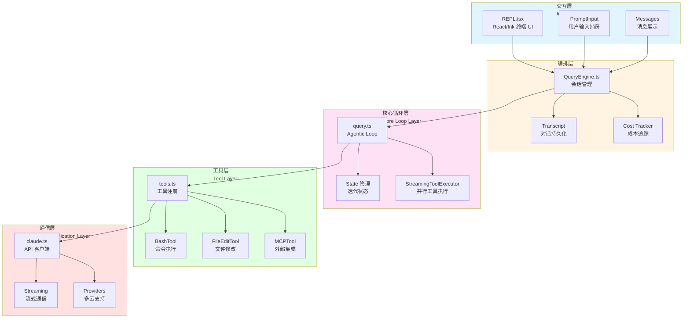
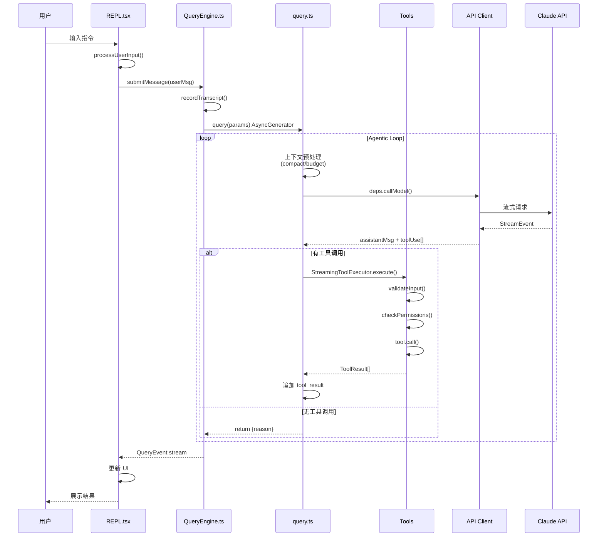

本文档旨在为初学者提供 Claude Code 项目的全景式认知框架,通过第一性原理分析建立架构坐标系,帮助开发者快速理解这个终端原生 AI 编程助手的核心定位与系统设计。

## 项目本质:Terminal-Native Agentic Coding System

Claude Code 是一个运行在本地终端中的 **agentic coding system**,其核心特质体现在三个关键维度:**terminal-native**(原生 CLI 应用)、**agentic**(AI 自主决策工具调用链)、**coding system**(面向软件工程全流程)。与 Cursor、GitHub Copilot 等 IDE 集成工具不同,Claude Code 拥有完整的 shell 访问权限,能够直接在项目目录中读取代码、修改文件、执行命令、调试程序,这赋予其强大的操作能力,同时也需要相应的安全约束机制。

从技术架构角度,Claude Code 构建了一套完整的 agentic loop 系统,而非简单的"一问一答"聊天模式。当用户输入 `bun run dev 有个 TypeScript 报错,帮我修一下` 时,系统会自主决策并执行多轮工具调用:首先通过 BashTool 运行命令查看报错信息,然后用 FileReadTool 定位到问题文件,接着通过 GrepTool 搜索相关类型定义,再通过 FileEditTool 修复代码,最后通过 BashTool 验证修复结果。每一步工具选择、参数传递、终止判定都由 AI 自主完成,这正是"agentic"的核心含义。

Sources: [README.md](claude-code/README.md#L1-L85), [what-is-claude-code.mdx](claude-code/docs/introduction/what-is-claude-code.mdx#L1-L112)

## 核心架构:五层分离设计

Claude Code 采用清晰的五层架构设计,每层职责明确、边界分明,这种分层设计确保了系统的可维护性与可扩展性。



### 各层职责与核心源码

| 层次 | 核心职责 | 入口源码 | 关键技术 |
|------|---------|---------|---------|
| **交互层** | 终端 UI 渲染、用户输入捕获、消息流展示 | `src/screens/REPL.tsx` | React/Ink、PromptInput、MessageList |
| **编排层** | 多轮对话管理、会话持久化、成本追踪、权限上下文 | `src/QueryEngine.ts` | QueryEngine、Transcript、Usage Accumulator |
| **核心循环层** | 单轮 agentic loop:发请求→收响应→执行工具→循环判定 | `src/query.ts` | AsyncGenerator、State Machine、StreamingToolExecutor |
| **工具层** | 定义 AI 可执行操作:Bash/文件/搜索/MCP 等 50+ 工具 | `src/tools.ts` → `src/Tool.ts` | Tool 接口、validateInput、checkPermissions、call |
| **通信层** | 与 Claude API 的流式通信、多 provider 支持、重试策略 | `src/services/api/claude.ts` | Anthropic SDK、Streaming、Bedrock/Vertex/Azure |

这种分层架构的核心优势在于:**流式优先**(Streaming-first)、**工具即能力**(Tool as Capability)、**权限即边界**(Permission as Boundary)、**上下文即记忆**(Context as Memory)。每一层都可以独立演进,例如工具层新增 MCP 工具无需修改核心循环,通信层切换 provider 无需调整编排逻辑。

Sources: [architecture-overview.mdx](claude-code/docs/introduction/architecture-overview.mdx#L1-L113), [main.tsx](claude-code/src/main.tsx#L1-L200), [QueryEngine.ts](claude-code/src/QueryEngine.ts#L1-L100)

## 核心数据流:从用户输入到工具执行

理解 Claude Code 的关键在于追踪一条完整的数据流:从用户在终端输入指令,到系统最终执行工具并返回结果。这条数据流贯穿所有五层架构,体现了 agentic loop 的核心机制。



### 关键源码路径追踪

1. **入口初始化**(`src/entrypoints/cli.tsx`):注入运行时 polyfill,`feature()` 函数永远返回 false,注入 `MACRO` 全局对象(VERSION、BUILD_TIME),声明构建目标(BUILD_TARGET、BUILD_ENV、INTERFACE_TYPE)

2. **Commander 解析**(`src/main.tsx`):4683 行的核心初始化逻辑,包括 side-effect import(并行预加载 MDM/keychain)、Commander 参数定义(40+ CLI 选项)、action handler(参数解析→服务初始化→showSetupScreens→launchRepl)

3. **REPL 渲染**(`src/replLauncher.tsx` + `src/screens/REPL.tsx`):组合 `<App><REPL /></App>` 渲染到终端,REPL 管理 50+ 状态(messages、inputValue、screen、streamingText、queryGuard),核心数据流为 `onSubmit → handlePromptSubmit → onQuery → onQueryImpl → query() → onQueryEvent`

4. **QueryEngine 编排**(`src/QueryEngine.ts`):管理会话状态(消息数组、ToolPermissionContext、FileHistorySnapshot)、成本追踪(accumulateUsage/getTotalCost)、Transcript 持久化(recordTranscript)、文件历史快照(fileHistoryMakeSnapshot)

5. **Agentic Loop**(`src/query.ts`):1732 行的 `query()` AsyncGenerator,`while(true)` 主循环,State 对象管理迭代状态(10 个字段:messages、autoCompactTracking、maxOutputTokensRecoveryCount 等),包含上下文预处理管道(applyToolResultBudget→snipCompact→microcompact→contextCollapse→autocompact)、流式 API 调用(deps.callModel)、工具执行(StreamingToolExecutor 并行或 runTools 串行)、终止/继续判定

6. **工具执行**(`src/Tool.ts` + `src/tools.ts`):每个工具实现 `Tool<Input, Output, Progress>` 接口,核心方法链为 `validateInput() → canUseTool()(UI 层) → checkPermissions() → call() → ToolResult`,`getAllBaseTools()` 组装 50+ 工具列表,经过 `filterToolsByDenyRules()` 权限过滤后传给 API

7. **API 通信**(`src/services/api/claude.ts`):3420 行的 API 客户端,支持 4 种 provider(Anthropic Direct/AWS Bedrock/Google Vertex/Azure),`deps.callModel()` 发起流式请求返回 `BetaRawMessageStreamEvent` 事件流,支持 Prompt Cache(cache_control)、thinking blocks、multi-turn tool use

Sources: [main.tsx](claude-code/src/main.tsx#L1-L200), [QueryEngine.ts](claude-code/src/QueryEngine.ts#L1-L100), [query.ts](claude-code/src/query.ts#L1-L100), [Tool.ts](claude-code/src/Tool.ts#L1-L100), [context.ts](claude-code/src/context.ts#L1-L80)

## 项目目录结构:模块化组织

Claude Code 的源码采用高度模块化的目录结构,每个目录对应特定的功能域,这种组织方式支持并行开发和独立测试。

```
claude-code/
├── src/                          # 源码主目录
│   ├── entrypoints/              # 入口点(CLI、SDK、init)
│   ├── screens/                  # UI 界面(REPL、ResumeConversation)
│   ├── components/               # React/Ink UI 组件
│   ├── QueryEngine.ts            # 编排层核心
│   ├── query.ts                  # Agentic Loop 核心
│   ├── Task.ts                   # 任务抽象(本地/远程/agent)
│   ├── Tool.ts                   # 工具接口定义
│   ├── tools/                    # 50+ 工具实现(Bash/File/MCP...)
│   ├── services/                 # 服务层(API/MCP/analytics/lsp...)
│   ├── utils/                    # 工具函数库(200+ 文件)
│   ├── context/                  # React Context(mailbox/notifications)
│   ├── state/                    # 全局状态管理(AppStateStore)
│   ├── commands/                 # 斜杠命令(/help、/init、/doctor...)
│   ├── hooks/                    # React Hooks(50+ 自定义 hooks)
│   ├── memdir/                   # 项目内存系统(CLAUDE.md)
│   └── tasks/                    # 任务类型实现(LocalShell/Agent/Teammate)
├── packages/                     # 子包(native modules、MCP servers)
│   ├── @ant/                     # Anthropic 相关包
│   ├── audio-capture-napi/       # 音频捕获 native module
│   ├── color-diff-napi/          # 颜色差异 native module
│   └── image-processor-napi/     # 图像处理 native module
├── docs/                         # 文档站点源码(Mintlify)
├── learn/                        # 学习材料(phase-1/phase-2 Q&A)
└── tests/                        # 测试文件(integration/mocks)
```

关键目录说明:**tools/** 包含 50+ 工具实现,每个工具独立文件(如 BashTool、FileEditTool、MCPTool);**services/** 包含 API 通信、MCP 协议、分析服务、LSP 集成等核心服务;**utils/** 包含 200+ 工具函数,涵盖权限、文件操作、Git 集成、安全存储等;**components/** 包含 100+ React/Ink UI 组件,用于终端渲染;**commands/** 包含 40+ 斜杠命令,每个命令独立实现。

Sources: [get_dir_structure](claude-code/src), [package.json](claude-code/package.json#L1-L166)

## 核心技术栈

Claude Code 的技术栈选择体现了"性能优先、类型安全、流式处理"的设计理念。

| 技术领域 | 技术选型 | 用途说明 |
|---------|---------|---------|
| **运行时** | Bun >= 1.3.11 | 高性能 JavaScript runtime,内置打包器、测试框架 |
| **语言** | TypeScript 6.0 | 类型安全,支持最新 ECMAScript 特性 |
| **UI 框架** | React 19 + Ink | 终端 UI 渲染,声明式组件模型 |
| **CLI 框架** | Commander.js | 命令行参数解析,子命令管理 |
| **API SDK** | @anthropic-ai/sdk | Anthropic API 官方 SDK,支持流式响应 |
| **验证** | Zod 4.3 | 运行时类型验证,工具输入 schema |
| **格式化** | Biome | 代码格式化与 linting |
| **包管理** | Bun Workspaces | Monorepo 管理,本地包链接 |
| **构建** | 自定义 build.ts | Code splitting 多文件打包,产物支持 Node/Bun 双运行时 |

关键技术特性:**流式处理**通过 AsyncGenerator 实现端到端流式响应;**类型安全**通过 TypeScript + Zod 实现编译时+运行时双重保障;**Native 性能**通过 Rust NAPI 模块处理图像/音频等计算密集型任务;**插件化**通过 MCP 协议支持外部工具集成;**安全隔离**通过权限系统+沙箱机制约束 AI 行为。

Sources: [package.json](claude-code/package.json#L1-L166), [README.md](claude-code/README.md#L1-L85)

## 与同类工具的架构差异

理解 Claude Code 的独特性,需要将其放在同类工具的架构对比中分析。

| 维度 | Claude Code | Cursor/Copilot | Aider | ChatGPT/Claude.ai |
|------|-------------|---------------|-------|-------------------|
| **架构模式** | Terminal-native agentic loop | IDE-integrated autocomplete + chat | CLI chat → git patch | Cloud chat + artifacts |
| **运行位置** | 本地进程 | IDE 进程内 | 本地进程 | 浏览器/云端 |
| **工具执行** | 直接 shell 执行 | LSP / IDE API | 文件操作为主 | 沙箱容器 |
| **权限模型** | 细粒度工具权限 + 沙箱 | IDE 权限继承 | Git 权限 | 云端沙箱隔离 |
| **上下文工程** | CLAUDE.md + git 状态 + 系统提示 | IDE context | Git diff | 对话历史 |
| **扩展机制** | MCP 协议 + Hooks + Skills | IDE 插件 | Git hooks | 插件生态 |

核心架构差异:**Claude Code 拥有完整的 shell 访问权**,这意味着它可以做任何用户在终端里能做的事,但也需要对应的权限模型来约束这个能力。与 IDE 集成工具相比,Claude Code 不依赖任何特定 IDE,能够在任何终端环境中工作;与云服务相比,Claude Code 在本地执行,拥有更低的延迟和更高的隐私性;与 Aider 等 CLI 工具相比,Claude Code 拥有更丰富的工具集(Bash/MCP/Grep/LSP 等),而不仅是文件操作。

Sources: [what-is-claude-code.mdx](claude-code/docs/introduction/what-is-claude-code.mdx#L1-L112)

## 学习路线建议

基于五层架构和核心数据流,建议初学者按以下顺序深入学习:

1. **[环境配置与运行指南](2-huan-jing-pei-zhi-yu-yun-xing-zhi-nan)**:安装 Bun、配置环境变量、运行开发模式,建立可调试的本地环境

2. **[启动流程与入口点解析](3-qi-dong-liu-cheng-yu-ru-kou-dian-jie-xi)**:从 `cli.tsx` → `main.tsx` → `replLauncher.tsx` → `REPL.tsx` 的完整启动链路,理解 side-effect import、Commander 参数定义、快速路径设计

3. **[核心架构总览](4-he-xin-jia-gou-zong-lan)**:深入五层架构的每一层,理解 QueryEngine 编排、query.ts 的 agentic loop、Tool 接口设计、API 流式通信

4. **技术深度解析系列**:根据兴趣选择专项深入
   - **对话系统**:[Agentic 对话循环机制](5-agentic-dui-hua-xun-huan-ji-zhi)→[流式响应与事件处理](6-liu-shi-xiang-ying-yu-shi-jian-chu-li)→[多轮对话与会话管理](7-duo-lun-dui-hua-yu-hui-hua-guan-li)
   - **工具系统**:[工具架构与注册机制](8-gong-ju-jia-gou-yu-zhu-ce-ji-zhi)→[文件操作工具详解](9-wen-jian-cao-zuo-gong-ju-xiang-jie)→[Shell 执行与命令工具](10-shell-zhi-xing-yu-ming-ling-gong-ju)
   - **安全机制**:[权限模型与审批流程](13-quan-xian-mo-xing-yu-shen-pi-liu-cheng)→[沙箱隔离机制](14-sha-xiang-ge-chi-ji-zhi)
   - **扩展开发**:[MCP 协议集成](24-mcp-xie-yi-ji-cheng)→[Hooks 钩子系统](25-hooks-gou-zi-xi-tong)→[自定义 Agent 开发](27-zi-ding-yi-agent-kai-fa)

每个阶段都有明确的学习目标和可验证的里程碑,建议配合 `learn/` 目录下的 phase-1/phase-2 学习笔记,通过源码追踪和调试加深理解。