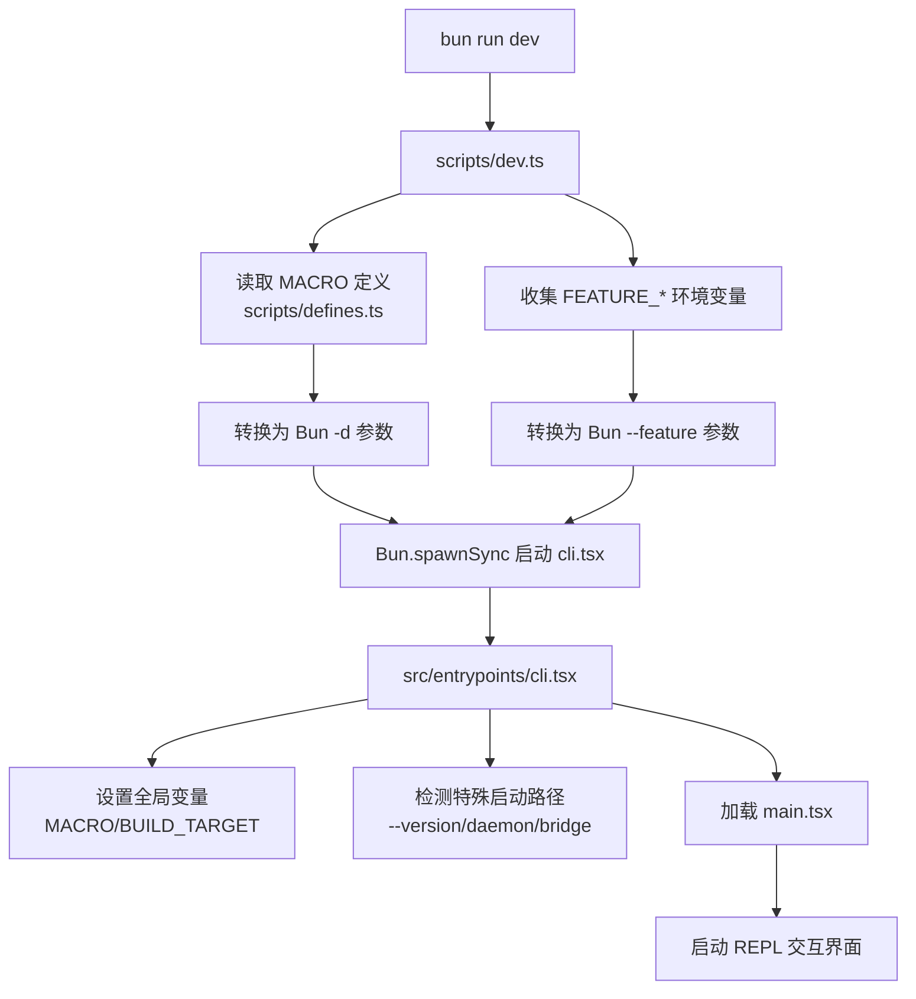
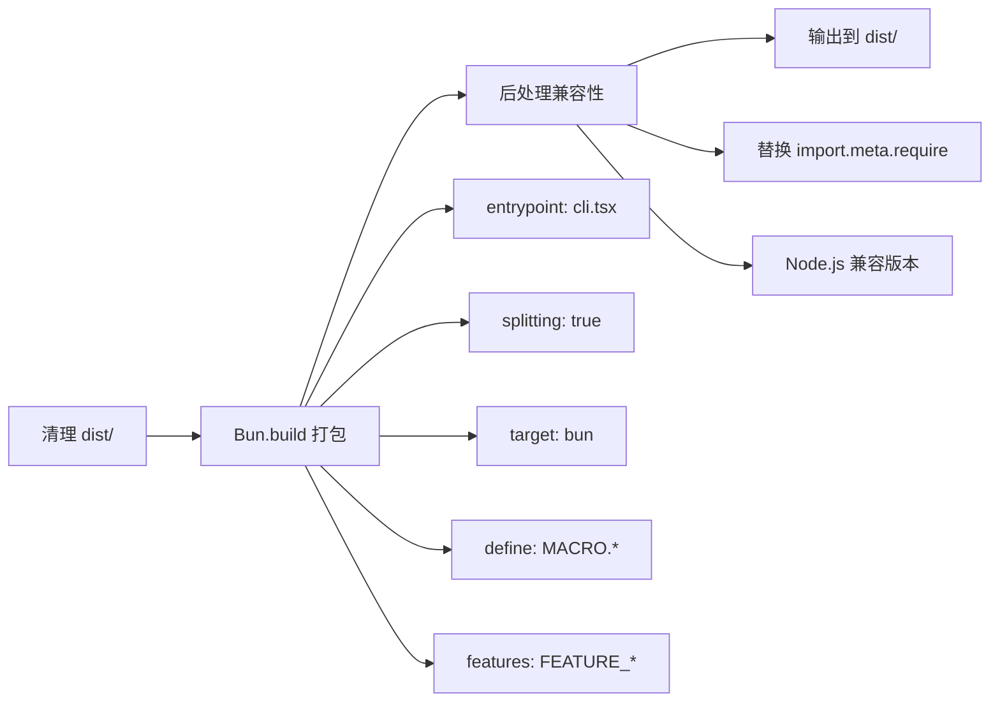

本指南将帮助你从零开始配置 Claude Code Best (CCB) 项目环境，理解构建流程，并掌握日常开发中的常用命令。作为 Anthropic 官方 Claude Code CLI 的逆向还原项目，CCB 使用现代化的技术栈（Bun + TypeScript + React），本指南将引导你完成环境搭建并理解核心配置文件的作用。

## 系统要求与依赖

CCB 项目基于 Bun 运行时构建，这是唯一的核心依赖要求。以下是完整的系统要求和版本限制：

| 依赖项 | 最低版本要求 | 推荐版本 | 说明 |
|--------|------------|---------|------|
| **Bun Runtime** | >= 1.3.11 | 最新版本 | **必须使用最新版本**，低版本会导致各种奇奇怪怪的 BUG |
| **Git** | 任意版本 | >= 2.0 | 用于版本控制和项目根目录检测 |
| **Node.js** | >= 18.0 | >= 20.0 | 仅在运行构建产物时需要（可选） |

⚠️ **重要提示**：项目 README 明确强调"一定要最新版本的 bun"，建议在开始之前执行 `bun upgrade` 确保版本最新。Bun 版本过旧会导致模块解析失败、宏定义注入错误等运行时问题。

**操作系统支持**：
- **macOS**：完全支持（主要开发平台）
- **Linux**：完全支持
- **Windows**：理论支持但未经充分测试，建议使用 WSL2

Sources: [README.md](claude-code/README.md#L29-L40), [package.json](claude-code/package.json#L24-L26)

## 快速开始：三步运行

### 第一步：克隆项目

```bash
git clone https://github.com/claude-code-best/claude-code.git
cd claude-code/claude-code
```

项目采用 monorepo 结构，实际代码位于 `claude-code/` 子目录中，根目录包含 `.zread` 文档系统。

### 第二步：安装依赖

```bash
bun install
```

该命令会自动完成以下操作：
1. **安装 devDependencies**：所有依赖项均在 `devDependencies` 中（包括 Anthropic SDK、React、工具库等）
2. **解析 workspace 依赖**：`packages/` 目录下的内部包通过 `workspace:*` 协议链接
3. **设置 Git hooks**：通过 `prepare` 脚本配置 `.githooks/` 目录为 hooks 路径

依赖安装过程通常在 10-30 秒内完成（Bun 的依赖解析速度远快于 npm/yarn）。

### 第三步：运行开发模式

```bash
bun run dev
```

看到版本号输出 **888** 即表示启动成功。开发模式会：
1. 注入 MACRO 宏定义（VERSION、BUILD_TIME 等）
2. 启用默认 feature flags（BUDDY、TRANSCRIPT_CLASSIFIER）
3. 扫描环境变量中的 `FEATURE_*` 变量并传递给 Bun 运行时
4. 直接运行 `src/entrypoints/cli.tsx`（无需构建）

此时你已进入交互式 REPL 界面，可以开始使用 Claude Code 的各种功能。

Sources: [README.md](claude-code/README.md#L42-L57), [package.json](claude-code/package.json#L37-L50), [scripts/dev.ts](claude-code/scripts/dev.ts#L1-L35)

## 开发模式详解

### 启动流程架构

开发模式的启动流程包含三个关键阶段，每个阶段都有特定的职责：



### MACRO 宏定义系统

MACRO 系统在构建时将常量注入代码，避免硬编码和运行时计算。所有宏定义集中在 `scripts/defines.ts` 中管理：

| 宏名称 | 值示例 | 用途 |
|--------|--------|------|
| `MACRO.VERSION` | "2.1.888" | CLI 版本号，`--version` 时输出 |
| `MACRO.BUILD_TIME` | "2025-04-03T16:15:00Z" | 构建时间戳，用于缓存失效检测 |
| `MACRO.FEEDBACK_CHANNEL` | "" | 反馈渠道链接（外部构建为空） |
| `MACRO.ISSUES_EXPLAINER` | "" | Issues 说明链接（外部构建为空） |
| `MACRO.NATIVE_PACKAGE_URL` | "" | Native 包下载地址 |
| `MACRO.PACKAGE_URL` | "" | 主包下载地址 |
| `MACRO.VERSION_CHANGELOG` | "" | 版本更新日志 |

**开发模式注入方式**：`scripts/dev.ts` 通过 Bun 的 `-d` 参数将宏定义注入：
```bash
bun run -d MACRO.VERSION:"2.1.888" -d MACRO.BUILD_TIME:"..." src/entrypoints/cli.tsx
```

**构建模式注入方式**：`build.ts` 通过 `Bun.build({ define })` 选项在打包时替换标识符。

Sources: [scripts/defines.ts](claude-code/scripts/defines.ts#L1-L19), [scripts/dev.ts](claude-code/scripts/dev.ts#L7-L15)

### Feature Flag 功能开关

CCB 使用强大的 feature flag 系统控制功能启用状态，这是理解项目架构的关键机制。

#### 核心原理

```typescript
// 代码中的标准用法（唯一正确方式）
import { feature } from 'bun:bundle';

if (feature('BUDDY')) {
  // Buddy 功能代码
}
```

`feature()` 函数由 Bun 运行时提供（`bun:bundle` 内置模块），不接受任何其他自定义实现。

#### 启用方式

**方式 1：环境变量（推荐用于开发）**
```bash
# 启用单个功能
FEATURE_BUDDY=1 bun run dev

# 启用多个功能
FEATURE_BUDDY=1 FEATURE_PROACTIVE=1 bun run dev

# 启用所有功能（不推荐，仅用于测试）
$(awk '/FEATURE_/{print $0"=1"}' .env 2>/dev/null) bun run dev
```

**方式 2：默认启用（仅限开发模式）**

`scripts/dev.ts` 中定义了开发模式默认启用的功能：
```typescript
const DEFAULT_FEATURES = ["BUDDY", "TRANSCRIPT_CLASSIFIER"];
```

这些功能在执行 `bun run dev` 时自动启用，无需设置环境变量。

**方式 3：构建时启用**

构建时也会扫描 `FEATURE_*` 环境变量：
```bash
FEATURE_BUDDY=1 bun run build
```

构建产物会永久包含这些功能（无法在运行时关闭）。

#### 常见功能开关列表

| Feature 名称 | 功能说明 | 默认状态 | 影响范围 |
|-------------|---------|---------|---------|
| **BUDDY** | Buddy 小宠物功能（交互式伴侣） | 开发模式默认启用 | `src/buddy/`, `/buddy` 命令 |
| **TRANSCRIPT_CLASSIFIER** | Auto Mode 分类器 | 开发模式默认启用 | 权限自动审批逻辑 |
| **DAEMON** | 后台守护进程模式 | 默认关闭 | `src/daemon/`, `--daemon-worker` |
| **BRIDGE_MODE** | 远程控制桥接模式 | 默认关闭 | `src/bridge/`, `remote-control` 命令 |
| **BG_SESSIONS** | 后台会话管理 | 默认关闭 | `ps/logs/attach/kill` 命令 |
| **PROACTIVE** | 主动建议模式 | 默认关闭 | 主动触发对话的功能 |
| **VOICE_MODE** | 语音模式 | 默认关闭 | 语音输入/输出 |
| **ABLATION_BASELINE** | 实验性消融基准 | 默认关闭 | 禁用多项高级功能用于对比实验 |

#### Feature Flag 的构建时消除

未启用的 feature 会在构建时通过死代码消除（DCE）优化掉：

```typescript
// 源代码
if (feature('BUDDY')) {
  console.log("Buddy enabled");
}

// 构建后（BUDDY 未启用时）
// 整个 if 块被消除，不包含在任何 chunk 中
```

这意味着禁用的功能不仅不会执行，连代码都不会包含在最终产物中，减小包体积。

Sources: [CLAUDE.md](claude-code/CLAUDE.md#L53-L84), [scripts/dev.ts](claude-code/scripts/dev.ts#L17-L27), [build.ts](claude-code/build.ts#L11-L16)

## 构建流程详解

### 构建命令与产物

```bash
bun run build
```

构建过程由 `build.ts` 驱动，采用代码分割（code splitting）策略，输出约 **450 个 chunk 文件**：

```
dist/
├── cli.js           # 主入口文件
├── chunk-abc123.js  # 分块 1
├── chunk-def456.js  # 分块 2
├── ...              # 约 450 个 chunk
└── chunk-xyz789.js  # 最后一个 chunk
```

### 构建流程三阶段



#### 阶段 1：清理输出目录

```typescript
const { rmSync } = await import("fs");
rmSync("dist", { recursive: true, force: true });
```

确保每次构建都是干净的，避免旧文件残留。

#### 阶段 2：Bun.build 打包

```typescript
const result = await Bun.build({
    entrypoints: ["src/entrypoints/cli.tsx"],
    outdir: "dist",
    target: "bun",
    splitting: true,
    define: getMacroDefines(),
    features: ["BUDDY", ...],  // 从 FEATURE_* 环境变量收集
});
```

关键配置说明：
- **splitting: true**：启用代码分割，将共享模块提取为独立 chunk
- **target: "bun"**：目标平台为 Bun（但产物兼容 Node.js）
- **define**：注入 MACRO 宏定义
- **features**：启用功能开关

#### 阶段 3：Node.js 兼容性后处理

Bun 特有的 `import.meta.require` 在 Node.js 中不存在，需要替换：

```typescript
// 原始代码
var __require = import.meta.require;

// 替换后（兼容 Node.js）
var __require = typeof import.meta.require === "function" 
  ? import.meta.require 
  : (await import("module")).createRequire(import.meta.url);
```

`build.ts` 会遍历 `dist/` 下所有 `.js` 文件，批量执行此替换。

### 运行构建产物

构建完成后，产物可以用 **Bun 或 Node.js** 运行：

```bash
# 使用 Bun 运行
bun dist/cli.js

# 使用 Node.js 运行
node dist/cli.js
```

两者行为完全一致，这为私有源发布和 CI/CD 部署提供了灵活性。

Sources: [build.ts](claude-code/build.ts#L1-L56), [package.json](claude-code/package.json#L30-L31)

## 核心配置文件解析

项目使用多个配置文件协同工作，理解它们的职责有助于快速定位问题：

### TypeScript 配置 (`tsconfig.json`)

```json
{
  "compilerOptions": {
    "target": "ESNext",
    "module": "ESNext",
    "moduleResolution": "bundler",
    "jsx": "react-jsx",
    "strict": false,          // 反编译代码类型错误较多，关闭严格模式
    "skipLibCheck": true,     // 跳过库类型检查，加速编译
    "noEmit": true,           // 不输出文件（Bun 负责构建）
    "paths": {
      "src/*": ["./src/*"]    // 路径别名，允许 import from 'src/utils/...'
    }
  }
}
```

**关键点**：
- **strict: false**：反编译代码约有 1341 个 TypeScript 错误，这些错误不影响运行
- **noEmit: true**：TypeScript 仅用于类型检查，不生成输出文件
- **路径别名**：支持 `import { ... } from 'src/utils/...'` 导入语法

### Bun 配置 (`bunfig.toml`)

```toml
[test]
root = "."
timeout = 10000
```

当前仅配置测试相关选项。Bun 的其他配置（如宏定义）通过命令行参数传递，不在配置文件中。

### Biome 配置 (`biome.json`)

```json
{
  "formatter": {
    "indentStyle": "space",
    "indentWidth": 2,
    "lineWidth": 80
  },
  "linter": {
    "enabled": true,
    "rules": {
      "recommended": true,
      "suspicious": {
        "noExplicitAny": "off",      // 反编译代码大量使用 any
        "noDoubleEquals": "off",      // 允许 == 比较
        ...
      }
    }
  }
}
```

Biome 同时负责**格式化**和**静态检查**，替代了 Prettier + ESLint 组合。

### Package.json 工作区配置

```json
{
  "workspaces": [
    "packages/*",
    "packages/@ant/*"
  ]
}
```

Monorepo 结构支持：
- `packages/`：内部包（如 `color-diff-napi`）
- `packages/@ant/`：Anthropic 相关 stub 包（Computer Use 相关）

所有内部包通过 `workspace:*` 协议引用，开发时自动链接，构建时打包为独立模块。

Sources: [tsconfig.json](claude-code/tsconfig.json#L1-L21), [bunfig.toml](claude-code/bunfig.toml#L1-L4), [biome.json](claude-code/biome.json#L1-L30), [package.json](claude-code/package.json#L27-L29)

## 常用开发命令速查

### 日常开发命令

| 命令 | 功能 | 说明 |
|------|------|------|
| `bun run dev` | 开发模式 | 直接运行 `cli.tsx`，支持热重载和调试 |
| `bun run build` | 构建产物 | 输出到 `dist/`，约 450 个 chunk 文件 |
| `bun test` | 运行测试 | 执行所有 `**/*.test.ts` 文件 |
| `bun test src/utils/__tests__/hash.test.ts` | 单文件测试 | 运行指定测试文件 |
| `bun test --coverage` | 覆盖率测试 | 生成覆盖率报告 |

### 代码质量命令

| 命令 | 功能 | 说明 |
|------|------|------|
| `bun run lint` | 静态检查 | 使用 Biome 检查代码问题 |
| `bun run lint:fix` | 自动修复 | 自动修复可修复的问题 |
| `bun run format` | 代码格式化 | 格式化所有 `src/` 下的文件 |
| `bun run check:unused` | 检查未使用代码 | 使用 Knip 检查未使用的导出 |
| `bun run health` | 健康检查 | 运行 `scripts/health-check.ts` |

### 特殊启动路径

开发模式支持多种特殊启动路径（通过命令行参数）：

```bash
# 查看版本
bun run dev --version
# 输出：2.1.888 (Claude Code)

# Pipe 模式（从标准输入读取）
echo "say hello" | bun run src/entrypoints/cli.tsx -p

# 后台守护进程模式（需要 FEATURE_DAEMON=1）
FEATURE_DAEMON=1 bun run dev daemon

# 远程控制模式（需要 FEATURE_BRIDGE_MODE=1）
FEATURE_BRIDGE_MODE=1 bun run dev remote-control
```

Sources: [package.json](claude-code/package.json#L37-L50), [CLAUDE.md](claude-code/CLAUDE.md#L14-L28)

## 项目目录结构解析

理解目录结构有助于快速定位代码和配置：

```
claude-code/
├── src/                      # 源代码主目录
│   ├── entrypoints/          # 入口文件目录
│   │   └── cli.tsx          # 真正的入口点
│   ├── main.tsx             # Commander.js CLI 定义
│   ├── query.ts             # 核心 Agentic Loop
│   ├── QueryEngine.ts       # 高层编排器
│   ├── tools/               # 工具实现目录
│   ├── components/          # React/Ink 组件
│   ├── screens/             # 屏幕组件（REPL 等）
│   ├── services/            # 服务层（API、分析等）
│   ├── utils/               # 工具函数库
│   └── types/               # TypeScript 类型定义
├── packages/                # Monorepo 内部包
│   ├── @ant/               # Anthropic stub 包
│   └── *-napi/             # Native addon stub 包
├── scripts/                # 开发脚本
│   ├── defines.ts          # MACRO 定义集中管理
│   ├── dev.ts              # 开发模式启动脚本
│   └── health-check.ts     # 健康检查脚本
├── tests/                  # 测试文件
│   ├── integration/        # 集成测试
│   └── mocks/              # Mock 对象
├── build.ts                # 构建脚本
├── tsconfig.json           # TypeScript 配置
├── bunfig.toml             # Bun 配置
├── biome.json              # Biome 配置
└── package.json            # 项目配置
```

**关键目录说明**：
- **src/entrypoints/**：所有启动路径的入口文件，`cli.tsx` 是主入口
- **src/tools/**：每个工具独立目录（如 `BashTool/`, `FileEditTool/`）
- **packages/**：内部 workspace 包，大部分是 stub 实现（反编译未完成）
- **scripts/**：构建和开发辅助脚本，不在运行时加载

Sources: [目录结构](claude-code), [CLAUDE.md](claude-code/CLAUDE.md#L86-L116)

## 故障排查指南

### 常见问题与解决方案

#### 问题 1：Bun 版本过低导致启动失败

**症状**：
```
error: Cannot find module 'bun:bundle'
error: Unexpected token
```

**解决方案**：
```bash
# 升级 Bun 到最新版本
bun upgrade

# 验证版本
bun --version  # 应该 >= 1.3.11
```

#### 问题 2：依赖安装失败

**症状**：
```
error: Failed to resolve dependency
```

**解决方案**：
```bash
# 清理 Bun 缓存
bun pm cache rm

# 删除 node_modules 重新安装
rm -rf node_modules bun.lock
bun install
```

#### 问题 3：TypeScript 类型错误

**症状**：
```
src/utils/xxx.ts(10,5): error TS2322: Type 'unknown' is not assignable to type 'string'
```

**解决方案**：
这是反编译代码的已知问题（约 1341 个错误），**不影响运行**。可以安全忽略这些错误，项目已在 `tsconfig.json` 中设置 `strict: false`。

#### 问题 4：Feature Flag 不生效

**症状**：
设置了 `FEATURE_BUDDY=1` 但 Buddy 功能未启用

**解决方案**：
```bash
# 错误方式：直接运行 cli.tsx
bun src/entrypoints/cli.tsx  # feature() 始终返回 false

# 正确方式 1：通过 dev 脚本
FEATURE_BUDDY=1 bun run dev

# 正确方式 2：手动传递 --feature 参数
bun run src/entrypoints/cli.tsx --feature BUDDY
```

#### 问题 5：构建产物在 Node.js 中运行报错

**症状**：
```
ReferenceError: import.meta.require is not defined
```

**解决方案**：
确保使用最新的 `build.ts`，它会自动替换 `import.meta.require` 为 Node.js 兼容版本。如果仍有问题，检查 `build.ts` 的后处理逻辑是否执行。

Sources: [README.md](claude-code/README.md#L29-L40), [CLAUDE.md](claude-code/CLAUDE.md#L132-L144), [build.ts](claude-code/build.ts#L29-L44)

## 下一步学习路径

完成环境配置后，建议按以下顺序深入学习项目：

### 推荐阅读顺序

1. **[启动流程与入口点解析](3-qi-dong-liu-cheng-yu-ru-kou-dian-jie-xi)**：深入理解 `cli.tsx` → `main.tsx` → `REPL.tsx` 的启动链路，掌握 feature flag 检查、权限初始化、会话创建的完整流程

2. **[核心架构总览](4-he-xin-jia-gou-zong-lan)**：从宏观视角理解 Agentic Loop、工具系统、状态管理的协作关系，建立全局架构认知

3. **[Agentic 对话循环机制](5-agentic-dui-hua-xun-huan-ji-zhi)**：深入 `query.ts` 的核心循环逻辑，理解 API 调用、流式响应处理、工具调用编排的实现细节

4. **[工具架构与注册机制](8-gong-ju-jia-gou-yu-zhu-ce-ji-zhi)**：学习如何定义和注册工具，理解 `Tool` 类型接口和权限检查流程

### 实践建议

- **阅读源码时结合 CLAUDE.md**：`CLAUDE.md` 是项目的"圣经"，包含架构说明和开发规范
- **使用 Bun 的调试功能**：`bun --inspect` 可以启用调试器，配合 Chrome DevTools 调试
- **关注 DEV-LOG.md**：记录了重要的架构变更和决策，有助于理解代码演进历史