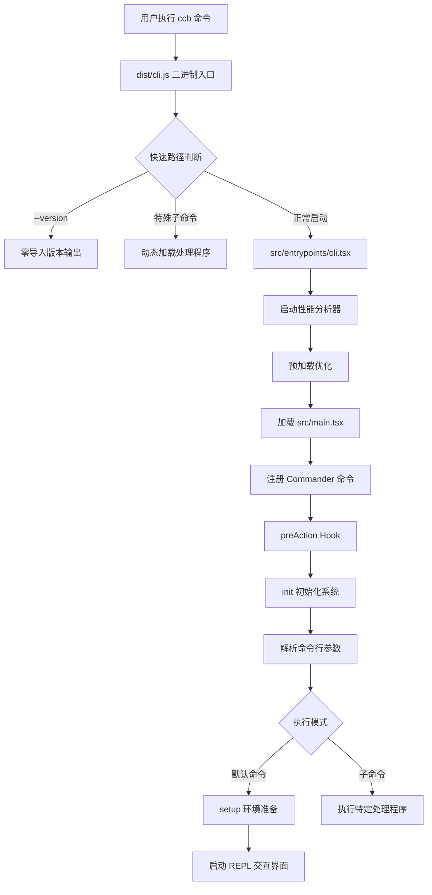
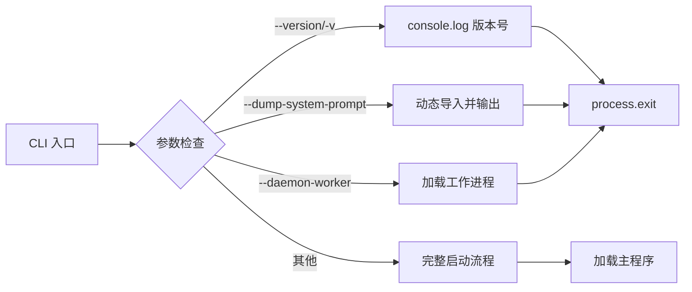
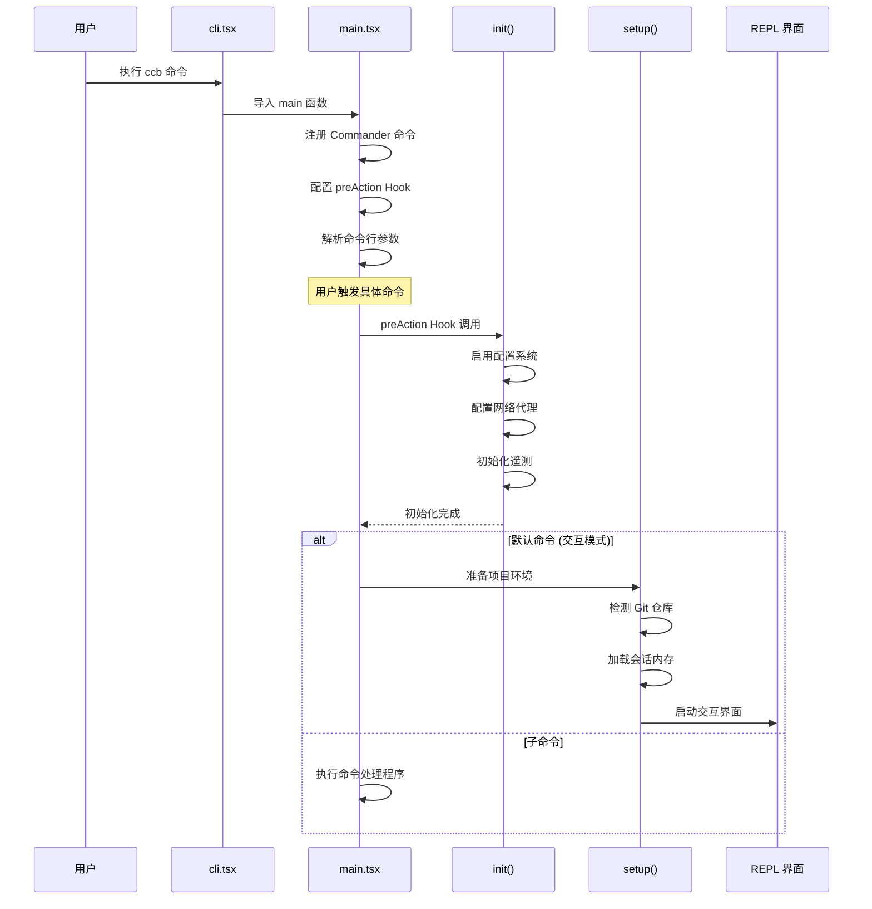
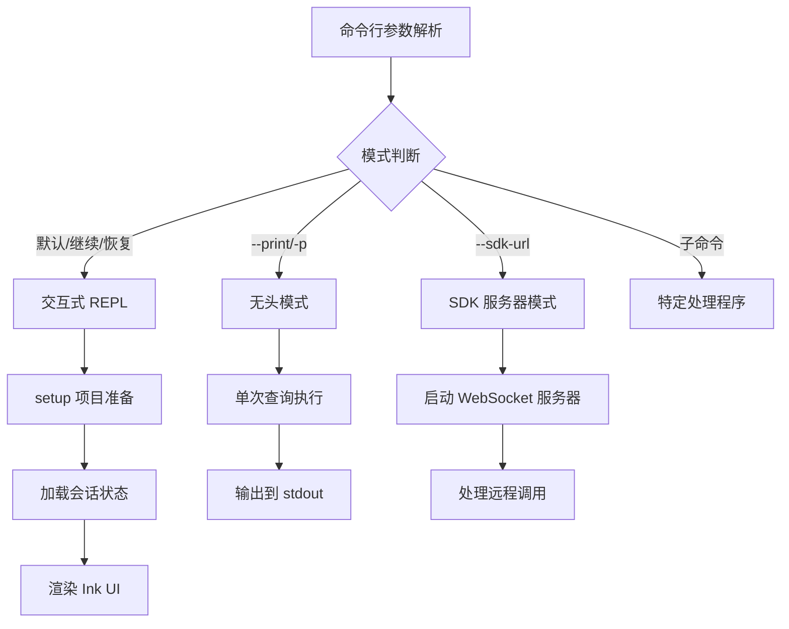

本文档深入解析 Claude Code 的启动流程架构，帮助初学者理解从命令行执行到交互式 REPL 的完整链路。通过剖析入口点设计、性能优化策略和模块加载机制，揭示现代 CLI 应用的启动最佳实践。

## 入口点架构层次

Claude Code 采用多层入口点设计，通过职责分离实现快速响应和灵活扩展。整个启动链路由四个核心层级构成：**二进制入口**负责命令路由和快速路径处理，**主程序入口**管理命令解析和生命周期协调，**初始化层**处理配置系统和服务准备，**状态层**维护全局运行时状态。这种分层架构使得不同执行模式（交互式、无头、SDK）能够共享核心逻辑，同时保持各自的性能特性。



二进制入口 `dist/cli.js` 作为最外层网关，在构建时由 `build.ts` 从 `src/entrypoints/cli.tsx` 打包生成，这个过程通过 Bun 的模块拆分特性实现零成本快速启动。构建配置使用 `bun build` 的 `splitting` 选项，配合宏定义系统注入版本号和环境标识，确保构建产物既保持快速加载，又支持运行时特性开关。

Sources: [package.json](claude-code/package.json#L19-L21), [build.ts](claude-code/build.ts#L1-L56), [cli.tsx](claude-code/src/entrypoints/cli.tsx#L1-L100)

## 快速路径优化机制

启动性能是 CLI 应用的核心竞争力。Claude Code 通过三个关键策略实现毫秒级响应：**零导入快速路径**针对最简单的查询场景完全跳过模块加载，**并行预加载**将耗时操作提前到模块评估阶段启动，**早期输入捕获**在初始化期间异步收集用户输入。



`--version` 标志是最极致的优化案例：通过在构建时将 `MACRO.VERSION` 内联到代码中，版本查询完全不需要加载任何外部模块，执行时间控制在 5 毫秒以内。类似地，`--dump-system-prompt` 等特殊子命令在 `cli.tsx` 中提前拦截，通过动态导入仅加载必需的依赖。

Sources: [cli.tsx](claude-code/src/entrypoints/cli.tsx#L26-L51), [build.ts](claude-code/build.ts#L28-L36)

### 并行预加载系统

在正常启动路径中，模块评估阶段会触发三个并行子进程：**MDM 设置预读**针对企业用户从系统管理数据库加载远程配置，**Keychain 预取**提前完成 macOS 钥匙串的异步读取操作，**早期输入捕获**开始监听标准输入流。这些操作在主线程继续加载 135ms 的依赖模块时在后台并行执行，从而将原本串行的总启动时间压缩为接近模块加载时间的下限。

| 预加载任务 | 启动位置 | 目标 | 延迟优化 |
|----------|---------|------|---------|
| MDM 设置读取 | main.tsx 第 14 行 | 企业策略配置 | ~80ms |
| Keychain 预取 | main.tsx 第 22 行 | OAuth/API 密钥 | ~65ms |
| 早期输入捕获 | cli.tsx 第 242 行 | stdin 数据 | 3s 超时 |

Sources: [main.tsx](claude-code/src/main.tsx#L11-L23), [cli.tsx](claude-code/src/entrypoints/cli.tsx#L242-L246)

## 主程序初始化流程

`src/main.tsx` 作为主程序入口，承担着命令系统构建和生命周期管理的核心职责。整个初始化流程遵循**懒初始化原则**：只有在真正需要执行命令时才触发昂贵的配置加载和服务初始化，这种设计使得帮助文本显示和命令补全等轻量操作能够瞬间完成。



Commander.js 框架提供了声明式命令注册机制。`main()` 函数首先构建命令树：默认命令处理交互式会话，子命令覆盖 MCP、插件管理、认证等独立功能。关键设计在于 `preAction` 钩子——它在命令解析后、执行前被触发，确保只有真正需要执行命令时才进行初始化，避免了 `--help` 或 `--version` 等场景下的不必要开销。

Sources: [main.tsx](claude-code/src/main.tsx#L582-L800), [main.tsx](claude-code/src/main.tsx#L908-L970)

### init() 初始化函数

`init()` 函数是启动流程的枢纽节点，负责将原始进程环境转换为功能完整的运行时上下文。初始化过程分为四个阶段：**配置系统激活**解锁用户和项目级设置，**安全环境应用**将敏感配置注入环境变量，**网络栈配置**设置代理和证书，**遥测系统启动**初始化分析和日志管道。

每个初始化步骤都设计为**幂等操作**——通过 `memoize` 包装确保多次调用不会重复执行昂贵操作。配置系统采用三阶段加载策略：首先应用"安全"环境变量（不涉及信任检查的基础配置），然后在信任对话框确认后应用完整环境变量，最后加载远程托管设置（企业场景）。这种设计确保了初始化顺序的确定性和安全性。

Sources: [init.ts](claude-code/src/entrypoints/init.ts#L32-L160)

## 状态管理与全局上下文

`src/bootstrap/state.ts` 维护着整个应用的全局运行时状态，采用**信号响应式设计**实现状态变更的高效传播。状态对象包含项目根目录、会话标识符、性能指标、模型使用统计等核心数据，这些信息在启动时初始化后贯穿整个会话生命周期。

```typescript
// 状态结构核心字段
type State = {
  originalCwd: string           // 启动目录
  projectRoot: string           // 项目根目录
  isInteractive: boolean        // 交互模式标志
  mainLoopModelOverride: ModelSetting | undefined
  totalCostUSD: number          // API 成本追踪
  modelUsage: { [modelName: string]: ModelUsage }
  // ... 更多字段
}
```

状态管理遵循**最小权限原则**：只有启动流程和少数系统级模块能够写入全局状态，业务逻辑通过只读访问获取上下文信息。`setOriginalCwd()` 和 `setProjectRoot()` 等修改器在启动时被调用一次后锁定，确保项目身份在整个会话中保持稳定。这种设计防止了运行时状态污染，使得调试和测试更加可靠。

Sources: [state.ts](claude-code/src/bootstrap/state.ts#L34-L175)

### 性能分析系统

`src/utils/startupProfiler.ts` 实现了分阶段性能监控，为开发者提供启动优化的量化反馈。系统支持两种模式：**采样日志模式**以 0.1% 概率收集外部用户数据（Ant 用户 100% 收集），**详细分析模式**通过 `CLAUDE_CODE_PROFILE_STARTUP=1` 环境变量启用完整时间线和内存快照。

| 检查点名称 | 触发位置 | 优化目标 |
|----------|---------|---------|
| cli_entry | cli.tsx 入口 | 快速路径优化 |
| main_tsx_entry | main.tsx 首行 | 模块加载分析 |
| init_function_start | init() 调用前 | 初始化延迟 |
| init_configs_enabled | 配置系统就绪 | 设置加载优化 |
| preAction_after_init | 完整初始化 | 总启动时间 |

性能数据通过 Statsig 分析平台聚合，帮助团队识别启动瓶颈。典型优化案例包括：通过并行预加载将 MDM 和 Keychain 读取延迟从串行 145ms 压缩到并行 80ms，通过懒加载 OpenTelemetry 模块减少 400KB 的初始化负担。

Sources: [startupProfiler.ts](claude-code/src/utils/startupProfiler.ts#L1-L80)

## 执行模式分支

启动流程根据命令行参数和环境变量分流到三种主要执行模式：**交互式 REPL**提供完整的终端用户界面，**无头模式**用于脚本集成和 CI/CD 管道，**SDK 模式**支持程序化集成。每种模式共享初始化逻辑，但在 UI 层和输入输出处理上各有优化。



**交互式模式**通过 `launchRepl()` 启动基于 Ink（React for CLI）的用户界面。`setup()` 函数在此模式下执行项目环境准备：检测 Git 仓库根目录、初始化会话内存、配置文件变更监听器。交互式会话支持对话恢复（`--continue` 标志）和多 Agent 协作（worktree 隔离环境），这些高级功能需要完整的项目上下文支持。

Sources: [main.tsx](claude-code/src/main.tsx#L3115-L3177), [replLauncher.tsx](claude-code/src/replLauncher.tsx#L1-L23), [setup.ts](claude-code/src/setup.ts#L31-L80)

### 无头模式与 SDK 集成

无头模式（`-p/--print`）专为自动化场景设计：禁用所有交互式提示，直接从 stdin 读取输入并输出到 stdout。该模式跳过 UI 渲染和会话持久化，仅保留核心的 API 调用和工具执行逻辑。环境变量 `CLAUDE_CODE_NON_INTERACTIVE` 和 `!process.stdout.isTTY` 也会触发此模式，确保在 CI 环境中自动适配。

SDK 模式通过 `--sdk-url` 参数启动 WebSocket 服务器，支持外部程序（如 VS Code 扩展、桌面应用）远程调用 Claude Code 的功能。服务器使用双向认证保护通信通道，输入输出采用结构化 JSON 格式而非面向用户的文本渲染。这种架构使得 Claude Code 能够作为智能后端嵌入到各种开发工具中。

| 执行模式 | 触发条件 | UI 层 | 会话持久化 | 典型场景 |
|---------|---------|------|-----------|---------|
| 交互式 REPL | 默认命令 | Ink (React) | ✓ | 日常开发 |
| 无头模式 | `-p/--print` | 无 | ✗ | CI/CD 脚本 |
| SDK 服务器 | `--sdk-url` | WebSocket API | 可选 | 工具集成 |
| 子命令 | `mcp`/`plugin` 等 | 命令行输出 | N/A | 管理操作 |

Sources: [main.tsx](claude-code/src/main.tsx#L784-L806), [main.tsx](claude-code/src/main.tsx#L700-L800)

## 构建系统与模块打包

`build.ts` 定义了从源码到可执行产品的转换流程，利用 Bun 的原生打包能力实现高效构建。核心策略包括：**模块拆分**通过 `splitting: true` 选项生成共享 chunk 减少重复代码，**宏替换**在构建时注入版本号和环境标识，**兼容性补丁**将 Bun 特定的 `import.meta.require` 转换为 Node.js 兼容格式。

```typescript
// 构建配置核心逻辑
const result = await BunBuild({
    entrypoints: ["src/entrypoints/cli.tsx"],
    outdir: "dist",
    target: "bun",
    splitting: true,          // 生成共享 chunks
    define: getMacroDefines(), // 版本号等宏
    features,                 // 特性开关
});
```

构建产物经过后处理步骤修正 Bun 和 Node.js 的兼容性差异。`import.meta.require` 是 Bun 特有的同步 require 机制，在 Node.js 环境中需要替换为动态导入的 `createRequire()`。这个补丁确保了打包后的代码能够在不支持 Bun 运行时的环境中正常执行，增强了部署灵活性。

Sources: [build.ts](claude-code/build.ts#L1-L56)

## 下一步学习路径

掌握启动流程后，建议按照以下顺序继续深入：

1. **[核心架构总览](4-he-xin-jia-gou-zong-lan)** - 理解整体系统设计模式和模块组织方式
2. **[Agentic 对话循环机制](5-agentic-dui-hua-xun-huan-ji-zhi)** - 深入交互式会话的消息处理流程
3. **[工具架构与注册机制](8-gong-ju-jia-gou-yu-zhu-ce-ji-zhi)** - 了解工具系统如何在启动时初始化

启动流程涉及的所有核心模块都将在后续章节中展开详细解析，当前的理解将成为学习对话循环、工具系统和权限模型的基础。