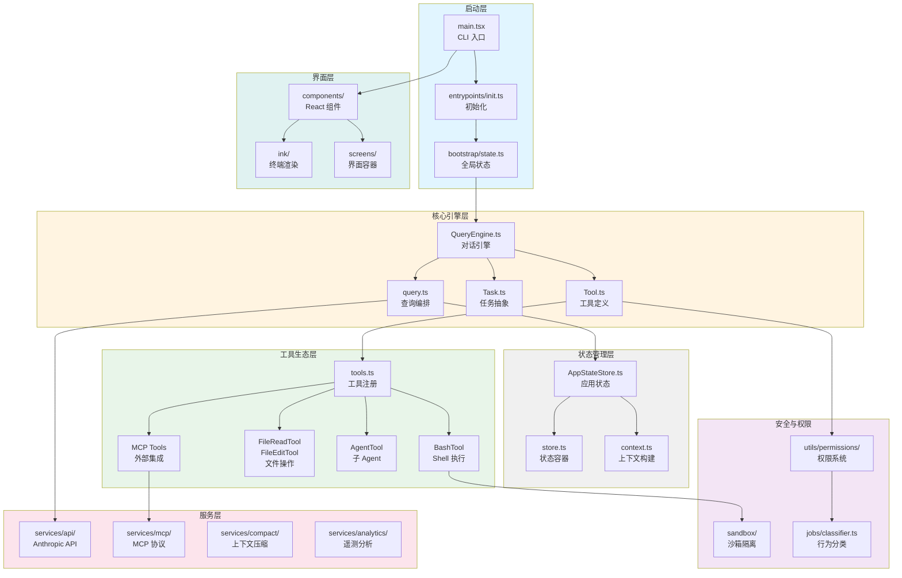
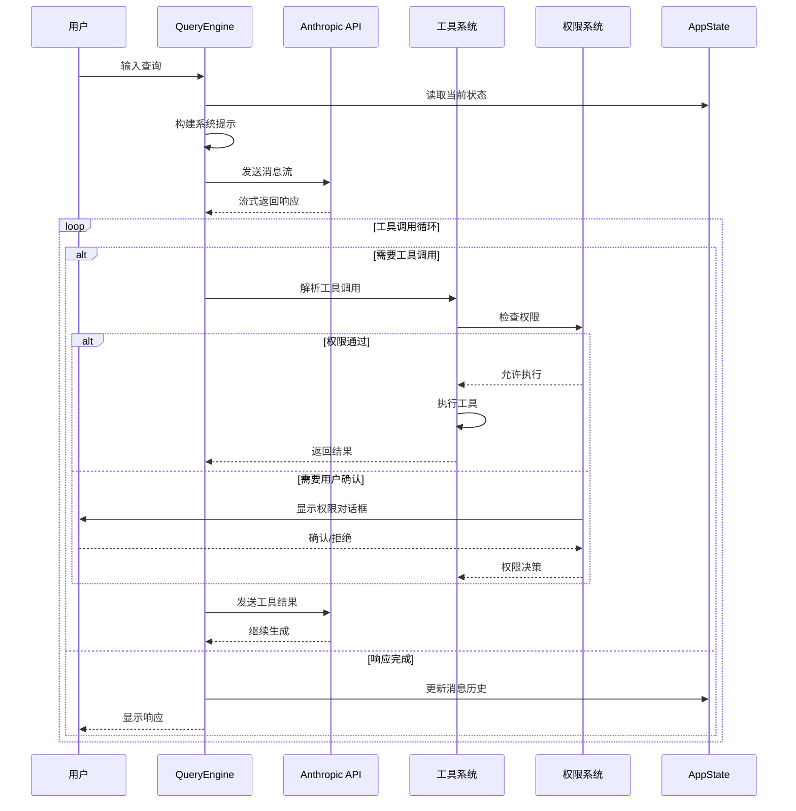
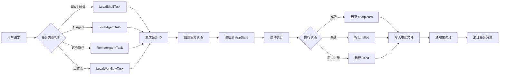

Claude Code 是一个基于 TypeScript/Bun 构建的智能编程助手 CLI 工具，采用模块化架构设计，通过 Agentic Loop 实现自主任务规划与执行。系统核心由**查询引擎**、**任务系统**、**工具生态**、**权限管理**、**上下文工程**五大子系统构成，支持多 Agent 协作、MCP 协议扩展、Hooks 钩子等高级能力。

## 架构全景图



系统采用**分层架构**设计：启动层负责环境初始化与全局状态配置，核心引擎层实现对话循环与任务调度，状态管理层维护应用生命周期数据，工具生态层提供可扩展的操作能力，服务层封装外部 API 交互，安全与权限层确保操作可控性，界面层实现终端交互体验。

Sources: [main.tsx](claude-code/src/main.tsx#L1-L100), [init.ts](claude-code/src/entrypoints/init.ts#L1-L100), [QueryEngine.ts](claude-code/src/QueryEngine.ts#L1-L150)

## 核心子系统详解

### 1. 查询引擎

**QueryEngine** 是系统的中枢神经，负责编排整个对话流程：接收用户输入 → 构建系统提示 → 调用 Anthropic API → 执行工具调用 → 处理响应 → 循环迭代。其核心配置包含工具集、命令集、MCP 客户端、Agent 定义等运行时依赖。

```typescript
export type QueryEngineConfig = {
  cwd: string                    // 工作目录
  tools: Tools                   // 可用工具集
  commands: Command[]            // 斜杠命令
  mcpClients: MCPServerConnection[]  // MCP 服务器连接
  agents: AgentDefinition[]      // Agent 定义
  canUseTool: CanUseToolFn       // 工具使用权限检查
  getAppState: () => AppState    // 状态读取器
  setAppState: (f: (prev: AppState) => AppState) => void  // 状态更新器
  initialMessages?: Message[]    // 初始消息历史
  readFileCache: FileStateCache  // 文件状态缓存
  customSystemPrompt?: string    // 自定义系统提示
  thinkingConfig?: ThinkingConfig  // 思维链配置
  maxTurns?: number             // 最大对话轮次
  maxBudgetUsd?: number         // 预算限制
}
```

**query.ts** 实现具体的查询逻辑，包括消息标准化、工具调用编排、上下文压缩触发、错误处理重试等。系统支持**流式响应**处理，通过 `StreamEvent` 事件机制实时推送 API 响应片段。

Sources: [QueryEngine.ts](claude-code/src/QueryEngine.ts#L132-L150), [query.ts](claude-code/src/query.ts#L1-L100)

### 2. 任务系统

**Task** 抽象定义了异步操作的统一接口，涵盖本地 Shell 执行、子 Agent 调度、远程 Agent 协作、工作流执行等多种类型。每个任务具有唯一 ID、状态机、输出文件、超时控制等生命周期管理能力。

| 任务类型 | 标识符 | 用途 | 示例场景 |
|---------|--------|------|---------|
| local_bash | b* | 本地 Shell 命令执行 | `npm test`、`git status` |
| local_agent | a* | 本地子 Agent 调用 | 代码审查、测试生成 |
| remote_agent | r* | 远程 Agent 协作 | 云端代码分析 |
| in_process_teammate | t* | 进程内协作 Agent | 并行任务分解 |
| local_workflow | w* | 工作流编排 | CI/CD 流水线 |
| monitor_mcp | m* | MCP 服务器监控 | 外部服务监听 |
| dream | d* | 后台推理任务 | 预测性分析 |

任务状态流转遵循 `pending → running → completed/failed/killed` 生命周期，`isTerminalTaskStatus` 函数判断任务是否进入终态。任务输出通过**内存映射文件**实现跨进程通信，避免大型输出阻塞主循环。

Sources: [Task.ts](claude-code/src/Task.ts#L1-L126)

### 3. 工具生态

**Tool** 定义了工具的标准接口：名称、参数 Schema、执行函数、权限检查、进度回调。系统内置 30+ 工具，覆盖文件操作、Shell 执行、代码搜索、Web 访问、Agent 调度等场景。

```typescript
export type Tool<T extends z.ZodType = z.ZodType> = {
  name: string                   // 工具名称（如 "bash"）
  description: string            // 功能描述
  inputSchema: T                // Zod 参数 Schema
  progress?: {
    // 进度更新回调
    setToolJSX: SetToolJSXFn    // 设置 JSX UI
    setProgress: (progress: ToolProgressData) => void
  }
  // 权限检查
  checkPermission?: (args: {
    input: z.infer<T>
    toolUseContext: ToolUseContext
    permissionContext: ToolPermissionContext
  }) => Promise<PermissionResult>
  // 核心执行逻辑
  tool: (args: {
    input: z.infer<T>
    toolUseContext: ToolUseContext
  }) => Promise<ToolResult>
}
```

**工具权限上下文** (`ToolPermissionContext`) 定义了多层权限规则：`alwaysAllowRules`（自动允许）、`alwaysDenyRules`（自动拒绝）、`alwaysAskRules`（强制询问），以及权限模式（default/plan/bypass/auto）。权限决策通过**分类器**进行风险评估，高风险操作触发用户确认。

Sources: [Tool.ts](claude-code/src/Tool.ts#L1-L150), [tools.ts](claude-code/src/tools.ts#L1-L100)

### 4. 状态管理

**AppState** 采用**不可变状态**设计，通过 `DeepImmutable` 类型确保状态只读。状态容器基于 `useSyncExternalStore` 实现响应式更新，避免不必要的重渲染。

```typescript
export type AppState = DeepImmutable<{
  settings: SettingsJson           // 用户配置
  verbose: boolean                 // 详细日志模式
  mainLoopModel: ModelSetting      // 当前模型
  toolPermissionContext: ToolPermissionContext  // 权限上下文
  messages: Message[]              // 对话历史
  tasks: Map<string, TaskState>    // 活跃任务
  mcpClients: MCPServerConnection[] // MCP 连接
  // Agent 协作状态
  showTeammateMessagePreview?: boolean
  selectedIPAgentIndex: number
  coordinatorTaskIndex: number
  // 远程会话状态
  remoteSessionUrl: string | undefined
  remoteConnectionStatus: 'connecting' | 'connected' | 'reconnecting' | 'disconnected'
  // Bridge 状态
  replBridgeEnabled: boolean
  replBridgeConnected: boolean
  // 推测执行状态
  speculationState: SpeculationState
  // 上下文压缩追踪
  autoCompactTracking: AutoCompactTrackingState
}>
```

**AppStateProvider** 封装状态容器，通过 React Context 提供全局访问。状态更新通过 `setAppState(prev => newState)` 函数式更新，确保并发安全。状态变更监听器 (`onChangeAppState`) 用于持久化、遥测等副作用。

Sources: [AppStateStore.ts](claude-code/src/state/AppStateStore.ts#L89-L150), [AppState.tsx](claude-code/src/state/AppState.tsx#L1-L200)

### 5. 上下文工程

**系统提示构建** (`context.ts`) 负责组装发送给 Claude 的完整上下文：Git 状态、项目结构、代码规范、记忆库、MCP 服务器能力等。上下文采用**分层缓存**策略，避免重复计算。

| 上下文层 | 来源 | 内容 | 更新频率 |
|---------|------|------|---------|
| System Context | `getSystemContext()` | 操作系统、Shell 环境、时间 | 每次查询 |
| User Context | `getUserContext()` | 项目根目录、Git 状态、分支信息 | 缓存（5分钟） |
| Memory Context | `memdir/` | 项目记忆、团队知识 | 文件变更时 |
| Tool Context | `tools.ts` | 可用工具描述、参数 Schema | 工具集变更时 |
| MCP Context | `services/mcp/` | 外部服务器能力、资源列表 | 连接建立时 |

**Token 预算管理** 通过 `tokenBudget` 模块动态分配各层上下文的 Token 配额，确保总上下文不超过模型限制（200K for Claude 3.5 Sonnet）。当上下文超限时，触发**自动压缩** (`services/compact/`)：移除旧消息、压缩工具调用结果、生成对话摘要。

Sources: [context.ts](claude-code/src/context.ts#L1-L100), [memdir/memdir.ts](claude-code/src/memdir/memdir.ts#L1-L50)

## 核心流程图解

### 对话循环流程



对话循环的核心是**Agentic Loop**：Claude 自主决定是否调用工具、调用顺序、参数传递，系统仅提供工具定义与执行环境。这种设计使 Claude 能够进行**多步推理**：读取文件 → 分析代码 → 修改文件 → 运行测试 → 根据结果调整。

Sources: [QueryEngine.ts](claude-code/src/QueryEngine.ts#L1-L150), [query.ts](claude-code/src/query.ts#L1-L100)

### 任务调度流程



任务系统通过**任务注册表**（`AppState.tasks`）管理所有活跃任务，每个任务独立维护输出文件（`getTaskOutputPath`）。主循环通过轮询或事件通知感知任务完成，从输出文件读取结果并注入到对话历史。

Sources: [Task.ts](claude-code/src/Task.ts#L59-L126), [tasks/](claude-code/src/tasks/)

## 技术栈与设计模式

### 核心技术栈

| 层级 | 技术选型 | 用途 |
|------|---------|------|
| 运行时 | Bun 1.3+ | JavaScript 运行时、包管理、打包 |
| 语言 | TypeScript 5.x | 类型安全、接口定义 |
| UI 框架 | React 18 + Ink | 终端 UI 组件化 |
| 状态管理 | Zustand-like Store | 不可变状态、响应式更新 |
| API 客户端 | @anthropic-ai/sdk | Claude API 调用 |
| Schema 验证 | Zod v4 | 运行时类型检查 |
| 外部协议 | @modelcontextprotocol/sdk | MCP 服务器集成 |
| 终端渲染 | Ink (自研 fork) | 虚拟 DOM → ANSI 转义 |

### 关键设计模式

1. **依赖注入**：QueryEngine 通过 config 对象接收所有依赖（tools、commands、mcpClients），便于测试与扩展。

2. **策略模式**：权限检查通过 `checkPermission` 函数实现，不同工具可定义不同策略（如 BashTool 检查命令白名单，FileEditTool 检查路径范围）。

3. **观察者模式**：AppState 通过 `subscribe` 机制通知订阅者状态变更，组件通过 `useSyncExternalStore` 订阅特定状态切片。

4. **工厂模式**：`getTools()` 函数根据运行时配置动态组装工具集，支持条件编译（`feature('COORDINATOR_MODE')`）。

5. **中间件模式**：Hooks 系统允许在工具执行前后注入自定义逻辑（如日志记录、权限审计、结果转换）。

Sources: [main.tsx](claude-code/src/main.tsx#L1-L100), [Tool.ts](claude-code/src/Tool.ts#L95-L150)

## 扩展性设计

### MCP 协议集成

**Model Context Protocol (MCP)** 是 Anthropic 推出的工具集成标准，Claude Code 完整实现了 MCP 客户端能力。通过 `services/mcp/client.ts` 管理多个 MCP 服务器连接，自动发现服务器提供的工具、资源、提示模板。

```typescript
export type MCPServerConnection = {
  name: string                    // 服务器名称
  status: 'connecting' | 'connected' | 'failed'
  capabilities: ServerCapabilities  // 服务器能力
  tools: MCPTool[]                // 提供的工具
  resources: ServerResource[]     // 可访问的资源
  client: Client                  // MCP SDK 客户端实例
}
```

MCP 服务器通过配置文件声明（`~/.config/claude-code/mcp.json`），支持多种传输协议：`stdio`（子进程通信）、`sse`（Server-Sent Events）、`http`（REST API）、`ws`（WebSocket）。

Sources: [services/mcp/types.ts](claude-code/src/services/mcp/types.ts#L1-L100), [services/mcp/client.ts](claude-code/src/services/mcp/client.ts#L1-L100)

### Hooks 钩子系统

Hooks 允许在关键执行点注入自定义逻辑，支持**同步/异步**执行、**结果修改**、**执行拦截**等高级能力。

| Hook 类型 | 触发时机 | 用途 |
|----------|---------|------|
| `PreToolUse` | 工具调用前 | 参数验证、权限增强 |
| `PostToolUse` | 工具调用后 | 结果转换、日志记录 |
| `PreQuery` | API 调用前 | 上下文注入、缓存检查 |
| `PostQuery` | API 调用后 | 响应处理、遥测上报 |
| `Notification` | 事件通知 | 桌面通知、Webhook 推送 |

Hooks 配置存储在 `~/.config/claude-code/hooks.json`，支持 Shell 命令、HTTP 请求、JavaScript 函数等多种执行方式。

Sources: [utils/hooks/](claude-code/src/utils/hooks/), [schemas/hooks.ts](claude-code/src/schemas/hooks.ts#L1-L50)

### Skills 技能扩展

**Skills** 是预定义的任务模板，封装常见工作流（如"创建 React 组件"、"修复 ESLint 错误"）。每个 Skill 包含提示模板、工具配置、参数 Schema。

```typescript
export type Skill = {
  name: string                    // 技能名称
  description: string             // 功能描述
  template: string                // 提示模板（支持变量插值）
  tools?: string[]                // 限制可用工具
  mcpServers?: string[]           // 依赖的 MCP 服务器
  parameters?: z.ZodObject<any>   // 参数 Schema
}
```

用户可通过 `/skills` 命令浏览可用技能，或通过配置文件自定义技能。SkillTool 将技能转换为可调用工具，Claive 自主决定何时使用。

Sources: [skills/](claude-code/src/skills/), [tools/SkillTool/](claude-code/src/tools/SkillTool/)

## 性能优化策略

### 1. 启动性能优化

- **并行预取**：`startMdmRawRead()` 和 `startKeychainPrefetch()` 在模块加载阶段并行启动耗时操作。
- **懒加载**：OpenTelemetry、Coordinator 等重型模块通过动态 `import()` 延迟加载。
- **条件编译**：`feature('COORDINATOR_MODE')` 通过 Bun 的 dead code elimination 移除未使用代码。

Sources: [main.tsx](claude-code/src/main.tsx#L1-L20)

### 2. 上下文缓存

- **Git 状态缓存**：`getGitStatus` 通过 `memoize` 缓存 5 分钟，避免频繁执行 `git` 命令。
- **文件状态缓存**：`FileStateCache` 追踪文件读取/修改时间，避免重复读取未变更文件。
- **Token 计数缓存**：通过近似估计算法（字符数 × 系数）避免每次调用官方 Tokenizer。

Sources: [context.ts](claude-code/src/context.ts#L36-L100), [utils/fileStateCache.ts](claude-code/src/utils/fileStateCache.ts#L1-L50)

### 3. 流式处理

所有 API 调用采用**流式响应**，实时渲染文本块与工具调用，避免等待完整响应。工具结果通过**增量写入**输出文件，主循环通过文件偏移量读取新增内容。

Sources: [query.ts](claude-code/src/query.ts#L80-L100)

## 阅读建议

根据你的学习目标，推荐以下阅读路径：

**对话系统与 API 交互**：
- [Agentic 对话循环机制](5-agentic-dui-hua-xun-huan-ji-zhi) - 理解 QueryEngine 如何编排多轮对话
- [流式响应与事件处理](6-liu-shi-xiang-ying-yu-shi-jian-chu-li) - 掌握流式 API 处理模式

**工具系统**：
- [工具架构与注册机制](8-gong-ju-jia-gou-yu-zhu-ce-ji-zhi) - 学习如何定义和注册新工具
- [Shell 执行与命令工具](10-shell-zhi-xing-yu-ming-ling-gong-ju) - 深入 BashTool 的实现原理

**安全与权限**：
- [权限模型与审批流程](13-quan-xian-mo-xing-yu-shen-pi-liu-cheng) - 理解多层权限检查机制
- [沙箱隔离机制](14-sha-xiang-ge-chi-ji-zhi) - 学习如何安全执行不可信代码

**上下文工程**：
- [系统提示构建](17-xi-tong-ti-shi-gou-jian) - 掌握上下文组装的最佳实践
- [上下文压缩策略](19-shang-xia-wen-ya-suo-ce-lue) - 学习如何管理 Token 预算

**可扩展性**：
- [MCP 协议集成](24-mcp-xie-yi-ji-cheng) - 集成外部工具服务器
- [Hooks 钩子系统](25-hooks-gou-zi-xi-tong) - 在关键执行点注入自定义逻辑