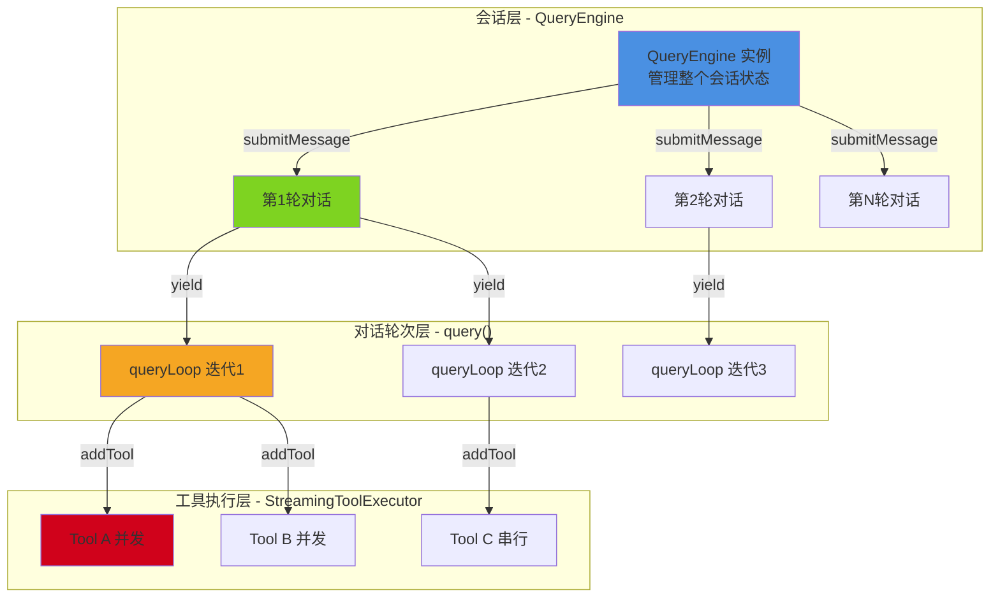
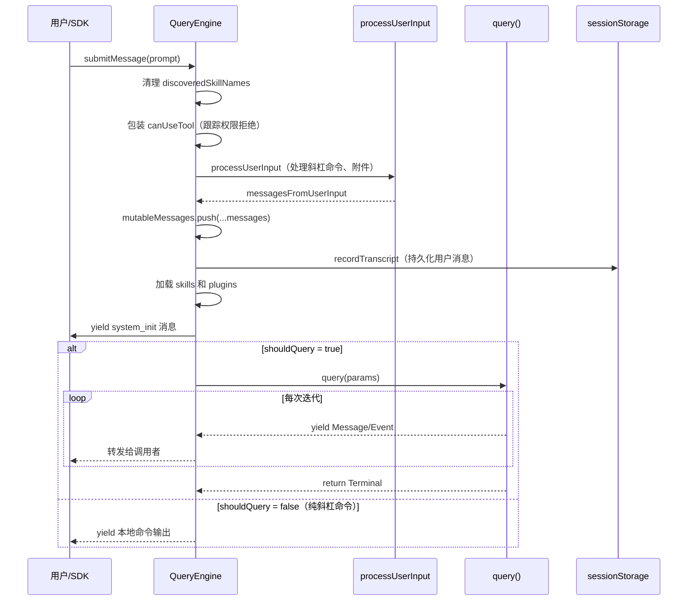
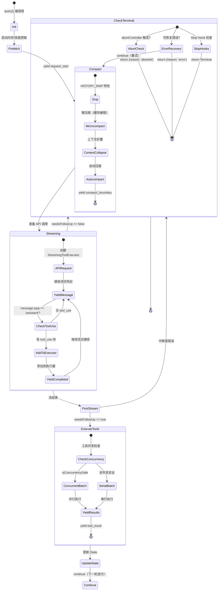
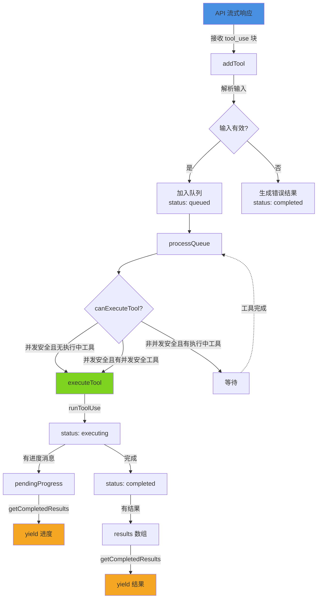
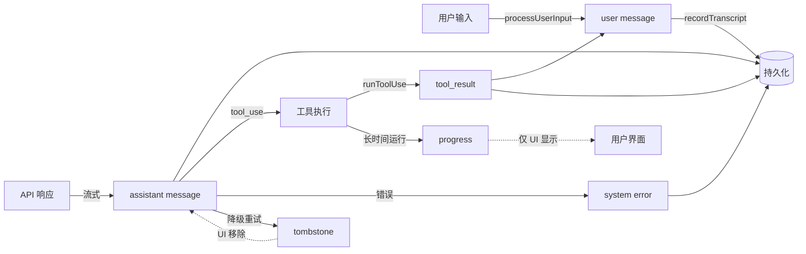
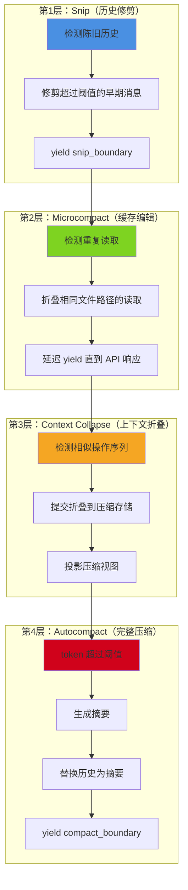

Claude Code 的核心在于其 **Agentic 对话循环** —— 一个能够自主规划、执行工具调用、并根据结果调整策略的持续交互系统。与传统的一次性问答不同，这个循环系统允许 AI 助手在单个用户请求中执行多轮工具调用，直到任务完成或需要用户干预。

## 架构概览：三层循环结构

Claude Code 的对话系统采用**三层嵌套架构**，每层负责不同粒度的状态管理和生命周期控制：



### 核心职责划分

| 层级 | 核心类/函数 | 生命周期 | 管理的状态 | 关键操作 |
|------|------------|---------|-----------|---------|
| **会话层** | `QueryEngine` | 整个会话期间 | mutableMessages、permissionDenials、fileReadState | 处理用户输入、持久化会话、权限跟踪 |
| **对话轮次层** | `query()` / `queryLoop()` | 单次用户请求 | State（messages、toolUseContext、turnCount） | API 调用、上下文压缩、循环控制 |
| **工具执行层** | `StreamingToolExecutor` | 单次 API 响应期间 | TrackedTool 队列、并发状态 | 工具调度、并发控制、结果缓冲 |

Sources: [QueryEngine.ts](claude-code/src/QueryEngine.ts#L186-L209), [query.ts](claude-code/src/query.ts#L219-L279), [StreamingToolExecutor.ts](claude-code/src/services/tools/StreamingToolExecutor.ts#L40-L62)

## QueryEngine：会话级状态管理器

`QueryEngine` 是整个对话系统的**根对象**，每个会话（conversation）创建一个实例并持续到会话结束。它的核心职责是**跨轮次状态持久化**和**用户输入预处理**。

### 核心状态成员

```typescript
export class QueryEngine {
  private config: QueryEngineConfig              // 配置项（不可变）
  private mutableMessages: Message[]             // 完整消息历史（跨轮次累积）
  private abortController: AbortController       // 中断控制器
  private permissionDenials: SDKPermissionDenial[] // 权限拒绝记录（SDK 报告用）
  private totalUsage: NonNullableUsage           // 累计 token 使用量
  private readFileState: FileStateCache          // 文件读取缓存（避免重复读取）
  private discoveredSkillNames: Set<string>      // 本轮发现的技能名称
  private loadedNestedMemoryPaths: Set<string>   // 已加载的嵌套内存路径
}
```

### submitMessage：对话入口点

用户每次发送消息都会调用 `submitMessage()`，它是一个 **AsyncGenerator**，通过 `yield` 逐步产出各类事件：



Sources: [QueryEngine.ts](claude-code/src/QueryEngine.ts#L211-L599)

### 关键设计决策

1. **早期持久化**：在进入 `query()` 循环**之前**就将用户消息写入 transcript，确保即使进程在 API 响应前被杀死，会话仍可通过 `--resume` 恢复。
2. **双模式持久化**：交互模式阻塞等待写入完成（~4-30ms），`--bare` 模式下异步执行以优化启动性能。
3. **权限拒绝跟踪**：通过包装 `canUseTool` 函数，自动记录所有被拒绝的工具调用，用于 SDK 的权限报告。

Sources: [QueryEngine.ts](claude-code/src/QueryEngine.ts#L439-L466)

## query()：对话轮次的核心循环

`query()` 是整个系统的**心脏**，实现了"Agentic"的核心语义 —— **自主多轮执行**。它通过一个无限循环持续处理工具调用，直到满足退出条件。

### State：跨迭代可变状态

为了避免函数内部出现 9 个独立的可变变量，系统将所有需要跨迭代传递的状态封装到 `State` 结构中：

```typescript
type State = {
  messages: Message[]                       // 当前对话历史
  toolUseContext: ToolUseContext            // 工具执行上下文
  autoCompactTracking: AutoCompactTrackingState | undefined  // 自动压缩追踪
  maxOutputTokensRecoveryCount: number      // max_output_tokens 恢复计数
  hasAttemptedReactiveCompact: boolean      // 是否已尝试反应式压缩
  maxOutputTokensOverride: number | undefined // 强制输出 token 限制
  pendingToolUseSummary: Promise<ToolUseSummaryMessage | null> | undefined // 工具摘要
  stopHookActive: boolean | undefined       // Stop Hook 是否激活
  turnCount: number                         // 当前对话轮次计数
  transition: Continue | undefined          // 上次迭代为何继续（测试断言用）
}
```

每次循环开始时，函数会**解构 State** 到局部变量，使代码清晰易读；`continue` 语句则通过重新构造完整的 `State` 对象来更新状态。

Sources: [query.ts](claude-code/src/query.ts#L204-L217), [query.ts](claude-code/src/query.ts#L311-L321)

### 对话循环的完整生命周期



Sources: [query.ts](claude-code/src/query.ts#L307-L1055)

### 循环控制的三大分支

循环的核心决策点在 `needsFollowUp` 变量 —— 它决定了是**继续执行工具**还是**终止对话**：

#### 1. 工具执行分支（needsFollowUp = true）

当 API 响应包含 `tool_use` 块时，系统会：
- 收集所有 `tool_use` 块到 `toolUseBlocks` 数组
- 如果启用了流式工具执行，立即将块添加到 `StreamingToolExecutor`
- 在流式接收期间**并发执行**工具，并实时 yield 已完成的结果
- 流结束后，通过 `getRemainingResults()` 确保所有工具结果被收集
- 更新 `state.messages` 并 `continue` 进入下一轮迭代

Sources: [query.ts](claude-code/src/query.ts#L832-L865), [query.ts](claude-code/src/query.ts#L1019-L1032)

#### 2. 错误恢复分支

系统实现了**多层次的错误恢复机制**，优先级从低到高：

| 错误类型 | 第一次恢复 | 第二次恢复 | 失败后动作 |
|---------|-----------|-----------|-----------|
| `prompt_too_long`（413） | Context Collapse drain | Reactive Compact | return {reason: 'prompt_too_long'} |
| `media_size_error` | Reactive Compact（剥离大文件） | - | return {reason: 'image_error'} |
| `max_output_tokens` | 8k → 64k 重试 | 多轮继续 | yield 错误，return |
| `overloaded_error` | 指数退避重试 | - | throw |

错误恢复的核心设计是**延迟揭示**（withhold）：可恢复的错误消息不会立即 yield 给调用者，而是先尝试恢复，只有当所有恢复手段都失败时才揭示原始错误。

Sources: [query.ts](claude-code/src/query.ts#L1068-L1186)

#### 3. 终止分支

当满足以下任一条件时，对话循环终止并返回 `Terminal` 对象：
- 无 `tool_use` 块且无错误 → 自然结束
- 用户中断 → `return {reason: 'aborted_streaming'}`
- 不可恢复错误 → `return {reason: '具体错误类型'}`
- 达到最大轮次限制 → `return {reason: 'max_turns'}`
- 预算耗尽 → `return {reason: 'budget_exceeded'}`

Sources: [query.ts](claude-code/src/query.ts#L1054), [query.ts](claude-code/src/query.ts#L1178)

## StreamingToolExecutor：并发安全的工具执行器

传统工具执行系统采用**串行模型**：等待所有 API 响应接收完毕后，逐个执行工具。Claude Code 的 `StreamingToolExecutor` 实现了**流式并发执行** —— 工具在流式接收期间就开始执行，大幅降低延迟。

### 并发控制策略

工具分为两类：
- **并发安全工具**：只读操作（`Read`、`Grep`、`Glob`），可并行执行
- **非并发工具**：写操作（`Edit`、`Write`、`Bash`），必须独占执行

执行器维护一个 `TrackedTool` 队列，每个条目包含：
```typescript
type TrackedTool = {
  id: string                          // tool_use_id
  block: ToolUseBlock                 // 原始块
  assistantMessage: AssistantMessage  // 关联的 assistant 消息
  status: 'queued' | 'executing' | 'completed' | 'yielded'
  isConcurrencySafe: boolean          // 并发安全性标志
  promise?: Promise<void>             // 执行 Promise
  results?: Message[]                 // 执行结果
  pendingProgress: Message[]          // 进度消息（立即 yield）
}
```

### 执行流程



Sources: [StreamingToolExecutor.ts](claude-code/src/services/tools/StreamingToolExecutor.ts#L40-L150)

### 流式工具执行的关键优势

1. **降低延迟**：在 30 秒的 API 流式响应期间，工具已经在后台执行
2. **实时反馈**：通过 `pendingProgress` 机制，长时间运行的工具（如大型测试）可实时报告进度
3. **错误隔离**：单个工具错误不会阻塞其他并发工具的执行
4. **优雅中断**：通过 `siblingAbortController`，当一个 Bash 工具出错时，可立即终止所有兄弟进程

Sources: [StreamingToolExecutor.ts](claude-code/src/services/tools/StreamingToolExecutor.ts#L45-L62), [StreamingToolExecutor.ts](claude-code/src/services/tools/StreamingToolExecutor.ts#L69-L71)

## 消息类型系统

对话循环处理的消息分为多种类型，每种类型都有特定的用途和生命周期：

### 核心消息类型

| 类型 | 用途 | 生成时机 | 是否持久化 |
|------|------|---------|-----------|
| `user` | 用户输入或工具结果 | processUserInput / 工具执行 | ✓ |
| `assistant` | API 响应 | API 流式响应 | ✓ |
| `attachment` | 文件/图片附件 | getAttachmentMessages | ✓ |
| `system` | 系统消息（压缩边界、错误等） | 压缩/错误处理 | ✓ |
| `progress` | 工具执行进度 | 长时间运行的工具 | ✗ |
| `tombstone` | 墓碑标记（删除孤儿消息） | 流式降级重试 | ✗ |

### 消息生命周期



Sources: [message.ts](claude-code/src/types/message.ts#L19-L76)

## 上下文压缩机制

Claude Code 实现了**四级压缩策略**，按触发条件和压缩粒度分层：

### 压缩层级



### 压缩触发时机

| 压缩类型 | 触发条件 | 压缩效果 | 是否可逆 |
|---------|---------|---------|---------|
| **Snip** | 历史消息超过 50 轮 | 移除早期消息，释放 tokens | ✗ |
| **Microcompact** | 相同文件被读取多次 | 折叠重复读取，保留最近一次 | ✓（缓存失效时） |
| **Context Collapse** | 检测到可折叠模式 | 保留原始消息，创建投影视图 | ✓ |
| **Autocompact** | Context 超过模型限制的 90% | 生成摘要替换详细对话 | ✗ |

Sources: [query.ts](claude-code/src/query.ts#L400-L543)

## 工具执行的完整流程

从工具调用到结果返回的完整生命周期：

### 1. 权限检查阶段

```typescript
const result = await canUseTool(tool, input, toolUseContext, assistantMessage, toolUseID)

if (result.behavior !== 'allow') {
  // 记录权限拒绝
  permissionDenials.push({ type: 'permission_denial', tool_name, ... })
  // 返回拒绝消息作为 tool_result
  return createUserMessage({ content: [tool_result with is_error: true] })
}
```

### 2. Pre-Tool-Use Hooks

在工具执行前，系统会运行所有注册的 pre-tool-use hooks：
- 修改工具输入（如文件路径规范化）
- 注入额外上下文（如 Git 状态）
- 覆盖权限决策（如自动批准特定操作）

### 3. 工具执行阶段

```typescript
const toolResult = await tool.run(input, toolUseContext)
```

工具通过 `Tool.run()` 方法执行，返回 `ToolResult` 对象：
- `content`: 文本内容或内容块数组
- `mediaAttachments`: 图片/文件附件
- `contextModifier`: 修改 `ToolUseContext` 的函数

### 4. Post-Tool-Use Hooks

工具执行完成后，运行 post-tool-use hooks：
- 记录工具使用统计
- 触发副作用（如自动 commit）
- 生成格式化输出

### 5. 结果处理

工具结果经过以下处理流程：
1. **规范化**：将工具输出转换为标准 `Message` 格式
2. **压缩**：如果结果过长，应用 `applyToolResultBudget` 截断
3. **存储**：更新 `FileStateCache`（如果是文件操作）
4. **Yield**：将结果产出给上层

Sources: [toolExecution.ts](claude-code/src/services/tools/toolExecution.ts#L1-L150), [toolOrchestration.ts](claude-code/src/services/tools/toolOrchestration.ts#L19-L82)

## 状态转换与循环继续

对话循环的核心是 **State 状态机**，每次迭代都可能触发状态转换：

### Continue 决策点

```typescript
if (needsFollowUp) {
  // 1. 收集工具结果
  const newMessages = [...messages, ...assistantMessages, ...toolResults]
  
  // 2. 更新 State
  state = {
    messages: newMessages,
    toolUseContext: updatedContext,
    turnCount: turnCount + 1,
    transition: { reason: 'tool_use' }
  }
  
  // 3. 继续循环
  continue
}
```

### Terminal 终止条件

```typescript
// 自然终止
return { reason: 'end_turn' }

// 用户中断
return { reason: 'aborted_streaming' }

// 错误终止
return { reason: 'prompt_too_long' }
return { reason: 'image_error' }
return { reason: 'max_turns' }
```

Sources: [query.ts](claude-code/src/query.ts#L1054), [query.ts](claude-code/src/query.ts#L1178)

## 设计原则总结

Claude Code 的 Agentic 对话循环体现了以下核心设计原则：

### 1. 分层状态管理
- **会话层**（QueryEngine）：长期状态、跨轮次持久化
- **轮次层**（query）：中期状态、工具调用链
- **工具层**（executor）：短期状态、单次执行

### 2. 延迟计算与流式处理
- 工具在流式响应期间就开始执行
- 压缩在真正需要时才触发
- 内存预取在后台异步进行

### 3. 错误恢复优于错误报告
- 多层 fallback 机制
- 延迟揭示可恢复错误
- 自动重试与降级策略

### 4. 并发安全优先
- 自动检测工具并发安全性
- 写操作强制串行化
- 错误隔离不传播

### 5. 可观测性设计
- 每个关键操作都有 checkpoint
- 通过 `transition` 字段记录循环决策原因
- 支持调试模式下的详细日志

这套架构使 Claude Code 能够处理从简单的单次问答到复杂的多步骤任务编排，同时保持系统的可维护性和可扩展性。

---

**相关主题**：
- 下一步建议阅读：[流式响应与事件处理](6-liu-shi-xiang-ying-yu-shi-jian-chu-li) —— 了解 API 流式响应的详细处理机制
- 相关主题：[工具架构与注册机制](8-gong-ju-jia-gou-yu-zhu-ce-ji-zhi) —— 深入理解工具系统的设计与实现
- 相关主题：[上下文压缩策略](19-shang-xia-wen-ya-suo-ce-lue) —— 详细了解四级压缩机制的工作原理
- 相关主题：[多轮对话与会话管理](7-duo-lun-dui-hua-yu-hui-hua-guan-li) —— 理解会话持久化与恢复机制