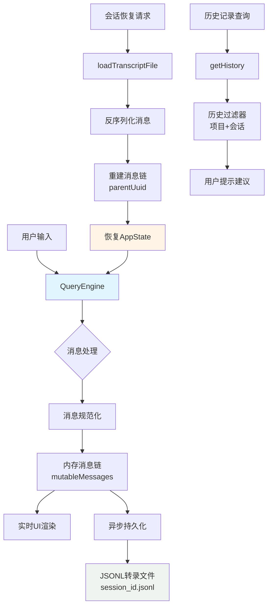
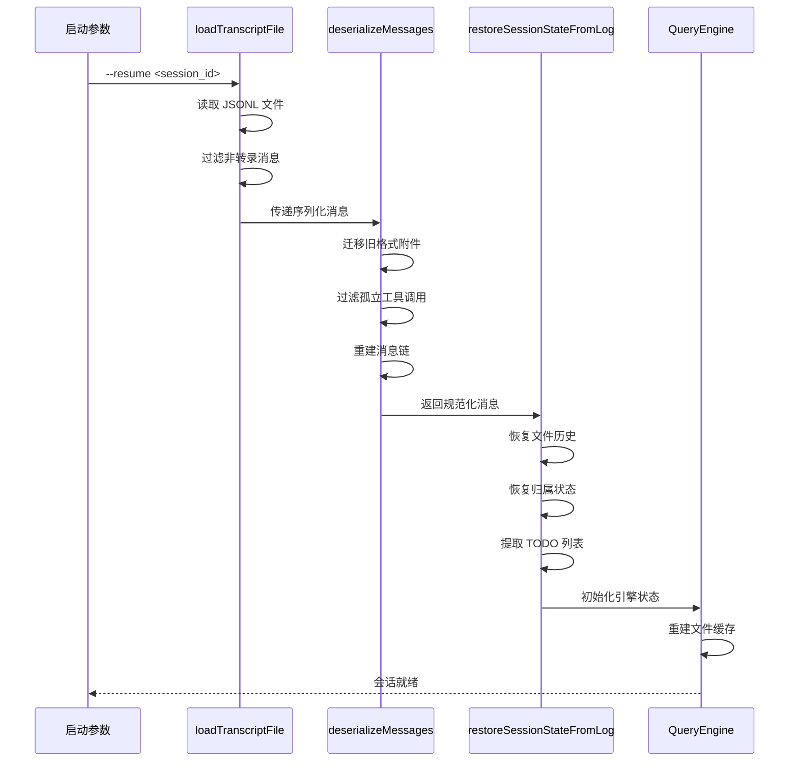
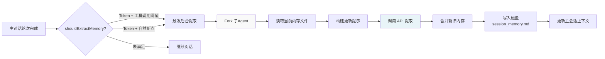
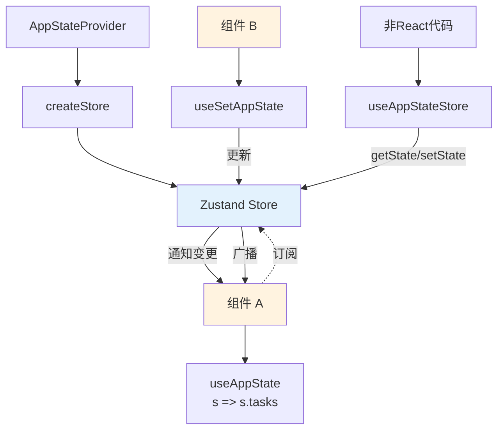
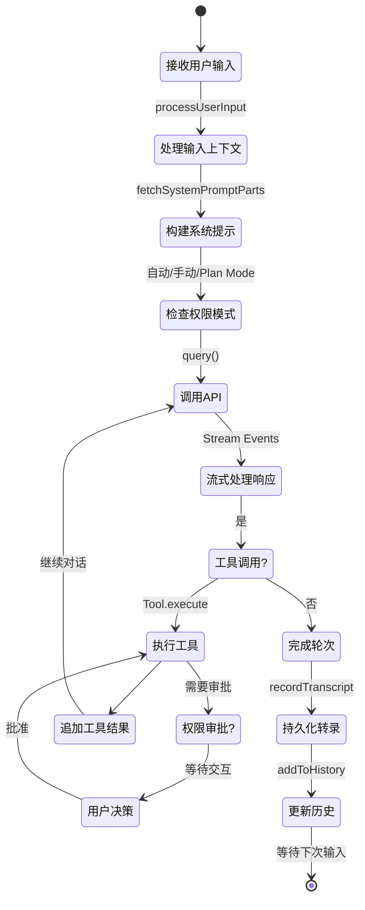

多轮对话与会话管理是 Claude Code 实现持续性、上下文感知交互的核心机制。该系统通过精细的消息链管理、持久化存储和状态恢复策略，确保用户能够在跨越多轮对话的复杂任务中保持连贯的工作上下文。本章节将深入解析会话生命周期管理、消息持久化机制、历史记录系统以及会话恢复策略的技术实现。

## 会话生命周期与架构概览

会话管理采用**分层持久化架构**，从内存状态到磁盘存储形成完整的数据流闭环。每个会话通过唯一的 SessionId 进行标识，所有对话消息以 JSONL 格式持久化到项目级存储中，支持跨进程恢复和长时间任务延续。



**核心设计原则**：会话系统遵循**单向数据流**模式——用户输入经由 QueryEngine 处理后规范化为 Message 对象，追加到内存消息链，同时异步写入磁盘。恢复时通过反序列化重建完整上下文，确保状态一致性。

Sources: [QueryEngine.ts](claude-code/src/QueryEngine.ts#L186-L200), [sessionStorage.ts](claude-code/src/utils/sessionStorage.ts#L139-L156)

## 消息链管理与持久化机制

### 消息类型系统

会话中的每条消息都遵循严格的类型定义，确保数据结构的可预测性和可序列化性：

```typescript
type Message = 
  | UserMessage           // 用户输入
  | AssistantMessage      // AI 响应
  | AttachmentMessage     // 文件/附件
  | SystemMessage         // 系统通知
  | ProgressMessage       // 进度更新（仅UI，不持久化）
```

**关键特性**：ProgressMessage 被设计为**瞬时状态**，不参与消息链持久化，避免膨胀转录文件体积。消息链通过 `parentUuid` 字段形成树状结构，支持精确的消息定位和分支恢复。

Sources: [types/message.ts](claude-code/src/types/message.ts), [sessionStorage.ts](claude-code/src/utils/sessionStorage.ts#L139-L146)

### 持久化流程

| 阶段 | 操作 | 文件位置 | 触发条件 |
|------|------|----------|----------|
| **实时写入** | `recordTranscript` | `~/.claude/projects/<project>/<session>.jsonl` | 每条消息生成时 |
| **历史记录** | `addToPromptHistory` | `~/.claude/history.jsonl` | 用户提交提示后 |
| **会话元数据** | `saveWorktreeState` | 同 JSONL 文件 | Worktree 模式切换 |
| **内容替换** | `recordContentReplacement` | 同 JSONL 文件 | 大型工具结果压缩 |

**异步持久化策略**：所有磁盘写入操作均为非阻塞，通过缓冲队列批量处理，避免影响交互响应速度。文件操作采用**文件锁机制**（lockfile）防止并发写入冲突。

Sources: [sessionStorage.ts](claude-code/src/utils/sessionStorage.ts#L78-L79), [history.ts](claude-code/src/history.ts#L355-L395)

## 历史记录系统

历史记录系统独立于会话转录，专注于**用户提示的快速检索和重用**，支持跨项目和跨会话的历史查询。

### 历史记录结构

```typescript
type LogEntry = {
  display: string           // 显示文本（含粘贴引用）
  pastedContents: Record<number, StoredPastedContent>
  timestamp: number
  project: string           // 项目标识
  sessionId?: string        // 会话归属
}
```

**粘贴内容处理**：小型文本（≤1KB）直接内联存储，大型内容计算哈希后存储到独立的 paste store，通过 `contentHash` 引用。这种**分级存储策略**平衡了检索速度和存储空间。

Sources: [history.ts](claude-code/src/history.ts#L219-L260)

### 历史记录查询优化

系统提供两种历史查询模式，针对不同使用场景优化：

| 查询模式 | 函数 | 特点 | 使用场景 |
|---------|------|------|----------|
| **Up-Arrow 历史** | `getHistory()` | 当前会话优先，按时间倒序 | 快速重用最近的命令 |
| **Ctrl+R 搜索** | `getTimestampedHistory()` | 去重显示文本，懒加载内容 | 跨会话搜索历史提示 |

**会话隔离机制**：`getHistory()` 将当前会话的条目置于其他会话之前，避免并发会话的历史记录交错，保证用户体验的连贯性。

Sources: [history.ts](claude-code/src/history.ts#L162-L217)

## 会话恢复与状态重建

会话恢复是多轮对话系统的核心能力，支持从磁盘转录文件完整重建会话状态，包括消息历史、文件缓存、任务状态等。

### 恢复流程架构



**关键恢复步骤**：

1. **消息反序列化**：`deserializeMessages` 处理格式迁移、过滤无效消息（未解析的工具调用、孤立的思维块）
2. **状态恢复**：`restoreSessionStateFromLog` 从日志快照重建文件历史、提交归属、TODO 列表
3. **缓存预热**：QueryEngine 恢复文件读取缓存，避免重新读取已知文件

Sources: [conversationRecovery.ts](claude-code/src/utils/conversationRecovery.ts#L154-L200), [sessionRestore.ts](claude-code/src/utils/sessionRestore.ts#L99-L150)

### 消息链一致性保证

会话恢复面临的核心挑战是**消息链完整性**。系统通过多层过滤机制确保恢复后的消息链符合 API 要求：

```typescript
// 过滤管道
deserializeMessages(messages)
  → migrateLegacyAttachmentTypes()    // 格式迁移
  → filterUnresolvedToolUses()        // 移除孤立工具调用
  → filterOrphanedThinkingOnlyMessages() // 移除孤立思维块
  → filterWhitespaceOnlyAssistantMessages() // 移除空白消息
```

**中断检测**：`deserializeMessagesWithInterruptDetection` 能够识别会话是否在轮次中被中断（如用户取消），支持自动继续未完成的任务。

Sources: [conversationRecovery.ts](claude-code/src/utils/conversationRecovery.ts#L164-L200)

## 会话内存与自动总结

**Session Memory** 系统通过后台子 Agent 定期提取对话关键信息，维护会话级别的知识库，避免在长对话中丢失重要上下文。

### 触发机制

Session Memory 的提取遵循**双重阈值策略**，平衡提取频率和上下文完整性：

| 阈值类型 | 配置参数 | 说明 |
|---------|---------|------|
| **Token 阈值** | `minimumTokensBetweenUpdate` | 上下文窗口增长量（与自动压缩共用指标） |
| **工具调用阈值** | `toolCallsBetweenUpdates` | 累计工具调用次数 |
| **安全窗口** | 最后助手轮次无工具调用 | 确保在自然对话断点提取 |

**触发逻辑**：当 Token 阈值**和**工具调用阈值同时满足，或 Token 阈值满足且处于对话自然断点时触发提取。Token 阈值为**强制条件**，防止过度提取。

Sources: [sessionMemory.ts](claude-code/src/services/SessionMemory/sessionMemory.ts#L134-L181)

### 提取流程



**内存文件结构**：`~/.claude/session_memory.md` 以 Markdown 格式存储结构化笔记，包含：
- 项目状态总结
- 关键决策记录
- 待办事项列表
- 重要代码位置引用

Sources: [sessionMemory.ts](claude-code/src/services/SessionMemory/sessionMemory.ts#L183-L200)

## AppState 状态管理

AppState 是会话的**运行时状态中心**，通过 React Context 和 Zustand-like store 模式管理所有动态状态，确保 UI 和业务逻辑的状态同步。

### 状态结构概览

```typescript
type AppState = {
  // 会话核心状态
  tasks: { [taskId: string]: TaskState }      // 任务注册表
  messages: Message[]                          // 内存消息链（通过 hook 管理）
  foregroundedTaskId?: string                 // 前台任务
  
  // 权限与模式
  toolPermissionContext: ToolPermissionContext
  mainLoopModel: ModelSetting
  
  // 远程会话
  remoteConnectionStatus: 'connected' | 'reconnecting' | 'disconnected'
  replBridgeEnabled: boolean
  
  // 插件与扩展
  mcp: { clients, tools, commands, resources }
  plugins: { enabled, disabled, errors }
}
```

**不可变性保证**：AppState 的所有字段都被标记为 `DeepImmutable`，状态更新必须通过 `setAppState` 函数进行，确保可追溯性和可调试性。

Sources: [AppStateStore.ts](claude-code/src/state/AppStateStore.ts#L89-L200)

### 状态订阅与响应式更新



**性能优化**：`useAppState` 支持选择器模式，组件仅在实际订阅的字段变化时重新渲染，避免不必要的渲染开销。多个独立字段应分别订阅而非返回对象。

Sources: [AppState.tsx](claude-code/src/state/AppState.tsx#L126-L163)

## QueryEngine：对话轮次引擎

QueryEngine 是**单会话实例**的核心控制器，管理从用户输入到 AI 响应的完整生命周期，维护跨轮次的持久状态。

### 核心职责

| 职责 | 实现机制 | 生命周期 |
|------|---------|---------|
| **消息管理** | `mutableMessages: Message[]` | 会话级别，跨轮次持久 |
| **文件缓存** | `readFileState: FileStateCache` | 避免重复读取已知文件 |
| **用量跟踪** | `totalUsage: NonNullableUsage` | 累积 Token 和成本统计 |
| **权限拒绝** | `permissionDenials: SDKPermissionDenial[]` | 轮次级别，重置于新轮次 |
| **技能发现** | `discoveredSkillNames: Set<string>` | 轮次级别，用于分析上报 |

**设计哲学**：QueryEngine 实例与会话**一对一绑定**，每个 `submitMessage()` 调用代表一个新轮次，但共享同一份状态。这种设计简化了状态管理，避免了跨轮次数据传递的复杂性。

Sources: [QueryEngine.ts](claude-code/src/QueryEngine.ts#L177-L200)

### 轮次处理流程



**关键特性**：
- **中断恢复**：通过 `abortController` 支持用户随时取消当前轮次
- **状态快照**：轮次开始时克隆文件缓存，支持失败回滚
- **懒加载消息**：仅在需要时加载完整消息内容（如大型工具结果）

Sources: [QueryEngine.ts](claude-code/src/QueryEngine.ts#L132-L175)

## 高级特性与实践

### 会话分支与 Worktree 隔离

**Worktree 模式**允许在独立 Git 工作树中运行子会话，实现并行开发而不干扰主工作流。会话系统通过 `PersistedWorktreeSession` 元数据跟踪 Worktree 会话：

```typescript
type PersistedWorktreeSession = {
  type: 'worktree_session'
  worktreePath: string          // Worktree 路径
  parentSessionId: string       // 父会话 ID
  agentType?: string            // 子 Agent 类型
  cwd: string                   // Worktree 工作目录
}
```

**恢复逻辑**：`restoreWorktreeSession` 在会话恢复时重新挂载 Worktree，确保文件操作路径正确。

Sources: [sessionRestore.ts](claude-code/src/utils/sessionRestore.ts#L61-L62), [types/logs.ts](claude-code/src/types/logs.ts)

### 远程会话与会话同步

**远程模式**（`--remote`）将会话状态同步到云端，支持跨设备访问和协作。关键状态包括：
- `remoteConnectionStatus`：WebSocket 连接状态
- `replBridgeEnabled`：远程控制开关
- `replBridgeSessionUrl`：云端会话 URL

**事件桥接**：本地会话通过 `SessionsWebSocket` 推送事件到远程查看器，实现实时状态同步。

Sources: [AppStateStore.ts](claude-code/src/state/AppStateStore.ts#L118-L148), [SessionsWebSocket.ts](claude-code/src/remote/SessionsWebSocket.ts)

### 上下文压缩与会话延续

当会话上下文接近 Token 限制时，**自动压缩**机制触发，通过以下策略保留关键信息：
1. **摘要生成**：提取对话核心决策和状态
2. **消息裁剪**：移除早期详细交互，保留摘要
3. **工具结果压缩**：大型输出替换为摘要引用

压缩边界通过 `SystemCompactBoundaryMessage` 标记，恢复时能够识别并正确处理压缩段。

Sources: [compact.ts](claude-code/src/services/compact/compact.ts), [messages.ts](claude-code/src/utils/messages.ts#L61-L63)

## 最佳实践建议

### 1. 会话持久化管理
- **定期清理**：大型项目的 `.jsonl` 文件可能增长到数 GB，建议定期归档旧会话
- **命名策略**：使用 `/rename <name>` 为重要会话设置有意义的名称，便于后续检索
- **分支利用**：对于实验性修改，使用 Worktree 模式隔离，避免污染主会话历史

### 2. 历史记录优化
- **粘贴内容**：大型文本通过文件引用（`@file.txt`）而非直接粘贴，避免历史记录膨胀
- **命令重用**：利用 Up-Arrow 快速访问最近命令，Ctrl+R 进行深度搜索
- **项目隔离**：历史记录按项目过滤，切换项目时自动切换历史上下文

### 3. 会话恢复场景
- **中断恢复**：意外退出后使用 `--resume` 自动恢复，系统会识别中断点并建议继续
- **跨机器同步**：结合 Git 提交 `.claude/` 目录（排除敏感信息），实现会话跨设备迁移
- **状态检查点**：关键修改前使用 `/compact` 生成摘要快照，便于后续回溯决策链

### 4. 性能优化
- **避免重复读取**：系统自动缓存已读文件，但大量文件操作时考虑分批处理
- **会话分片**：超长任务（数千轮对话）建议分割为多个子会话，避免单会话状态过重
- **内存监控**：长会话中关注内存使用，必要时重启会话释放累积状态

## 技术边界与限制

| 限制项 | 阈值 | 影响 | 缓解策略 |
|--------|------|------|----------|
| **JSONL 文件大小** | 建议 <50MB | 恢复速度下降 | 定期压缩或归档 |
| **消息链深度** | 无硬限制 | Token 限制触发压缩 | 自动压缩机制 |
| **历史记录条目** | 100 条/项目 | 旧记录自动丢弃 | 重要命令手动保存 |
| **内存缓存** | 读取缓存有限 | 频繁读取相同文件 | 系统自动 LRU 淘汰 |

Sources: [sessionStorage.ts](claude-code/src/utils/sessionStorage.ts#L121-L123), [history.ts](claude-code/src/history.ts#L19)

---

多轮对话与会话管理系统通过精细的消息链管理、持久化策略和状态恢复机制，为 Claude Code 提供了强大的上下文保持能力。理解这些底层机制有助于更好地规划工作流，优化会话使用策略，并在遇到问题时快速定位和解决。结合后续的[工具架构与注册机制](8-gong-ju-jia-gou-yu-zhu-ce-ji-zhi)，可以进一步掌握会话中工具调用的完整生命周期。