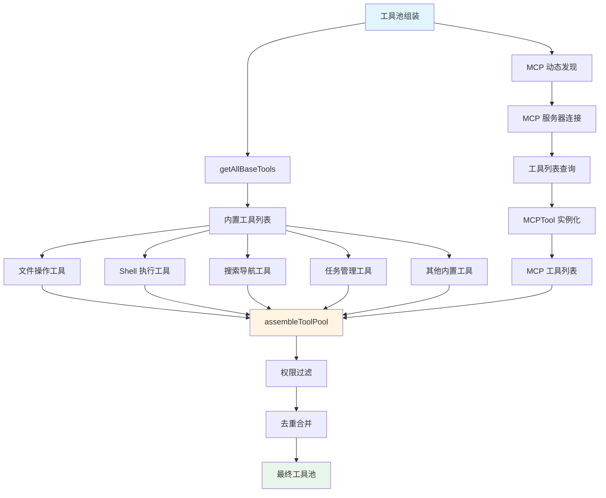
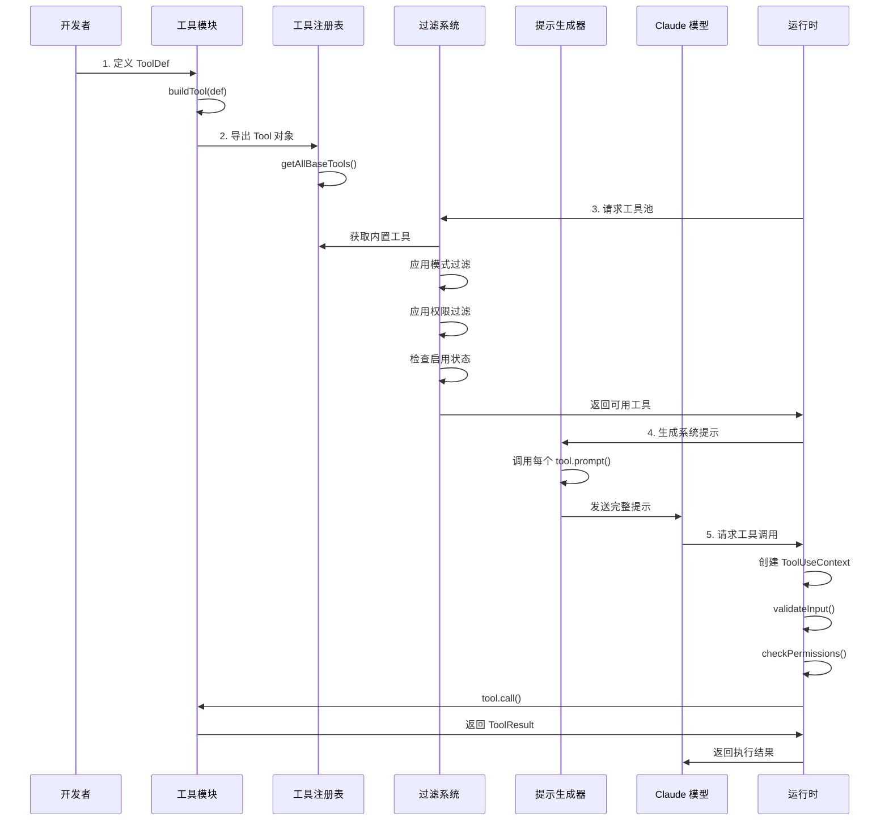

Claude Code 的工具系统是其智能体能力的核心基础设施，采用类型安全的接口设计、灵活的注册机制和多层次的过滤策略。本页面深入解析工具的定义规范、注册流程以及在系统中的生命周期管理。

## 核心架构：类型系统与接口定义

工具系统的类型架构建立在三个核心类型之上：`Tool`、`ToolDef` 和 `Tools`。**Tool** 类型定义了完整工具的所有必需和可选方法，包括执行逻辑、权限检查、UI 渲染、提示生成等多个维度的能力。这个接口非常庞大，包含了约 40 个方法，覆盖了从工具调用到结果展示的完整流程。

**ToolDef** 类型是一个部分定义类型，允许开发者只实现核心功能，而将安全相关的默认行为交由系统填充。这种设计通过 **buildTool** 函数实现，该函数接收一个 ToolDef 对象并返回一个完整的 Tool 对象，自动填充所有未提供的可选方法。默认策略遵循"安全优先"原则：`isConcurrencySafe` 默认为 `false`，`isReadOnly` 默认为 `false`，`checkPermissions` 默认委托给通用权限系统。

```typescript
export type Tool<
  Input extends AnyObject = AnyObject,
  Output = unknown,
  P extends ToolProgressData = ToolProgressData,
> = {
  readonly name: string
  aliases?: string[]
  searchHint?: string
  
  // 核心执行方法
  call(
    args: z.infer<Input>,
    context: ToolUseContext,
    canUseTool: CanUseToolFn,
    parentMessage: AssistantMessage,
    onProgress?: ToolCallProgress<P>,
  ): Promise<ToolResult<Output>>
  
  // Schema 定义
  readonly inputSchema: Input
  readonly inputJSONSchema?: ToolInputJSONSchema
  outputSchema?: z.ZodType<unknown>
  
  // 权限与安全
  checkPermissions(
    input: z.infer<Input>,
    context: ToolUseContext,
  ): Promise<PermissionResult>
  validateInput?(
    input: z.infer<Input>,
    context: ToolUseContext,
  ): Promise<ValidationResult>
  isConcurrencySafe(input: z.infer<Input>): boolean
  isReadOnly(input: z.infer<Input>): boolean
  isDestructive?(input: z.infer<Input>): boolean
  
  // UI 渲染
  renderToolUseMessage(
    input: Partial<z.infer<Input>>,
    options: { theme: ThemeName; verbose: boolean; commands?: Command[] },
  ): React.ReactNode
  renderToolResultMessage?(
    content: Output,
    progressMessagesForMessage: ProgressMessage<P>[],
    options: { ... }
  ): React.ReactNode
  
  // 提示生成
  description(input: z.infer<Input>, options: { ... }): Promise<string>
  prompt(options: { ... }): Promise<string>
  
  // 其他辅助方法...
}
```

**buildTool** 函数是工具定义的关键枢纽，它通过 TypeScript 的高级类型特性实现了精确的类型推断和默认值填充。函数签名 `buildTool<D extends AnyToolDef>(def: D): BuiltTool<D>` 保证了传入的部分定义会被完整化，同时保留了所有显式提供的类型信息。默认值对象 `TOOL_DEFAULTS` 集中定义了所有可缺省方法的安全默认实现，确保即使开发者忘记实现某些方法，系统也能保持安全的默认行为。

Sources: [Tool.ts](claude-code/src/Tool.ts#L362-L504) [Tool.ts](claude-code/src/Tool.ts#L757-L792)

## 工具注册：从定义到系统可用

工具注册采用分层架构，分为三个核心函数：`getAllBaseTools()`、`getTools(permissionContext)` 和 `assembleToolPool(permissionContext, mcpTools)`。这种分层设计支持不同运行模式下的工具集定制，同时保持注册逻辑的清晰和可维护性。

**getAllBaseTools()** 函数是所有内置工具的单一真实来源，返回一个包含 50+ 个工具对象的数组。这个函数通过条件导入和特性标志动态组装工具列表，支持不同构建变体和运行环境的需求。例如，Ant 内部构建通过 `process.env.USER_TYPE === 'ant'` 判断来包含 `REPLTool` 和 `TungstenTool`，而实验性功能如 `MonitorTool`、`WebBrowserTool` 则通过 `feature()` 函数检查特性标志。这种设计使得同一份代码可以支持多种部署模式，从功能完整的内部版本到精简的公开发布版本。

```typescript
export function getAllBaseTools(): Tools {
  return [
    AgentTool,
    TaskOutputTool,
    BashTool,
    ...(hasEmbeddedSearchTools() ? [] : [GlobTool, GrepTool]),
    ExitPlanModeV2Tool,
    FileReadTool,
    FileEditTool,
    FileWriteTool,
    ...(process.env.USER_TYPE === 'ant' ? [ConfigTool, TungstenTool] : []),
    ...(isWorktreeModeEnabled() ? [EnterWorktreeTool, ExitWorktreeTool] : []),
    // ... 更多工具
  ]
}
```

**getTools(permissionContext)** 函数在 getAllBaseTools 的基础上应用多层过滤逻辑。首先是模式过滤：当启用 Simple Mode (`CLAUDE_CODE_SIMPLE=true`) 时，只保留 Bash、Read、Edit 三个核心工具，或者如果同时启用 REPL 模式，则只保留 REPLTool。然后是权限过滤：通过 `filterToolsByDenyRules()` 移除被权限规则完全禁止的工具。最后是启用状态检查：调用每个工具的 `isEnabled()` 方法，移除当前环境不可用的工具。这种三层过滤确保了返回的工具集既符合运行模式要求，又遵守权限约束，同时所有工具都是可用的。

**assembleToolPool(permissionContext, mcpTools)** 函数是工具池组装的最终环节，负责合并内置工具和 MCP (Model Context Protocol) 工具。这个函数首先通过 getTools 获取内置工具，然后过滤 MCP 工具以移除被拒绝的条目，最后通过去重逻辑（内置工具优先）合并两个列表。去重时特别考虑了 prompt cache 稳定性：内置工具按名称排序并保持连续，MCP 工具单独排序后追加，这样避免了 MCP 工具插入到内置工具之间导致缓存失效。

Sources: [tools.ts](claude-code/src/tools.ts#L191-L249) [tools.ts](claude-code/src/tools.ts#L269-L325) [tools.ts](claude-code/src/tools.ts#L343-L365)

## 工具分类：内置工具与 MCP 工具

系统将工具分为两大类：内置工具（Built-in Tools）和 MCP 工具（Model Context Protocol Tools）。**内置工具**是系统核心功能的实现，直接编译在二进制文件中，包括文件操作（FileReadTool、FileEditTool、FileWriteTool）、Shell 执行（BashTool、PowerShellTool）、搜索导航（GlobTool、GrepTool、LSPTool）、任务管理（TaskCreateTool、TaskGetTool、TaskStopTool）等 60+ 个工具。这些工具使用 buildTool 函数定义，遵循统一的接口规范，共享相同的权限检查和 UI 渲染框架。

**MCP 工具**通过 Model Context Protocol 动态发现和集成，允许外部服务提供工具能力。MCP 工具的定义结构与内置工具兼容，但增加了 `mcpInfo` 字段来记录服务器名称和工具名称。MCPTool 作为模板工具，在 `mcpClient.ts` 中被动态实例化为具体的 MCP 工具对象，覆盖 `call`、`description`、`prompt` 等方法以调用实际的 MCP 服务。MCP 工具支持延迟加载（`shouldDefer` 标志）和强制加载（`alwaysLoad` 标志），前者通过 ToolSearch 机制按需加载以减少初始提示大小，后者确保关键工具在第一轮对话就可用。



MCP 工具的权限模型与内置工具一致，都通过 `checkPermissions` 方法和权限规则系统控制。权限规则支持通配符匹配，如 `mcp__server__*` 可以一次性禁止某个 MCP 服务器的所有工具。这种设计确保了 MCP 工具的无缝集成，同时保持了系统安全边界的完整性。

Sources: [tools.ts](claude-code/src/tools.ts#L1-L100) [MCPTool.ts](claude-code/src/tools/MCPTool/MCPTool.ts#L27-L77)

## 过滤机制：多层次的工具可用性控制

工具过滤机制通过四个维度控制工具的可用性：**模式过滤**、**权限过滤**、**特性标志**和**Agent 限制**。每个维度独立运作，通过布尔逻辑组合实现精细的访问控制。

**模式过滤**根据运行模式动态调整工具集。Simple Mode 仅保留 Bash、Read、Edit 三个基础工具，适合最小化功能场景。REPL Mode 检测到 REPLTool 存在时，会隐藏所有 `REPL_ONLY_TOOLS` 集合中的工具（如 Bash、Read、Edit），因为这些工具通过 REPL 虚拟机上下文访问，不应直接暴露给模型。Coordinator Mode 为协调器提供专门的工作流工具（AgentTool、TaskStopTool、SendMessageTool），而为工作节点保留基础操作工具。这些模式通过环境变量和运行时状态判断，在 getTools 函数中实现。

**权限过滤**通过 `filterToolsByDenyRules()` 函数实现，检查权限上下文中的拒绝规则。拒绝规则可以针对工具名称或模式（如 `Bash(rm *)`），当存在匹配且无具体规则内容时（即 blanket deny），该工具被完全移除。对于 MCP 工具，规则格式为 `mcp__<server>__<tool>` 或 `mcp__<server>__*`，前者禁止特定工具，后者禁止整个服务器的所有工具。这种提前过滤机制确保模型在生成提示时就看不到被禁止的工具，而不是在调用时才拒绝。

**特性标志**通过 `feature()` 函数检查，控制实验性工具的可用性。例如，`MonitorTool` 需要 `feature('MONITOR_TOOL')` 返回 true，`WebBrowserTool` 需要 `feature('WEB_BROWSER_TOOL')`。这些标志由构建系统注入，在编译时确定，不同构建版本可以包含或排除特定工具。条件导入通过 `require()` 动态加载，避免未启用工具的代码进入最终二进制文件。

**Agent 限制**通过常量集合定义不同类型 Agent 的工具白名单和黑名单。`ALL_AGENT_DISALLOWED_TOOLS` 定义了所有子 Agent 都不能使用的工具，如 TaskOutputTool（防止递归）、ExitPlanModeTool（Plan Mode 是主线程抽象）、AskUserQuestionTool（后台 Agent 不应直接询问用户）。`ASYNC_AGENT_ALLOWED_TOOLS` 定义了异步 Agent 可以使用的只读和写入工具白名单。`COORDINATOR_MODE_ALLOWED_TOOLS` 限制协调器只能使用 Agent 管理相关工具。这些限制在 `filterToolsForAgent()` 函数中应用，确保 Agent 在受限权限下运行。

Sources: [tools.ts](claude-code/src/tools.ts#L260-L325) [tools.ts](claude-code/src/constants/tools.ts#L36-L111)

## 工具生命周期：从定义到执行

工具的生命周期分为五个阶段：**定义**、**注册**、**过滤**、**提示生成**和**执行**。每个阶段都有明确的职责和数据流向，确保工具从静态定义到动态执行的全链路可控。

**定义阶段**发生在模块加载时，开发者创建一个 ToolDef 对象并导出。以 FileReadTool 为例，定义包括：使用 Zod 定义的 `inputSchema`（lazySchema 包装以支持循环依赖）、核心 `call` 方法实现文件读取逻辑、`checkPermissions` 方法委托给 `checkReadPermissionForTool`、`prompt` 方法生成工具描述和使用说明、以及各种 UI 渲染方法。定义通过 `buildTool()` 函数完整化，自动获得默认的 `isEnabled`、`isConcurrencySafe`、`isReadOnly` 等方法实现。

**注册阶段**在 `tools.ts` 模块初始化时发生，所有工具对象被导入并添加到 `getAllBaseTools()` 返回的数组中。注册是静态的（编译时确定），但包含条件逻辑：环境变量判断（`process.env.USER_TYPE === 'ant'`）、特性标志检查（`feature('MONITOR_TOOL')`）、功能开关判断（`isWorktreeModeEnabled()`）。MCP 工具的注册发生在运行时，当 MCP 服务器连接成功后，工具列表被动态发现并添加到 `appState.mcp.tools` 中。

**过滤阶段**在每次对话轮次开始时发生，系统调用 `assembleToolPool()` 构建当前可用的工具集。过滤逻辑首先获取内置工具列表，应用模式过滤（Simple/REPL/Coordinator），然后应用权限过滤（移除被 blanket deny 的工具），最后检查每个工具的 `isEnabled()` 状态。MCP 工具并行处理，经过相同的权限过滤后与内置工具合并。最终的工具列表按名称排序（内置工具优先），确保提示缓存稳定性。

**提示生成阶段**为每个工具调用 `prompt()` 方法，生成包含工具名称、描述、参数 schema 和使用说明的文本片段。提示内容缓存友好：内置工具按固定顺序生成，参数 schema 使用 JSON Schema 格式。对于延迟加载的工具（`shouldDefer: true`），只生成精简的元信息，完整 schema 通过 ToolSearch 按需加载。提示还包括权限相关的动态内容，如当前工作目录、允许的文件路径模式等，这些通过 `getToolPermissionContext()` 获取。

**执行阶段**当模型决定调用工具时触发，系统创建 `ToolUseContext` 上下文对象，包含所有执行所需的依赖：AbortController 用于取消、getAppState/setAppState 用于状态管理、readFileState 用于文件缓存、mcpClients 用于 MCP 调用等。系统首先调用 `validateInput()` 验证输入合法性（如文件路径是否存在），然后调用 `checkPermissions()` 检查权限，如果通过则执行 `call()` 方法。执行过程中可以通过 `onProgress` 回调报告进度，执行结果通过 `ToolResult` 对象返回，包含数据、新消息和可选的上下文修改器。



Sources: [FileReadTool.ts](claude-code/src/tools/FileReadTool/FileReadTool.ts#L1-L100) [Tool.ts](claude-code/src/Tool.ts#L158-L300)

## 工具开发的最佳实践

开发新工具需要遵循接口规范并注意性能、安全和可用性方面的最佳实践。**Schema 定义**推荐使用 `lazySchema()` 包装 Zod schema，避免循环依赖问题。输入 schema 应该精确描述参数类型和约束，输出 schema 虽然可选但建议提供以支持类型推断。对于 MCP 工具或需要自定义 JSON Schema 的场景，可以使用 `inputJSONSchema` 字段直接提供 schema 对象。

**权限检查**必须正确实现 `checkPermissions` 方法，返回 `PermissionResult` 类型。对于文件系统操作，委托给 `checkReadPermissionForTool` 或 `checkWritePermissionForTool` 等辅助函数。对于需要自定义逻辑的工具，返回 `{ behavior: 'ask', message: '...' }` 触发用户确认，或 `{ behavior: 'deny', message: '...' }` 直接拒绝。安全相关的默认值要谨慎设置：`isConcurrencySafe` 只在工具完全无副作用时返回 true，`isDestructive` 在执行不可逆操作（删除、覆盖、发送）时必须返回 true。

**UI 渲染**需要实现 `renderToolUseMessage`（显示工具调用）、`renderToolResultMessage`（显示执行结果）、`renderToolUseProgressMessage`（可选，显示进度）。对于搜索/读取类工具，实现 `isSearchOrReadCommand()` 返回 `{ isSearch: true }` 或 `{ isRead: true }`，启用压缩显示模式。对于输出可能非常大的工具，实现 `isResultTruncated()` 判断非详细模式是否截断，启用点击展开功能。

**性能优化**方面，长时间运行的工具应支持进度报告，通过 `onProgress` 回调定期更新状态。支持中断的工具实现 `interruptBehavior()` 返回 `'cancel'`（新消息到达时取消）或 `'block'`（阻塞等待）。工具应设计为幂等的（相同输入产生相同输出），支持重试和恢复。避免在工具中执行阻塞性 I/O，使用异步 API 并尊重 AbortSignal。

**提示生成**通过 `description()` 方法返回简短描述（用于工具搜索匹配），`prompt()` 方法返回完整使用说明。提示内容应该清晰说明工具的能力边界、参数含义和使用场景，但避免过度详细导致 token 浪费。对于延迟加载的工具，提供 `searchHint` 关键词帮助模型通过 ToolSearch 发现工具。

Sources: [Tool.ts](claude-code/src/Tool.ts#L500-L695) [BashTool.tsx](claude-code/src/tools/BashTool/BashTool.tsx#L1-L120)

## 延伸阅读

工具系统是 Claude Code 的核心能力层，理解其架构有助于深入其他技术模块：

- **[文件操作工具详解](9-wen-jian-cao-zuo-gong-ju-xiang-jie)** - 深入 FileRead、FileEdit、FileWrite 工具的实现细节
- **[Shell 执行与命令工具](10-shell-zhi-xing-yu-ming-ling-gong-ju)** - BashTool 和 PowerShellTool 的安全机制与执行流程
- **[权限模型与审批流程](13-quan-xian-mo-xing-yu-shen-pi-liu-cheng)** - 工具权限检查的完整架构和规则系统
- **[MCP 协议集成](24-mcp-xie-yi-ji-cheng)** - MCP 工具的动态发现、协议转换和生命周期管理
- **[系统提示构建](17-xi-tong-ti-shi-gou-jian)** - 工具提示如何融入整体系统提示并优化 token 使用