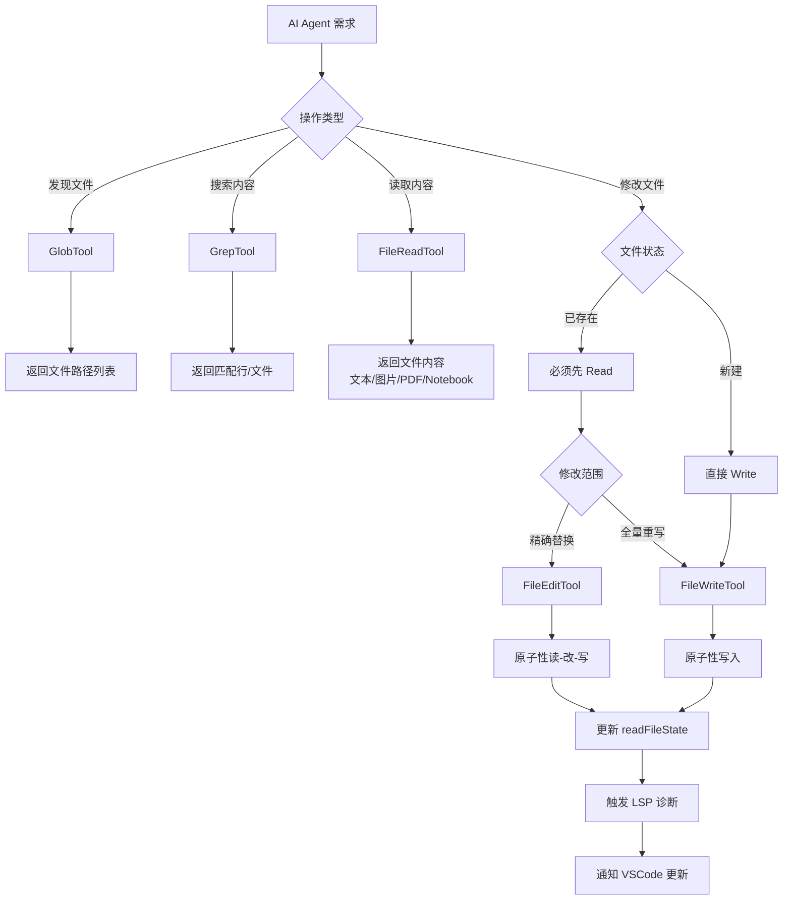
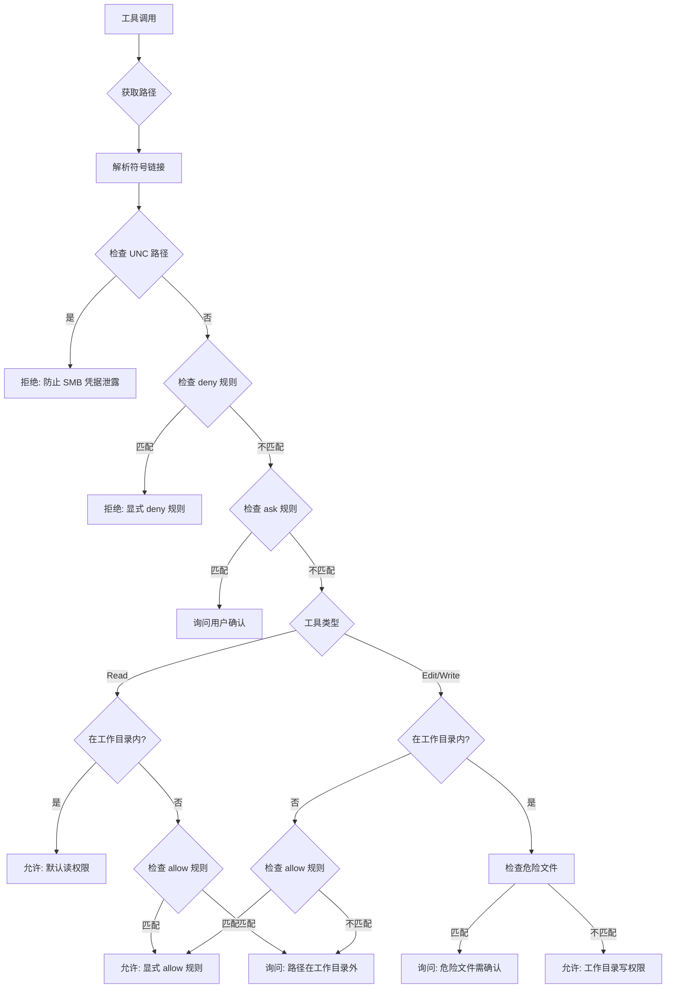

Claude Code 的文件操作系统由**五个核心工具**构成完整的文件生命周期管理能力：Read（读取）、Write（全量写入）、Edit（精确编辑）、Glob（模式搜索）、Grep（内容搜索）。这不是简单的功能划分，而是**风险分级与性能优化**的双重架构决策——Read 只读免审批，Edit/Write 写入需确认，Glob/Grep 只读支持高并发，每个工具都在 token 效率、安全性、用户体验之间找到最优平衡点。

## 工具架构总览

五大工具形成清晰的职责分层：**检索层**（Glob/Grep）负责发现文件，**读取层**（Read）负责获取内容，**写入层**（Edit/Write）负责修改文件。这种分离设计使得 AI 可以先用 Glob 找到目标文件集合，再用 Grep 定位包含特定内容的文件，最后用 Read 读取关键内容，用 Edit/Write 完成修改——每一步都只传递必要的信息，避免 token 浪费。

### 核心工具对比矩阵

| 工具 | 权限级别 | 核心能力 | Token 效率策略 | 关键限制 |
|------|---------|---------|---------------|---------|
| **Read** | 只读（免审批） | 读取任意文件（文本/图片/PDF/Notebook） | 去重缓存、分页读取、图片压缩 | 25K tokens/次、256KB 文件大小 |
| **Write** | 写入（需确认） | 创建或全量覆盖文件 | Diff 增量输出、行尾保持 | 必须先读取文件（已存在时） |
| **Edit** | 写入（需确认） | 精确字符串替换 | 引号标准化、原子性读写 | 1GB 文件上限、必须唯一匹配 |
| **Glob** | 只读（并发安全） | 按文件名模式搜索 | 路径相对化、结果截断 | 100 文件/次 |
| **Grep** | 只读（并发安全） | 按内容正则搜索 | Ripgrep 加速、上下文控制 | 250 行/次（默认） |

<Tip>
Read 的 `maxResultSizeChars` 虽然设置为 `Infinity`，但真正的截断发生在 `validateContentTokens()` 中基于 token 预算的动态判定，而非字符数硬限制。这确保了大文件读取不会突破上下文窗口限制。
</Tip>

Sources: [Tool.ts](claude-code/src/Tool.ts), [tools registry](claude-code/src/tools.ts)

### 工具交互流程



这个流程图展示了工具间的强制依赖关系：Edit/Write 在修改已存在文件前必须先 Read，这不仅是为了获取内容，更是为了填充 `readFileState` 缓存——后续的去重校验和防覆写检查都依赖这个状态。

Sources: [FileEditTool validation](claude-code/src/tools/FileEditTool/FileEditTool.ts#L217-L312), [FileWriteTool validation](claude-code/src/tools/FileWriteTool/FileWriteTool.ts#L107-L195)

## FileRead：多模态文件读取引擎

Read 工具是整个文件操作系统的**数据入口**，其设计核心是"**只读必要的内容**"——通过去重缓存、分页读取、智能压缩三重机制将 token 消耗降到最低。

### 去重缓存机制

当 AI 重复读取同一个文件的同一范围时，系统通过 `readFileState` 缓存避免重复传输：

```typescript
// FileReadTool.ts:530-573 — 去重逻辑核心
const existingState = readFileState.get(fullFilePath)
if (existingState && !existingState.isPartialView && existingState.offset !== undefined) {
  const rangeMatch = existingState.offset === offset && existingState.limit === limit
  if (rangeMatch) {
    const mtimeMs = await getFileModificationTimeAsync(fullFilePath)
    if (mtimeMs === existingState.timestamp) {
      return { data: { type: 'file_unchanged', file: { filePath: file_path } } }
    }
  }
}
```

**关键设计点**：
- **去重范围**：仅对 Read 工具自身的读取生效（通过 `offset !== undefined` 判定），Edit/Write 虽然也会写入 `readFileState`，但它们的 `offset` 为 `undefined`，不会误命中去重
- **一致性保证**：通过 mtime 比对确保文件未被外部修改，避免返回过期内容
- **降级开关**：有 GrowthBook feature flag（`tengu_read_dedup_killswitch`）可紧急关闭此功能
- **实测效果**：BQ proxy 显示约 18% 的 Read 调用是同文件碰撞，占全 fleet `cache_creation` 的 2.64%

Sources: [FileReadTool.ts](claude-code/src/tools/FileReadTool/FileReadTool.ts#L530-L573)

### 多格式分发策略

Read 工具的 `callInner()` 按 `ext` 分发到四条完全不同的处理路径：

```
.ipynb  → readNotebook()      → JSON cell 解析 → token 校验
.png/.jpg/.gif/.webp → readImageWithTokenBudget() → 压缩+降采样
.pdf   → extractPDFPages()    → 页面级提取 → OCR/文本提取
其他    → readFileInRange()   → 分页读取 → 行号格式化
```

**图片路径的压缩策略**采用三级渐进式优化：

1. **标准缩放**：`maybeResizeAndDownsampleImageBuffer()` 先做基础缩放
2. **Token 估算**：用 `base64.length * 0.125` 快速估算 token 数
3. **激进压缩**：超出预算时调用 `compressImageBufferWithTokenLimit()` 压缩质量
4. **兜底策略**：仍然超限时用 sharp 做最后处理：`resize(400,400).jpeg({quality:20})`

**PDF 路径**有强制分页机制：超过 `PDF_AT_MENTION_INLINE_THRESHOLD` 时必须指定 `pages` 参数，每请求最多 `PDF_MAX_PAGES_PER_READ` 页（默认 20 页），防止大 PDF 耗尽 token 预算。

Sources: [FileReadTool callInner](claude-code/src/tools/FileReadTool/FileReadTool.ts#L400-L800), [PDF limits](claude-code/src/constants/apiLimits.ts), [Image processing](claude-code/src/tools/FileReadTool/imageProcessor.ts)

### 分页读取与 Token 预算

Read 工具支持 `offset` 和 `limit` 参数实现分页读取，但真正的限制来自**动态 token 预算**：

| 限制类型 | 默认值 | 校验时机 | 超限行为 |
|---------|-------|---------|---------|
| `maxSizeBytes` | 256 KB | **读取前**（stat 文件大小） | 直接抛错，拒绝读取 |
| `maxTokens` | 25,000 | **读取后**（实际输出 token 数） | 抛错 `MaxFileReadTokenExceededError` |

**已知不一致**：`maxSizeBytes` 基于总文件大小而非实际读取的片段大小，这意味着即使只读取 100 行，如果文件总大小超过 256 KB 也会被拒绝。早期版本尝试过截断而非抛错，但实测发现：抛错路径产生 ~100 字节的错误消息，截断路径产生 ~25K tokens 的内容——token 成本高出 250 倍。

Sources: [FileReadTool limits](claude-code/src/tools/FileReadTool/limits.ts#L1-L93)

### 安全防线与智能建议

Read 工具在 `validateInput()` 中设置了多层安全门：

1. **设备文件屏蔽**（`BLOCKED_DEVICE_PATHS`）：`/dev/zero`、`/dev/random`、`/dev/tty` 等——防止无限输出或阻塞挂起
2. **二进制文件拒绝**（`hasBinaryExtension`）：排除 PDF 和图片扩展名后，阻止读取 `.exe`、`.so` 等二进制文件
3. **UNC 路径跳过**：Windows 下 `\\server\share` 路径跳过文件系统操作，防止 SMB NTLM 凭据泄露
4. **权限拒绝规则**（`matchingRuleForInput`）：匹配 `deny` 规则后直接拒绝

**文件未找到时的智能建议**：当文件不存在时，Read 不会只报一个 "file not found"：

```typescript
// FileReadTool.ts:639-647
const similarFilename = findSimilarFile(fullFilePath)      // 相似扩展名
const cwdSuggestion = await suggestPathUnderCwd(fullFilePath) // cwd 相对路径建议
// macOS 截图特殊处理：薄空格(U+202F) vs 普通空格
const altPath = getAlternateScreenshotPath(fullFilePath)
```

对 macOS 截图文件名中 AM/PM 前的薄空格（U+202F）做了特殊处理——这是实测中发现的跨 macOS 版本兼容性问题。

Sources: [FileReadTool validation](claude-code/src/tools/FileReadTool/FileReadTool.ts#L217-L350), [Blocked devices](claude-code/src/tools/FileReadTool/FileReadTool.ts#L38-L65)

## FileEdit：精确字符串替换引擎

Edit 工具的核心挑战是"**AI 输出与文件实际内容的不对齐**"——AI 只能输出直引号，但源码可能用弯引号；AI 的缩进感知受 line number prefix 干扰；AI 无法保证 `old_string` 在文件中的唯一性。Edit 工具通过**引号标准化、反向引号保持、原子性读写**三层机制解决这些问题。

### 引号标准化与反向保持

AI 模型只能输出直引号（`'` `"`），但源码中可能使用弯引号（`'` `'` `"` `"`）。`findActualString()` 函数处理了这个不对齐：

```typescript
// utils.ts:73-93
export function findActualString(fileContent: string, searchString: string): string | null {
  if (fileContent.includes(searchString)) return searchString      // 精确匹配
  const normalizedSearch = normalizeQuotes(searchString)           // 弯引号→直引号
  const normalizedFile = normalizeQuotes(fileContent)
  const idx = normalizedFile.indexOf(normalizedSearch)
  if (idx !== -1) return fileContent.substring(idx, idx + searchString.length)
  return null
}
```

**反向引号保持**（`preserveQuoteStyle`）：如果文件用弯引号，替换后的新字符串也自动转换为弯引号，包括缩写中的撇号（如 "don't"）。这确保了 Edit 操作不会破坏文件的引号风格一致性。

Sources: [FileEditTool utils](claude-code/src/tools/FileEditTool/utils.ts#L73-L220)

### 原子性读-改-写协议

Edit 工具的 `call()` 方法实现了一个**无锁原子更新**协议：

```typescript
// FileEditTool.ts:380-450 — 原子性协议核心
1. await fs.mkdir(dir)            ← 确保目录存在（异步，在临界区外）
2. await fileHistoryTrackEdit()   ← 备份旧内容（异步，在临界区外）
3. readFileSyncWithMetadata()     ← 同步读取当前文件内容（临界区开始）
4. getFileModificationTime()      ← mtime 校验
5. findActualString()             ← 引号标准化匹配
6. getPatchForEdit()              ← 计算 diff
7. writeTextContent()             ← 写入磁盘
8. readFileState.set()            ← 更新缓存（临界区结束）
```

**关键约束**：步骤 3-8 之间**不允许任何异步操作**（源码注释明确写道："Please avoid async operations between here and writing to disk to preserve atomicity"）。这确保了在 mtime 校验和实际写入之间不会有其他进程修改文件。

Sources: [FileEditTool atomicity](claude-code/src/tools/FileEditTool/FileEditTool.ts#L380-L450)

### 防覆写校验机制

Edit 工具在 `validateInput()` 中检查两个条件：

1. **必须先读取**（`readFileState` 中有记录且不是局部视图）
2. **文件未被外部修改**（`mtime` 未变，或全量读取时内容完全一致）

```typescript
// FileEditTool.ts:290-311 — Windows 特殊处理
const isFullRead = readTimestamp.offset === undefined && readTimestamp.limit === undefined
if (isFullRead && fileContent === readTimestamp.content) {
  // 内容不变，安全继续（Windows 云同步/杀毒可能改 mtime）
}
```

Windows 上的 mtime 可能因云同步、杀毒软件等被修改而不改变内容，因此对全量读取做了内容级比对作为兜底。

Sources: [FileEditTool validation](claude-code/src/tools/FileEditTool/FileEditTool.ts#L217-L312)

### 编辑大小限制与唯一性约束

```typescript
const MAX_EDIT_FILE_SIZE = 1024 * 1024 * 1024 // 1 GiB
```

超过 1 GiB 的文件直接拒绝编辑——这是 V8 字符串长度限制（~2^30 字符）的安全边界。

**唯一性约束**：`old_string` 必须在文件中唯一，否则需要：
- 提供更大的上下文使其唯一
- 使用 `replace_all: true` 替换所有匹配项（适合重命名变量等场景）

Sources: [FileEditTool size limit](claude-code/src/tools/FileEditTool/FileEditTool.ts#L246-L261), [Edit prompt](claude-code/src/tools/FileEditTool/prompt.ts)

## FileWrite：全量写入与创建

Write 工具与 Edit 共享大部分基础设施（权限检查、mtime 校验、fileHistory 备份），但有两个关键差异使其适合**创建新文件**或**完全重写文件**的场景。

### 行尾处理策略

```typescript
// FileWriteTool.ts:300-305 — 关键注释
// Write is a full content replacement — the model sent explicit line endings
// in `content` and meant them. Do not rewrite them.
writeTextContent(fullFilePath, content, enc, 'LF')
```

Write 工具始终使用 `LF` 行尾。早期版本会保留旧文件的行尾或采样仓库行尾风格，但这导致 Linux 上 bash 脚本被注入 `\r`——现在 AI 发什么行尾就用什么行尾，确保脚本文件的可执行性。

Sources: [FileWriteTool line endings](claude-code/src/tools/FileWriteTool/FileWriteTool.ts#L300-L305)

### 输出区分与 Diff 展示

Write 工具返回 `type: 'create' | 'update'`：

| 类型 | 触发条件 | `originalFile` | `structuredPatch` |
|------|---------|---------------|------------------|
| `create` | 文件不存在 | `null` | 完整内容作为新增行 |
| `update` | 文件存在且被覆盖 | 原始文件内容 | 完整 diff（old 全删，new 全增） |

`structuredPatch` 使用 diff 库的 `structuredPatch()` 生成，包含 hunk 信息：
```typescript
type Hunk = {
  oldStart: number
  oldLines: number
  newStart: number
  newLines: number
  lines: string[]  // '@@ -1,3 +1,5 @@' 格式的 diff 行
}
```

Sources: [FileWriteTool output](claude-code/src/tools/FileWriteTool/FileWriteTool.ts#L30-L60), [Diff types](claude-code/src/tools/FileEditTool/types.ts#L31-L86)

## GlobTool：文件名模式搜索

Glob 工具提供**高效的文件名模式匹配**能力，基于 glob 模式（如 `**/*.ts`、`src/**/*.{js,jsx}`）快速定位目标文件集合，避免逐个目录遍历的 token 浪费。

### 核心参数

| 参数 | 类型 | 说明 | 示例 |
|------|------|------|------|
| `pattern` | string | Glob 模式（必填） | `**/*.test.ts`、`src/**/*.tsx` |
| `path` | string | 搜索起始目录（可选，默认 cwd） | `./packages`、`/Users/project` |

**结果限制**：默认返回最多 100 个文件路径，超出时 `truncated: true` 并提示使用更精确的模式。

Sources: [GlobTool.ts](claude-code/src/tools/GlobTool/GlobTool.ts), [Glob prompt](claude-code/src/tools/GlobTool/prompt.ts)

### 与 Read/Edit/Write 的协作模式

Glob 通常作为**文件操作流水线的第一步**：

```typescript
// 常见协作模式
1. Glob `**/*.ts`          → 找到所有 TypeScript 文件
2. Grep `pattern: "TODO"`  → 过滤出包含 TODO 的文件
3. Read 选中文件           → 获取具体内容
4. Edit/Write 修改         → 完成重构
```

**并发安全**：Glob 的 `isConcurrencySafe() → true` 和 `isReadOnly() → true` 确保它可以与其他只读工具并发执行，无需等待权限确认。

Sources: [GlobTool concurrency](claude-code/src/tools/GlobTool/GlobTool.ts#L75-L85)

## GrepTool：文件内容正则搜索

Grep 工具基于 **ripgrep (rg)** 提供高性能正则搜索能力，支持三种输出模式、上下文控制、多行模式等高级特性，是**定位特定代码片段**的核心工具。

### 输出模式对比

| 模式 | 输出内容 | 典型场景 | Token 效率 |
|------|---------|---------|-----------|
| `files_with_matches` | 匹配文件的路径列表 | 快速定位目标文件 | ⭐⭐⭐⭐⭐ 最高 |
| `content` | 匹配行 + 行号 + 上下文 | 查看具体代码片段 | ⭐⭐⭐ 中等 |
| `count` | 每个文件的匹配次数 | 评估影响范围 | ⭐⭐⭐⭐ 较高 |

**默认模式**：未指定 `output_mode` 时默认为 `files_with_matches`，这是 Token 效率最高的选择——先缩小文件范围，再针对性读取。

Sources: [GrepTool.ts](claude-code/src/tools/GrepTool/GrepTool.ts#L1-L200), [Grep output modes](claude-code/src/tools/GrepTool/GrepTool.ts#L45-L75)

### 上下文控制参数

| 参数 | 说明 | 示例 |
|------|------|------|
| `-B` | 匹配行之前的 N 行 | `-B: 2` 显示前 2 行上下文 |
| `-A` | 匹配行之后的 N 行 | `-A: 5` 显示后 5 行上下文 |
| `-C` / `context` | 前后各 N 行 | `context: 3` 前后各 3 行 |
| `-n` | 显示行号（默认 true） | `-n: false` 隐藏行号 |
| `-i` | 忽略大小写 | `-i: true` 匹配 "TODO"/"todo"/"Todo" |

**智能限制**：默认 `head_limit: 250` 行，防止大型搜索结果耗尽 token 预算。传递 `head_limit: 0` 可解除限制（谨慎使用）。

Sources: [GrepTool parameters](claude-code/src/tools/GrepTool/GrepTool.ts#L15-L60)

### 高级特性

**多行模式**（`multiline: true`）：启用 `rg -U --multiline-dotall`，允许 `.` 匹配换行符，模式可跨多行匹配。适合查找跨越多行的代码模式。

**文件类型过滤**（`type`）：使用 ripgrep 内置的文件类型定义，比 `glob` 更高效：
- `type: "js"` → 自动包含 `.js`、`.jsx`、`.mjs`
- `type: "py"` → 自动包含 `.py`、`.pyi`
- `type: "rust"` → 自动包含 `.rs`

**VCS 目录排除**：自动排除 `.git`、`.svn`、`.hg`、`.bzr`、`.jj`、`.sl` 等版本控制目录，减少噪音。

Sources: [GrepTool advanced features](claude-code/src/tools/GrepTool/GrepTool.ts#L200-L400)

## 权限与安全模型

文件操作工具的安全模型基于**分层权限检查**，核心原则是"**最小权限 + 显式确认**"：Read 只读免审批，Edit/Write 写入需确认，所有工具都遵循 deny 规则优先的原则。

### 权限检查流程



**关键检查顺序**：
1. **UNC 路径防御**（defense-in-depth）：阻止 `\\server\share` 格式的网络路径
2. **Deny 规则优先**：匹配 deny 规则直接拒绝，跳过后续所有检查
3. **Ask 规则次之**：匹配 ask 规则需用户确认
4. **Edit 权限隐含 Read 权限**：但有 read-specific 规则时，read 规则优先
5. **工作目录默认权限**：在允许的工作目录内，Read 默认允许，Edit/Write 需检查危险文件

Sources: [Filesystem permissions](claude-code/src/utils/permissions/filesystem.ts#L1030-L1300)

### 危险文件保护机制

```typescript
// filesystem.ts:60-85
export const DANGEROUS_FILES = [
  '.gitconfig', '.gitmodules',      // Git 配置
  '.bashrc', '.bash_profile',       // Shell 配置
  '.zshrc', '.zprofile',            // Zsh 配置
  '.profile', '.ripgreprc',         // 通用配置
  '.mcp.json', '.claude.json',     // Claude Code 配置
]

export const DANGEROUS_DIRECTORIES = [
  '.git', '.vscode', '.idea', '.claude'  // 配置目录
]
```

**保护策略**：
- **大小写不敏感比对**：通过 `normalizeCaseForComparison()` 统一转为小写，防止 `.cLauDe/Settings.locaL.json` 绕过检查
- **自动询问确认**：即使在允许的工作目录内，编辑危险文件也需要显式确认
- **Skills 特殊处理**：编辑 `.claude/skills/{name}/` 目录时，提供"仅允许此 skill"的精细化权限选项

Sources: [Dangerous files](claude-code/src/utils/permissions/filesystem.ts#L26-L85)

## 文件历史快照系统

每次 Edit/Write 前都会调用 `fileHistoryTrackEdit()`，快照存储在 `FileHistoryState` 中，支持**会话级别的文件修改追溯**。

### 快照存储结构

```typescript
type FileHistorySnapshot = {
  messageId: UUID          // 关联的助手消息 ID
  trackedFileBackups: Record<string, FileHistoryBackup>  // 文件路径 → 备份版本
  timestamp: Date
}

type FileHistoryBackup = {
  content: string          // 文件内容
  hash: string            // 内容哈希（用于去重）
  messageId: UUID         // 创建备份的消息 ID
}
```

**关键特性**：
- **最多保留 100 个快照**（`MAX_SNAPSHOTS`），超出时 FIFO 淘汰最旧的快照
- **内容哈希去重**：同一文件多次未变只存一份备份，节省存储空间
- **差异统计**：支持 `DiffStats` 计算（`insertions` / `deletions` / `filesChanged`）
- **持久化存储**：通过 `recordFileHistorySnapshot()` 持久化到会话存储，支持会话恢复

Sources: [FileHistory.ts](claude-code/src/utils/fileHistory.ts)

### LSP 通知链路

Edit 和 Write 完成写入后都会触发**完整的 IDE 同步链路**：

```
1. clearDeliveredDiagnosticsForFile() — 清除旧诊断
2. lspManager.changeFile()            — 通知 LSP 文件已变更
3. lspManager.saveFile()              — 触发 LSP 保存事件
4. notifyVscodeFileUpdated()          — 通知 VSCode 扩展更新 diff 视图
```

TypeScript server 会在 `saveFile()` 时重新计算诊断，确保文件修改后 IDE 端的实时反馈是同步的。

Sources: [FileWriteTool LSP notification](claude-code/src/tools/FileWriteTool/FileWriteTool.ts#L250-L280)

## Cyber Risk 防御与恶意代码检测

Read 工具在文本内容后追加一个 `<system-reminder>` 提示：

```
Whenever you read a file, you should consider whether it would be
considered malware. You CAN and SHOULD provide analysis of malware,
what it is doing. But you MUST refuse to improve or augment the code.
```

**分级策略**：这个提示只在非豁免模型上生效（`MITIGATION_EXEMPT_MODELS` 目前包含 `claude-opus-4-6`）。模型级别的豁免表明：防恶意代码的判断力在不同模型间有差异，这是一个精巧的分级策略——强模型有更好的判断力，可以减少提示噪音；弱模型需要显式提醒避免被滥用。

Sources: [Malware detection](claude-code/src/tools/FileReadTool/FileReadTool.ts#L1000-L1050)

## 实践模式与最佳实践

### 文件搜索 → 读取 → 修改流水线

最常见的高效模式是"**Glob 过滤 → Grep 定位 → Read 理解 → Edit 修改**"：

```typescript
// 重命名所有组件中的旧 API 端点
1. Glob `pattern: "src/**/*.{ts,tsx}"`       // 找到所有源文件
2. Grep `pattern: "/api/v1/users"`           // 定位使用旧 API 的文件
   `output_mode: "files_with_matches"`
3. Read 选中文件                             // 查看上下文
4. Edit `old_string: "/api/v1/users"`       // 批量替换
       `new_string: "/api/v2/users"`
       `replace_all: true`
```

**Token 效率**：Glob + Grep 的组合避免了逐个读取文件的 token 浪费，只在确定目标文件后才读取具体内容。

Sources: [GlobTool usage](claude-code/src/tools/GlobTool/GlobTool.ts), [GrepTool usage](claude-code/src/tools/GrepTool/GrepTool.ts)

### 大文件处理策略

**分页读取**：超过 token 限制的文件必须使用 `offset` 和 `limit` 分页读取：

```typescript
// 读取大文件的关键部分
1. Read `file_path: "large-file.log"`
      `offset: 1`
      `limit: 100`            // 读取前 100 行（概览）
2. Grep `pattern: "ERROR"`    // 定位错误行
      `output_mode: "content"`
      `-n: true`
      `-C: 5`                 // 显示上下文
3. Read `file_path: "large-file.log"`
      `offset: 523`           // 读取错误附近的详细内容
      `limit: 50`
```

**PDF 分页**：超过 10 页的 PDF 必须指定 `pages` 参数：

```typescript
Read `file_path: "document.pdf"`
     `pages: "1-5, 10, 15-20"`  // 读取第 1-5 页、第 10 页、第 15-20 页
```

Sources: [FileReadTool pagination](claude-code/src/tools/FileReadTool/prompt.ts#L20-L35), [PDF reading](claude-code/src/tools/FileReadTool/FileReadTool.ts#L600-L700)

### 避免常见陷阱

| 陷阱 | 问题 | 解决方案 |
|------|------|---------|
| **重复 Read** | 浪费 token，但会被去重机制自动优化 | 依赖去重缓存，无需手动优化 |
| **未 Read 就 Edit** | 校验失败，提示 "must read file first" | 始终先 Read，填充 `readFileState` |
| **old_string 不唯一** | Edit 失败，提示 "string not unique" | 提供更大上下文或使用 `replace_all` |
| **行尾混淆** | Write 时 `CRLF` vs `LF` 导致脚本失败 | Write 使用 AI 发送的行尾，不做转换 |
| **Windows mtime 误判** | 云同步修改 mtime 导致防覆写校验失败 | 全量读取时自动回退到内容比对 |

Sources: [FileEditTool validation](claude-code/src/tools/FileEditTool/FileEditTool.ts#L217-L312), [FileWriteTool line endings](claude-code/src/tools/FileWriteTool/FileWriteTool.ts#L300-L305)

---

**下一步阅读**：掌握文件操作工具后，建议继续学习 [Shell 执行与命令工具](10-shell-zhi-xing-yu-ming-ling-gong-ju) 了解如何通过 Bash 工具执行系统命令，或探索 [搜索与导航工具](11-sou-suo-yu-dao-hang-gong-ju) 深入理解 LSP 工具的代码导航能力。