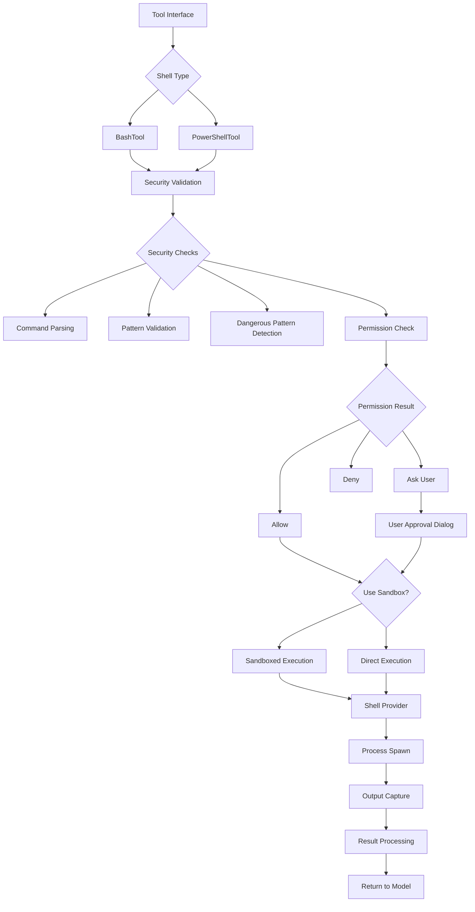
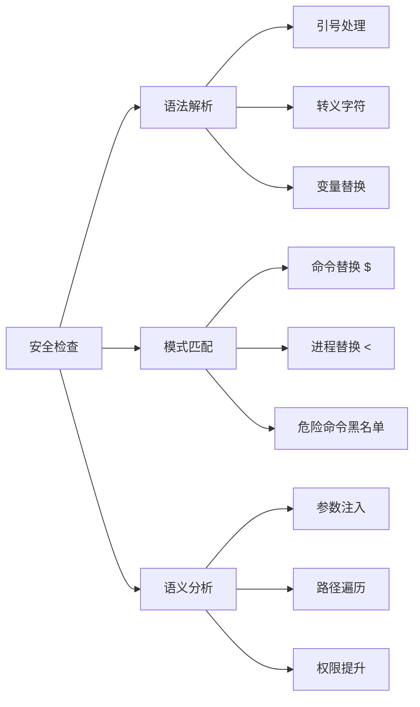
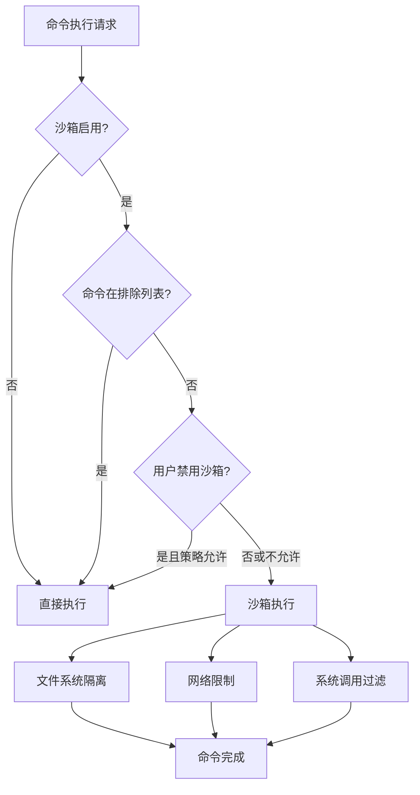
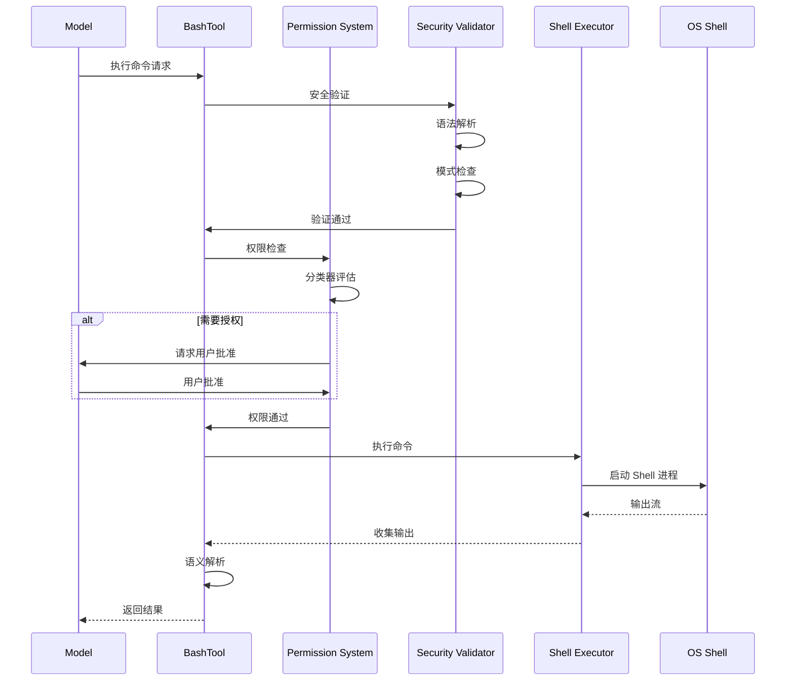

Shell 执行与命令工具是 Claude Code 中用于与系统交互的核心工具集，提供了执行 Bash 和 PowerShell 命令的能力，并通过多层安全机制确保命令执行的安全性和可控性。

## 架构总览

Shell 工具系统采用分层架构设计，从顶层的工具接口到底层的命令执行，每一层都承担特定的职责，确保命令执行的安全性、权限控制和执行效率。



Sources: [BashTool.tsx](claude-code/src/tools/BashTool/BashTool.tsx#L420-L541), [PowerShellTool.tsx](claude-code/src/tools/PowerShellTool/PowerShellTool.tsx#L1-L150)

## 核心工具接口

### BashTool

BashTool 是主要的 Shell 执行工具，支持执行 POSIX 兼容的 Shell 命令（bash、zsh 等）。该工具提供了丰富的参数配置，支持前台执行、后台执行、超时控制和沙箱隔离等多种执行模式。

**输入参数配置：**

| 参数名 | 类型 | 必填 | 说明 |
|--------|------|------|------|
| `command` | string | ✓ | 要执行的 Shell 命令 |
| `description` | string | ✗ | 命令用途的清晰描述（5-10 个单词） |
| `timeout` | number | ✗ | 超时时间（毫秒），最大 30 分钟 |
| `run_in_background` | boolean | ✗ | 是否在后台运行命令 |
| `dangerouslyDisableSandbox` | boolean | ✗ | 危险：禁用沙箱隔离 |

**输出结果结构：**

| 字段名 | 类型 | 说明 |
|--------|------|------|
| `stdout` | string | 标准输出内容 |
| `stderr` | string | 标准错误输出 |
| `interrupted` | boolean | 命令是否被中断 |
| `backgroundTaskId` | string | 后台任务 ID（如果后台运行） |
| `persistedOutputPath` | string | 大输出持久化路径（超过 30KB） |
| `returnCodeInterpretation` | string | 退出码的语义解释 |

Sources: [BashTool.tsx](claude-code/src/tools/BashTool/BashTool.tsx#L227-L296), [prompt.ts](claude-code/src/tools/BashTool/prompt.ts)

### PowerShellTool

PowerShellTool 为 Windows 系统提供 PowerShell 命令执行能力，采用与 BashTool 相似的架构模式，但针对 PowerShell 的语法特性进行了专门的安全验证和语义解析。

**PowerShell 专有特性：**
- Cmdlet 名称规范化处理（`Get-Content` → `get-content`）
- PowerShell 管道和语句分隔符解析
- Windows 特有的路径格式验证（UNC 路径安全检查）
- PowerShell 别名和函数的安全检查

Sources: [PowerShellTool.tsx](claude-code/src/tools/PowerShellTool/PowerShellTool.tsx#L54-L150), [powershellSecurity.ts](claude-code/src/tools/PowerShellTool/powershellSecurity.ts)

## 安全验证体系

### 多层安全检查机制

Shell 工具实施了深度防御策略，通过多达 20+ 种安全检查确保命令执行的可靠性。这些检查在命令执行前进行，能够识别并阻止潜在危险的命令模式。

**安全检查分类：**



**核心安全验证器：**

1. **命令替换检测**：阻止 `$()`、`` ` ``、`<()`、`>()` 等可能绕过安全检查的命令替换语法
2. **危险变量检测**：阻止通过 `IFS`、`PATH` 等环境变量注入的攻击
3. **Zsh 特性防护**：拦截 `zmodload`、`=cmd` 等 Zsh 特有的危险特性
4. **注释注入防护**：检测引号与注释符号的异常组合（如 `'x'#`）
5. **Unicode 攻击防护**：识别 Unicode 空白字符和控制字符注入

Sources: [bashSecurity.ts](claude-code/src/tools/BashTool/bashSecurity.ts#L1-L259), [ValidationContext](claude-code/src/tools/BashTool/bashSecurity.ts#L103-L117)

### 命令解析与 AST 分析

系统采用 Tree-sitter 进行精确的 Shell 命令语法分析，将命令解析为抽象语法树（AST），从而实现语义级别的安全检查。这种方法比传统的正则表达式匹配更加准确和安全。

**AST 分析流程：**
```
原始命令 → 词法分析 → 语法树构建 → 语义分析 → 安全判定
```

**解析示例：**
```bash
# 复合命令解析
git commit -m "fix" && npm run build

# AST 节点识别
[
  { type: 'command', command: 'git', args: ['commit', '-m', 'fix'] },
  { type: 'operator', operator: '&&' },
  { type: 'command', command: 'npm', args: ['run', 'build'] }
]
```

Sources: [ast.ts](claude-code/src/utils/bash/ast.js), [treeSitterAnalysis.ts](claude-code/src/utils/bash/treeSitterAnalysis.ts)

## 权限控制系统

### 分类器驱动的权限决策

系统使用智能分类器对命令进行风险评估，根据命令的读写特性、潜在影响和用户上下文，自动决定权限策略。

**权限决策类型：**

| 决策类型 | 说明 | 示例 |
|---------|------|------|
| `allow` | 自动允许执行 | `ls`、`cat file.txt` |
| `ask` | 需要用户确认 | `rm -rf dir`、`npm install` |
| `deny` | 阻止执行 | `rm -rf /`、危险命令组合 |

**命令特征识别：**
- **只读命令**：`grep`、`find`、`cat`、`ls` 等无副作用的读取操作
- **列表命令**：`tree`、`du` 等目录浏览操作
- **搜索命令**：`rg`、`ag` 等文本搜索工具
- **写入命令**：`mv`、`cp`、`rm` 等文件修改操作

Sources: [bashPermissions.ts](claude-code/src/tools/BashTool/bashPermissions.ts#L1-L200), [bashClassifier.ts](claude-code/src/utils/permissions/bashClassifier.ts)

### 权限规则匹配

系统支持灵活的权限规则配置，包括精确匹配、前缀匹配和通配符匹配三种模式。

**规则类型对比：**

| 规则类型 | 语法 | 匹配逻辑 | 使用场景 |
|---------|------|---------|---------|
| 精确匹配 | `git status` | 命令完全相等 | 特定命令授权 |
| 前缀匹配 | `git:*` | 命令以指定前缀开始 | 命令组授权 |
| 通配符匹配 | `npm run *` | 支持 `*` 和 `?` 通配符 | 灵活模式匹配 |

**环境变量处理：**
系统在规则匹配前会自动剥离安全的环境变量前缀（如 `NODE_ENV=prod npm run build`），但会阻止包含危险环境变量的命令绕过权限检查。

Sources: [bashPermissions.ts](claude-code/src/tools/BashTool/bashPermissions.ts#L161-L188), [shellRuleMatching.ts](claude-code/src/utils/permissions/shellRuleMatching.ts)

### 复合命令权限策略

对于使用 `&&`、`||`、`;` 等操作符连接的复合命令，系统采用**任意匹配**策略：只要任一子命令匹配安全规则，整个复合命令就会触发权限请求。

**复合命令分解示例：**
```bash
# 原始命令
git status && npm run build || echo "failed"

# 分解后的子命令
["git status", "npm run build", "echo 'failed'"]

# 权限检查
- 如果 "npm run build" 需要授权，则整个命令需要用户批准
```

Sources: [bashPermissions.ts](claude-code/src/tools/BashTool/bashPermissions.ts#L445-L468)

## 沙箱隔离机制

### 沙箱执行策略

沙箱机制为命令执行提供了额外的隔离层，通过限制文件系统访问、网络连接和系统调用，防止恶意或意外操作对系统造成损害。

**沙箱决策流程：**



**沙箱排除命令配置：**
用户可以通过 `settings.json` 配置不需要沙箱隔离的命令：
```json
{
  "sandbox": {
    "excludedCommands": [
      "npm run *",
      "yarn *",
      "pnpm *",
      "docker *"
    ]
  }
}
```

Sources: [shouldUseSandbox.ts](claude-code/src/tools/BashTool/shouldUseSandbox.ts#L130-L154), [sandbox-adapter.ts](claude-code/src/utils/sandbox/sandbox-adapter.ts)

### 环境变量安全处理

沙箱模式下，系统会特别关注环境变量的安全性，防止通过环境变量注入绕过安全检查。

**危险环境变量：**
- `PATH`：可能被劫持以执行恶意二进制文件
- `LD_PRELOAD`：可能注入恶意共享库
- `IFS`：可能破坏参数解析
- `BASH_ENV`：可能自动执行恶意脚本

Sources: [bashPermissions.ts](claude-code/src/tools/BashTool/bashPermissions.ts#L196-L200), [BINARY_HIJACK_VARS](claude-code/src/tools/BashTool/bashPermissions.ts)

## 只读命令识别

### 命令分类策略

系统通过多层启发式规则识别只读命令，这些命令会被自动允许执行，无需用户干预。

**只读命令白名单机制：**

| 命令类别 | 典型命令 | 安全标志 | 特殊验证 |
|---------|---------|---------|---------|
| 文件读取 | `cat`、`head`、`tail` | 安全标志检查 | 路径验证 |
| 目录列表 | `ls`、`tree`、`du` | 无执行标志 | 权限检查 |
| 文本搜索 | `grep`、`rg`、`ag` | 无执行标志 | 参数过滤 |
| 版本控制 | `git status`、`git log` | 只读操作 | 仓库检查 |
| 容器操作 | `docker ps`、`docker images` | 只读命令 | 无特权标志 |

**安全标志验证示例：**
```bash
# 允许：只读操作
find . -name "*.ts"

# 阻止：包含执行操作
find . -name "*.ts" -exec rm {} \;
```

Sources: [readOnlyValidation.ts](claude-code/src/tools/BashTool/readOnlyValidation.ts#L1-L150), [COMMAND_ALLOWLIST](claude-code/src/tools/BashTool/readOnlyValidation.ts#L128-L199)

### 命令标志参数验证

对于支持多种操作模式的命令，系统会验证每个标志参数的安全性，确保不会执行危险操作。

**命令标志分类：**

| 标志类型 | 示例 | 参数验证 |
|---------|------|---------|
| `none` | `-h`、`--help` | 无参数 |
| `number` | `-d 5`、`--max-depth=5` | 数字验证 |
| `string` | `-e ".ts"` | 字符串安全检查 |
| `file` | `--config file.json` | 路径安全验证 |

**特殊命令安全配置：**
```typescript
// find 命令安全配置
find: {
  safeFlags: {
    '-name': 'string',
    '-type': 'string',
    '-maxdepth': 'number'
  },
  // 排除危险的 -exec 和 -execdir 标志
}
```

Sources: [readOnlyValidation.ts](claude-code/src/tools/BashTool/readOnlyValidation.ts#L35-L50), [FlagArgType](claude-code/src/utils/shell/readOnlyCommandValidation.ts)

## 命令语义解析

### 退出码语义映射

不同的命令使用不同的退出码语义，系统通过语义映射正确解释命令执行结果，避免误报错误。

**常见命令退出码语义：**

| 命令 | 退出码 0 | 退出码 1 | 退出码 2+ |
|------|---------|---------|----------|
| `grep` | 找到匹配 | 未找到匹配 | 错误 |
| `diff` | 无差异 | 有差异 | 错误 |
| `find` | 成功 | 部分失败 | 错误 |
| `test` | 条件为真 | 条件为假 | 错误 |

**语义解析示例：**
```typescript
// grep 命令语义
function grepSemantic(exitCode: number) {
  if (exitCode === 1) {
    return { isError: false, message: 'No matches found' }
  }
  return { isError: exitCode >= 2 }
}
```

Sources: [commandSemantics.ts](claude-code/src/tools/BashTool/commandSemantics.ts#L31-L89), [interpretCommandResult](claude-code/src/tools/BashTool/commandSemantics.ts#L124-L140)

### 输出处理与持久化

对于大型输出（超过 30KB），系统采用持久化策略，将完整输出保存到磁盘，仅向前端返回预览内容，避免内存溢出和性能下降。

**输出处理流程：**
```
命令输出 → 大小检查 → [≤30KB] → 直接返回
                     → [>30KB] → 持久化到磁盘
                              → 生成预览（前 1KB）
                              → 返回预览 + 文件路径
```

**持久化文件结构：**
- 存储位置：`~/.claude-code/tool-results/{taskId}.txt`
- 文件限制：最大 64MB，超出部分自动截断
- 清理策略：会话结束后自动清理

Sources: [BashTool.tsx](claude-code/src/tools/BashTool/BashTool.tsx#L589-L623), [toolResultStorage.ts](claude-code/src/utils/toolResultStorage.ts)

## 执行模式与任务管理

### 前台与后台执行

系统支持前台和后台两种执行模式，适应不同场景的命令执行需求。

**执行模式对比：**

| 特性 | 前台执行 | 后台执行 |
|------|---------|---------|
| 阻塞性 | 阻塞直到完成 | 立即返回任务 ID |
| 输出获取 | 实时输出 | 通过任务 ID 读取 |
| 超时控制 | 严格超时 | 长时间运行 |
| 用户交互 | 支持 Ctrl+C | 支持 Ctrl+B 后台化 |
| 适用场景 | 快速命令 | 构建任务、测试套件 |

**自动后台化策略：**
在 Assistant 模式下，超过 15 秒的阻塞命令会被自动移至后台执行，避免阻塞对话流程。

Sources: [BashTool.tsx](claude-code/src/tools/BashTool/BashTool.tsx#L54-L57), [LocalShellTask.ts](claude-code/src/tasks/LocalShellTask/LocalShellTask.ts)

### 任务输出管理

后台任务输出通过任务输出系统进行管理，支持实时输出流式读取和历史输出查询。

**任务输出特性：**
- **增量输出**：实时追加输出内容
- **输出持久化**：保存到磁盘，支持重新读取
- **进度通知**：任务完成时通知用户
- **错误追踪**：捕获退出码和错误信息

Sources: [TaskOutput.ts](claude-code/src/utils/task/TaskOutput.ts), [diskOutput.ts](claude-code/src/utils/task/diskOutput.ts)

## Shell 提供者抽象

### 多 Shell 支持

系统通过 Shell Provider 抽象层支持多种 Shell 类型，当前支持 Bash/Zsh 和 PowerShell。

**Shell Provider 接口：**
```typescript
interface ShellProvider {
  type: ShellType  // 'bash' | 'powershell'
  path: string     // Shell 可执行文件路径
  spawn(command: string, options: SpawnOptions): ChildProcess
  parseCommand(command: string): ParsedCommand
  validateCommand(command: string): ValidationResult
}
```

**Shell 检测流程：**
```
环境变量 CLAUDE_CODE_SHELL
    ↓ 未设置
检查 $SHELL 环境变量
    ↓ 验证
使用 which 查找 zsh/bash
    ↓ 优先级
用户偏好（zsh 优先）
    ↓ 回退
搜索标准路径
```

Sources: [Shell.ts](claude-code/src/utils/Shell.ts#L73-L137), [shellProvider.ts](claude-code/src/utils/shell/shellProvider.ts)

### 命令执行流程

完整的命令执行流程包括 Shell 初始化、环境设置、命令执行和结果收集四个阶段。



Sources: [Shell.ts](claude-code/src/utils/Shell.ts#L181-L200), [BashTool.tsx](claude-code/src/tools/BashTool/BashTool.tsx#L624-L723)

## 最佳实践

### 命令描述规范

为命令提供清晰、准确的描述有助于系统更好地理解命令意图，提高权限自动批准的准确性。

**描述编写建议：**
- ✅ 使用主动语态描述命令目的
- ✅ 简洁明了（5-10 个单词）
- ✅ 避免使用 "complex"、"risk" 等模糊词汇
- ✅ 对复杂管道命令提供完整上下文

**示例对比：**
```typescript
// ❌ 不好的描述
{ command: "find . -name '*.tmp' -exec rm {} \\;", 
  description: "complex cleanup operation" }

// ✅ 好的描述
{ command: "find . -name '*.tmp' -exec rm {} \\;", 
  description: "Find and delete all .tmp files recursively" }
```

Sources: [BashTool.tsx](claude-code/src/tools/BashTool/BashTool.tsx#L228-L240), [prompt.ts](claude-code/src/tools/BashTool/prompt.ts)

### 安全命令编写

遵循安全命令编写原则可以减少权限请求次数，提升执行效率。

**安全命令编写指南：**

1. **优先使用只读命令**
   ```bash
   # ✅ 好：使用只读命令
   git status
   
   # ⚠️ 谨慎：写入操作需要确认
   git commit -m "message"
   ```

2. **避免危险命令组合**
   ```bash
   # ❌ 避免：可能被阻止
   sudo rm -rf /
   
   # ✅ 更安全：明确指定目标
   rm -rf ./temp-dir
   ```

3. **使用沙箱友好的命令**
   ```bash
   # ✅ 在沙箱中安全执行
   npm run build
   docker ps
   
   # ⚠️ 可能需要禁用沙箱
   docker run -v /host:/container image
   ```

Sources: [bashSecurity.ts](claude-code/src/tools/BashTool/bashSecurity.ts#L1-L100), [readOnlyValidation.ts](claude-code/src/tools/BashTool/readOnlyValidation.ts#L1-L50)

## 相关页面

- [工具架构与注册机制](8-gong-ju-jia-gou-yu-zhu-ce-ji-zhi) - 了解工具系统的整体架构
- [权限模型与审批流程](13-quan-xian-mo-xing-yu-shen-pi-liu-cheng) - 深入了解权限系统的设计
- [沙箱隔离机制](14-sha-xiang-ge-chi-ji-zhi) - 沙箱技术的详细实现
- [搜索与导航工具](11-sou-suo-yu-dao-hang-gong-ju) - 文件搜索和代码导航工具