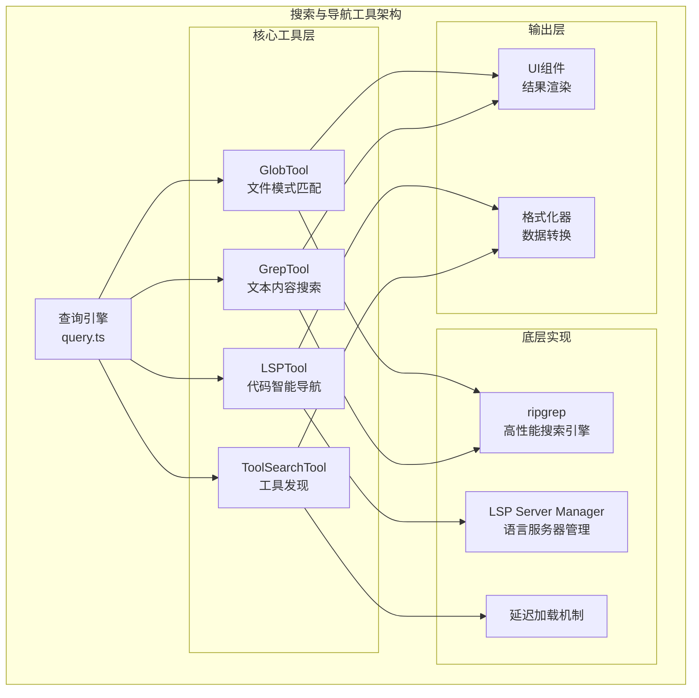

搜索与导航工具系统提供了从文件系统遍历到代码语义理解的完整搜索能力。该系统由四个核心工具构成：**GlobTool**（文件模式匹配）、**GrepTool**（文本内容搜索）、**LSPTool**（代码智能导航）和 **ToolSearchTool**（延迟工具发现），形成了从文件名 → 文本内容 → 代码语义 → 工具元数据的四层搜索架构。

## 架构总览

搜索与导航工具采用了**统一工具接口**设计，每个工具都实现了 `buildTool()` 定义的标准生命周期：输入验证 → 权限检查 → 核心执行 → 结果格式化。这种架构确保了工具行为的一致性，同时允许底层实现技术的差异化——GlobTool 和 GrepTool 基于 **ripgrep** 的高性能文本搜索，LSPTool 通过 **Language Server Protocol** 提供语义级代码理解，ToolSearchTool 则实现了工具本身的元数据搜索能力。



Sources: [GlobTool.ts](claude-code/src/tools/GlobTool/GlobTool.ts#L57-L198) [GrepTool.ts](claude-code/src/tools/GrepTool/GrepTool.ts#L160-L310) [LSPTool.ts](claude-code/src/tools/LSPTool/LSPTool.ts#L127-L224) [ToolSearchTool.ts](claude-code/src/tools/ToolSearchTool/ToolSearchTool.ts#L304-L350)

## GlobTool：文件模式匹配引擎

GlobTool 提供基于 **glob 模式**的文件查找能力，支持 `**/*.js`、`src/**/*.ts` 等通配符语法。该工具的核心价值在于将复杂的文件系统遍历抽象为简单的模式匹配操作，同时自动处理路径规范化、权限过滤和性能优化。

### 核心实现机制

GlobTool 的实现巧妙地**复用 ripgrep 的 `--files` 模式**而非实现独立的 glob 引擎。当用户请求 `**/*.ts` 时，工具会构造 `rg --files --glob '**/*.ts' --sort=modified` 命令，利用 ripgrep 的高度优化的文件系统遍历能力。这种设计带来了三个关键优势：**统一依赖**（不需要额外的 glob 库）、**性能保证**（ripgrep 的 C 实现比 JavaScript 实现快 5-10 倍）、**行为一致性**（与 GrepTool 共享相同的路径处理和排除逻辑）。

Sources: [glob.ts](claude-code/src/utils/glob.ts#L66-L131)

### 路径处理与模式提取

绝对路径处理是 glob 实现的**关键复杂性来源**。当用户提供 `/Users/project/src/**/*.ts` 这样的绝对路径时，工具必须提取静态基础目录（`/Users/project/src`）和相对模式（`**/*.ts`），因为 ripgrep 的 `--glob` 参数只接受相对模式。`extractGlobBaseDirectory()` 函数通过**定位第一个 glob 特殊字符**（`*`、`?`、`[`、`{`）来实现这一拆分，同时正确处理 Windows 驱动器根路径（`C:/`）和 Unix 根路径（`/`）的边界情况。

```typescript
// 路径提取示例
extractGlobBaseDirectory('/Users/project/src/**/*.ts')
// → { baseDir: '/Users/project/src', relativePattern: '**/*.ts' }

extractGlobBaseDirectory('*.js')
// → { baseDir: '', relativePattern: '*.js' }
```

Sources: [glob.ts](claude-code/src/utils/glob.ts#L17-L64)

### 智能过滤策略

GlobTool 实现了**多层过滤机制**以平衡功能性和性能。第一层是 **VCS 目录排除**（`.git`、`.svn`、`.hg` 等），这些目录包含大量元数据文件但极少是用户搜索目标。第二层是 **用户自定义忽略模式**，通过 `toolPermissionContext` 传递，支持项目特定的排除规则。第三层是 **孤立插件缓存排除**，通过 `getGlobExclusionsForPluginCache()` 动态计算，避免返回过期的插件版本目录。所有排除规则都通过 `--glob '!pattern'` 参数传递给 ripgrep，确保在**文件系统遍历阶段**就过滤掉不需要的路径，而非在结果集上后处理。

Sources: [GlobTool.ts](claude-code/src/tools/GlobTool/GlobTool.ts#L94-L134) [glob.ts](claude-code/src/utils/glob.ts#L86-L118)

### 结果限制与分页

GlobTool 默认**限制返回 100 个文件**，通过 `limit` 和 `offset` 参数支持分页。这种限制是**防御性设计**：大型 monorepo 可能包含数万文件，无限制返回会消耗大量 token 并降低响应速度。当结果被截断时，工具在输出中标记 `truncated: true`，提示用户使用更具体的模式或分页参数。值得注意的是，文件按**修改时间排序**（`--sort=modified`），优先返回最近修改的文件——这在大多数开发场景中更符合用户意图。

Sources: [GlobTool.ts](claude-code/src/tools/GlobTool/GlobTool.ts#L154-L176)

## GrepTool：文本内容搜索引擎

GrepTool 是基于 **ripgrep** 的文本搜索工具，支持完整的正则表达式语法、多种输出模式、上下文行显示和智能分页。该工具的设计哲学是**最大化搜索灵活性**，同时通过合理的默认值和限制机制防止上下文膨胀。

### 三种输出模式

GrepTool 支持**三种互补的输出模式**，针对不同的搜索场景优化：

| 模式 | 用途 | 输出格式 | Token 效率 |
|------|------|----------|-----------|
| `files_with_matches` | 快速定位相关文件 | 仅文件路径列表 | 最高（默认模式） |
| `content` | 查看匹配行内容 | 匹配行 + 行号 + 上下文 | 中等 |
| `count` | 统计匹配频率 | 每文件匹配次数 | 最高（概览用） |

`files_with_matches` 模式（默认）适用于**广度优先搜索**，用户需要先了解哪些文件包含目标模式，再决定深入查看。`content` 模式支持 `-A`（后置上下文）、`-B`（前置上下文）、`-C`（双向上下文）参数，适用于**深度分析**特定代码区域。`count` 模式适用于**量化分析**，例如统计某个 API 的使用频率或错误模式的分布。

Sources: [GrepTool.ts](claude-code/src/tools/GrepTool/GrepTool.ts#L33-L89) [GrepTool.ts](claude-code/src/tools/GrepTool/GrepTool.ts#L254-L309)

### 智能分页机制

GrepTool 实现了**自动分页**以防止大量结果淹没上下文窗口。默认 `head_limit` 为 **250 行/条目**——这个值经过精心调优，足够支持探索性搜索，同时将单次搜索的 token 消耗控制在合理范围（约 6-24K tokens/搜索密集型会话）。用户可以通过显式设置 `head_limit: 0` 来**禁用限制**（用于导出完整结果），或使用 `offset` 参数实现**手动分页**（跳过前 N 条结果）。

```typescript
// 分页逻辑核心
function applyHeadLimit<T>(
  items: T[],
  limit: number | undefined,
  offset: number = 0,
): { items: T[]; appliedLimit: number | undefined } {
  if (limit === 0) {
    return { items: items.slice(offset), appliedLimit: undefined } // 无限制模式
  }
  const effectiveLimit = limit ?? DEFAULT_HEAD_LIMIT // 默认 250
  const sliced = items.slice(offset, offset + effectiveLimit)
  const wasTruncated = items.length - offset > effectiveLimit
  return {
    items: sliced,
    appliedLimit: wasTruncated ? effectiveLimit : undefined, // 仅在截断时报告
  }
}
```

这种**条件性报告**机制（只在实际发生截断时才设置 `appliedLimit`）让 AI 模型能够智能判断是否需要继续分页，避免在结果集很小时浪费 token 在分页提示上。

Sources: [GrepTool.ts](claude-code/src/tools/GrepTool/GrepTool.ts#L110-L142) [GrepTool.ts](claude-code/src/tools/GrepTool/GrepTool.ts#L310-L578)

### Ripgrep 集成架构

GrepTool 的底层实现通过 `ripGrep()` 函数与 ripgrep 二进制交互。该函数实现了**多层次的容错机制**：首先尝试使用系统安装的 ripgrep（`rg` 命令），如果不存在则回退到内置版本（`vendor/ripgrep/` 目录下的预编译二进制）。在**打包模式**（bundled mode）下，ripgrep 功能被静态编译到运行时，通过 `argv0='rg'` 参数触发内部调度。

性能优化方面，ripgrep 集成实现了**超时保护**（默认 20 秒，WSL 环境延长至 60 秒）和**缓冲区限制**（20MB，大型 monorepo 可能有 20 万+ 文件）。超时后采用**分级终止策略**：先发送 SIGTERM（优雅终止），5 秒后升级为 SIGKILL（强制终止），确保在极端情况下也能释放资源。错误处理方面，专门识别 `EAGAIN` 错误（资源暂时不可用，常见于 Docker/CI 环境）并提供友好提示。

Sources: [ripgrep.ts](claude-code/src/utils/ripgrep.ts#L31-L105) [ripgrep.ts](claude-code/src/utils/ripgrep.ts#L108-L200)

### 文件类型过滤

GrepTool 支持**两种文件过滤方式**：`type` 参数（ripgrep 内置类型，如 `js`、`py`、`rust`）和 `glob` 参数（自定义 glob 模式，如 `*.{ts,tsx}`）。`type` 参数更高效，因为 ripgrep 针对内置类型维护了优化的文件扩展名映射表；`glob` 参数更灵活，支持任意模式组合。两者可以同时使用，ripgrep 会应用 **AND 逻辑**（文件必须同时满足两个条件）。

Sources: [GrepTool.ts](claude-code/src/tools/GrepTool/GrepTool.ts#L351-L434)

## LSPTool：代码智能导航系统

LSPTool 通过 **Language Server Protocol** 提供语义级代码理解能力，支持定义跳转、引用查找、符号搜索等九种操作。该工具的核心价值在于超越文本匹配，理解代码的**语义结构**——例如，查找 `getUser` 函数的所有调用点时，LSP 能区分同名的不同函数（通过作用域、签名等），而纯文本搜索会返回所有字符串匹配。

### LSP 操作矩阵

LSPTool 支持的九种操作覆盖了代码导航的主要场景：

| 操作 | 语义 | 典型用例 | 返回数据 |
|------|------|----------|----------|
| `goToDefinition` | 跳转到符号定义位置 | 理解函数/类的实现 | Location[] |
| `findReferences` | 查找所有引用位置 | 影响分析、重构准备 | Location[] |
| `hover` | 获取悬停信息 | 查看类型签名、文档 | Hover |
| `documentSymbol` | 获取文档内所有符号 | 快速浏览文件结构 | DocumentSymbol[] |
| `workspaceSymbol` | 工作区范围符号搜索 | 全局符号发现 | SymbolInformation[] |
| `goToImplementation` | 查找接口实现 | 多态代码导航 | Location[] |
| `prepareCallHierarchy` | 准备调用层次项 | 调用图入口点 | CallHierarchyItem[] |
| `incomingCalls` | 查找调用者 | 理解函数被谁使用 | CallHierarchyIncomingCall[] |
| `outgoingCalls` | 查找被调用者 | 理解函数依赖什么 | CallHierarchyOutgoingCall[] |

Sources: [LSPTool.ts](claude-code/src/tools/LSPTool/LSPTool.ts#L59-L86) [prompt.ts](claude-code/src/tools/LSPTool/prompt.ts#L1-L22)

### LSP 服务器管理架构

LSPTool 依赖 **LSP Server Manager** 单例来管理语言服务器实例。该管理器在 Claude Code 启动时**异步初始化**，加载项目配置的语言服务器（如 TypeScript、Python、Go 等），并维护文件到服务器的映射关系。每个 LSP 服务器实例封装了**进程生命周期管理**（启动、健康检查、重启）、**协议通信**（JSON-RPC 消息序列化/反序列化）和**状态同步**（`textDocument/didOpen`、`textDocument/didChange` 通知）。

当 LSPTool 被调用时，首先检查目标文件是否已在 LSP 服务器中打开（通过 `manager.isFileOpen()`）。如果未打开，工具会**读取文件内容**并发送 `textDocument/didOpen` 通知，确保 LSP 服务器拥有最新的文件状态。这种**懒加载**策略避免了在启动时打开所有文件的开销，同时保证了操作时数据的准确性。文件大小限制为 **10MB**，超过限制的文件会被跳过（LSP 服务器对大文件的性能通常很差）。

Sources: [LSPTool.ts](claude-code/src/tools/LSPTool/LSPTool.ts#L224-L278) [manager.ts](claude-code/src/services/lsp/manager.ts#L63-L134)

### Git 忽略文件过滤

LSPTool 实现了**智能结果过滤**，自动排除 `.gitignore` 中定义的文件。这对于 `findReferences` 和 `workspaceSymbol` 等返回大量位置的操作尤其重要——如果不加过滤，可能会返回 `node_modules`、`dist` 等构建产物中的引用，干扰用户判断。过滤逻辑通过 `filterGitIgnoredLocations()` 函数实现，该函数接受 Location 数组和工作目录，使用 `git check-ignore` 命令批量检查每个 URI，返回过滤后的结果。

Sources: [LSPTool.ts](claude-code/src/tools/LSPTool/LSPTool.ts#L336-L374)

### 调用层次操作的特殊处理

`incomingCalls` 和 `outgoingCalls` 操作需要**两步协议交互**。首先发送 `textDocument/prepareCallHierarchy` 请求获取光标位置的 `CallHierarchyItem`（函数/方法元数据），然后使用返回的 item 发送 `callHierarchy/incomingCalls` 或 `callHierarchy/outgoingCalls` 请求获取实际的调用关系。LSPTool 自动处理这个两步流程，对调用者透明——用户只需指定 `operation: 'incomingCalls'`，工具内部会完成协议编排。

Sources: [LSPTool.ts](claude-code/src/tools/LSPTool/LSPTool.ts#L299-L334)

### 结果格式化策略

LSPTool 的 `formatters.ts` 模块实现了**面向可读性的结果转换**。原始 LSP 协议返回的是结构化数据（URI、Range、SymbolKind 等），formatters 将其转换为人类友好的文本格式。例如，`findReferences` 的结果会按文件分组，每个文件内按行号排序，格式为：

```
src/auth.ts:
  15: export function getUser(id: string) {
  42:   const user = getUser(userId)
  89:   return getUser(session.userId)

src/api.ts:
  12: import { getUser } from './auth'
```

URI 格式化处理了**跨平台路径问题**：移除 `file://` 前缀、解码 URI 编码（`%20` → 空格）、转换为相对路径（如果更短）。Windows 路径特殊处理（`file:///C:/path` → `C:/path`）确保了在所有平台上一致显示。

Sources: [formatters.ts](claude-code/src/tools/LSPTool/formatters.ts#L19-L94)

## ToolSearchTool：延迟加载工具发现

ToolSearchTool 实现了**延迟加载工具的搜索与发现**机制。该工具解决了工具数量增长与上下文窗口限制之间的矛盾——当项目集成了大量 MCP 服务器（可能有数百个工具）时，将所有工具描述包含在系统提示中会消耗数万 tokens。ToolSearchTool 允许系统只列出工具名称，在 AI 需要使用时再按需加载完整描述。

### 延迟加载判定逻辑

工具是否延迟加载由 `isDeferredTool()` 函数决定，该函数实现了**多条件判定**：

1. **显式排除**（`alwaysLoad: true`）：工具通过 `_meta['anthropic/alwaysLoad']` 标记自己必须立即加载，不参与延迟加载机制
2. **MCP 工具**（`isMcp: true`）：所有 MCP 工具默认延迟加载，因为它们是工作流特定的，不是所有用户都需要
3. **工具自身标记**（`shouldDefer: true`）：工具可以通过 `shouldDefer` 属性主动选择延迟加载
4. **特殊例外**：ToolSearchTool 本身不能延迟（否则无法加载其他工具）；在 Fork Subagent 实验中 Agent 工具必须立即可用；Brief 和 SendUserFile 作为通信通道必须立即加载

Sources: [ToolSearchTool/prompt.ts](claude-code/src/tools/ToolSearchTool/prompt.ts#L72-L122)

### 搜索算法架构

ToolSearchTool 实现了**混合搜索策略**，支持三种查询形式：

| 查询形式 | 示例 | 匹配逻辑 | 用例 |
|----------|------|----------|------|
| **精确选择** | `select:Read,Edit,Grep` | 直接按名称匹配 | 已知工具名 |
| **关键词搜索** | `notebook jupyter` | 多关键词加权评分 | 功能发现 |
| **必需词搜索** | `+slack send` | 必须包含 `slack`，其他词加权 | 服务器过滤 |

搜索算法的核心是**加权评分系统**，对每个延迟工具计算匹配分数：

- **工具名部分匹配**：MCP 工具 12 分（服务器名高权重），常规工具 10 分
- **工具名部分包含**：MCP 工具 6 分，常规工具 5 分
- **searchHint 匹配**：4 分（精心策划的能力描述，信号强度高）
- **描述文本匹配**：2 分（使用词边界正则避免误匹配）

最终按分数降序排列，返回前 `max_results`（默认 5）个工具。这种**分层评分**确保了最相关的工具排在前面，同时避免了过于严格的匹配导致无结果。

Sources: [ToolSearchTool.ts](claude-code/src/tools/ToolSearchTool/ToolSearchTool.ts#L186-L302)

### MCP 工具名称解析

MCP 工具的命名遵循 `mcp__<server>__<action>` 格式（例如 `mcp__slack__send_message`），ToolSearchTool 的 `parseToolName()` 函数专门处理这种结构。解析时移除 `mcp__` 前缀，按 `__` 分割服务器名和动作名，然后进一步按下划线分割为独立词元。例如 `mcp__github__create_issue` 被解析为 `['github', 'create', 'issue']`，使得搜索 `github` 或 `create issue` 都能匹配到该工具。

常规工具名则按 **CamelCase 和下划线**分割：`TodoWrite` → `['todo', 'write']`，`file_read` → `['file', 'read']`。这种统一的词元化处理让用户可以用自然语言搜索工具，无需记忆精确的工具名。

Sources: [ToolSearchTool.ts](claude-code/src/tools/ToolSearchTool/ToolSearchTool.ts#L128-L161)

### 描述缓存与失效

ToolSearchTool 使用 **lodash memoize** 缓存工具描述（通过 `getToolDescriptionMemoized()`），避免每次搜索都调用 `tool.prompt()`。缓存以工具名为键，当延迟工具集合发生变化时（通过 `getDeferredToolsCacheKey()` 检测），自动清空缓存。这种**增量失效**策略平衡了性能（缓存命中率高）和正确性（工具描述可能动态变化）。

Sources: [ToolSearchTool.ts](claude-code/src/tools/ToolSearchTool/ToolSearchTool.ts#L52-L105)

## UI 组件与用户体验

搜索工具的 UI 层通过 **React 组件**实现，提供一致的用户反馈和错误处理。每个工具定义了三组 UI 函数：`renderToolUseMessage`（工具调用显示）、`renderToolResultMessage`（结果渲染）、`renderToolUseErrorMessage`（错误显示）。

### SearchResultSummary 通用组件

`SearchResultSummary` 是 GrepTool 和 GlobTool 共享的**结果摘要组件**，显示格式为 "Found **N** files/lines/matches across **M** files"。组件支持两种显示模式：**简洁模式**（非 verbose，单行显示 + Ctrl+O 展开提示）和**详细模式**（verbose，显示完整结果内容）。这种**渐进式披露**设计让用户在默认状态下看到概览，需要时再展开详情，避免界面拥挤。

Sources: [GrepTool/UI.tsx](claude-code/src/tools/GrepTool/UI.tsx#L15-L94) [GlobTool/UI.tsx](claude-code/src/tools/GlobTool/UI.tsx#L47-L62)

### 错误消息友好化

错误处理遵循**用户友好原则**：非 verbose 模式下，复杂的错误消息被替换为简短提示（"File not found"、"Error searching files"），避免暴露底层实现细节。例如，当路径不存在时，错误消息会包含 `FILE_NOT_FOUND_CWD_NOTE` 标记，UI 组件检测到该标记后显示友好的 "File not found" 而非完整的文件系统错误。Verbose 模式下（调试用）则显示原始错误消息，帮助开发者定位问题。

Sources: [GrepTool/UI.tsx](claude-code/src/tools/GrepTool/UI.tsx#L96-L126) [GlobTool/UI.tsx](claude-code/src/tools/GlobTool/UI.tsx#L23-L46)

### 工具摘要生成

`getToolUseSummary()` 函数为每个工具调用生成**简洁摘要**，显示在 UI 的工具使用行。摘要内容是工具输入的关键参数，例如 GrepTool 显示搜索模式（`pattern: "async.*await"`），GlobTool 显示文件模式（`pattern: "**/*.ts"`）。摘要长度限制为 `TOOL_SUMMARY_MAX_LENGTH`（通常 50 字符），超过部分用省略号截断，确保 UI 紧凑。

Sources: [GrepTool/UI.tsx](claude-code/src/tools/GrepTool/UI.tsx#L155-L200) [GlobTool/UI.tsx](claude-code/src/tools/GlobTool/UI.tsx#L55-L63)

## 性能与安全考量

### 权限检查机制

所有搜索工具都实现了**统一的权限检查流程**，通过 `checkReadPermissionForTool()` 函数执行。该函数接受工具定义、输入参数和权限上下文，返回 `PermissionDecision`（allow/deny/ask）。权限检查在**工具执行前**进行，确保用户不会访问未授权的文件。对于 GlobTool 和 GrepTool，权限匹配器通过 `preparePermissionMatcher()` 函数生成，支持通配符模式匹配规则（例如允许 `src/**` 但拒绝 `secrets/**`）。

Sources: [GlobTool.ts](claude-code/src/tools/GlobTool/GlobTool.ts#L135-L142) [GrepTool.ts](claude-code/src/tools/GrepTool/GrepTool.ts#L233-L240) [LSPTool.ts](claude-code/src/tools/LSPTool/LSPTool.ts#L210-L217)

### 只读语义保证

搜索工具通过 `isReadOnly()` 方法返回 `true`，向系统声明它们**不会修改文件系统状态**。这个标记影响了多个系统行为：工具可以并发执行（不需要串行化）、在 Plan Mode 下自动批准、不会触发文件变更钩子。`isSearchOrReadCommand()` 方法进一步细化语义，返回 `{ isSearch: true, isRead: false }`，帮助上下文管理系统区分搜索操作和文件读取操作，应用不同的 token 预算策略。

Sources: [GlobTool.ts](claude-code/src/tools/GlobTool/GlobTool.ts#L76-L87) [GrepTool.ts](claude-code/src/tools/GrepTool/GrepTool.ts#L183-L194)

### 并发安全性

所有搜索工具都标记为 `isConcurrencySafe() => true`，表示它们**支持并发执行**。这意味着 AI 可以同时发起多个搜索请求（例如并行搜索三个不同的模式），系统会并发执行而非排队。并发安全性基于两个前提：工具是无副作用的（只读）、底层实现（ripgrep、LSP 服务器）支持并发请求。对于 LSPTool，LSP Server Manager 内部实现了请求队列和去重逻辑，确保对同一文件的并发请求被合并。

Sources: [GlobTool.ts](claude-code/src/tools/GlobTool/GlobTool.ts#L76-L78) [GrepTool.ts](claude-code/src/tools/GrepTool/GrepTool.ts#L183-L185) [LSPTool.ts](claude-code/src/tools/LSPTool/LSPTool.ts#L146-L148)

### 输入验证层级

搜索工具实现了**多层输入验证**，在 `validateInput()` 方法中检查参数合法性：

1. **路径存在性检查**：验证 `path` 参数指向存在的文件/目录
2. **类型检查**：验证路径是文件还是目录（GlobTool 要求目录，LSPTool 要求文件）
3. **文件大小检查**：LSPTool 验证文件小于 10MB
4. **模式语法检查**：GrepTool 通过 discriminated union schema 验证参数组合合法性

验证失败时返回结构化错误（`{ result: false, message, errorCode }`），errorCode 用于分类统计和自动化测试。错误消息设计为**可操作性**的，例如当路径不存在时，会建议可能的正确路径（"Did you mean src/utils?"）。

Sources: [GlobTool.ts](claude-code/src/tools/GlobTool/GlobTool.ts#L94-L134) [GrepTool.ts](claude-code/src/tools/GrepTool/GrepTool.ts#L201-L232) [LSPTool.ts](claude-code/src/tools/LSPTool/LSPTool.ts#L155-L209)

### 安全性防护

搜索工具实现了多项**安全防护措施**以防止恶意使用：

- **UNC 路径跳过**：Windows 的 UNC 路径（`\\server\share`）可能导致 NTLM 凭据泄露，工具在验证阶段跳过这些路径的文件系统操作
- **命令注入防护**：搜索模式通过 ripgrep 的 `-e` 参数传递，防止以破折号开头的模式被解释为命令行选项
- **PATH 劫持防护**：使用命令名 `rg` 而非完整路径调用系统 ripgrep，让操作系统的 `NoDefaultCurrentDirectoryInExePath` 保护生效
- **缓冲区溢出防护**：ripgrep 输出限制为 20MB，超过后截断并标记，防止恶意构造的大量输出耗尽内存

Sources: [GlobTool.ts](claude-code/src/tools/GlobTool/GlobTool.ts#L100-L103) [GrepTool.ts](claude-code/src/tools/GrepTool/GrepTool.ts#L378-L384) [ripgrep.ts](claude-code/src/utils/ripgrep.ts#L38-L44) [ripgrep.ts](claude-code/src/utils/ripgrep.ts#L149-L166)

## 跨工具协作模式

搜索工具的真正威力在于**组合使用**，形成强大的代码探索工作流。以下是典型的协作模式：

### 漏斗式搜索（Funnel Search）

当用户需要定位特定功能的实现时，AI 通常采用**漏斗式搜索策略**：首先用 GlobTool 找到候选文件（例如 `**/*auth*.ts`），然后用 GrepTool 搜索关键模式（例如 `function.*login`），最后用 LSPTool 的 `goToDefinition` 深入实现细节。这种**从广度到深度**的递进搜索平衡了效率和准确性。

### 影响分析（Impact Analysis）

当需要评估代码变更的影响范围时，AI 会组合使用 LSPTool 的 `findReferences` 和 `incomingCalls`。首先找到符号的所有引用位置，然后对每个引用位置构建调用层次，最终生成完整的**依赖图**。这种语义级分析比文本搜索更准确，能区分同名不同作用域的符号。

### 工具发现链（Tool Discovery Chain）

当 AI 需要使用特定功能但不确定工具名时，会启动**工具发现链**：先用 ToolSearchTool 搜索关键词（例如 "database query"），获得候选工具列表，然后选择最相关的工具执行。如果第一个选择不理想，可以回到 ToolSearchTool 尝试其他关键词。这种**迭代发现**模式让 AI 能够适应不断扩展的工具生态。

## 配置与调优

### 环境变量控制

搜索工具的行为可以通过**环境变量**精细调优：

| 环境变量 | 作用 | 默认值 | 用例 |
|----------|------|--------|------|
| `USE_BUILTIN_RIPGREP` | 强制使用内置 ripgrep | false | 系统版本不兼容时 |
| `CLAUDE_CODE_GLOB_NO_IGNORE` | GlobTool 是否忽略 `.gitignore` | true | 需要搜索忽略文件时设为 false |
| `CLAUDE_CODE_GLOB_HIDDEN` | GlobTool 是否包含隐藏文件 | true | 排除隐藏文件时设为 false |
| `CLAUDE_CODE_GLOB_TIMEOUT_SECONDS` | 搜索超时时间（秒） | 20（WSL: 60） | 大型代码库延长超时 |

Sources: [glob.ts](claude-code/src/utils/glob.ts#L97-L99) [ripgrep.ts](claude-code/src/utils/ripgrep.ts#L32-L35) [ripgrep.ts](claude-code/src/utils/ripgrep.ts#L129-L133)

### LSP 服务器配置

LSPTool 的能力取决于配置的语言服务器。LSP Server Manager 在启动时加载配置文件（通常在项目根目录或全局配置中），为每种语言启动对应的服务器实例。如果某个文件类型没有配置 LSP 服务器，LSPTool 会返回友好错误（"No LSP server available for file type: .xyz"）。用户可以通过添加配置来扩展支持的语言。

Sources: [manager.ts](claude-code/src/services/lsp/manager.ts#L145-L150)

## 扩展阅读

搜索与导航工具系统是 Claude Code **工具生态**的核心组成部分。要深入理解其设计哲学和实现细节，建议阅读以下相关页面：

- **[工具架构与注册机制](8-gong-ju-jia-gou-yu-zhu-ce-ji-zhi)**：了解 `buildTool()` 的完整 API 和工具生命周期
- **[Shell 执行与命令工具](10-shell-zhi-xing-yu-ming-ling-gong-ju)**：探索 BashTool 如何与搜索工具协作
- **[权限模型与审批流程](13-quan-xian-mo-xing-yu-shen-pi-liu-cheng)**：深入权限检查的实现机制
- **[MCP 协议集成](24-mcp-xie-yi-ji-cheng)**：理解 MCP 工具的延迟加载架构