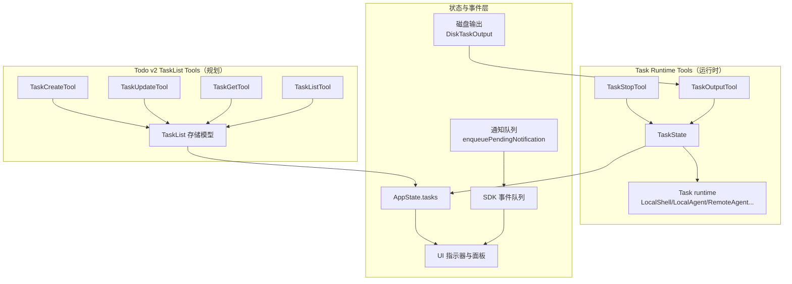
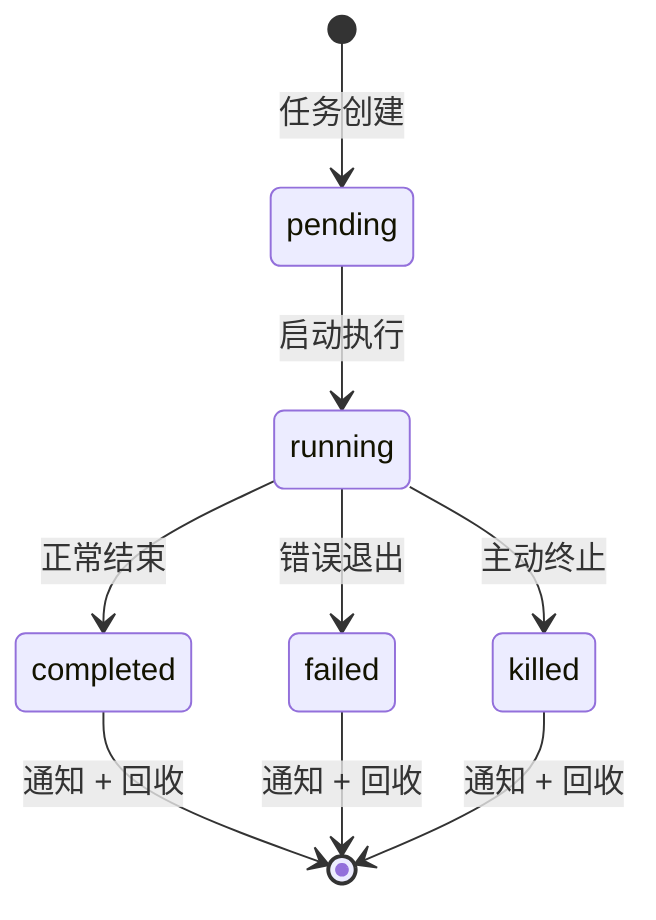

Claude Code 的“任务管理工具”包含两个独立但互补的子系统：基于工具链的 运行时任务（Task runtime tools）与面向规划与协调的 Todo v2 任务列表（TaskList 工具集）。前者用于执行与观测后台任务（Shell、Agent、Remote Agent 等），由 LLM 或用户在会话中直接调用；后者用于结构化规划与团队协作，由 Todo v2 功能开关启用，支持任务的创建、查询、更新与阻塞关系管理。两者在实现上互不依赖，共享 AppState.tasks 的 UI 汇聚，但在数据模型与 API 面向不同。本文聚焦“工具系统”视角，依次介绍运行时任务工具与 Todo v2 任务列表工具，并澄清两者边界与协作方式。

## 架构概览

Sources: [Task.ts](claude-code/src/Task.ts#L1-L57), [tasks.ts](claude-code/src/tasks.ts#L1-L40), [framework.ts](claude-code/src/utils/task/framework.ts#L1-L117), [tasks.ts](claude-code/src/utils/tasks.ts#L69-L139)

## 核心概念：运行时任务（Task Runtime）

- TaskType 与状态机：定义 7 种任务类型与统一状态。状态包含 pending、running、completed、failed、killed；isTerminalTaskStatus 用于判定终态，避免对已结束任务注入消息或重复通知。
- Task 接口与注册：Task 接口约定类型名与 kill 方法，由各实现提供 spawn/kill/update 等操作。getAllTasks 与 getTaskByType 提供统一注册与类型查找。
- 任务 ID：使用类型前缀与 base36（digits + 小写字母）8 位随机码，长度与熵足以防御符号链接暴力破解；generateTaskId 与 getTaskIdPrefix 实现生成逻辑。
- 状态管理：registerTask、updateTaskState、evictTerminalTask 统一在 AppState.tasks 中注册、更新与及时回收，支持 UI 驱动的 retain/evictAfter 策略。
- 通知与事件：各任务在完成或重要变更时通过 enqueuePendingNotification 发送结构化通知；框架通过 generateTaskAttachments 汇聚增量与变更，形成推送通知。

Sources: [Task.ts](claude-code/src/Task.ts#L1-L106), [tasks.ts](claude-code/src/tasks.ts#L1-L40), [framework.ts](claude-code/src/utils/task/framework.ts#L48-L117), [tasks/types.ts](claude-code/src/tasks/types.ts#L1-L46), [diskOutput.ts](claude-code/src/utils/task/diskOutput.ts#L1-L100)

## 任务类型与输出机制

下表汇总主要任务类型及其输出方式：

| 任务类型 | 说明 | 输出路径 | 典型用途 |
|---------|------|---------|---------|
| local_bash | 本地 Shell 后台命令 | getTaskOutputPath(taskId).output | 长时构建、脚本、交互式提示监控 |
| local_agent | 本地子 Agent（含 teammate） | 侧链 JSONL transcript + 任务输出文件 | 协作式多 Agent 执行与调试 |
| remote_agent | 远程 Agent | 任务输出文件 + 远程会话轮询 | 分布式或云端 Agent 执行 |
| monitor_mcp | MCP 流式监控 | 任务输出文件（流式） | 实时监控与条件触发 |
| local_workflow | 本地工作流脚本 | 任务输出文件 | 编排式脚本流 |
| in_process_teammate | 同进程队友任务 | 任务输出文件 | 协作者在会话内并行处理 |
| dream | Dream 类型任务 | 任务输出文件 | 特殊场景长时任务（按需） |

- 输出机制：DiskTaskOutput 封装异步写入队列，配合 getTaskOutputDelta、getTaskOutputPath 实现增量读取与路径管理，确保大文件与跨会话一致性；输出目录与会话 ID 绑定避免并发冲突。
- Stall Watchdog（LocalShell）：定期检测输出停滞，结合 looksLikePrompt 判断交互式阻塞，在需要时推送提示型通知，便于用户或 Agent 处理键盘等待场景。

Sources: [LocalShellTask.tsx](claude-code/src/tasks/LocalShellTask/LocalShellTask.tsx#L1-L104), [LocalAgentTask.tsx](claude-code/src/tasks/LocalAgentTask/LocalAgentTask.tsx#L1-L149), [RemoteAgentTask.tsx](claude-code/src/tasks/RemoteAgentTask/RemoteAgentTask.tsx#L1-L150), [diskOutput.ts](claude-code/src/utils/task/diskOutput.ts#L1-L100)

## 运行时工具详解

### TaskStopTool
- 功能：按任务 ID 终止正在运行的后台任务。输入支持 task_id 与历史兼容的 shell_id。
- 校验与调用：validateInput 校验存在性与运行态；内部调用 stopTask 统一终止逻辑，并在 LocalShell 场景抑制重复通知，同时通过 emitTaskTerminatedSdk 通知 SDK 端。
- 并发与安全：isConcurrencySafe() 为 true，可在并发场景安全使用；对 Bash 任务实施通知抑制以减少噪声，对 Agent 任务保留部分结果提取逻辑的通知。

Sources: [TaskStopTool.ts](claude-code/src/tools/TaskStopTool/TaskStopTool.ts#L1-L131), [stopTask.ts](claude-code/src/tasks/stopTask.ts#L1-L100)

### TaskOutputTool
- 功能：读取任务输出（增量或全量），用于查看运行时日志与结果。
- 实现：基于 getTaskOutputDelta/getTaskOutputPath，读取磁盘输出文件并返回增量摘要或完整内容；由 UI 或 SDK 消费。

Sources: [diskOutput.ts](claude-code/src/utils/task/diskOutput.ts#L1-L100), [framework.ts](claude-code/src/utils/task/framework.ts#L158-L200)

## Todo v2 任务列表工具（TaskList 工具集）

Todo v2 是一套面向规划与协作的轻量任务列表，与运行时任务系统独立，启用条件由 isTodoV2Enabled 控制。它提供四个核心工具：TaskCreateTool、TaskGetTool、TaskListTool、TaskUpdateTool，数据模型与运行时任务不同，强调阻塞关系与团队协调。

### 工具概览

| 工具 | 功能 | 核心输入 | 典型用途 |
|------|------|---------|---------|
| TaskCreateTool | 创建任务 | subject, description, activeForm?, metadata? | 初始化工作项与扩展元数据 |
| TaskGetTool | 查询单个任务 | taskId | 读取详情与阻塞关系 |
| TaskListTool | 列出任务 | 无参数 | 团队协同与任务看板 |
| TaskUpdateTool | 更新任务 | taskId + 可选字段 + status='deleted' 可删除 | 推进状态、设置负责人与阻塞 |

### TaskCreateTool
- 功能：创建任务并返回 ID；支持 activeForm（进行时态描述）与任意 metadata。
- 行为：创建时触发 executeTaskCreatedHooks；若有阻塞错误则回滚删除；并在 UI 层自动展开任务列表（expandedView: 'tasks'）。

Sources: [TaskCreateTool.ts](claude-code/src/tools/TaskCreateTool/TaskCreateTool.ts#L1-L138), [tasks.ts](claude-code/src/utils/tasks.ts#L69-L139)

### TaskGetTool
- 功能：根据 taskId 返回任务详情（subject、description、status、blocks、blockedBy）。
- 不可变性：isReadOnly() 为 true，适合查询与展示。

Sources: [TaskGetTool.ts](claude-code/src/tools/TaskGetTool/TaskGetTool.ts#L1-L128)

### TaskListTool
- 功能：列出所有非内部任务，并过滤已完成阻塞项以简化视图。
- 输出：任务 ID、主题、状态、负责人与阻塞依赖；为 UI 或 SDK 提供结构化数据。

Sources: [TaskListTool.ts](claude-code/src/tools/TaskListTool/TaskListTool.ts#L1-L116)

### TaskUpdateTool
- 功能：更新任意字段，支持设置 owner、阻塞关系，并将 status='deleted' 视为删除操作；状态变更可触发 executeTaskCompletedHooks 与队友通知（通过 writeToMailbox）。
- 验证：先查询现有任务，比对变更后执行增量更新；返回变更字段列表与状态变化信息。

Sources: [TaskUpdateTool.ts](claude-code/src/tools/TaskUpdateTool/TaskUpdateTool.ts#L1-L200), [tasks.ts](claude-code/src/utils/tasks.ts#L69-L139)

## 两套系统的边界与协作

- 数据模型独立：
  - 运行时任务：由 src/Task.ts 与 src/tasks/*.ts 定义，状态与生命周期由各任务实现管理。
  - Todo v2 列表：由 src/utils/tasks.ts 的 TaskSchema 定义，持久化在任务列表目录，支持跨进程共享与高水位标记防止 ID 重用。
- 工具与用途分离：
  - 运行时工具：TaskStopTool、TaskOutputTool 用于控制与观测后台执行。
  - 列表工具：TaskCreateTool/TaskGetTool/TaskListTool/TaskUpdateTool 用于规划与协同。
- 共享 UI 状态：两者均可反映在 AppState.tasks 中供 UI 指示器与面板展示，但读写路径与语义不同；变更通过 onTasksUpdated 信号与 notifyTasksUpdated 通知 UI 刷新。
- 并发与锁定：Todo v2 的列表操作通过文件锁与重试策略保证并发安全；运行时任务的终止与状态更新由框架层统一序列化与事件队列。

Sources: [Task.ts](claude-code/src/Task.ts#L1-L106), [tasks.ts](claude-code/src/tasks.ts#L1-L40), [tasks/types.ts](claude-code/src/tasks/types.ts#L1-L46), [framework.ts](claude-code/src/utils/task/framework.ts#L48-L144), [tasks.ts](claude-code/src/utils/tasks.ts#L1-L188)

## 输出管理与安全性

- 输出目录：基于会话 ID 的临时目录下 tasks/ 子目录，避免多会话冲突；路径由 getTaskOutputDir/getTaskOutputPath 管理。
- 写入模式：DiskTaskOutput 使用异步队列与单线程 drain 循环，避免内存链式保留；配合 O_NOFOLLOW（非 Windows）防止符号链接攻击。
- 容量与截断：MAX_TASK_OUTPUT_BYTES 控制输出上限，超出由写入端或监控端截断；框架层通过 generateTaskAttachments 读取增量并自动回收已通知的终态任务。

Sources: [diskOutput.ts](claude-code/src/utils/task/diskOutput.ts#L1-L100), [framework.ts](claude-code/src/utils/task/framework.ts#L158-L200)

## 状态生命周期与通知流程

- 通知生成：各任务在完成或重要事件时调用 enqueuePendingNotification；框架通过 generateTaskAttachments 为运行中任务生成增量附件。
- 回收时机：已通知的终态任务在 generateTaskAttachments 或显式 evictTerminalTask 中回收；UI 可通过 retain/evictAfter 延迟回收以保留面板展示。

Sources: [framework.ts](claude-code/src/utils/task/framework.ts#L48-L144), [LocalShellTask.tsx](claude-code/src/tasks/LocalShellTask/LocalShellTask.tsx#L1-L172), [LocalAgentTask.tsx](claude-code/src/tasks/LocalAgentTask/LocalAgentTask.tsx#L1-L200), [stopTask.ts](claude-code/src/tasks/stopTask.ts#L1-L100)

## 典型场景与最佳实践

- 长时构建与脚本：使用 local_bash 运行，结合 Stall Watchdog 检测交互式阻塞；通过 TaskOutputTool 查看进度，必要时用 TaskStopTool 中止。
- 多 Agent 协作：使用 local_agent 或 remote_agent 执行子任务；通过侧链 JSONL 与任务输出文件追踪日志；UI 可 retain 以保留对话视图。
- 任务规划与团队协同：启用 Todo v2 后，用 TaskCreateTool 创建工作项，TaskUpdateTool 设置负责人与阻塞，TaskListTool 展示团队看板；通过 onTasksUpdated 实时刷新。
- SDK 集成：SDK 端监听任务启动/完成事件，由 enqueueSdkEvent 发出；对终止事件通过 emitTaskTerminatedSdk 通知，避免依赖解析 XML。

Sources: [TaskStopTool.ts](claude-code/src/tools/TaskStopTool/TaskStopTool.ts#L1-L131), [LocalAgentTask.tsx](claude-code/src/tasks/LocalAgentTask/LocalAgentTask.tsx#L1-L200), [framework.ts](claude-code/src/utils/task/framework.ts#L1-L117), [tasks.ts](claude-code/src/utils/tasks.ts#L1-L188)

## 与其他系统的关系

- 与对话系统：运行时任务与对话循环并行执行，通知通过消息队列注入对话上下文；Todo v2 列表变更作为对话状态的一部分由 UI 呈现。
- 与权限系统：任务输出路径位于项目临时目录，受内部路径可读性策略保护；终止操作通过 validateInput 校验权限与状态。
- 与 Hooks 系统：任务创建/完成可触发对应 Hooks，由 executeTaskCreatedHooks/executeTaskCompletedHooks 调用，允许外部扩展行为。
- 与多 Agent 协作：local_agent/in_process_teammate 支持并行执行；Todo v2 的 owner 与阻塞关系用于团队分工与依赖管理。

Sources: [TaskStopTool.ts](claude-code/src/tools/TaskStopTool/TaskStopTool.ts#L60-L91), [framework.ts](claude-code/src/utils/task/framework.ts#L104-L116), [tasks.ts](claude-code/src/utils/tasks.ts#L1-L188), [LocalAgentTask.tsx](claude-code/src/tasks/LocalAgentTask/LocalAgentTask.tsx#L1-L200)

## 建议阅读顺序

- 若关注对话与工具系统整体：先读 [工具架构与注册机制](8-gong-ju-jia-gou-yu-zhu-ce-ji-zhi)，再读本页。
- 若关注权限与安全：读 [权限模型与审批流程](13-quan-xian-mo-xing-yu-shen-pi-liu-cheng)，理解任务终止与输出访问的安全边界。
- 若关注多 Agent 协作：读 [子 Agent 机制](21-zi-agent-ji-zhi)，理解 local_agent/in_process_teammate 在协作中的角色。
- 若关注扩展性：读 [Hooks 钩子系统](25-hooks-gou-zi-xi-tong)，了解如何在任务生命周期插入自定义逻辑。