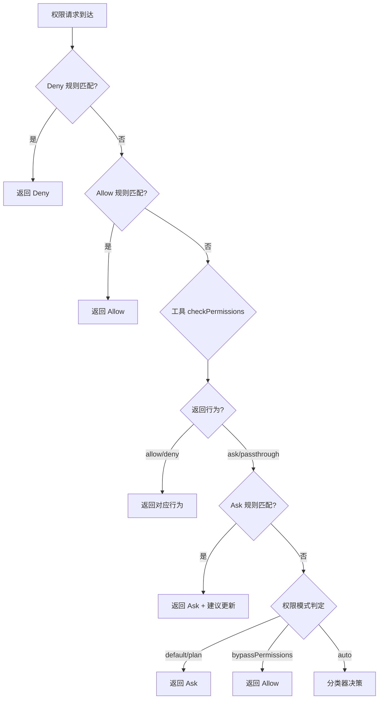

Claude Code 的权限系统是整个 Agent 架构的安全基石，它通过 **Allow/Ask/Deny 三级权限体系**、**五层规则优先级**和**细粒度的工具行为控制**，确保 AI 在执行操作时既能保持高效自主，又能严格遵循安全边界。该系统并非简单的"是/否"二元判断，而是一个融合了规则引擎、模式匹配、安全检查和用户交互的完整决策流程。

## 权限行为的三种裁决

每一次工具调用都会触发权限检查，系统最终会做出三种裁决之一：**Allow（自动放行）**、**Ask（弹出确认）**或 **Deny（直接拒绝）**。这三种行为由 `PermissionResult` 类型定义，每种行为都携带不同的元数据以满足不同场景需求。Allow 行为包含可选的 `updatedInput` 字段，允许权限系统在放行前修改工具输入（例如将相对路径转换为绝对路径）；Ask 行为携带用户提示信息、建议的权限更新以及可选的元数据（如命令描述）；Deny 行为则包含拒绝原因和决策理由，用于向 AI 解释为何操作被阻止。

Sources: [permissions.ts](claude-code/src/types/permissions.ts#L174-L246)

| 行为 | 含义 | 返回类型 | 典型触发场景 |
|------|------|---------|-------------|
| **Allow** | 自动放行，无用户交互 | `{ behavior: 'allow', updatedInput?, decisionReason }` | 读取项目内文件、执行白名单命令 |
| **Ask** | 弹出交互式确认对话框 | `{ behavior: 'ask', message, suggestions, metadata? }` | 执行未知 Bash 命令、修改敏感文件 |
| **Deny** | 立即拒绝，不执行操作 | `{ behavior: 'deny', message, decisionReason }` | 尝试执行被禁命令、访问禁止路径 |

这三种行为并非完全互斥——`passthrough` 类型作为第四种特殊行为，表示"无明确规则匹配，使用默认行为"，它在权限检查流水线中充当"未命中"标记，最终会根据当前权限模式（default/plan/auto）转换为最终的 Ask 或 Allow 行为。

Sources: [permissions.ts](claude-code/src/types/permissions.ts#L251-L266)

## 五层规则优先级体系

权限规则从六个来源汇聚而成，按优先级从高到低依次为：**session（当前对话授权）**、**cliArg（命令行参数）**、**command（Skill 白名单）**、**projectSettings（项目配置）**、**userSettings（用户配置）**和 **policySettings（企业策略）**。每个来源维护三个规则数组：`alwaysAllowRules`、`alwaysAskRules` 和 `alwaysDenyRules`，这些规则在运行时合并为 `ToolPermissionContext` 对象。

规则数据结构 `PermissionRule` 包含三个核心字段：`source`（规则来源）、`ruleBehavior`（allow/ask/deny）和 `ruleValue`（工具名+可选内容）。规则值的格式为 `ToolName(ruleContent)`，例如 `Bash(git *)` 表示"允许所有 git 开头的 Bash 命令"。当 `ruleContent` 缺失时，规则应用于整个工具（如 `Bash` 表示"允许所有 Bash 操作"），但此类宽泛规则在 Auto 模式下会被 `stripDangerousPermissionsForAutoMode` 函数自动移除，以防止绕过分类器安全检查。

Sources: [permissions.ts](claude-code/src/types/permissions.ts#L54-L79)



规则优先级的设计体现了"最小权限原则"：session 规则优先级最高，允许用户在对话中临时授权特定操作（如"本次会话中允许所有 npm 命令"）；cliArg 规则用于 CI/CD 场景，通过 `--allowed-tools` 参数预授权工具链；command 规则为 Skill 提供沙箱能力，限制 Skill 只能使用声明过的工具；projectSettings 规则实现团队共享的权限策略（如"所有开发者共享相同的 git 命令白名单"）；userSettings 规则允许个人偏好配置；policySettings 规则由企业管理员下发，用户无法覆盖，通常用于禁用危险操作。

Sources: [permissions.ts](claude-code/src/utils/permissions/permissions.ts#L109-L120)

## 规则匹配引擎：三维度解析

权限系统的核心是**规则匹配引擎**，它在 `permissions.ts` 中实现，支持三种匹配维度：**工具名匹配**、**命令模式匹配**和**路径模式匹配**。工具名匹配最简单，通过 `toolMatchesRule()` 函数实现：当规则的 `ruleContent` 为空时，匹配整个工具；MCP 工具使用 `getToolNameForPermissionCheck()` 获取标准名称，支持服务器前缀模式（`mcp__server__*` 匹配该服务器所有工具）和精确匹配模式。

命令模式匹配主要用于 BashTool 和 PowerShellTool，通过 AST 解析器提取命令结构。以 BashTool 为例，`bashPermissions.ts` 中的 `checkPermissions()` 方法首先调用 `readOnlyValidation.ts` 进行只读检查（使用 tree-sitter bash 解析命令 AST），识别读写操作；然后通过 `shouldUseSandbox()` 判断是否需要沙箱隔离；最后调用模式匹配器检查规则。命令模式支持前缀匹配（`git *` 匹配所有 git 命令）、精确匹配（`npm install` 仅匹配该命令）和通配符匹配（`docker-compose *` 匹配所有 docker-compose 子命令）。

Sources: [bashPermissions.ts](claude-code/src/tools/BashTool/bashPermissions.ts#L146-L200)

路径模式匹配用于文件操作工具（Read/Edit/Write），通过 glob 模式匹配文件路径。例如规则 `Edit(src/**)` 允许编辑 `src/` 目录下的所有文件，`Read(*.json)` 允许读取所有 JSON 文件。路径匹配在工具的 `checkPermissions()` 方法中实现，通过 `getPath()` 提取输入中的文件路径，然后与规则内容进行 glob 匹配。路径规范化处理统一使用 POSIX 风格（`/` 分隔符），Windows 路径会自动转换为 POSIX 格式后再匹配。

规则内容中的特殊字符需要转义——当命令本身包含括号时（如 `python -c "print(1)"`），规则必须写成 `Bash(python -c "print\(1\)")`。`permissionRuleParser.ts` 提供了 `escapeRuleContent()` 和 `unescapeRuleContent()` 函数处理转义逻辑：先转义反斜杠（`\` → `\\`），再转义括号（`(` → `\(`，`)` → `\)`），解析时逆向操作。这种设计保证了规则字符串的可解析性，同时避免与语法字符冲突。

Sources: [permissionRuleParser.ts](claude-code/src/utils/permissions/permissionRuleParser.ts#L44-L133)

## 权限检查的完整流水线

工具调用触发权限检查时，系统执行以下六步流水线：

**第一步：全局拒绝检查**（Blanket Deny）。`getDenyRuleForTool()` 检查工具名是否完全匹配 deny 规则（无 `ruleContent`）。命中的工具在初始化阶段就被 `getTools()` 过滤掉，根本不会出现在可用工具列表中。这是最高优先级的拒绝，用于永久禁用危险工具。

**第二步：全局允许检查**（Blanket Allow）。`toolAlwaysAllowedRule()` 检查工具名是否完全匹配 allow 规则。命中的工具直接放行，跳过后续所有检查。这适用于完全可信的工具（如 GrepTool、GlobTool 等只读工具）。

**第三步：工具自身权限检查**。每个工具实现 `checkPermissions(input, context)` 方法，返回 `PermissionResult`。不同工具有不同的逻辑：
- BashTool 执行只读检查 → 沙箱判定 → AST 解析 → 模式匹配 → 安全检查
- FileEditTool 检查路径是否在工作目录内、是否匹配敏感文件模式
- SkillTool 检查 allowedTools 白名单和属性安全标记

**第四步：Hook 系统介入**。`executePermissionRequestHooks()` 执行 PreToolUse hook，允许 hook 覆盖权限决策。Hook 可以返回 `deny` 阻止操作、返回 `ask` 强制用户确认，或返回 `allow` 放行。Hook 的决策优先级高于规则系统。

**第五步：Ask 规则检查**。如果前三步返回 `passthrough`，检查 `alwaysAskRules` 中是否有匹配规则。匹配则返回 Ask 行为，并提供权限更新建议（"Always allow"按钮）。

**第六步：权限模式默认行为**。如果所有规则都未命中，根据当前权限模式决定最终行为：
- `default` 模式：大部分工具返回 Ask（需要用户确认）
- `plan` 模式：写操作返回 Deny，读操作返回 Allow
- `bypassPermissions` 模式：所有操作返回 Allow
- `auto` 模式：调用 AI 分类器自动决策

Sources: [permissions.ts](claude-code/src/utils/permissions/permissions.ts#L473-L620)

## 权限模式详解

Claude Code 支持多种权限模式，通过 `PermissionMode` 类型定义，每种模式适用于不同的信任场景：

| 模式 | 内部值 | 启动方式 | 行为特征 |
|------|--------|---------|---------|
| **Default** | `'default'` | 默认模式 | 敏感操作逐一确认，安全平衡 |
| **Plan Mode** | `'plan'` | `/plan` 命令 | 只能读不能写，探索阶段专用 |
| **Accept Edits** | `'acceptEdits'` | `/accept-edits` | 自动批准文件编辑，但命令仍需确认 |
| **Auto** | `'auto'` | `/auto` + opt-in | AI 分类器自动决策，无需人工确认 |
| **Bypass** | `'bypassPermissions'` | `--dangerously-skip-permissions` | 跳过所有检查，仅用于沙箱环境 |

Plan Mode 是最严格的安全模式，通过 `EnterPlanModeTool` 触发。进入 Plan Mode 时，系统调用 `prepareContextForPlanMode()` 将权限上下文切换为 plan 模式，并保存之前的模式以便退出时恢复。在 Plan Mode 下，工具的 `checkPermissions()` 方法会检查 `context.toolPermissionContext.mode === 'plan'`，对于写操作返回 Deny，只允许读取和查询。这确保 AI 在探索阶段无法意外修改代码，用户可以先审查计划再批准执行。

Sources: [permissionSetup.ts](claude-code/src/utils/permissions/permissionSetup.ts#L84-L147)

Auto Mode 是最激进的自动化模式，需要用户显式 opt-in（首次使用时会弹出风险提示对话框）。启用后，系统使用 **Transcript Classifier**（基于 Claude 模型的 AI 分类器）自动评估每个操作的风险。分类器接收完整的对话上下文和工具调用信息，输出 `YoloClassifierResult`，包含 `shouldBlock` 标志和 `reason` 解释。分类器分两阶段执行：**Fast Stage** 使用简单规则快速判断（如"只读操作自动允许"），**Thinking Stage** 对复杂操作进行深度推理。分类器有失败保护机制——如果 API 超时或返回错误，系统会回退到普通 Ask 模式，而不是盲目放行（fail-safe 设计）。

Sources: [permissions.ts](claude-code/src/utils/permissions/permissions.ts#L518-L600)

Bypass Mode 完全跳过权限检查，仅在 `--dangerously-skip-permissions` 标志下启用。该模式会显示警告："所有操作将自动执行，不进行任何安全检查"，仅在隔离沙箱或完全可信环境中使用。系统会在 `permissionSetup.ts` 中调用 `checkAndDisableBypassPermissions()` 检查企业管理策略，如果 `policySettings` 禁用了 bypass 模式，即使命令行传入该标志也会被忽略。

## 审批流程与用户交互

当权限决策为 Ask 时，系统会渲染权限请求对话框，由 `PermissionRequest.tsx` 组件处理。该组件根据工具类型选择对应的权限请求组件（通过 `permissionComponentForTool()` 映射）：BashTool 使用 `BashPermissionRequest`、FileEditTool 使用 `FileEditPermissionRequest`、MCPTool 使用 `MCPPermissionRequest` 等。所有权限请求组件共享相同的 `ToolUseConfirm` 接口，包含以下核心字段：

```typescript
type ToolUseConfirm = {
  tool: Tool                    // 工具实例
  input: unknown               // 工具输入参数
  permissionResult: PermissionDecision  // 权限检查结果
  onAllow(updatedInput, updates, feedback)  // 用户批准回调
  onReject(feedback)          // 用户拒绝回调
  recheckPermission()         // 重新检查权限（用于规则更新后）
  onUserInteraction()         // 用户交互通知（防止异步自动批准）
}
```

Sources: [PermissionRequest.tsx](claude-code/src/components/permissions/PermissionRequest.tsx#L103-L127)

权限对话框的核心功能是**建议权限更新**（Permission Updates）。当用户选择"Always allow"时，系统调用 `buildPermissionUpdates()` 生成 `PermissionUpdate` 对象，然后通过 `persistPermissionUpdates()` 持久化到配置文件，同时调用 `applyPermissionUpdates()` 更新内存中的 `toolPermissionContext`。更新操作包括：
- `addRules`：添加新规则（如添加 `Bash(git *)` 到 allow 规则）
- `removeRules`：移除规则
- `replaceRules`：替换所有规则（用于批量更新）
- `setMode`：切换权限模式
- `addDirectories`/`removeDirectories`：管理工作目录白名单

Sources: [PermissionUpdate.ts](claude-code/src/utils/permissions/PermissionUpdate.ts#L55-L188)

权限对话框还支持**反馈机制**——用户在拒绝操作时可以输入文本反馈或粘贴图片，这些反馈会被注入到 AI 的对话上下文中，帮助 AI 理解拒绝原因并调整策略。例如，用户拒绝执行 `rm -rf node_modules` 并反馈"不要删除依赖目录"，AI 会在后续对话中避免类似操作。反馈数据通过 `contentBlocks` 字段传递，支持 `ContentBlockParam` 类型（文本、图片等）。

Sources: [permissions.ts](claude-code/src/types/permissions.ts#L183-L226)

## 高级安全特性

### Denial Tracking：死循环防护

当 AI 连续请求同一类被拒绝的操作时，系统会陷入死循环（AI 不断重试相同命令 → 用户不断拒绝 → AI 继续重试）。为防止这种情况，`denialTracking.ts` 实现了**拒绝追踪机制**。系统维护 `DenialTrackingState` 状态，记录每个工具的连续拒绝次数和最近拒绝时间：

```typescript
const DENIAL_LIMITS = {
  maxDenialsPerTool: 3,      // 同一工具连续拒绝上限
  cooldownPeriodMs: 30000,   // 冷却期 30 秒
}
```

当连续拒绝次数达到上限时，`shouldFallbackToPrompting()` 返回 true，系统向 AI 注入系统消息："Your previous tool call was rejected 3 times. Please try a different approach." 强制 AI 改变策略。操作成功时调用 `recordSuccess()` 重置计数器。该机制在 Auto 模式下尤为重要——如果分类器连续错误批准危险操作，用户连续拒绝后，系统会强制回退到手动确认模式，避免自动化系统失控。

Sources: [denialTracking.ts](claude-code/src/utils/permissions/denialTracking.ts#L1-L100)

### Auto Mode 的安全防护

Auto Mode 虽然追求自动化，但有多层安全防护：

**第一层：危险规则剥离**。`stripDangerousPermissionsForAutoMode()` 在进入 Auto Mode 时，从 `alwaysAllowRules` 中移除危险规则。危险规则定义包括：
- 工具级 Allow（`Bash` 无内容，允许所有命令）
- 脚本解释器前缀（`python:*`、`node:*`、`ruby:*` 等）
- 通配符规则（`python*`、`node*` 等）

这些规则会绕过分类器检查，导致任意代码执行风险。剥离后，即使是 Auto Mode，这些操作仍需分类器批准。

**第二层：分类器评估**。每个操作通过 `classifyYoloAction()` 发送给 AI 分类器。分类器使用 Claude 模型，系统提示包含安全指南和操作描述列表。分类器返回 `YoloClassifierResult`，包含 `shouldBlock` 布尔值和 `reason` 解释。分类器采用两阶段设计：**Fast Stage** 使用简化规则（如"git 操作自动允许"），**Thinking Stage** 对高风险操作启用深度推理。

**第三层：失败保护**。如果分类器 API 失败（超时、网络错误、响应格式错误），系统回退到普通 Ask 模式，而不是盲目放行或拒绝。这是 fail-safe 设计原则的体现——宁可降低效率，也不牺牲安全。

**第四层：连续拒绝熔断**。当分类器连续批准被用户拒绝的操作达到阈值时，`shouldFallbackToPrompting()` 触发熔断，强制切换到手动确认模式，向 AI 注入错误消息要求改变策略。

Sources: [permissionSetup.ts](claude-code/src/utils/permissions/permissionSetup.ts#L84-L147)

### 敏感文件保护

`isInProtectedNamespace()` 函数定义了受保护的文件路径模式，包括：
- `.claude/` 目录（配置文件）
- `.git/` 目录（版本控制）
- Shell 配置文件（`.bashrc`、`.zshrc`、`profile` 等）
- SSH 密钥目录（`.ssh/`）
- 环境变量文件（`.env`）

访问这些路径时，工具的 `checkPermissions()` 方法会返回 `safetyCheck` 类型的 Ask 决策，`classifierApprovable` 标志为 false（在 Auto Mode 下不可自动批准，必须人工确认）或 true（可由分类器评估，但分类器会看到路径敏感性上下文）。例如，编辑 `.git/config` 文件在 Auto Mode 下仍需人工确认，因为错误的修改可能导致仓库损坏。

Sources: [permissions.ts](claude-code/src/utils/permissions/permissions.ts#L532-L548)

## 规则配置最佳实践

权限规则通过 `settings.json` 文件配置，支持项目级（`.claude/settings.json`）、用户级（`~/.claude/settings.json`）和企业级（通过 `policySettings` 下发）。配置格式如下：

```json
{
  "permissions": {
    "allow": [
      "Bash(git *)",
      "Bash(npm *)",
      "Edit(src/**)",
      "Read(*)"
    ],
    "deny": [
      "Bash(rm -rf /)",
      "Bash(sudo *)"
    ],
    "ask": [
      "Bash(docker *)"
    ]
  },
  "defaultMode": "default"
}
```

规则建议遵循以下原则：
1. **最小权限原则**：只授予必要的权限，避免工具级 Allow（如 `Bash`）
2. **前缀优先**：使用命令前缀而非精确匹配（`git *` 优于 `git commit`），减少规则数量
3. **deny 优于 allow**：优先使用 deny 规则禁用危险操作，而非用 allow 规则允许所有
4. **项目级配置**：团队共享规则放在项目级，个人偏好放用户级
5. **定期审计**：使用 `claude config list` 查看当前规则，移除不再需要的规则

Sources: [permissionsLoader.ts](claude-code/src/utils/permissions/permissionsLoader.ts#L86-L145)

## 权限系统的扩展性

权限系统通过多个扩展点支持自定义行为：

**Hook 系统**：PreToolUse hook 可以拦截任何工具调用，实现自定义权限逻辑。Hook 接收工具名、输入参数和上下文信息，返回 `allow`/`deny`/`ask` 决策。这允许企业集成外部审批系统（如 Slack 审批流程、数据库审计日志）。

**自定义工具权限**：每个工具的 `checkPermissions()` 方法可以完全自定义。例如，企业可以创建 `SecureBashTool`，在标准 BashTool 基础上增加额外的命令审计、输入验证和网络隔离检查。

**权限规则解析器**：`permissionRuleParser.ts` 支持扩展规则语法。通过添加新的转义规则或匹配算法，可以支持更复杂的模式（如正则表达式、时间窗口限制）。

**分类器插件**：Auto Mode 的分类器逻辑通过 `classifierDecision.ts` 模块实现，理论上可以替换为其他分类模型（如本地规则引擎、第三方安全服务）。

## 总结

Claude Code 的权限模型是一个多层次、多维度的安全系统，它通过**五层规则优先级**、**三维度匹配引擎**、**六步检查流水线**和**多种权限模式**，在安全性和易用性之间找到平衡。系统的设计体现了"**防御深度**"原则：规则系统、工具检查、Hook 拦截、分类器评估、用户确认，层层把关，即使某一层失效，其他层仍能提供保护。

对于开发者，理解权限模型的关键在于：**规则优先级决定匹配顺序，权限模式决定默认行为，工具 checkPermissions 决定具体逻辑**。对于用户，合理配置权限规则（项目级共享 + 用户级个性化）并选择适当的权限模式（开发用 default，探索用 plan，可信环境用 auto），可以最大化效率同时保持安全。对于企业，通过 `policySettings` 强制执行安全策略、禁用危险模式、集成外部审批系统，可以满足合规要求。

权限系统不是阻碍效率的枷锁，而是赋予 AI 自主能力的信任框架。当你理解了它的设计哲学和实现细节，就能更好地利用它构建安全、高效的 AI 辅助开发工作流。