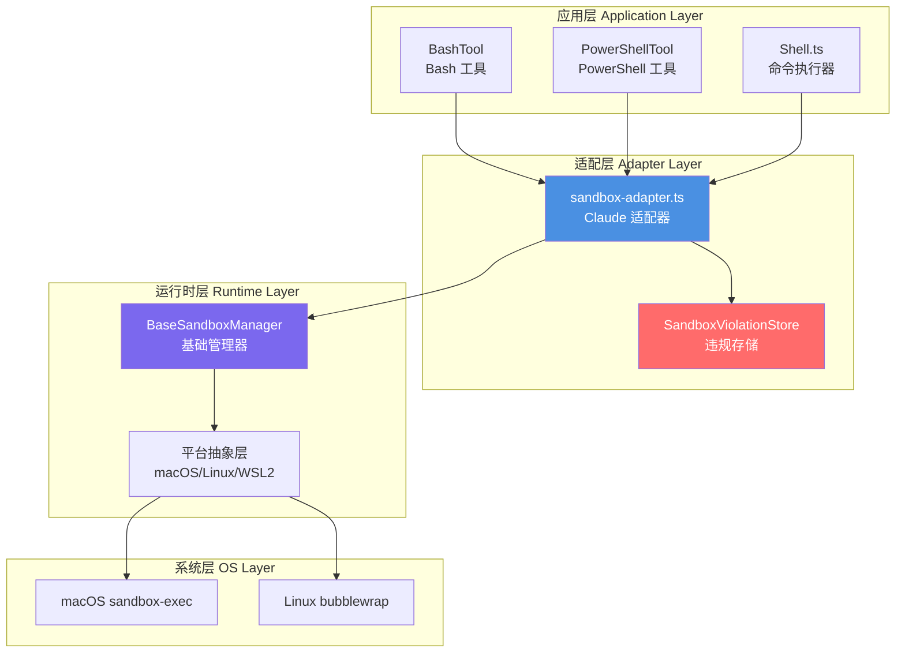
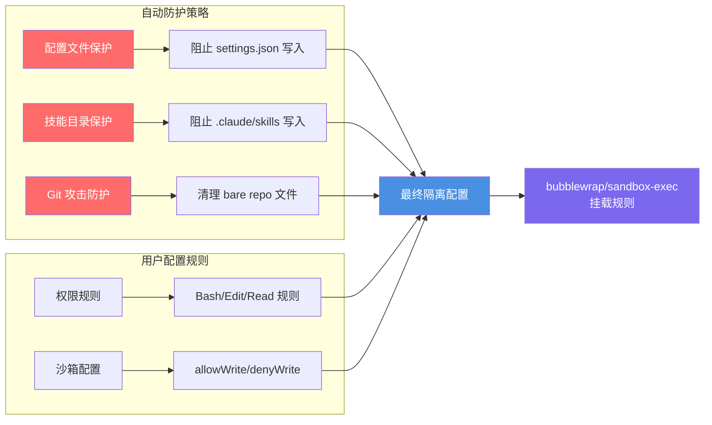
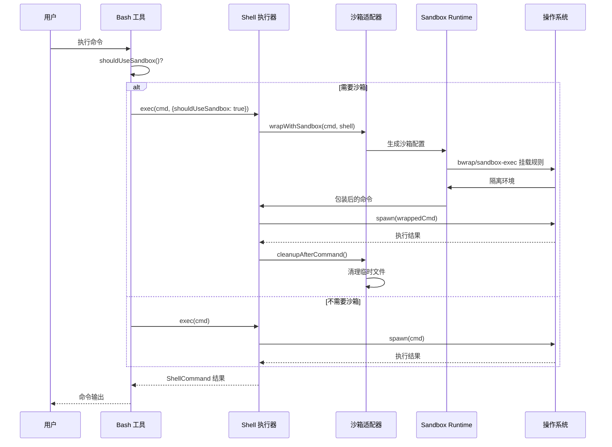

沙箱隔离机制是 Claude Code 安全体系的核心防线，通过操作系统级别的隔离技术，为 Bash 命令和 Shell 操作提供受限的执行环境。该机制基于 `@anthropic-ai/sandbox-runtime` 包，在 macOS 上使用 `sandbox-exec`，在 Linux/WSL2 上使用 `bubblewrap`（bwrap）实现进程级的资源隔离，防止恶意或意外操作对系统造成损害。

## 核心架构与设计理念

沙箱隔离采用**适配器模式**和**分层架构**设计，将底层的 OS 隔离机制与 Claude Code 的权限系统、配置系统无缝集成。架构分为三层：底层运行时（sandbox-runtime）、适配层（sandbox-adapter）、以及上层应用（Shell、BashTool、PowerShellTool）。



**适配器层**（`sandbox-adapter.ts`）是整个系统的核心，它负责将 Claude Code 的设置系统、权限规则转换为 sandbox-runtime 可理解的配置格式，同时提供命令包装、依赖检查、违规监控等高级功能。这种设计使得沙箱机制可以独立演进，而不影响上层业务逻辑。

Sources: [sandbox-adapter.ts](claude-code/src/utils/sandbox/sandbox-adapter.ts#L1-L22)

### 平台支持与依赖管理

沙箱机制在不同平台上使用不同的底层技术栈，但提供统一的抽象接口。**macOS** 使用系统自带的 `sandbox-exec` 工具，无需额外依赖；**Linux/WSL2** 需要 `bubblewrap`（提供命名空间隔离）和 `socat`（用于网络代理）。WSL1 由于技术限制不被支持。

| 平台 | 底层技术 | 必需依赖 | 支持状态 |
|------|---------|---------|---------|
| macOS | sandbox-exec | 无（系统内置） | ✅ 完全支持 |
| Linux | bubblewrap | bwrap, socat | ✅ 完全支持 |
| WSL2 | bubblewrap | bwrap, socat | ✅ 完全支持 |
| WSL1 | - | - | ❌ 不支持 |
| Windows | - | - | ❌ 不支持 |

依赖检查机制通过 `checkDependencies()` 函数实现，它会自动检测平台和必需工具的可用性，并返回结构化的检查结果（包含 errors 和 warnings）。这个函数被 memoization 优化，避免重复检查带来的性能开销。

Sources: [sandbox-adapter.ts](claude-code/src/utils/sandbox/sandbox-adapter.ts#L451-L457)

## 隔离能力与资源控制

沙箱提供三大核心隔离能力：**文件系统隔离**、**网络隔离**和**环境隔离**。每种隔离能力都通过细粒度的配置进行控制，确保在不影响正常功能的前提下，最大化安全防护。

### 文件系统隔离

文件系统隔离通过白名单和黑名单机制控制进程对文件系统的访问权限。系统维护四个关键列表：`allowWrite`（允许写入路径）、`denyWrite`（禁止写入路径）、`allowRead`（允许读取路径）、`denyRead`（禁止读取路径）。

**自动安全策略**是文件系统隔离的亮点。系统会自动阻止对配置文件（`settings.json`）的写入，防止沙箱逃逸攻击；阻止对 `.claude/skills` 目录的写入，避免恶意代码注入；针对 Git bare repository 攻击提供防护，动态清理可能被植入的恶意 Git 文件（如 `HEAD`、`objects/`、`refs/`）。



**路径解析约定**支持多种格式：`/path` 在权限规则中表示相对于设置文件的路径，在沙箱配置中表示绝对路径；`//path` 表示文件系统根路径；`~/path` 表示用户主目录；`./path` 或 `path` 表示相对路径。系统通过 `resolvePathPatternForSandbox()` 和 `resolveSandboxFilesystemPath()` 两个函数分别处理这两种场景。

Sources: [sandbox-adapter.ts](claude-code/src/utils/sandbox/sandbox-adapter.ts#L222-L280)

### 网络隔离

网络隔离通过域名白名单和代理机制控制进程的网络访问。`allowedDomains` 配置允许访问的域名列表，`deniedDomains` 配置禁止访问的域名。系统支持从 WebFetch 工具的权限规则中提取域名配置（格式：`WebFetch(domain:example.com)`），实现权限系统与沙箱配置的联动。

**高级网络控制**包括：Unix socket 访问控制（`allowUnixSockets`、`allowAllUnixSockets`）、本地绑定权限（`allowLocalBinding`）、HTTP/SOCKS 代理端口配置（`httpProxyPort`、`socksProxyPort`）。企业环境可以通过 `allowManagedDomainsOnly` 设置，强制只使用策略配置中的域名，忽略本地用户配置。

Sources: [sandbox-adapter.ts](claude-code/src/utils/sandbox/sandbox-adapter.ts#L177-L220)

### 环境隔离与命令排除

**命令排除机制**（excludedCommands）允许用户配置不需要沙箱隔离的命令模式。支持三种匹配模式：前缀匹配（`npm run test:*`）、精确匹配（`git status`）、通配符匹配（`bazel *`）。系统会智能解析复合命令（如 `cmd1 && cmd2`），对每个子命令单独检查是否匹配排除规则。

**Worktree 支持**是环境隔离的重要特性。当检测到当前工作目录是 Git worktree 时，系统会自动解析主仓库路径，并授予对主仓库 `.git` 目录的写入权限，确保 Git 操作（如 `git commit` 创建 `index.lock`）能正常工作。这个路径在初始化时解析一次并缓存，避免重复检测。

Sources: [shouldUseSandbox.ts](claude-code/src/tools/BashTool/shouldUseSandbox.ts#L21-L128)

## 集成机制与执行流程

沙箱机制通过 **Shell.ts** 的 `exec()` 函数集成到命令执行流程中。当 `shouldUseSandbox` 为 `true` 时，系统会调用 `SandboxManager.wrapWithSandbox()` 包装命令，生成带有沙箱参数的完整命令字符串，然后通过 `spawn()` 执行。



**PowerShell 的特殊处理**：在沙箱环境中执行 PowerShell 命令时，系统使用 `/bin/sh` 作为沙箱的内层 shell，而 PowerShell 命令被预包装为 `pwsh -NoProfile -NonInteractive -EncodedCommand <base64>` 格式。这样既能利用沙箱隔离，又避免了 PowerShell profile 加载带来的副作用。

**清理机制**（cleanupAfterCommand）在命令执行完成后立即运行，负责：删除 bubblewrap 在宿主机上创建的 0 字节挂载点文件（如 `.bashrc`）、清理可能被植入的 Git bare repository 文件、释放临时资源。这个操作必须是同步的，确保调用者在 `await shellCommand.result` 后立即看到干净的工作目录。

Sources: [Shell.ts](claude-code/src/utils/Shell.ts#L259-L273)

### 配置系统与优先级

沙箱配置通过多层设置系统管理，优先级从高到低为：**flagSettings**（命令行标志）> **policySettings**（企业策略）> **userSettings**（用户全局）> **projectSettings**（项目配置）> **localSettings**（本地配置）。

| 配置项 | 说明 | 默认值 |
|--------|------|--------|
| `sandbox.enabled` | 启用/禁用沙箱 | false |
| `sandbox.autoAllowBashIfSandboxed` | 沙箱命令自动允许 | true |
| `sandbox.allowUnsandboxedCommands` | 允许沙箱失败时回退 | true |
| `sandbox.excludedCommands` | 排除的命令模式列表 | [] |
| `sandbox.failIfUnavailable` | 沙箱不可用时失败 | false |
| `sandbox.enabledPlatforms` | 限制启用的平台 | 所有支持平台 |

**策略锁定机制**：当 `policySettings` 或 `flagSettings` 中设置了任何沙箱相关配置时，`areSandboxSettingsLockedByPolicy()` 返回 `true`，阻止本地修改沙箱设置。这确保了企业安全策略的强制执行。

Sources: [SandboxOverridesTab.tsx](claude-code/src/components/sandbox/SandboxOverridesTab.tsx#L32-L47)

## 违规监控与用户交互

沙箱违规监控通过 **SandboxViolationStore** 实现，这是一个响应式的存储系统，记录所有沙箱阻止的操作。违规事件包含时间戳、命令、违规描述等信息，并通过订阅机制（subscribe）通知 UI 更新。

**SandboxViolationExpandedView** 组件实时显示被阻止的操作，默认展示最近 10 条违规记录。在 Linux 平台上，由于 bubblewrap 的技术限制，违规监控功能被禁用（返回 null）。

```typescript
// 违规事件的数据结构
interface SandboxViolationEvent {
  timestamp: Date
  command?: string
  line: string  // 违规描述
}
```

**用户交互流程**通过 `/sandbox` 命令或 `sandbox-toggle` 命令触发，提供三个标签页：**Mode**（沙箱模式选择）、**Overrides**（覆盖设置）、**Config**（当前配置查看）。用户可以选择三种模式：

1. **auto-allow**：沙箱 + 自动允许（推荐）
2. **regular**：沙箱 + 常规权限审批
3. **disabled**：禁用沙箱

Sources: [SandboxViolationExpandedView.tsx](claude-code/src/components/SandboxViolationExpandedView.tsx#L20-L55)

### 命令排除的交互设计

当用户批准一个命令并选择"不再询问"时，系统会智能判断是否应该将该命令添加到 `excludedCommands` 列表。如果权限建议中包含 Bash 规则（如 `Bash(npm run test:*)`），系统会提取命令模式并添加到排除列表，下次执行时直接跳过沙箱。

`/sandbox exclude <pattern>` 命令提供了手动添加排除模式的能力。例如，`/sandbox exclude "npm run test:*"` 会将该模式写入 `settings.local.json` 的 `sandbox.excludedCommands` 数组中。

Sources: [sandbox-toggle.tsx](claude-code/src/commands/sandbox-toggle/sandbox-toggle.tsx#L51-L72)

## 安全增强特性

### Git Bare Repository 防护

这是一个关键的安全特性，防止攻击者通过植入 Git bare repository 文件逃逸沙箱。Git 的 `is_git_directory()` 函数会将包含 `HEAD` + `objects/` + `refs/` 的目录视为 bare repository，如果其中还包含带有 `core.fsmonitor` 的 `config` 文件，当 Claude 的非沙箱 git 进程访问该目录时，会触发 fsmonitor 钩子，导致沙箱逃逸。

**防护策略**采用双层防御：对于存在的文件，添加到 `denyWrite` 列表（bubblewrap 会以只读方式挂载）；对于不存在的文件，在命令执行后通过 `scrubBareGitRepoFiles()` 清理。这避免了 bubblewrap 在挂载点创建 0 字节文件（会破坏 `git log HEAD` 命令）。

Sources: [sandbox-adapter.ts](claude-code/src/utils/sandbox/sandbox-adapter.ts#L257-L280)

### Worktree 自动检测

Git worktree 场景下，`.git` 是一个文件（而非目录），内容为 `gitdir: /path/to/main/repo/.git/worktrees/name`。系统在初始化时通过 `detectWorktreeMainRepoPath()` 解析主仓库路径，并授予写入权限，确保 Git 操作正常进行。

这个检测只执行一次并缓存结果，因为 worktree 状态在会话期间不会改变。检测逻辑使用 `lastIndexOf()` 查找 `.git/worktrees/` 标记，避免误匹配包含 `.github` 等路径的情况。

Sources: [sandbox-adapter.ts](claude-code/src/utils/sandbox/sandbox-adapter.ts#L422-L445)

### 动态配置更新

沙箱配置支持运行时动态更新，通过 `settingsChangeDetector` 订阅设置变化，当检测到配置改变时，自动调用 `refreshConfig()` 重新构建 sandbox-runtime 配置。这确保了用户修改权限规则或沙箱设置后，后续命令立即使用新配置，无需重启会话。

Sources: [sandbox-adapter.ts](claude-code/src/utils/sandbox/sandbox-adapter.ts#L776-L781)

## 故障处理与回退机制

当沙箱不可用或执行失败时，系统提供多层回退机制。**failIfUnavailable** 设置（默认 false）控制沙箱不可用时的行为：如果设置为 true 且沙箱不可用，命令执行会失败并返回错误；如果为 false，系统会回退到非沙箱模式。

**allowUnsandboxedCommands** 设置控制是否允许沙箱失败后的回退。当设置为 true（开放模式）时，如果命令因沙箱限制失败，Claude 可以使用 `dangerouslyDisableSandbox` 标志重试命令，在不使用沙箱的情况下执行（但仍受权限系统控制）。当设置为 false（严格模式）时，所有命令必须在沙箱中执行，或显式列在 `excludedCommands` 中。

**getSandboxUnavailableReason()** 函数提供诊断信息，当用户显式启用沙箱但因依赖缺失或平台不支持而无法运行时，返回人类可读的原因说明，帮助用户排查问题。

Sources: [sandbox-adapter.ts](claude-code/src/utils/sandbox/sandbox-adapter.ts#L562-L592)

## 总结与最佳实践

沙箱隔离机制通过多层架构设计，将操作系统级的隔离能力与 Claude Code 的权限系统深度整合，提供了企业级的安全防护。关键设计原则包括：**默认安全**（自动防护策略）、**渐进增强**（从权限审批到沙箱隔离）、**可配置性**（多层配置系统、命令排除）、**透明性**（违规监控、诊断信息）。

**推荐配置策略**：
- 开发环境：启用沙箱 + auto-allow 模式，平衡安全性与效率
- 生产环境：启用沙箱 + 严格模式（`allowUnsandboxedCommands: false`），最大化安全性
- 企业环境：通过 `policySettings` 强制配置，锁定本地修改
- 特殊命令：使用 `excludedCommands` 排除已知安全的长期运行命令（如 `npm run dev`）

通过理解沙箱机制的工作原理和配置选项，开发者可以在保证安全的前提下，优化命令执行的效率和用户体验。