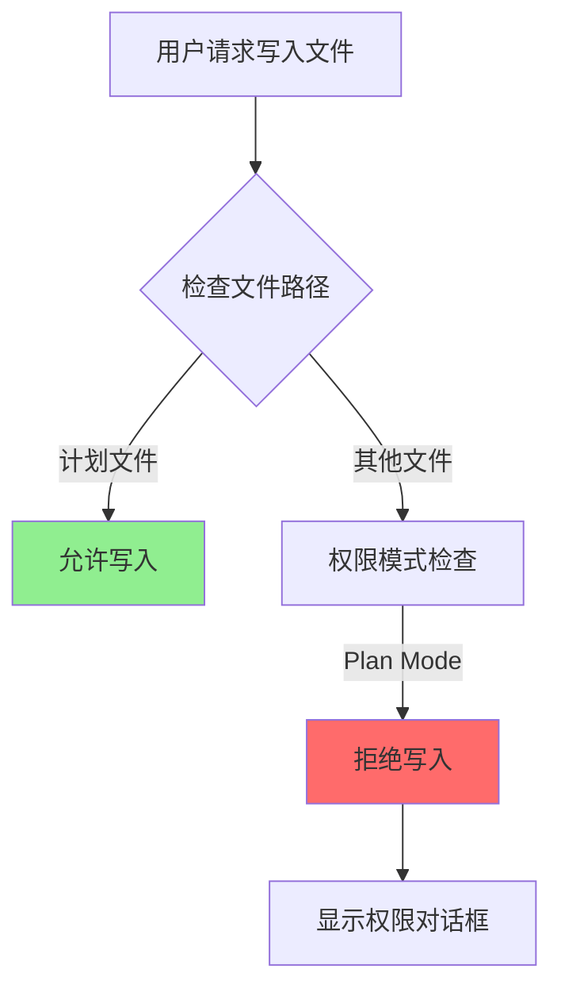
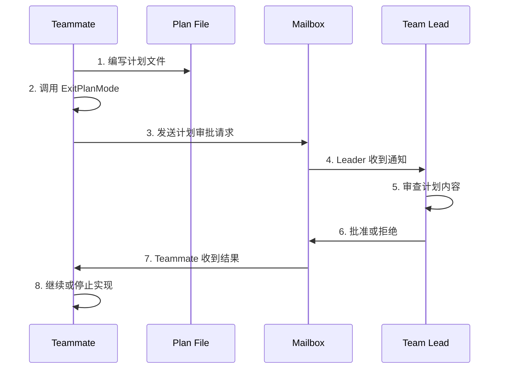

Plan Mode 是 Claude Code 的**安全执行策略**之一，要求 AI 在实施代码前进行**规划、探索、设计**,将最终计划方案提交用户批准后方可进入实现阶段。这种模式通过**强制只读执行**和**用户审批机制**,有效平衡了自动化能力与安全性,确保 AI 的行动符合用户预期。

Sources: [commands.ts](claude-code/src/commands.ts#L76), [types/permissions.ts](claude-code/src/types/permissions.ts#L23-L26)

## 核心概念

### Plan Mode 的定位

Plan Mode 是一种**权限模式**,属于 Claude Code 的 `PermissionMode` 类型系统之一,与 `default`、`acceptEdits`、`bypassPermissions`、`dontAsk` 等模式并列。在 plan mode 下,系统会:

1. **将所有文件操作转为只读**,除了计划文件本身
2. **阻止非只读工具执行**(如 Bash、Git 操作等)
3. **要求 AI 在完成规划后通过 `ExitPlanMode` 工具退出并等待用户批准**
4. **恢复之前的权限模式**进入实现阶段

这种设计确保 AI 在实际编码前进行**充分的思考和探索**,避免在理解不充分的情况下贸然修改代码导致错误或需要返工。

Sources: [commands.ts](claude-code/src/commands.ts#L76), [types/permissions.ts](claude-code/src/types/permissions.ts#L23-L26)

### Plan Mode 的两种触发方式

#### 1. 自动进入

**EnterPlanModeTool** 供 AI 主动调用,用于在遇到需要规划的任务时进入 Plan Mode。

**适用场景**:
- **新功能实现**: 添加复杂的新功能
- **多方案选择**: 任务可以有多种实现方式
- **代码重构**: 影响现有架构的修改
- **架构决策**: 需要选择技术方案或模式
- **多文件修改**: 涉及 3 个以上文件
- **需求不明确**: 需要探索才能理解范围
- **用户偏好重要**: 实现方式可能因用户需求而异

**不适用场景**:
- 单行修复或简单的 bug 修复
- 明确的小改动
- 纯研究/探索任务
- 标准操作

**提示词特点** (针对外部用户):
- 强调**主动**使用,而非被动
- 提供**6 个明确的判断标准**
- 包含正反面示例

Sources: [EnterPlanModeTool/prompt.ts](claude-code/src/tools/EnterPlanModeTool/prompt.ts#L1-L171)

#### 2. 手动切换

用户可以通过 **`/plan`** 命令手动进入 Plan Mode。

**命令变体**:
- **`/plan`** - 进入 plan mode
- **`/plan open`** - 在编辑器中打开计划文件
- **`/plan <description>`** - 进入 plan mode 并带有描述

Sources: [plan/plan.tsx](claude-code/src/commands/plan/plan.tsx#L1-L122)

#### 3. 强制 Plan Mode (Teammate 机制)

对于 Teammate(子 Agent),可以通过 **`--plan-mode-required`** 标志强制启用 Plan Mode。

**工作流程**:
1. Teammate **必须**进入 plan mode
2. 创建计划并写入计划文件
3. 通过 `ExitPlanMode` **提交计划给 Team Leader**
4. **等待 Leader 审批**
5. 获得批准后才能开始实现

**关键特性**:
- **无需本地用户交互**: 避免权限对话框阻塞
- **远程审批**: 计划通过邮箱发送给 Leader
- **状态跟踪**: 通过 `awaitingPlanApproval` 标记等待状态

Sources: [ExitPlanModeV2Tool.ts](claude-code/src/tools/ExitPlanModeTool/ExitPlanModeV2Tool.ts#L211-L260), [teammate.ts](claude-code/src/utils/teammate.ts#L80-L150), [inProcessTeammateHelpers.ts](claude-code/src/utils/inProcessTeammateHelpers.ts#L1-L50)

## Plan Mode 工作流程

进入 Plan Mode 后,系统会通过系统提示注入详细的工作流程指令,AI 会遵循以下阶段完成任务。

### 标准 5 阶段工作流

**Phase 1 - 初始理解**
- **目标**: 深入理解用户请求和相关代码
- **操作**: 启动 Explore Agents 并行探索代码库
- **限制**: 此阶段**只能**使用 `explore` agent 类型
- **Agent 数量**: 最多 3 个(默认 1 个)
- **并发执行**: 在单个消息中进行多次 tool 调用

**Phase 2 - 设计**
- **目标**: 设计实现方案
- **操作**: 启动 Plan Agent(s) 深入设计
- **Agent 数量**: 最多 3 个(默认 1 个)
- **建议**: 大多数任务应该启动至少 1 个 Plan Agent
- **视角多样化**: 复杂任务可使用多个 Agent 提供不同视角

**Phase 3 - 审查**
- **目标**: 审查计划并确保与用户意图一致
- **操作**:
  1. 阅读关键文件
  2. 确保计划与原始请求一致
  3. 使用 `AskUserQuestion` 澄清疑问

**Phase 4 - 编写最终计划**
- **目标**: 将计划写入计划文件
- **计划文件路径**: `{plansDir}/{planSlug}.md`
- **内容要求**:
  - Context 部分: 说明变更原因和目标
  - 推荐方案: 仅包含最终选择的方法
  - 文件路径: 列出需要修改的关键文件
  - 复用资源: 引用现有函数和工具
  - 验证方案: 描述如何测试变更

**Phase 5 - 退出 Plan Mode**
- **目标**: 请求用户批准
- **操作**: 调用 `ExitPlanMode` 工具
- **重要性**: 回合**必须**以 `AskUserQuestion` 或 `ExitPlanMode` 结束
- **禁止**: 不能以文本或其他方式询问"计划是否可以?"

**关键规则**:
- 只能编辑**计划文件**
- 所有其他文件操作都被阻止
- 非只读工具被禁止
- 工具结果必须在 `AskUserQuestion` 或 `ExitPlanMode` 之间选择

Sources: [messages.ts](claude-code/src/utils/messages.ts#L3171-L3380)

### 实验性功能: Interview Phase

对于 Ant 用户,启用了 **Interview Phase** 工作流,这是一个更结构化的交互式规划流程,提供更详细的指导。

### Plan File 实验变体

系统正在进行 A/B 测试,优化计划文件结构。

**实验变体**:
- **control**: 标准的计划文件结构
- **trim**: 精简版,减少冗余
- **cut**: 更精简,强调实用性
- **cap**: 严格限制,最多 40 行

**目的**: 减少计划文件大小,降低成本

Sources: [messages.ts](claude-code/src/utils/messages.ts#L3190-L3240), [planModeV2.ts](claude-code/src/utils/planModeV2.ts#L1-L96)

## Plan Mode 实现细节

### 权限控制机制

#### Plan Mode 下的权限行为

在 Plan Mode 下,权限系统的行为与默认模式类似,但有以下关键区别。

**允许的操作**:
- **文件读取**: Read、Glob、Grep 等只读工具
- **AskUserQuestion**: 向用户提问
- **ExitPlanMode**: 退出计划模式
- **计划文件写入**: 对计划文件的特殊写入权限

**禁止的操作**:
- 非计划文件的写入操作
- Bash 等非只读工具执行
- 配置文件修改
- Git 操作

#### 权限检查流程

系统使用特殊的路径检查逻辑来决定是否允许文件写入操作。



**实现代码**:

```typescript
export function checkEditableInternalPath(
  absolutePath: string,
  input: { [key: string]: unknown },
): PermissionResult {
  const normalizedPath = normalize(absolutePath)
  
  // Plan files for current session - 特殊豁免
  if (isSessionPlanFile(normalizedPath)) {
    return {
      behavior: 'allow',
      updatedInput: input,
      decisionReason: {
        type: 'other',
        reason: 'Plan files for current session are allowed for writing',
      },
    }
  }
  // ... 其他检查
}

function isSessionPlanFile(absolutePath: string): boolean {
  const expectedPrefix = join(getPlansDirectory(), getPlanSlug())
  const normalizedPath = normalize(absolutePath)
  return (
    normalizedPath.startsWith(expectedPrefix) && normalizedPath.endsWith('.md')
  )
}
```

Sources: [filesystem.ts](claude-code/src/utils/permissions/filesystem.ts#L1489-L1498), [filesystem.ts](claude-code/src/utils/permissions/filesystem.ts#L245-L255)

### 计划文件管理

#### 计划文件路径

**默认位置**: `~/.claude/plans/{planSlug}.md`  
**项目位置**: `{projectRoot}/.claude/plans/{planSlug}.md`

可以通过 `settings.json` 中的 `plansDirectory` 配置自定义位置。

#### 计划文件生命周期

1. **创建**: 首次进入 Plan Mode 时生成 `planSlug`
2. **编辑**: 在 Plan Mode 期间可以多次编辑
3. **持久化**: 退出 Plan Mode 后文件保留
4. **重用**: 重新进入 Plan Mode 时可以读取现有计划

**planSlug 生成**:
- 使用随机单词组合生成
- 确保唯一性(最多重试 10 次)
- 绑定到 Session ID

Sources: [plans.ts](claude-code/src/utils/plans.ts#L30-L100)

### 系统提示注入

#### Plan Mode 附件类型

系统使用**attachment 机制**动态注入 Plan Mode 相关的系统提示,确保 AI 能够获得正确的上下文信息。

**plan_mode 附件**:
- **触发时机**: 进入 Plan Mode 时
- **内容**: 完整的 5 阶段工作流指令
- **类型**: `full` 或 `sparse`(根据是否已多次进入)

**plan_mode_reentry 附件**:
- **触发时机**: 重新进入 Plan Mode(之前已退出)
- **内容**: 提醒读取现有计划文件
- **操作**: 评估是继续还是重新开始

**plan_mode_exit 附件**:
- **触发时机**: 退出 Plan Mode 时
- **内容**: 确认可以开始实现
- **计划文件引用**: 如果计划文件存在

**注入机制**:

```typescript
// attachments.ts 中的附件生成逻辑
if (toolPermissionContext.mode === 'plan') {
  const planFilePath = getPlanFilePath()
  const existingPlan = getPlan()
  
  // 检查是否重新进入
  if (hasExitedPlanModeInSession() && existingPlan !== null) {
    attachments.push({ 
      type: 'plan_mode_reentry', 
      planFilePath 
    })
    setHasExitedPlanMode(false)
  }
  
  // 添加主指令
  attachments.push({
    type: 'plan_mode',
    reminderType: isSparse ? 'sparse' : 'full',
    isSubAgent: !!agentId,
    planFilePath,
    planExists: existingPlan !== null
  })
}
```

Sources: [attachments.ts](claude-code/src/utils/attachments.ts#L1050-L1100), [messages.ts](claude-code/src/utils/messages.ts#L3860-L3900)

### 模式切换与状态恢复

#### 进入 Plan Mode

当进入 Plan Mode 时,系统会:

1. **记录模式切换**: 调用 `handlePlanModeTransition` 
2. **准备权限上下文**: 调用 `prepareContextForPlanMode`
3. **更新权限模式**: 设置为 `plan`
4. **保存之前模式**: 存储在 `prePlanMode` 字段中

```typescript
// EnterPlanModeTool.ts
async call(_input, context) {
  // 记录切换
  handlePlanModeTransition(
    context.getAppState().toolPermissionContext.mode, 
    'plan'
  )
  
  // 更新权限上下文
  context.setAppState(prev => ({
    ...prev,
    toolPermissionContext: applyPermissionUpdate(
      prepareContextForPlanMode(prev.toolPermissionContext),
      { type: 'setMode', mode: 'plan', destination: 'session' }
    )
  }))
}
```

Sources: [EnterPlanModeTool.ts](claude-code/src/tools/EnterPlanModeTool/EnterPlanModeTool.ts#L89-L105)

#### 退出 Plan Mode

当退出 Plan Mode 时,系统会:

1. **检查之前模式**: 读取 `prePlanMode` 字段
2. **处理特殊情况**: 如果之前是 Auto Mode 但现在不可用,降级到 `default`
3. **恢复模式**: 更新权限模式
4. **触发退出附件**: 设置 `needsPlanModeExitAttachment`

```typescript
// ExitPlanModeV2Tool.ts
async call(input, context) {
  const appState = context.getAppState()
  
  // 恢复之前的模式
  const prePlanRaw = 
    appState.toolPermissionContext.prePlanMode ?? 'default'
  
  // 处理 Auto Mode 的特殊情况
  let restoreMode = prePlanRaw
  if (prePlanRaw === 'auto' && !isAutoModeGateEnabled()) {
    // Circuit breaker 触发,降级到 default
    restoreMode = 'default'
  }
  
  // 更新状态
  context.setAppState(prev => ({
    ...prev,
    toolPermissionContext: applyPermissionUpdate(
      prev.toolPermissionContext,
      { type: 'setMode', mode: restoreMode, destination: 'session' }
    )
  }))
  
  // 标记需要退出附件
  setNeedsPlanModeExitAttachment(true)
}
```

Sources: [ExitPlanModeV2Tool.ts](claude-code/src/tools/ExitPlanModeTool/ExitPlanModeV2Tool.ts#L300-L350)

## Teammate Plan Mode 审批流程

对于 Teammate(子 Agent),Plan Mode 有特殊的审批机制,确保团队协作的安全性。

### Team Lead 审批机制

**触发条件**: Teammate 启动时设置了 `--plan-mode-required` 标志

**工作流程**:



**实现代码**:

```typescript
// ExitPlanModeV2Tool.ts
if (isTeammate() && isPlanModeRequired()) {
  // 检查计划是否存在
  if (!plan) {
    throw new Error('No plan file found')
  }
  
  // 生成审批请求
  const requestId = generateRequestId(
    'plan_approval',
    formatAgentId(agentName, teamName || 'default')
  )
  
  const approvalRequest = {
    type: 'plan_approval_request',
    from: agentName,
    timestamp: new Date().toISOString(),
    planFilePath: filePath,
    planContent: plan,
    requestId
  }
  
  // 发送到 Team Lead 的邮箱
  await writeToMailbox(
    'team-lead',
    {
      from: agentName,
      text: jsonStringify(approvalRequest),
      timestamp: new Date().toISOString()
    },
    teamName
  )
  
  // 更新任务状态
  const agentTaskId = findInProcessTeammateTaskId(agentName, appState)
  if (agentTaskId) {
    setAwaitingPlanApproval(agentTaskId, context.setAppState, true)
  }
  
  return {
    data: {
      plan,
      isAgent: true,
      filePath,
      awaitingLeaderApproval: true,
      requestId
    }
  }
}
```

Sources: [ExitPlanModeV2Tool.ts](claude-code/src/tools/ExitPlanModeTool/ExitPlanModeV2Tool.ts#L211-L260)

### UI 显示

**等待批准状态**:
- 显示 "Plan submitted for team lead approval"
- 显示计划文件路径
- 提示 "Waiting for team lead to review and approve..."

**批准后**:
- 正常退出 Plan Mode
- 可以开始实现

Sources: [ExitPlanModeTool/UI.tsx](claude-code/src/tools/ExitPlanModeTool/UI.tsx#L60-82)

## Plan Mode 使用最佳实践

### 何时使用 Plan Mode

| 场景类型 | 是否使用 | 原因 |
|---------|---------|------|
| ✅ 新功能实现 | 是 | 特别是影响架构的功能,需要提前规划 |
| ✅ 多文件修改 | 是 | 涉及 3 个以上文件的修改应该先规划 |
| ✅ 需求不明确 | 是 | 需要探索才能理解范围的任务 |
| ✅ 多种方案 | 是 | 需要选择合适的方法 |
| ✅ 架构决策 | 是 | 技术选型或模式选择需要用户参与 |
| ✅ 代码重构 | 是 | 大规模重构或架构调整影响面广 |
| ✅ 用户偏好重要 | 是 | 实现方式可能因用户需求而异 |
| ❌ 单行修复 | 否 | 简单的 bug 或 typo 不需要规划 |
| ❌ 明确的小改动 | 否 | 用户已给出详细指示的小修改 |
| ❌ 纯研究任务 | 否 | 探索代码库应该使用 Agent tool |
| ❌ 标准操作 | 否 | 按照现有模式添加功能不需要规划 |

### Plan Mode 工作流建议

**高效的探索策略**:

| 任务复杂度 | Agent 数量 | 使用场景 |
|-----------|-----------|---------|
| 简单明确 | 1 个 | 任务明确,文件路径已知 |
| 中等复杂 | 1-2 个 | 范围较广,需要理解多个领域 |
| 高度复杂 | 2-3 个 | 涉及多个领域,需要理解现有模式 |

**计划文件编写建议**:
- **保持简洁**: 大部分计划应少于 40 行
- **列出文件路径**: 明确要修改的文件
- **引用现有资源**: 避免重复造轮子,复用现有函数
- **包含验证方法**: 描述如何测试变更是否正确

**与用户交互建议**:
- ✅ 使用 `AskUserQuestion` 澄清需求和技术选型
- ❌ 不要在文本中询问"计划是否可以?"
- ✅ 使用 `ExitPlanMode` 请求批准

**退出后的实现**:
- 按照计划逐步实现
- 遇到问题时可以随时调整
- 可以重新进入 Plan Mode 修改计划

### 常见问题

| 问题 | 答案 |
|------|------|
| 如何查看当前计划? | 使用 `/plan` 命令 |
| 如何编辑计划文件? | 使用 `/plan open` 在编辑器中打开 |
| 可以多次进入 Plan Mode 吗? | 可以,系统会提示读取现有计划并决定是继续还是重新开始 |
| Plan Mode 下可以运行测试吗? | 不可以,只能执行只读操作 |
| 如何强制 Teammate 使用 Plan Mode? | 启动时添加 `--plan-mode-required` 标志 |

## 架构设计决策

### 为什么使用权限模式实现?

**优点**:

| 优势 | 说明 |
|------|------|
| 与现有系统集成 | 无需额外的状态管理机制,复用 PermissionMode 系统 |
| 统一的权限检查 | 所有工具都通过相同的权限检查流程 |
| 模式切换简单 | 通过 `applyPermissionUpdate` 统一处理所有模式切换 |
| 状态恢复 | `prePlanMode` 字段自动保存和恢复之前的状态 |

**权衡**:
- 需要在权限检查逻辑中添加特殊处理(如计划文件写入)
- Auto Mode 集成复杂度增加(需要在 Plan Mode 下保持 Auto Mode 状态)

### 为什么使用 Attachment 机制注入指令?

**优点**:

| 优势 | 说明 |
|------|------|
| 动态注入 | 无需重新构建系统提示,根据状态动态注入 |
| 上下文感知 | 根据当前状态决定注入内容,避免冗余 |
| 版本控制 | 可以轻松修改指令内容,支持 A/B 测试 |
| 稀疏提醒 | 避免每次都发送完整指令,减少 token 使用 |

**实现**:
- `plan_mode`: 首次进入的完整指令
- `plan_mode_reentry`: 重新进入的简化指令
- `plan_mode_exit`: 退出时的确认

### 为什么限制只能编辑计划文件?

**安全考虑**:

| 考虑 | 说明 |
|------|------|
| 防止意外修改 | 避免在规划阶段修改代码,确保思考完整 |
| 强制规划流程 | 确保 AI 完成完整的思考和探索过程 |
| 用户控制 | 给用户审查和批准的机会,防止不符合预期的修改 |

**实现机制**:
- `isSessionPlanFile` 函数检查文件路径是否为当前会话的计划文件
- 在 `checkEditableInternalPath` 中对计划文件进行特殊处理
- 路径格式: `{plansDir}/{planSlug}.md` 或 `{plansDir}/{planSlug}-agent-{agentId}.md`

## 相关页面

想深入了解 Claude Code 的其他安全机制,请参阅:

- [权限模型与审批流程](13-quan-xian-mo-xing-yu-shen-pi-liu-cheng) - 理解完整的权限系统和审批机制
- [沙箱隔离机制](14-sha-xiang-ge-chi-ji-zhi) - 了解执行隔离和沙箱保护
- [自动模式与安全策略](16-zi-dong-mo-shi-yu-an-quan-ce-lue) - 探索 Auto Mode 的工作原理
- [子 Agent 机制](21-zi-agent-ji-zhi) - 了解 Teammate 的工作原理和协作机制
- [协调器与 Swarm 模式](23-xie-diao-qi-yu-swarm-mo-shi) - 深入多 Agent 协作和团队工作流程