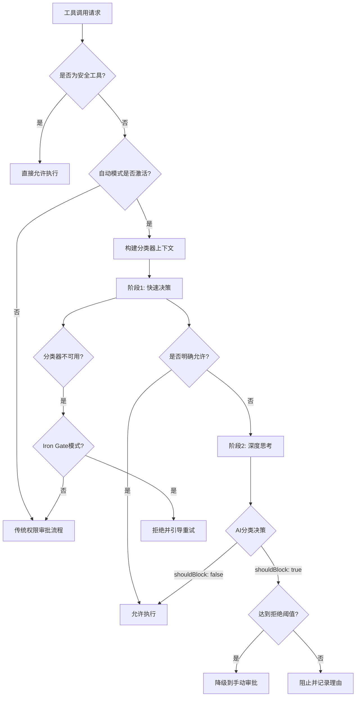

自动模式是一种基于AI分类器的智能权限控制系统，能够自动判断工具操作是否安全，从而减少手动审批提示，实现更流畅的交互体验。该系统通过转录分类器分析对话上下文、用户意图和工具调用内容，在保证安全的前提下最大化自动化执行。

## 核心架构与工作原理

自动模式的核心是**双阶段XML分类器**，它通过AI模型评估每个工具操作的安全性。整个系统遵循"安全第一"原则，在不确定的情况下倾向于阻止操作。



**系统状态管理**通过三个关键标志位控制自动模式行为：`autoModeActive`表示当前是否处于自动模式，`autoModeFlagCli`记录CLI标志传递情况，`autoModeCircuitBroken`作为熔断器在远程配置禁用时阻止重新进入自动模式。

Sources: [autoModeState.ts](claude-code/src/utils/permissions/autoModeState.ts#L1-L40)

## 权限模式体系

自动模式运行在完整的权限模式生态中，用户可以通过Shift+Tab在不同模式间切换。系统支持六种核心模式：

| 模式 | 说明 | 安全级别 | 适用场景 |
|------|------|----------|----------|
| `default` | 默认模式，所有操作需要审批 | 最高 | 新用户、敏感项目 |
| `acceptEdits` | 自动接受工作目录内的文件编辑 | 高 | 信任的本地开发 |
| `plan` | 计划模式，先规划后执行 | 高 | 复杂任务规划 |
| `auto` | AI分类器自动决策 | 中 | 流畅开发体验 |
| `bypassPermissions` | 绕过所有权限检查 | 最低 | 内部测试、特殊场景 |
| `dontAsk` | 不提示但遵循规则 | 中 | 自动化脚本 |

**模式切换逻辑**确保安全性递增转换。当从其他模式切换到自动模式时，系统会剥离危险的Bash/PowerShell权限规则，防止绕过分类器。对于Anthropic内部用户，模式循环路径为：`default` → `bypassPermissions` → `auto` → `default`，跳过了acceptEdits和plan模式。

Sources: [getNextPermissionMode.ts](claude-code/src/utils/permissions/getNextPermissionMode.ts#L1-L102), [permissions.ts](claude-code/src/types/permissions.ts#L15-L45)

## 分类器决策流程

### 双阶段分类机制

**阶段1（快速决策）**使用简短后缀提示分类器立即做出判断，通过`<block>yes/no</block>` XML标签响应。如果阶段1明确允许（`<block>no</block>`），则直接返回允许结果，避免不必要的深度思考。如果阶段1选择阻止或无法解析，则进入阶段2。

**阶段2（深度思考）**要求分类器提供完整的推理链路，使用`<thinking>`标签展示决策过程。系统会解析`<block>`和`<reason>`标签提取最终决策和理由。两阶段设计在保证安全的同时优化了延迟。

```typescript
// 阶段1快速后缀
const XML_S1_SUFFIX = '\nErr on the side of blocking. <block> immediately.'

// 阶段2思考后缀
const XML_S2_SUFFIX = '\nReview the classification process and follow it carefully, ' +
  'making sure you deny actions that should be blocked. As a reminder, ' +
  'explicit (not suggestive or implicit) user confirmation is required to ' +
  'override blocks. Use <thinking> before responding with <block>.'
```

Sources: [yoloClassifier.ts](claude-code/src/utils/permissions/yoloClassifier.ts#L432-L479)

### 系统提示构建

分类器的系统提示由三部分组成：基础提示定义分类任务，权限模板提供allow/deny/environment规则，用户自定义配置替换默认规则。

**外部用户权限模板**使用`<user_*_to_replace>`标签包裹默认规则，用户提供的设置会**完全替换**对应部分。**Anthropic内部模板**则保持默认规则在标签外部，用户设置以**追加**方式生效。

配置来源遵循安全优先级：仅从`userSettings`和`localSettings`读取，**明确排除projectSettings**以防止恶意项目注入分类器规则（RCE风险）。

Sources: [yoloClassifier.ts](claude-code/src/utils/permissions/yoloClassifier.ts#L400-L530), [settings.ts](claude-code/src/utils/settings/settings.ts)

## 安全策略与防护机制

### 工具白名单机制

系统维护`SAFE_YOLO_ALLOWLISTED_TOOLS`集合，包含无需分类器检查的安全工具。这些工具的特征是**仅读取元数据或执行安全操作**：

- **只读文件操作**：FileRead, Grep, Glob, LSP
- **任务管理**：TaskCreate, TaskGet, TaskList, TaskUpdate, TaskStop
- **规划/UI**：AskUserQuestion, EnterPlanMode, ExitPlanMode
- **协调器**：TeamCreate, TeamDelete, SendMessage

**重要例外**：文件写入/编辑工具不在白名单中，由`acceptEdits`快速路径处理（工作目录内自动允许，目录外需分类）。

Sources: [classifierDecision.ts](claude-code/src/utils/permissions/classifierDecision.ts#L1-L99)

### 危险模式检测

**Bash安全验证**执行25类检查，覆盖命令注入、shell特性滥用、编码绕过等攻击向量。关键防护包括：

1. **命令替换检测**：阻止`$()`、`${}`、`<()`、`>()`等命令替换语法
2. **Zsh危险命令**：拦截`zmodload`、`emulate`、`sysopen`等Zsh特有危险命令
3. **引号解析验证**：检测畸形token、反斜杠注入、引号-注释不同步
4. **危险变量检测**：阻止IFS注入、环境变量滥用

**PowerShell防护**额外检测`Invoke-Expression`、`Start-Process`、`Start-Job`等代码执行命令，考虑PowerShell不区分大小写的特性。

Sources: [bashSecurity.ts](claude-code/src/tools/BashTool/bashSecurity.ts#L1-L200), [destructiveCommandWarning.ts](claude-code/src/tools/BashTool/destructiveCommandWarning.ts#L1-L103)

### 危险权限规则剥离

进入自动模式时，系统会识别并剥离危险的权限规则，防止绕过分类器：

**Bash危险规则**包括：
- 工具级允许（`Bash`或`Bash(*)`）- 允许所有命令
- 解释器前缀规则（`python:*`、`node:*`）- 允许任意脚本执行
- 通配符规则（`python*`、`node*`）- 匹配多个解释器版本

**PowerShell危险规则**覆盖：
- 嵌套shell启动：`pwsh`、`powershell`、`cmd`、`wsl`
- 代码执行：`iex`、`invoke-expression`、`invoke-command`
- 进程生成：`start-process`、`start-job`、`start-threadjob`

剥离操作发生在模式转换时，通过`transitionPermissionMode`函数实现，确保自动模式始终运行在受控权限环境下。

Sources: [permissionSetup.ts](claude-code/src/utils/permissions/permissionSetup.ts#L1-L200)

### 拒绝限制与降级策略

**拒绝追踪系统**监控连续拒绝和总拒绝次数，当达到阈值时降级到手动审批：

```typescript
export const DENIAL_LIMITS = {
  maxConsecutive: 3,  // 连续拒绝3次后降级
  maxTotal: 20,       // 总拒绝20次后降级
}
```

降级逻辑确保当分类器持续阻止操作时，用户有机会介入审查。每次成功允许后，连续拒绝计数器重置为零。

Sources: [denialTracking.ts](claude-code/src/utils/permissions/denialTracking.ts#L1-L46)

### 失败处理策略

**分类器不可用场景**包括API错误、网络超时、响应格式错误等。系统通过`iron_gate_closed`特性标志控制行为：

- **Fail-Closed（Iron Gate开启）**：拒绝操作并提供重试指引，防止未分类的危险操作
- **Fail-Open（Iron Gate关闭）**：降级到传统权限审批流程，允许用户手动决策

**转录超长处理**：当对话历史超过分类器上下文窗口时，系统自动降级到手动审批，避免无效重试。在headless模式下直接中止，因为无法交互。

Sources: [permissions.ts](claude-code/src/utils/permissions/permissions.ts#L700-L899)

## 配置与远程控制

### 自动模式配置

用户通过`settings.autoMode`配置分类器规则，包含三个数组字段：

```json
{
  "autoMode": {
    "allow": ["在测试目录中运行测试", "安装npm依赖包"],
    "soft_deny": ["删除生产数据库", "修改系统配置文件"],
    "environment": ["项目使用TypeScript和React", "部署到AWS us-west-2"]
  }
}
```

**allow规则**指导分类器自动批准的操作类型，**soft_deny规则**建议阻止的高风险操作，**environment规则**提供项目上下文信息帮助分类器理解操作意图。

Sources: [yoloClassifier.ts](claude-code/src/utils/permissions/yoloClassifier.ts#L65-L95)

### 远程访问控制

**访问权限验证**在会话启动时通过GrowthBook特性标志检查用户是否有权使用自动模式。`verifyAutoModeGateAccess`函数执行异步验证，支持以下控制维度：

- **模型限制**：某些模型可能禁用自动模式
- **组织策略**：企业用户可能受组织策略限制
- **Fast Mode限制**：Fast Mode可能触发熔断器
- **实时禁用**：远程配置可以立即禁用正在运行的自动模式会话

**熔断器机制**通过`autoModeCircuitBroken`标志防止被踢出后重新进入。SDK或显式重新进入时会检查该标志，确保禁用状态持续生效。

Sources: [bypassPermissionsKillswitch.ts](claude-code/src/utils/permissions/bypassPermissionsKillswitch.ts#L1-L156), [permissionSetup.ts](claude-code/src/utils/permissions/permissionSetup.ts)

### 策略限制服务

**Policy Limits服务**从API获取组织级别的策略限制，遵循与远程管理设置相同的模式（失败开放、ETag缓存、后台轮询、重试逻辑）：

- **Console用户（API key）**：全部符合条件
- **OAuth用户（Claude.ai）**：仅Team和Enterprise/C4E订阅者符合条件
- **API失败开放**：获取失败时继续运行，不应用限制

限制通过后台轮询每小时刷新一次，支持动态调整组织策略而无需用户重启。

Sources: [policyLimits/index.ts](claude-code/src/services/policyLimits/index.ts#L1-L200)

## CLI工具与诊断

### 规则管理命令

`claude auto-mode`命令提供三个子命令辅助规则管理：

```bash
# 查看默认外部规则
claude auto-mode defaults

# 查看有效配置（用户设置 + 默认回退）
claude auto-mode config

# AI辅助规则审查
claude auto-mode critique --model claude-sonnet-4-20250514
```

**critique命令**使用AI分析用户自定义规则的清晰度、完整性、冲突和可操作性，提供改进建议。系统会构建完整的分类器系统提示作为上下文，帮助AI理解规则在分类器中的实际表现。

Sources: [autoMode.ts](claude-code/src/cli/handlers/autoMode.ts#L1-L171)

### 调试与监控

**会话级诊断**通过`CLAUDE_CODE_DUMP_AUTO_MODE`环境变量启用请求/响应转储，文件以时间戳命名存储在`~/.claude/auto-mode/`目录。**错误转储**在分类器API失败时自动生成，路径为`~/.claude/auto-mode-classifier-errors/{sessionId}.txt`，可通过`/share`命令分享。

**分析事件**记录每次分类器决策的详细信息，包括：
- 决策结果（allowed/blocked/unavailable）
- 分类器模型、阶段、延迟、token使用量
- 会话累计token（计算开销占比）
- 拒绝统计（连续拒绝、总拒绝）

Sources: [yoloClassifier.ts](claude-code/src/utils/permissions/yoloClassifier.ts#L144-L240), [permissions.ts](claude-code/src/utils/permissions/permissions.ts#L720-L780)

## 最佳实践建议

### 规则编写原则

**allow规则**应明确具体操作场景而非宽泛权限。例如：
- ✅ "在`tests/`目录运行Jest测试"
- ❌ "运行任意测试命令"

**soft_deny规则**覆盖不可逆或高风险操作，提供分类器阻止理由：
- "强制推送到main分支 - 可能覆盖团队协作历史"
- "删除未提交的文件 - 无法从Git恢复"

**environment规则**补充项目上下文，帮助分类器理解操作合理性：
- "项目使用Docker Compose进行本地开发"
- "生产环境通过CI/CD自动部署"

### 安全增强策略

1. **最小权限原则**：仅在需要时启用自动模式，处理敏感操作时切换回default模式
2. **规则审查**：定期运行`claude auto-mode critique`检查规则质量
3. **熔断器意识**：组织策略变更时自动模式可能被远程禁用，注意系统通知
4. **降级准备**：遇到连续拒绝时审查操作意图，必要时手动审批继续

### 性能优化考虑

**双阶段分类**在明确允许场景下避免阶段2的深度思考开销，平均延迟优化30-50%。**缓存控制**通过在系统提示中设置`cache_control`，利用Claude的Prompt Caching特性复用稳定的系统+CLAUDE.md前缀，减少重复计算。

Sources: [yoloClassifier.ts](claude-code/src/utils/permissions/yoloClassifier.ts#L800-L900)

自动模式代表了权限控制的未来方向——通过AI理解上下文和意图，在保证安全的前提下实现真正的流畅协作。理解其安全机制和配置策略，能够帮助开发者充分利用自动化优势，同时保持对系统行为的完全掌控。结合[沙箱隔离机制](14-sha-xiang-ge-chi-ji-zhi)和[Plan Mode执行模式](15-plan-mode-zhi-xing-mo-shi)，可以构建多层防护的健壮开发环境。