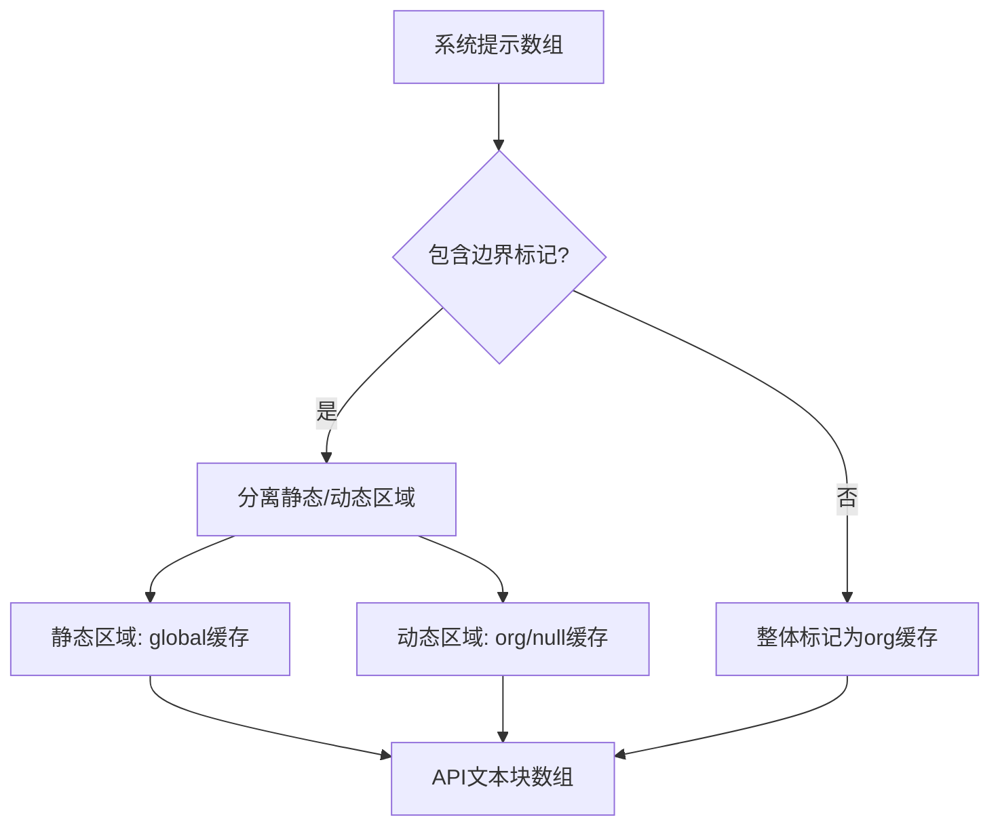
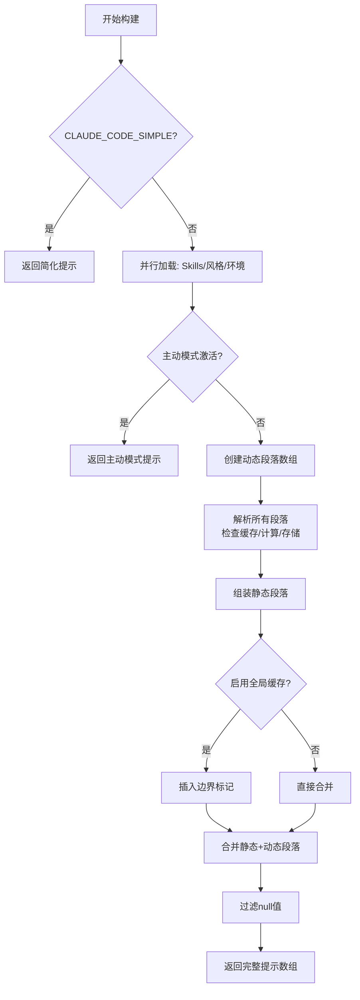

系统提示是 Claude Code 与 Claude API 交互的核心桥梁，它定义了 Agent 的身份、行为规范、工具使用策略以及环境上下文。Claude Code 采用模块化的系统提示构建机制，将庞大的指令集分解为可缓存、可组合的提示段落，既保证了上下文完整性，又通过智能缓存策略优化了 API 调用成本和响应速度。

## 核心架构：段落化系统与缓存策略

Claude Code 的系统提示构建基于**段落化架构**，每个提示段落都是一个独立的计算单元，具有明确的缓存语义。这种设计使得静态内容（如行为准则）可以跨组织缓存，而动态内容（如项目内存、MCP 指令）则按需更新。

### 系统提示段落的类型

系统提示段落分为两类：**缓存型段落**和**易变型段落**。缓存型段落通过 `systemPromptSection()` 创建，在会话期间仅计算一次，后续调用直接从缓存读取，直到执行 `/clear` 或 `/compact` 命令。易变型段落通过 `DANGEROUS_uncachedSystemPromptSection()` 创建，每次对话轮次都会重新计算，用于包含会话间可能变化的内容（如 MCP 服务器连接状态）。

```typescript
// 缓存型段落示例：项目内存（会话内稳定）
systemPromptSection('memory', () => loadMemoryPrompt())

// 易变型段落示例：MCP 指令（服务器可能随时连接/断开）
DANGEROUS_uncachedSystemPromptSection(
  'mcp_instructions',
  () => isMcpInstructionsDeltaEnabled() ? null : getMcpInstructionsSection(mcpClients),
  'MCP servers connect/disconnect between turns'
)
```

段落解析器 `resolveSystemPromptSections()` 负责协调所有段落的计算和缓存读取，它首先检查缓存状态，若命中则直接返回缓存值，否则执行计算函数并将结果存入缓存。这种机制确保了相同内容不会重复计算，特别是在启用了 Prompt Caching 时能显著降低 Token 消耗。

Sources: [systemPromptSections.ts](claude-code/src/constants/systemPromptSections.ts#L10-L58)

### 缓存边界与作用域优化

系统提示被划分为**静态区域**和**动态区域**，通过 `SYSTEM_PROMPT_DYNAMIC_BOUNDARY` 边界标记分隔。静态区域包含所有跨组织可缓存的通用指令（如工具使用规范、代码风格指南），这些内容对所有用户和会话都相同，可以使用 `global` 缓存作用域。动态区域包含用户特定、会话特定的内容（如项目路径、MCP 配置、语言偏好），这些内容只能使用 `org` 缓存作用域或不缓存。

缓存作用域的划分由 `splitSysPromptPrefix()` 函数实现，它根据边界标记将系统提示数组转换为带有缓存元数据的文本块。当全局缓存功能启用时，静态区域会被标记为 `cacheScope: 'global'`，动态区域则标记为 `cacheScope: null`（不缓存）或 `cacheScope: 'org'`（组织级缓存）。这种设计使得 API 可以在不同会话间复用静态提示的缓存，大幅降低成本。



边界标记的位置至关重要，它必须放在所有静态内容之后、所有动态内容之前。移动或删除该标记会导致缓存策略失效，因为原本可以全局缓存的内容会被迫降级为组织级缓存或完全不缓存，增加 API 调用成本。

Sources: [prompts.ts](claude-code/src/constants/prompts.ts#L106-L115), [api.ts](claude-code/src/utils/api.ts#L321-L400)

## 系统提示的组成结构

Claude Code 的系统提示由多个功能明确的段落组成，每个段落负责特定的行为指导或上下文注入。这种模块化设计使得提示内容易于维护和扩展，同时通过条件编译（Dead Code Elimination）移除未启用的功能模块。

### 静态指令段落

静态指令段落构成了系统提示的基础框架，它们定义了 Agent 的核心行为模式、工具使用规范和沟通风格。这些段落包括：

**身份与角色定义**：通过 `getSimpleIntroSection()` 定义 Agent 的基本身份——一个交互式助手，专门协助软件工程任务。该段落会根据是否配置了输出风格（Output Style）调整角色描述，如果没有配置输出风格，则默认定位为"帮助软件工程任务"。

**系统行为规范**：通过 `getSimpleSystemSection()` 定义工具执行、权限提示、系统提醒等基础行为。该段落强调了工具结果中可能包含 `<system-reminder>` 标签，这些标签提供有用的上下文信息，但与具体的工具调用结果无直接关联。同时说明了对话具有无限上下文能力，通过自动压缩机制突破 Token 限制。

**任务执行指南**：通过 `getSimpleDoingTasksSection()` 提供详细的任务执行指导，包括代码风格偏好（不过度设计、不添加不必要的抽象）、错误处理策略、安全考虑（避免 OWASP Top 10 漏洞）等。对于 Anthropic 内部用户（`USER_TYPE === 'ant'`），还会包含额外的代码注释指南和验证要求，例如默认不写注释、报告任务完成前必须验证功能是否真正工作。

**工具使用策略**：通过 `getUsingYourToolsSection()` 指导工具选择和调用模式。该段落明确指出应优先使用专用工具（如 `FileReadTool`、`FileEditTool`）而非 Bash 命令，鼓励并行调用独立的工具以提高效率，并介绍了任务管理工具（`TaskCreateTool`、`TodoWriteTool`）的使用场景。对于启用了 REPL 模式的场景，工具使用指导会简化，因为 REPL 有自己的提示系统。

**沟通风格指南**：通过 `getOutputEfficiencySection()` 和 `getSimpleToneAndStyleSection()` 定义输出风格。对于 Anthropic 内部用户，强调流畅的自然语言表达、完整的句子结构、避免不必要的符号和表格，重点是读者理解而非简洁性。对于外部用户，则强调简洁直接、直奔主题、避免冗余。两个版本都要求工具调用前不要使用冒号（如"让我读取文件:"应改为"让我读取文件。"）。

Sources: [prompts.ts](claude-code/src/constants/prompts.ts#L175-L442)

### 动态上下文段落

动态上下文段落注入会话特定的信息，这些内容在会话期间可能发生变化，或者不同用户/项目有不同的配置。动态段落通过缓存系统管理，避免不必要的重复计算。

**会话特定指导**：通过 `getSessionSpecificGuidanceSection()` 提供基于当前会话状态的指导，包括是否启用了 `AskUserQuestionTool`（用于询问用户拒绝工具调用的原因）、是否为非交互式会话（影响 Shell 命令建议）、Agent 工具使用策略（fork 模式 vs subagent 模式）、Skills 技能调用说明等。该段落根据启用的工具集动态生成内容，未启用的功能会被过滤掉。

**项目内存系统**：通过 `loadMemoryPrompt()` 加载项目的持久化记忆系统。Claude Code 支持基于文件的内存系统，存储在 `~/.claude/projects/<slug>/memory/` 目录下。内存系统包含四种类型：用户偏好、反馈记录、项目知识和参考资料。内存系统使用 `MEMORY.md` 作为索引文件（限制 200 行、25KB），每个内存条目存储在独立的 Markdown 文件中，包含 frontmatter 元数据（name、description、type）。内存指导段落会说明如何读写内存、何时使用内存而非计划或任务、以及如何搜索过去的上下文。

**环境信息**：通过 `computeSimpleEnvInfo()` 注入运行时环境信息，包括当前工作目录、是否为 Git 仓库、是否在 Git Worktree 中、平台类型（Windows/macOS/Linux）、Shell 类型、操作系统版本、当前模型名称和知识截止日期、最新模型家族信息等。对于 Git Worktree 场景，会特别说明这是仓库的隔离副本，所有命令应从该目录执行，不要 `cd` 到原始仓库根目录。

**MCP 服务器指令**：通过 `getMcpInstructionsSection()` 加载已连接 MCP 服务器的使用说明。每个 MCP 服务器可以提供 `instructions` 字段，指导如何使用其提供的工具和资源。该段落仅在至少一个 MCP 服务器提供了指令时才包含。当启用了 MCP 指令增量更新功能（`isMcpInstructionsDeltaEnabled()`）时，该段落会被省略，改为通过附件机制注入。

**语言偏好**：通过 `getLanguageSection()` 设置响应语言。如果用户配置了语言偏好（如中文），系统提示会要求 Agent 始终使用该语言进行所有解释、注释和用户交流，技术术语和代码标识符保持原样。

**输出风格**：通过 `getOutputStyleSection()` 加载自定义的输出风格配置。输出风格允许用户定义特定的响应格式和内容偏好，通过 `outputStyles.ts` 管理。

Sources: [prompts.ts](claude-code/src/constants/prompts.ts#L444-L577), [memdir.ts](claude-code/src/memdir/memdir.ts#L419-L450)

### 特殊模式段落

特殊模式段落根据功能开关（Feature Flags）动态加载，这些段落仅在特定功能启用时才会包含在系统提示中。

**主动模式**：当 `PROACTIVE` 或 `KAIROS` 功能启用且主动模式激活时，系统提示会大幅简化，移除大部分任务执行指导，转而强调 Agent 作为自主执行者的角色。该模式下，内存系统、MCP 指令、Scratchpad 说明等段落仍会保留，但整体指令更加简洁，给予 Agent 更大的自主决策空间。

**Token 预算管理**：当 `TOKEN_BUDGET` 功能启用时，系统提示会包含 Token 预算指导段落，说明当用户指定了 Token 目标（如"+500k"、"spend 2M tokens"）时，Agent 应持续工作直到接近目标，并会看到每轮的输出 Token 计数。该指导强调目标是最小值而非建议，Agent 应规划工作以高效利用预算。

**数字长度锚点**：对于 Anthropic 内部用户，系统提示包含数字化的长度限制指导，如"工具调用之间的文本保持≤25 字"、"最终响应保持≤100 字"，研究表明这种数字化指导比定性描述（如"简洁"）能减少约 1.2% 的输出 Token。

**验证 Agent**：当 `VERIFICATION_AGENT` 功能和 `tengu_hive_evidence` 特性标志启用时，系统提示会要求 Agent 在报告非平凡实现任务完成前，必须进行独立的对抗性验证，无论实现是由 Agent 直接完成、由 fork 完成、还是由 subagent 完成。Agent 作为向用户报告的一方，对验证负责。

Sources: [prompts.ts](claude-code/src/constants/prompts.ts#L466-L555)

## 系统提示的构建流程

系统提示的构建是一个异步流程，涉及多个数据源的并行加载和条件判断。主构建函数 `getSystemPrompt()` 接受工具集、模型 ID、额外工作目录和 MCP 客户端列表作为参数，返回一个字符串数组（每个元素是一个提示段落）。

### 构建步骤

**步骤 1：环境简化检查**。如果设置了 `CLAUDE_CODE_SIMPLE` 环境变量，系统提示会极度简化，仅包含基本身份信息、当前工作目录和会话开始日期，跳过所有复杂的指导和上下文注入。这用于调试或特殊场景。

**步骤 2：并行加载基础数据**。系统会并行加载三个关键数据源：Skill 工具命令列表（通过 `getSkillToolCommands()` 从项目目录扫描）、输出风格配置（通过 `getOutputStyleConfig()` 加载用户自定义风格）、环境信息（通过 `computeSimpleEnvInfo()` 计算运行时环境）。并行加载优化了启动速度。

**步骤 3：判断会话类型**。如果是主动模式（Proactive/Kairos 激活），系统提示会走简化路径，仅包含核心指令和必要上下文。否则，进入完整的标准构建流程。

**步骤 4：组装动态段落**。标准流程中，系统会创建一个动态段落数组，每个段落都是一个 `SystemPromptSection` 对象。这些段落包括会话指导、内存系统、环境信息、语言偏好、输出风格、MCP 指令、Scratchpad 说明、函数结果清理、工具结果摘要、数字长度锚点（仅内部用户）、Token 预算指导（仅启用时）等。所有段落通过 `resolveSystemPromptSections()` 解析，该函数会检查缓存、执行计算、存储结果。

**步骤 5：组装完整提示**。将静态段落（身份、系统行为、任务执行、工具使用、沟通风格）和动态段落（已解析的结果）合并为一个数组。如果启用了全局缓存作用域，会在静态和动态段落之间插入 `SYSTEM_PROMPT_DYNAMIC_BOUNDARY` 边界标记。最终过滤掉所有 `null` 值（某些段落可能条件不满足而返回 `null`），返回有效的字符串数组。



Sources: [prompts.ts](claude-code/src/constants/prompts.ts#L444-L577)

## API 层的提示转换

系统提示字符串数组需要转换为 Claude API 接受的格式，这一过程由 `buildSystemPromptBlocks()` 函数完成。该函数接受系统提示数组、是否启用 Prompt Caching 标志和可选的查询源信息，返回一个 `TextBlockParam[]` 数组，每个文本块可以携带缓存控制元数据。

### 转换过程

`buildSystemPromptBlocks()` 内部调用 `splitSysPromptPrefix()` 执行实际的分割和缓存标记逻辑。分割函数会遍历系统提示数组，识别特殊块（如归属头、CLI 前缀、边界标记），并根据缓存策略将内容分组为带有 `cacheScope` 的文本块。

**全局缓存模式**：当全局缓存功能启用且未设置 `skipGlobalCacheForSystemPrompt` 时，分割函数会根据边界标记将提示分为静态块和动态块。静态块标记为 `cacheScope: 'global'`，可以在不同组织和会话间复用缓存。动态块标记为 `cacheScope: null`（不缓存）或根据配置使用其他作用域。归属头和 CLI 前缀通常不缓存或使用 `org` 作用域。

**组织缓存模式**：当设置了 `skipGlobalCacheForSystemPrompt` 标志时，分割函数会跳过全局缓存，将所有内容（过滤掉边界标记后）标记为 `cacheScope: 'org'`，这意味着缓存只能在同一组织内复用。这种模式用于特定场景，如工具级缓存策略。

转换后的文本块数组会被直接传递给 Claude API 的 `system` 参数。API 会根据 `cache_control` 字段决定是否使用缓存、使用哪个作用域的缓存，并在响应中返回缓存命中情况和 Token 节省量。

Sources: [claude.ts](claude-code/src/services/api/claude.ts#L3200-L3224), [api.ts](claude-code/src/utils/api.ts#L321-L400)

## 缓存优化的最佳实践

系统提示构建机制的设计充分考虑了 Prompt Caching 的优化需求，开发者在扩展或修改系统提示时应遵循以下最佳实践，以避免缓存失效和成本增加。

### 段落设计原则

**优先使用缓存型段落**。除非内容确实在会话间会变化，否则应使用 `systemPromptSection()` 创建段落，这样内容会在首次计算后缓存，后续轮次直接复用。易变型段落（`DANGEROUS_uncachedSystemPromptSection()`）会破坏提示缓存，导致每轮对话都需要重新传输系统提示，增加 Token 消耗和延迟。

**将动态内容移到边界后**。所有包含用户特定、会话特定、运行时特定内容的段落都应放在 `SYSTEM_PROMPT_DYNAMIC_BOUNDARY` 之后，这样静态内容可以享受全局缓存，动态内容使用组织级缓存或不缓存。如果在边界前放置动态内容（如用户 ID、时间戳），会导致全局缓存失效，每个用户/会话都会有不同的缓存键。

**避免在静态段落下使用运行时判断**。静态段落中的条件判断如果依赖于运行时状态（如特性标志、用户类型、会话模式），会导致缓存碎片化。例如，如果静态段落中包含 `if (getIsNonInteractiveSession()) { ... }`，那么交互式会话和非交互式会话会有不同的静态提示，无法共享全局缓存。应将这类判断移到动态段落中。

### 缓存失效的场景

**执行 `/clear` 或 `/compact` 命令**。这两个命令会调用 `clearSystemPromptSections()`，清空所有段落的缓存状态，下轮对话会重新计算所有段落。这是设计预期行为，用于强制刷新上下文。

**MCP 服务器连接状态变化**。默认情况下，MCP 指令段落使用易变型段落，每次轮次都会重新计算。当启用了 MCP 指令增量更新功能（`isMcpInstructionsDeltaEnabled()`）时，MCP 指令通过附件机制注入，系统提示中的 MCP 段落会被省略，避免缓存失效。

**特性标志翻转**。如果某个段落的包含条件依赖于特性标志（如 `feature('TOKEN_BUDGET')`），特性标志的启用或禁用会导致缓存失效。因此特性标志的判断应在构建时（而非运行时）进行，或者将受影响的段落放在动态区域。

Sources: [systemPromptSections.ts](claude-code/src/constants/systemPromptSections.ts#L60-L68), [prompts.ts](claude-code/src/constants/prompts.ts#L345-L400)

## 内存系统集成

项目内存系统是系统提示的重要组成部分，它允许 Claude Code 持久化用户偏好、项目知识和反馈记录，跨会话复用。内存系统通过 `loadMemoryPrompt()` 函数加载，该函数会检查内存功能是否启用、构建内存指导段落、并确保内存目录存在。

### 内存系统的结构

内存系统基于文件系统，存储在 `~/.claude/projects/<project-slug>/memory/` 目录下。核心文件是 `MEMORY.md`，作为内存索引，每个条目是一行链接和简短描述（如 `- [用户角色](user_role.md) — 定义用户在项目中的职责`）。`MEMORY.md` 限制为 200 行和 25KB，超出部分会被截断并显示警告。每个内存条目存储在独立的 Markdown 文件中，包含 YAML frontmatter（name、description、type 字段）和详细内容。

内存分为四种类型：**用户偏好**（user）记录用户的角色、偏好、沟通风格；**反馈记录**（feedback）记录用户对 Agent 行为的反馈、应避免或重复的行为；**项目知识**（project）记录项目的架构决策、技术栈、约束条件；**参考资料**（reference）记录外部文档链接、API 参考、工具文档。

### 内存加载流程

`loadMemoryPrompt()` 首先检查自动内存功能是否启用（`isAutoMemoryEnabled()`），然后根据功能标志决定是否跳过索引文件（`skipIndex` 模式下内存条目直接通过文件系统访问，不使用 `MEMORY.md`）。对于 Kairos 主动模式，会使用简化的日志式内存提示。对于团队内存功能（TEAMMEM），会加载团队共享内存和个人内存两部分。

内存指导段落会说明内存目录的位置、四种内存类型的定义、如何写入内存（创建文件、更新索引）、何时访问内存（用户明确要求、遇到相似场景、启动新对话时）、以及内存与其他持久化机制（计划、任务）的区别。指导强调内存用于跨会话复用的信息，而非当前会话的临时状态。

内存目录的创建通过 `ensureMemoryDirExists()` 完成，该函数在内存提示加载时调用一次（通过缓存机制确保只调用一次），使用递归 `mkdir` 创建完整的父目录链，并优雅处理目录已存在的情况。这样 Agent 在写入内存时可以直接使用 `FileWriteTool`，无需先检查或创建目录。

Sources: [memdir.ts](claude-code/src/memdir/memdir.ts#L199-L266), [memdir.ts](claude-code/src/memdir/memdir.ts#L419-L450)

## 子 Agent 的提示增强

子 Agent（Subagent，通过 `AgentTool` 创建）有自己的系统提示构建逻辑，通过 `enhanceSystemPromptWithEnvDetails()` 函数实现。子 Agent 的系统提示基于主会话的提示，但会追加额外的指导段落，以适应子 Agent 的执行环境。

### 子 Agent 提示的组成

子 Agent 提示包含基础提示（传入的 `existingSystemPrompt`）、Agent 特定注意事项（如始终使用绝对路径、在最终响应中分享相关文件路径、避免使用 emoji、工具调用前不使用冒号）、DiscoverSkills 指导（如果启用）、以及环境信息（工作目录、Git 状态、平台、模型等）。

子 Agent 不会通过主会话的 `getSystemPrompt()` 流程，因此某些动态段落（如 DiscoverSkills 指导）需要在 `enhanceSystemPromptWithEnvDetails()` 中显式添加。该函数接受可选的 `enabledToolNames` 参数，用于判断是否应包含 DiscoverSkills 指导（当调用者未提供该参数时，默认包含，保持向后兼容）。

子 Agent 的提示构建强调独立性：子 Agent 有自己的工作目录上下文、自己的工具集、自己的执行环境。提示中会明确说明 Agent 线程的 Bash 调用会重置工作目录，因此必须使用绝对路径。最终响应应包含相关文件的绝对路径和关键代码片段，但不要大段复述只是读取过的代码。

Sources: [prompts.ts](claude-code/src/constants/prompts.ts#L760-L791)

## 总结

Claude Code 的系统提示构建机制是一个精心设计的多层次系统，平衡了功能性、性能和成本。通过段落化架构、智能缓存策略、静态/动态分离，系统提示既提供了丰富的上下文和行为指导，又最小化了 API 调用开销。理解这一机制对于扩展 Claude Code 功能、优化性能、调试上下文问题至关重要。开发者在修改系统提示时应遵循缓存优化原则，避免破坏缓存、增加成本。内存系统为跨会话的知识持久化提供了强大支持，是 Claude Code 智能化的重要基石。子 Agent 的提示增强机制确保了分布式任务执行的一致性和独立性。