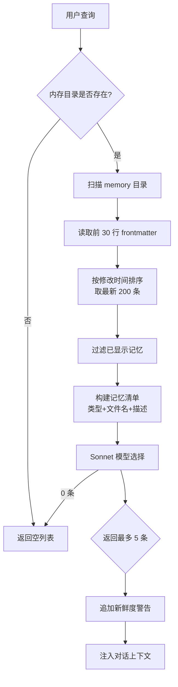
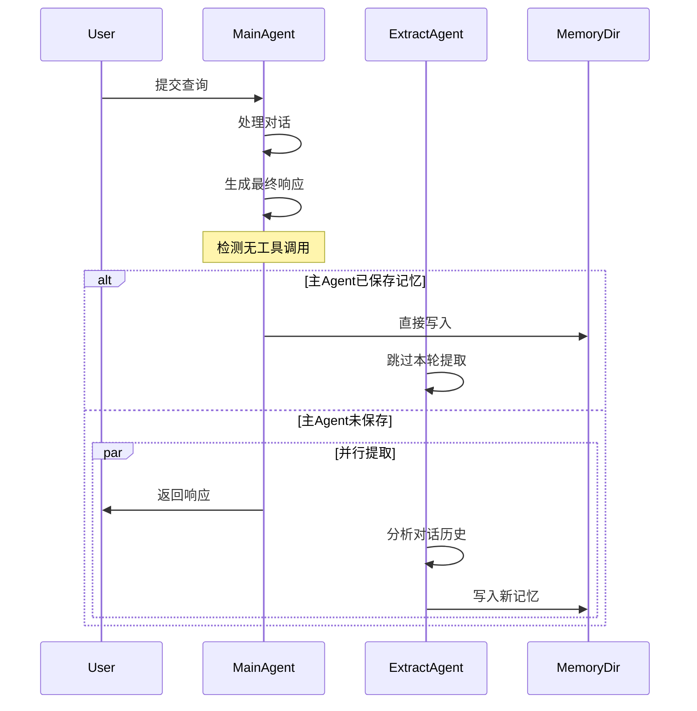
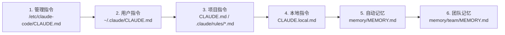

Claude Code 的内存系统是一个**文件驱动的持久化知识库**，通过严格的类型分类和智能检索机制，在跨对话场景中维护用户偏好、项目上下文和工作指导。系统采用**四类型封闭分类法**（user / feedback / project / reference），明确排除可从代码库推导的信息，确保内存存储的是真正的**隐性知识**而非冗余的代码状态。核心架构包括：基于 Markdown 的文件存储（`~/.claude/projects/<slug>/memory/`）、Sonnet 模型驱动的相关性检索（最多 5 个记忆）、后台 Forked Agent 的自动提取机制，以及团队与个人双层作用域管理，形成了一个**自组织、自更新、自验证**的知识生态系统。

Sources: [memoryTypes.ts](claude-code/src/memdir/memoryTypes.ts#L1-L52), [memdir.ts](claude-code/src/memdir/memdir.ts#L1-L50), [paths.ts](claude-code/src/memdir/paths.ts#L1-L75)

---

## 内存类型分类系统

系统采用**封闭分类法**，仅允许四种预定义的记忆类型，每种类型都有明确的存储范围、使用场景和结构规范。这种设计避免了模糊的分类边界，防止系统存储可通过代码库、Git 历史或项目文件推导的冗余信息。

### 四种核心类型

| 类型 | 作用域默认值 | 存储内容 | 何时保存 | 使用场景 |
|------|------------|---------|---------|---------|
| **user** | 始终 private | 用户角色、目标、责任、知识背景 | 学习到用户的角色、偏好、责任或知识时 | 解释代码时需适配用户视角，如 Go 专家首次接触 React |
| **feedback** | 默认 private，团队约定用 team | 工作指导（避免/保持）、纠正与确认 | 用户纠正（"不要那样"）或确认非显而易见的方案时 | 指导未来行为，避免重复指导 |
| **project** | 倾向 team | 进行中的工作、目标、事件、截止日期 | 学习到谁在做什么、为什么、何时完成时 | 理解请求背景、预判协调问题、提供明智建议 |
| **reference** | 通常 team | 外部系统指针（Linear、Slack、Grafana） | 学习到外部系统资源位置时 | 用户引用外部系统或需要查找外部信息时 |

### 严格的排除规则

系统明确禁止存储以下类型的信息，即使**用户显式要求**保存：

- **代码模式与约定**：可从当前项目状态推导（通过 `grep`、`git`、代码阅读）
- **Git 历史**：`git log` / `git blame` 是权威来源
- **调试解决方案**：修复已在代码中，上下文在提交消息中
- **已文档化内容**：`CLAUDE.md` 已覆盖的内容
- **临时任务细节**：进行中的工作、临时状态、当前对话上下文

**防护机制**：当用户要求保存 PR 列表或活动摘要时，系统会询问**令人惊讶或非显而易见的部分**，而非盲目执行保存操作。

Sources: [memoryTypes.ts](claude-code/src/memdir/memoryTypes.ts#L54-L122), [memoryTypes.ts](claude-code/src/memdir/memoryTypes.ts#L196-L220)

---

## 存储架构与目录结构

内存系统采用**两层文件结构**：索引文件（`MEMORY.md`）和独立记忆文件（`*.md`）。每个记忆是独立的 Markdown 文件，带有 YAML frontmatter 元数据，通过索引文件组织为可浏览的知识目录。

### 目录布局

```
~/.claude/
├── projects/
│   └── <sanitized-project-path>/
│       └── memory/                    # 个人记忆根目录
│           ├── MEMORY.md              # 个人索引（最多 200 行 / 25KB）
│           ├── user_role.md           # 记忆文件示例
│           ├── feedback_testing.md
│           ├── project_merge_freeze.md
│           └── team/                  # 团队记忆子目录（可选）
│               ├── MEMORY.md          # 团队索引
│               ├── reference_linear.md
│               └── feedback_code_style.md
```

### 索引文件规范

`MEMORY.md` 是**纯文本索引**，无 frontmatter，每条记录一行，格式为：

```markdown
- [用户角色](user_role.md) — 数据科学家，关注可观测性/日志
- [测试指导](feedback_testing.md) — 集成测试必须使用真实数据库
- [合并冻结](project_merge_freeze.md) — 2026-03-05 起禁止非关键合并
```

**容量限制**：
- **行数上限**：200 行（超出部分被截断）
- **字节上限**：25 KB（防止长行索引绕过行数限制）
- **单条建议长度**：~150 字符（保持索引可浏览性）

**截断策略**：当超出任一限制时，系统在索引末尾追加警告，说明触发的限制类型和当前大小，引导用户将详细信息移至主题文件。

Sources: [memdir.ts](claude-code/src/memdir/memdir.ts#L25-L80), [paths.ts](claude-code/src/memdir/paths.ts#L77-L150), [teamMemPaths.ts](claude-code/src/memdir/teamMemPaths.ts#L46-L80)

---

## 记忆文件格式与 Frontmatter

每个记忆文件是独立的 Markdown 文档，包含三部分：YAML frontmatter 元数据、标题、正文内容。Frontmatter 提供结构化元信息，正文采用**规则-原因-应用**三层结构，确保记忆的可解释性和可迁移性。

### 标准格式

```markdown
---
name: 集成测试指导
description: 集成测试必须使用真实数据库而非 mock
type: feedback
---

# 集成测试指导

**Rule:** 集成测试必须连接真实数据库，禁止使用 mock

**Why:** 上季度发生 mock 测试通过但生产迁移失败的事故，原因是 mock/生产环境差异掩盖了损坏的迁移脚本

**How to apply:** 所有涉及数据库 schema 变更的测试必须在真实的测试数据库上执行
```

### Frontmatter 字段

| 字段 | 必填 | 说明 | 示例 |
|------|------|------|------|
| `name` | ✓ | 记忆标题（简短描述） | `集成测试指导` |
| `description` | ✓ | 一句话摘要（用于检索提示） | `集成测试必须使用真实数据库而非 mock` |
| `type` | ✓ | 四种类型之一 | `user` / `feedback` / `project` / `reference` |

### 正文结构最佳实践

**Feedback / Project 类型推荐结构**：
1. **规则本身**（Rule / Fact）：清晰陈述指导或事实
2. **原因**（Why）：动机解释（通常是约束、截止日期、利益相关者需求）
3. **应用方式**（How to apply）：该指导何时何地生效

这种结构让未来的 Agent 能够**判断边缘情况**而非盲目遵循规则，特别是在记忆老化（如项目状态改变）时，原因信息帮助判断记忆是否仍然有效。

Sources: [memoryTypes.ts](claude-code/src/memdir/memoryTypes.ts#L124-L194)

---

## 检索机制：相关性发现流程

当用户查询可能涉及历史记忆时，系统启动**三阶段检索流程**：扫描 → 选择 → 注入。该流程通过 Sonnet 模型的语义理解能力，从可能数百条记忆中精准选择最相关的 5 条，避免上下文污染和 token 浪费。



### 核心实现细节

**扫描阶段**（`scanMemoryFiles`）：
- 递归扫描 `memory/` 目录，排除 `MEMORY.md`
- 并发读取所有 `.md` 文件的前 30 行（frontmatter 通常在前几行）
- 提取 `description`、`type`、`mtimeMs` 元数据
- 按修改时间降序排序，取最新 200 条（防止目录爆炸）

**选择阶段**（`selectRelevantMemories`）：
- 使用 **Sonnet 3.5** 模型（平衡成本与效果）
- 输入：用户查询 + 记忆清单（格式：`[type] filename (timestamp): description`）
- 输出：JSON 数组，最多 5 个文件名
- **特殊逻辑**：过滤"近期使用的工具"的参考文档记忆（避免重复信息）

**新鲜度标记**：
- 超过 1 天的记忆追加警告：`This memory is X days old. Verify against current code before asserting as fact.`
- 今天/昨天的记忆不追加警告（减少噪音）
- 目的：防止记忆中的代码引用（file:line）过时被当作事实

Sources: [findRelevantMemories.ts](claude-code/src/memdir/findRelevantMemories.ts#L1-L142), [memoryScan.ts](claude-code/src/memdir/memoryScan.ts#L1-L95), [memoryAge.ts](claude-code/src/memdir/memoryAge.ts#L1-L54)

---

## 自动提取机制：Forked Agent 模式

系统在每个完整查询循环结束时（模型产生最终响应且无工具调用），启动**后台 Forked Agent** 从对话中提取持久记忆。该 Agent 是主对话的**完美分支**，共享 prompt cache，但具有独立的工具权限限制。



### Forked Agent 特性

**共享资源**：
- 主对话的完整历史（包括用户消息、工具调用、响应）
- 系统提示和工具列表（保持 cache 键一致）
- 项目上下文和工作目录

**独立限制**：
- **文件写入**：仅允许写入 `memory/` 目录
- **Bash 命令**：仅允许只读命令（`isReadOnly` 检查）
- **工具集**：Read/Grep/Glob 无限制，Write/Edit 限路径，REPL 允许（内部操作重新触发权限检查）

**互斥机制**：
- 如果主 Agent 在本轮对话中已写入记忆，提取 Agent 检测到 `hasMemoryWritesSince` 标志，**自动跳过**
- 提取 Agent 的 cursor 推进到主 Agent 最后一条消息，避免重复处理
- 设计目标：**主 Agent 优先，后台 Agent 补充**

### 提取触发条件

1. **功能开关**：`feature('EXTRACT_MEMORIES')` 为 true
2. **交互模式**：非交互会话或 `tengu_slate_thimble` 功能开启
3. **内存启用**：`isAutoMemoryEnabled()` 返回 true
4. **消息阈值**：自上次提取后至少有 6 条模型可见消息
5. **非远程模式**：或远程模式下显式启用提取

Sources: [extractMemories.ts](claude-code/src/services/extractMemories/extractMemories.ts#L1-L200), [extractMemories.ts](claude-code/src/services/extractMemories/extractMemories.ts#L240-L350)

---

## 团队与个人双层作用域

当启用团队记忆功能时（`feature('TEAMMEM')`），内存系统维护两个独立但协同的目录：**个人目录**（`memory/`）和**团队目录**（`memory/team/`）。两者使用相同的四类型分类，但在 `<scope>` 标签中明确区分共享范围。

### 作用域决策矩阵

| 记忆类型 | 推荐作用域 | 决策标准 |
|---------|-----------|---------|
| **user** | 始终 private | 个人偏好、知识背景、隐私信息 |
| **feedback** | 默认 private<br/>项目约定用 team | 个人风格偏好 → private<br/>测试策略、构建规范 → team |
| **project** | 倾向 team | 跨团队成员协调、截止日期、依赖关系 |
| **reference** | 通常 team | 外部系统位置、监控面板、缺陷跟踪 |

### 安全防护

**路径遍历防护**（`sanitizePathKey`）：
- 检测空字节（`\0`）：防止 C syscall 截断
- 检测 URL 编码遍历（`%2e%2e%2f` = `../`）
- 检测 Unicode 规范化攻击（全宽字符 `．．／` → `../`）
- 拒绝反斜杠（Windows 路径分隔符）
- 拒绝绝对路径

**符号链接解析**（`realpathDeepestExisting`）：
- 对最深存在的祖先目录调用 `realpath()`，解析所有符号链接
- 检测悬空符号链接（链接存在但目标不存在）
- 检测符号链接循环（`ELOOP` 错误）
- 比较规范化的文件系统位置，而非字符串路径

**权限边界**：
- 项目级设置（`.claude/settings.json`）**不可覆盖** `autoMemoryDirectory`（防止恶意仓库重定向到敏感目录）
- 仅用户级、本地级、策略级、标志级设置生效
- 环境变量 `CLAUDE_COWORK_MEMORY_PATH_OVERRIDE` 仅接受绝对路径，不支持 `~` 展开

Sources: [teamMemPaths.ts](claude-code/src/memdir/teamMemPaths.ts#L22-L100), [teamMemPrompts.ts](claude-code/src/memdir/teamMemPrompts.ts#L1-L101), [paths.ts](claude-code/src/memdir/paths.ts#L152-L220)

---

## 与上下文系统的集成

内存系统是 Claude Code 上下文工程的**核心组件**，与指令文件（`CLAUDE.md`）、计划、任务系统协同工作，形成分层持久化策略。系统在启动时按优先级加载多个来源的指令，内存作为**动态层**补充静态指令文件。

### 指令加载优先级



**加载顺序**：从低优先级到高优先级，后加载的文件**覆盖**冲突内容，模型更关注后加载的指令。

### 内存 vs 其他持久化机制

| 机制 | 作用域 | 生命周期 | 何时使用 |
|------|--------|---------|---------|
| **Memory** | 跨对话 | 永久 | 用户偏好、项目背景、工作指导、外部系统指针 |
| **Plan** | 当前对话 | 任务完成 | 非平凡实现的方案对齐，包含多个步骤的架构设计 |
| **Tasks** | 当前对话 | 任务完成 | 当前工作的步骤追踪、进度管理、待办事项 |
| **CLAUDE.md** | 项目级 | 永久 | 代码约定、架构说明、静态项目知识 |

**决策原则**：
- 仅在当前对话有用的信息 → 不用内存
- 需要跨对话记住的信息 → 用内存
- 进行中的实现方案 → 用 Plan
- 当前工作的任务列表 → 用 Tasks

Sources: [claudemd.ts](claude-code/src/utils/claudemd.ts#L1-L75), [memdir.ts](claude-code/src/memdir/memdir.ts#L202-L280)

---

## Token 预算与衰减检测

内存系统与 Token 预算管理器紧密集成，监控对话的 token 消耗模式，在**收益递减**时主动终止查询循环，避免浪费计算资源和用户等待时间。

### 预算跟踪机制

**BudgetTracker 状态**：
- `continuationCount`：连续续接次数
- `lastDeltaTokens`：上次检查的 token 增量
- `lastGlobalTurnTokens`：全局轮次 token 总数
- `startedAt`：跟踪开始时间戳

**决策逻辑**（`checkTokenBudget`）：
1. **子 Agent 或无预算**：立即停止
2. **未达 90% 预算**：继续，追加推动消息
3. **达到 90% 预算**：检查衰减模式
4. **衰减模式**（连续 3 次续接，每次增量 < 500 tokens）：停止并记录完成事件

### 衰减检测标准

```typescript
const isDiminishing =
  tracker.continuationCount >= 3 &&
  deltaSinceLastCheck < 500 &&
  tracker.lastDeltaTokens < 500
```

**含义**：Agent 连续 3 次续接后，如果每次仅产生少于 500 tokens 的进展，系统判定进入"收益递减"状态，主动终止循环。

**完成事件记录**：
- `continuationCount`：续接次数
- `pct`：预算使用百分比
- `turnTokens`：轮次 token 数
- `budget`：总预算
- `diminishingReturns`：是否因衰减而停止
- `durationMs`：总耗时

Sources: [tokenBudget.ts](claude-code/src/query/tokenBudget.ts#L1-L94)

---

## 记忆文件检测与权限

系统通过多层检测机制区分**自动管理的内存文件**和**用户管理的指令文件**，为 UI 展示（差异折叠、徽章显示）和权限控制提供基础。

### 文件类型分类

| 文件类型 | 路径模式 | 用途 | UI 行为 |
|---------|---------|------|---------|
| **个人记忆** | `~/.claude/projects/<slug>/memory/*.md` | 自动记忆 | 差异折叠 |
| **团队记忆** | `memory/team/*.md` | 共享记忆 | 差异折叠 |
| **Agent 记忆** | `*/agent-memory/*.md` | 子 Agent 记忆 | 差异折叠 |
| **会话记忆** | `~/.claude/session-memory/*.md` | 会话日志 | 差异折叠 |
| **会话转录** | `~/.claude/projects/*.jsonl` | 对话历史 | 差异折叠 |
| **项目指令** | `CLAUDE.md`, `.claude/rules/*.md` | 用户管理 | 完整差异 |
| **本地指令** | `CLAUDE.local.md` | 用户管理 | 完整差异 |

### 检测函数层次

```typescript
// 1. 顶层检测：自动管理 vs 用户管理
isAutoManagedMemoryFile(filePath)

// 2. 作用域检测：team vs personal
memoryScopeForPath(filePath) → 'team' | 'personal' | null

// 3. 目录检测：Grep/Glob 工具
isMemoryDirectory(dirPath)

// 4. 会话文件检测
detectSessionFileType(filePath) → 'session_memory' | 'session_transcript' | null
```

**平台适配**：
- Windows：路径比较时小写化（文件系统不区分大小写）
- MinGW：`/c/...` 路径转换为原生路径后检测
- 符号链接：规范化后比较，防止绕过

Sources: [memoryFileDetection.ts](claude-code/src/utils/memoryFileDetection.ts#L1-L150)

---

## 配置与开关

内存系统的行为可通过**环境变量**和**设置文件**精细控制，支持项目级、用户级、全局级的多层配置覆盖。

### 功能开关

| 环境变量 | 作用 | 默认值 |
|---------|------|--------|
| `CLAUDE_CODE_DISABLE_AUTO_MEMORY` | 禁用自动记忆（1/true → OFF, 0/false → ON） | 未设置（启用） |
| `CLAUDE_CODE_SIMPLE` | `--bare` 模式，禁用内存提示 | 未设置 |
| `CLAUDE_CODE_REMOTE_MEMORY_DIR` | 远程模式下的内存目录覆盖 | 未设置 |
| `CLAUDE_COWORK_MEMORY_PATH_OVERRIDE` | Cowork 模式下的完整内存路径覆盖 | 未设置 |

### 设置文件选项

```json
// ~/.claude/settings.json 或 .claude/settings.json
{
  "autoMemoryEnabled": true,           // 全局开关
  "autoMemoryDirectory": "~/.claude/custom-memory"  // 自定义目录（支持 ~ 展开）
}
```

**设置来源优先级**（从高到低）：
1. `CLAUDE_CODE_DISABLE_AUTO_MEMORY` 环境变量
2. `CLAUDE_CODE_SIMPLE` 环境变量
3. 远程模式检查（无 `CLAUDE_CODE_REMOTE_MEMORY_DIR` 时禁用）
4. `policySettings`（管理员策略）
5. `flagSettings`（功能标志）
6. `localSettings`（项目级 `.claude/settings.json`）
7. `userSettings`（用户级 `~/.claude/settings.json`）
8. 默认启用

**安全限制**：项目级设置（`.claude/settings.json`）**不可设置** `autoMemoryDirectory`，防止恶意仓库重定向到敏感目录。

Sources: [paths.ts](claude-code/src/memdir/paths.ts#L17-L75), [memory.tsx](claude-code/src/commands/memory/memory.tsx#L1-L90)

---

## 典型使用场景

### 场景 1：新项目入职

**用户**：`我是数据科学家，第一次接触这个 React 项目，之前主要用 Python`  
**系统行为**：
1. **立即保存** user 记忆：`user_data_scientist.md`
   ```yaml
   type: user
   description: 用户是数据科学家，React 新手，Python 背景
   ```
2. **后续交互**：解释代码时自动类比 Python/数据科学概念，避免前端术语轰炸

### 场景 2：工作指导学习

**用户**：`不要在这些测试里 mock 数据库，上次被坑了`  
**系统行为**：
1. **识别为 feedback**，询问是否团队约定
2. 用户确认后保存 team 记忆：`feedback_database_testing.md`
   ```markdown
   **Rule:** 集成测试必须使用真实数据库
   **Why:** 上季度 mock/生产差异掩盖了损坏的迁移
   **How to apply:** 所有涉及 schema 的测试
   ```
3. **未来行为**：检测到类似测试场景时，自动提醒使用真实数据库

### 场景 3：项目状态追踪

**用户**：`我们在做性能优化，目标是本月底把 API 延迟降到 100ms 以下`  
**系统行为**：
1. **提取 project 记忆**：`project_performance_optimization.md`
   ```markdown
   **Fact:** 性能优化进行中，目标 2026-03-31 前降至 100ms
   **Why:** 用户体验要求，oncall 延迟告警频繁
   **How to apply:** 评估变更对延迟的影响
   ```
2. **检索触发**：用户提到"延迟"、"性能"、"优化"时自动加载
3. **新鲜度提醒**：超过 1 个月后自动追加"记忆可能过时"警告

### 场景 4：外部系统引用

**用户**：`查一下 Linear 的 INGEST 项目，那里有所有管道 bug`  
**系统行为**：
1. **保存 reference 记忆**：`reference_linear_ingest.md`
   ```yaml
   type: reference
   description: 管道 bug 跟踪在 Linear 项目 INGEST
   ```
2. **未来检索**：用户提到"bug"、"管道"、"问题"时建议查询 Linear

Sources: [memoryTypes.ts](claude-code/src/memdir/memoryTypes.ts#L58-L194)

---

## 遥测与监控

系统通过 **GrowthBook 功能标志**和**自定义遥测事件**监控内存系统的使用模式和健康状态，为产品优化提供数据支撑。

### 关键遥测事件

| 事件名称 | 触发时机 | 关键字段 |
|---------|---------|---------|
| `tengu_memdir_loaded` | 内存目录加载 | `total_file_count`, `total_subdir_count`, `line_count`, `was_truncated` |
| `tengu_memory_recall_shape` | 记忆检索完成 | `total_candidates`, `selected_count`, `selection_rate` |
| `tengu_auto_mem_tool_denied` | 工具权限拒绝 | `tool_name`, `reason` |
| `tengu_memory_freshness_warning` | 新鲜度警告触发 | `memory_age_days`, `file_path` |

### 记忆形态遥测（Memory Shape Telemetry）

**目的**：监控记忆检索的选择率和候选池大小，识别"选择噪音"问题。

**实现**：
- 记录候选池大小（通常 0-200 条）
- 记录被选中的记忆数量（0-5 条）
- 计算选择率：`selected_count / total_candidates`
- 区分"无相关记忆"（选择率 0）和"精准选择"（选择率 > 0）

**应用**：
- 识别过度保存的记忆类型
- 优化选择提示的精度
- 调整候选池大小上限

Sources: [memoryShapeTelemetry.ts](claude-code/src/memdir/memoryShapeTelemetry.ts#L1-L50)

---

## 相关页面

- **[系统提示构建](17-xi-tong-ti-shi-gou-jian)**：了解内存如何注入系统提示
- **[上下文压缩策略](19-shang-xia-wen-ya-suo-ce-lue)**：内存与其他上下文的压缩机制
- **[Token 预算管理](20-token-yu-suan-guan-li)**：预算如何影响内存加载
- **[子 Agent 机制](21-zi-agent-ji-zhi)**：Forked Agent 的实现细节
- **[工具架构与注册机制](8-gong-ju-jia-gou-yu-zhu-ce-ji-zhi)**：内存相关工具的权限控制