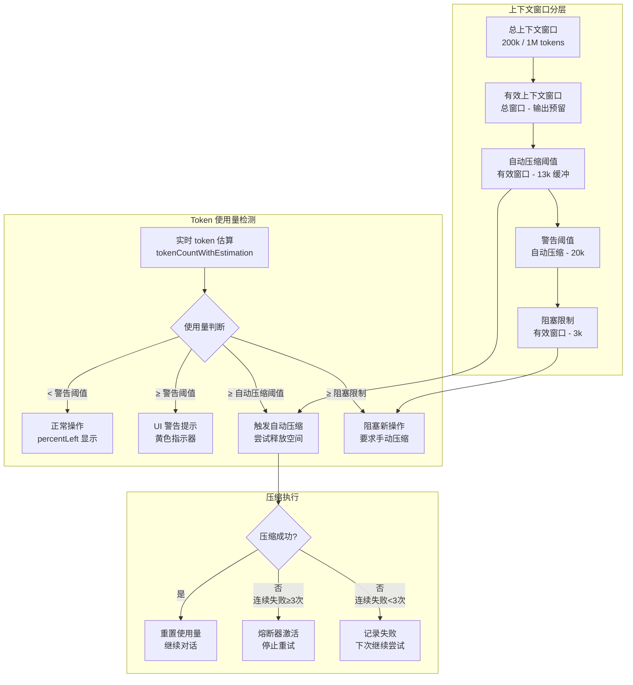
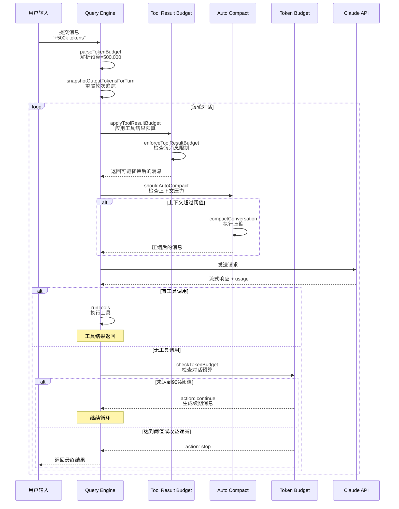

Token 预算管理是 Claude Code 上下文工程的核心机制，负责在有限的上下文窗口内高效分配和管理 token 资源。该系统通过多层级的预算控制策略，确保对话历史、工具结果和系统提示在模型上下文窗口内得到合理分配，同时通过自动压缩和内容替换等机制最大化可用上下文空间的利用效率。Token 预算管理不是单一的限制机制，而是一个动态平衡系统，在用户需求、模型能力和性能优化之间寻找最佳平衡点，确保长期对话的连续性和响应质量。

## 上下文窗口基础

上下文窗口是模型单次请求能够处理的最大 token 数量，这是 token 预算管理的硬性约束边界。Claude Code 支持两种上下文窗口规格：默认的 **200k tokens** 和通过 beta 功能启用的 **1M tokens**，后者为需要处理大量代码库或长对话历史的场景提供了更大的缓冲空间。上下文窗口的计算需要考虑多个因素：`getContextWindowForModel` 函数首先检查环境变量覆盖（`CLAUDE_CODE_MAX_CONTEXT_TOKENS`），然后检测模型名称中的 `[1m]` 后缀标记，最后根据模型能力和 beta 功能启用状态确定最终的上下文窗口大小。对于启用 1M 上下文的模型，系统还需要验证 `context-1m-2025-08-07` beta 头是否存在于请求中，同时允许通过 `CLAUDE_CODE_DISABLE_1M_CONTEXT` 环境变量在 HIPAA 合规等场景下禁用该功能。

Sources: [context.ts](claude-code/src/utils/context.ts#L24-L79)

有效上下文窗口需要从总窗口大小中预留输出 token 空间，这是上下文预算计算的关键概念。`getEffectiveContextWindowSize` 函数通过 `getContextWindowForModel(model) - reservedTokensForSummary` 计算可用输入 token 预算，其中预留 token 数量取模型默认输出上限和 20,000（基于 compact 摘要输出的 p99.99 统计值）的较小值。这种预留机制确保即使上下文接近窗口上限，模型仍有足够的 token 空间生成有意义的响应，避免因输出空间不足导致的截断问题。环境变量 `CLAUDE_CODE_AUTO_COMPACT_WINDOW` 提供了进一步限制有效上下文窗口的能力，允许在测试或特殊场景下使用更小的窗口进行自动压缩决策。

Sources: [autoCompact.ts](claude-code/src/services/compact/autoCompact.ts#L24-L48)

## 多层级预算体系

### 工具结果预算

工具结果预算控制系统处理工具调用返回内容的策略，防止单个或多个工具的大体积输出过度消耗上下文资源。该系统包含两个层级的限制：**单工具结果限制**（`MAX_TOOL_RESULT_TOKENS = 100,000`，约 400KB 文本）和**单轮消息聚合限制**（`MAX_TOOL_RESULTS_PER_MESSAGE_CHARS = 200,000`）。当工具结果超过单工具限制时，内容会被持久化到磁盘的会话目录（`projectDir/sessionId/tool-results/`），模型收到包含文件路径和内容预览的引用消息；当同一轮对话中多个工具结果的总量超过聚合限制时，系统会选择最大的几个结果进行持久化，直到总大小降到限制以下。

Sources: [toolLimits.ts](claude-code/src/constants/toolLimits.ts#L1-L57)

工具结果预算的执行通过 `enforceToolResultBudget` 函数实现，该函数采用**冻结决策**策略确保跨轮次的稳定性。每个工具结果通过 `tool_use_id` 追踪，一旦某个 ID 在首轮被标记为"已见"（`seenIds`），其命运即被冻结：已被替换的结果在后续轮次中继续使用相同的预览字符串（字节级一致性，无需 I/O），未被替换的结果永远不会在后续轮次被替换（避免破坏 prompt cache）。这种设计通过 `ContentReplacementState` 状态对象实现，该对象在会话生命周期内持续存在，记录所有已见 ID 和替换决策，同时支持从会话记录中重建状态以实现会话恢复时的决策一致性。

Sources: [toolResultStorage.ts](claude-code/src/utils/toolResultStorage.ts#L743-L850)

工具结果持久化后的消息格式采用 XML 标签包装，提供清晰的上下文边界标识。`buildLargeToolResultMessage` 函数生成的消息包含完整输出大小、持久化文件路径和前 2KB 的内容预览，格式如下：

```
<persisted-output>
Output too large (150KB). Full output saved to: /path/to/tool-results/abc123.txt

Preview (first 2KB):
[content preview...]
...
</persisted-output>
```

某些工具（如 Read）通过设置 `maxResultSizeChars: Infinity` 主动退出持久化机制，这些工具的结果永远不会被替换，而是依赖工具自身的 `maxTokens` 参数控制输出大小。

Sources: [toolResultStorage.ts](claude-code/src/utils/toolResultStorage.ts#L200-L237)

### 对话 Token 预算

对话 token 预算允许用户通过自然语言指定本轮对话的目标 token 使用量，提供了一种更高层次的预算控制抽象。用户可以在输入中使用多种格式指定预算：简写形式如 `"+500k"` 或 `"+2m"`（支持 k/m/b 后缀），详细形式如 `"use 2M tokens"` 或 `"spend 500k tokens"`。`parseTokenBudget` 函数通过三个正则表达式（`SHORTHAND_START_RE`、`SHORTHAND_END_RE`、`VERBOSE_RE`）解析这些格式，将后缀转换为对应的乘数（k=1,000, m=1,000,000, b=1,000,000,000），返回绝对的 token 数量。

Sources: [tokenBudget.ts](claude-code/src/utils/tokenBudget.ts#L1-L45)

对话预算的执行通过 `checkTokenBudget` 函数实现，该函数在每轮工具执行后检查累积的输出 token 是否达到预算目标的 90% 阈值。预算追踪器 `BudgetTracker` 记录本轮起始输出 token、当前累积 token、连续续期次数和时间戳，通过 `getTurnOutputTokens()` 计算相对于轮次起始的增量。当 token 使用量未达到 90% 阈值且连续续期次数小于 3 次或每轮增量大于 500 tokens（收益递减阈值）时，系统生成续期消息 `"Stopped at X% of token target (Y / Z). Keep working — do not summarize."` 并继续执行；当达到阈值或检测到收益递减时，系统停止执行并记录完成事件用于分析。

Sources: [tokenBudget.ts](claude-code/src/query/tokenBudget.ts#L1-L94)

预算续期机制的实现位于 `query.ts` 的主循环中，通过 `TOKEN_BUDGET` feature flag 控制启用。当 `checkTokenBudget` 返回 `action: 'continue'` 决策时，系统调用 `incrementBudgetContinuationCount()` 增加计数器，构造包含续期提示的用户消息，并通过 `transition: { reason: 'token_budget_continuation' }` 继续循环。这种设计允许模型在预算范围内完成复杂任务，同时通过收益递减检测避免无限循环——当连续 3 轮每轮增量小于 500 tokens 时，系统认为任务已进入边际效益递减阶段，主动终止预算执行。

Sources: [query.ts](claude-code/src/query.ts#L1312-L1356)

### 上下文窗口预算与自动压缩

自动压缩预算是上下文窗口管理的前置防线，在上下文接近窗口上限时主动触发压缩操作。自动压缩阈值通过 `getAutoCompactThreshold(model)` 计算，公式为 `effectiveContextWindow - AUTOCOMPACT_BUFFER_TOKENS`，其中缓冲区为 13,000 tokens。以 200k 上下文窗口为例，有效窗口约为 180k（预留 20k 输出），自动压缩阈值约为 167k tokens，这意味着当上下文使用量超过 167k 时，系统会尝试压缩历史对话。压缩操作会保留最近的对话轮次和关键决策点，将早期的详细对话转换为摘要形式，从而释放上下文空间供后续使用。

Sources: [autoCompact.ts](claude-code/src/services/compact/autoCompact.ts#L50-L100)

Token 使用量的警告和错误阈值分层设计提供了渐进式的上下文压力反馈机制。`calculateTokenWarningState` 函数计算多个阈值状态：**警告阈值**（`threshold - 20,000`）触发 UI 显示上下文使用率警告，**错误阈值**（`threshold - 20,000`，与警告阈值相同但在不同上下文中语义不同）准备阻止新操作，**阻塞限制**（`actualContextWindow - 3,000`）是硬性边界，超过该限制时用户必须手动执行 `/compact` 或清除对话历史。这些阈值的分层设计允许系统在真正达到硬限制前通过 UI 提示引导用户采取行动，避免突兀的操作中断。

Sources: [autoCompact.ts](claude-code/src/services/compact/autoCompact.ts#L102-L148)



## 核心机制详解

### 内容替换与冻结决策

内容替换机制通过**冻结决策**策略确保跨 API 调用的 prompt cache 稳定性，这是工具结果预算的核心设计原则。`ContentReplacementState` 状态对象维护两个关键数据结构：`seenIds: Set<string>` 记录所有已处理工具结果的 ID，`replacements: Map<string, string>` 存储 ID 到替换内容的映射。当新轮次的工具结果进入预算检查流程时，`partitionByPriorDecision` 函数将候选结果分为三类：**mustReapply**（已替换过的结果，从 Map 中获取预览字符串重新应用），**frozen**（已见但未替换的结果，永远不会被替换），**fresh**（新结果，需要预算检查）。

Sources: [toolResultStorage.ts](claude-code/src/utils/toolResultStorage.ts#L743-L785)

冻结决策的实现细节体现了对并发安全和状态一致性的严格要求。当 `enforceToolResultBudget` 函数选择某些新结果进行持久化时，非持久化的候选 ID 被立即（同步地）添加到 `seenIds`，而选中的持久化 ID 在异步持久化操作完成后才与替换内容一起原子性地添加到状态中。这种时序控制确保没有观察者会看到某个 ID 存在于 `seenIds` 但不存在于 `replacements` 的中间状态，避免主线程发送预览内容而子线程发送完整内容导致的 cache miss。对于会话恢复场景，`reconstructContentReplacementState` 函数从持久化的替换记录中重建状态，确保恢复后的会话做出与原始会话完全相同的替换决策。

Sources: [toolResultStorage.ts](claude-code/src/utils/toolResultStorage.ts#L924-L1000)

### Token 估算与追踪

Token 估算系统提供实时和事后两种 token 计数能力，是所有预算决策的数据基础。**事后计数**通过 `getTokenCountFromUsage(usage)` 实现，直接从 API 响应的 `usage` 对象计算总 token 数（`input_tokens + cache_creation_input_tokens + cache_read_input_tokens + output_tokens`），这是最准确的计数方式但只能用于已完成的 API 调用。**实时估算**通过 `tokenCountWithEstimation(messages)` 实现，遍历消息列表使用启发式算法估算当前上下文大小，用于自动压缩阈值检测和 UI 显示。两种方式的结合使用确保系统既能准确追踪实际使用情况，又能在 API 调用前做出合理的预算决策。

Sources: [tokens.ts](claude-code/src/utils/tokens.ts#L43-L91)

Token 追踪的轮次管理通过 `bootstrap/state.ts` 中的全局状态实现。`outputTokensAtTurnStart` 记录本轮起始时的累积输出 token，`currentTurnTokenBudget` 存储用户指定的对话预算，`budgetContinuationCount` 追踪连续续期次数。`snapshotOutputTokensForTurn(budget)` 函数在轮次开始时重置这些状态，`getTurnOutputTokens()` 返回当前轮次的增量输出 token（`getTotalOutputTokens() - outputTokensAtTurnStart`），`getCurrentTurnTokenBudget()` 返回用户指定的预算或 null。这种设计将轮次级别的追踪与会话级别的总使用量追踪分离，允许细粒度的预算控制同时保持全局使用统计的完整性。

Sources: [state.ts](claude-code/src/bootstrap/state.ts#L726-L745)

### 预算冲突与优先级

当多个预算机制同时激活时，系统遵循明确的优先级规则处理冲突。**工具结果预算**作为最基础的层级，首先执行以减少传递给后续阶段的数据量；**自动压缩预算**在检测到上下文压力时触发，优先于用户指定的对话预算，因为上下文溢出会导致 API 错误；**对话 token 预算**作为用户意图的表达，在自动压缩执行后检查，如果自动压缩成功释放了足够空间，对话预算可能不会触发续期。这种优先级顺序确保系统首先保证不违反模型的硬性约束（上下文窗口），然后在剩余空间内满足用户的软性预算目标。

Sources: [query.ts](claude-code/src/query.ts#L300-L360)

预算机制的 feature flag 控制提供了细粒度的启用/禁用能力。`TOKEN_BUDGET` flag 控制对话 token 预算功能，`REACTIVE_COMPACT` flag 启用响应式压缩（等待 API 的 prompt-too-long 错误而非主动压缩），`CONTEXT_COLLAPSE` flag 控制上下文折叠功能。这些 flag 的组合使用允许在不同场景下优化预算策略：例如在内部测试中启用 `REACTIVE_COMPACT` 并配合 `tengu_cobalt_raccoon` GrowthBook flag，可以在不影响外部用户的情况下验证响应式压缩的效果。所有 feature flag 的检查都在运行时进行，确保同一代码库可以在不同环境（开发、测试、生产）中表现出不同的行为。

Sources: [query.ts](claude-code/src/query.ts#L280-L282)

## 架构设计与数据流

Token 预算管理系统的架构采用分层设计，将不同职责的组件清晰地分离到独立的模块中。最上层是 **Query Engine**（`query.ts`），负责协调整个预算管理流程；中间层包括 **Budget Tracker**（`query/tokenBudget.ts`）、**Tool Result Storage**（`utils/toolResultStorage.ts`）和 **Auto Compact**（`services/compact/autoCompact.ts`），分别处理不同类型的预算逻辑；底层是 **Context Utils**（`utils/context.ts`）、**Token Utils**（`utils/tokens.ts`）和 **State Management**（`bootstrap/state.ts`），提供基础的计算和状态管理能力。这种分层架构使得每个组件可以独立测试和演化，同时通过明确的接口契约保持整体系统的稳定性。

Sources: [query.ts](claude-code/src/query.ts#L1-L120)



## 配置与调优

Token 预算管理系统的行为可以通过多个维度进行配置，涵盖环境变量、用户设置和 feature flag。**上下文窗口配置**方面，`CLAUDE_CODE_MAX_CONTEXT_TOKENS` 环境变量允许覆盖模型检测到的上下文窗口大小（仅限 ant 内部用户），`CLAUDE_CODE_AUTO_COMPACT_WINDOW` 限制自动压缩使用的有效窗口大小，`CLAUDE_CODE_DISABLE_1M_CONTEXT` 在合规要求下禁用 1M 上下文功能。这些配置在 `getContextWindowForModel` 和 `getEffectiveContextWindowSize` 函数中按优先级依次检查，确保环境变量覆盖能够满足特殊场景的需求。

Sources: [context.ts](claude-code/src/utils/context.ts#L28-L48)

**自动压缩配置**提供了细粒度的控制选项。`DISABLE_AUTO_COMPACT` 环境变量完全禁用自动压缩功能（保留手动 `/compact` 能力），`DISABLE_COMPACT` 同时禁用自动和手动压缩。用户配置文件中的 `autoCompactEnabled` 字段提供了持久化的个人偏好设置。`CLAUDE_AUTOCOMPACT_PCT_OVERRIDE` 环境变量允许以百分比形式指定压缩阈值（例如 "90" 表示在 90% 容量时触发），主要用于测试和调试。`CLAUDE_CODE_BLOCKING_LIMIT_OVERRIDE` 环境变量覆盖阻塞限制的计算，允许在测试中使用更小的值触发阻塞行为。

Sources: [autoCompact.ts](claude-code/src/services/compact/autoCompact.ts#L183-L225)

**工具结果预算配置**通过 GrowthBook feature flag 实现动态调整。`tengu_hawthorn_window` flag 覆盖默认的 `MAX_TOOL_RESULTS_PER_MESSAGE_CHARS` 值，允许在不发布新版本的情况下调整每消息聚合限制。`tengu_satin_quoll` flag 提供工具级别的持久化阈值覆盖，映射工具名称到自定义阈值，对于不在映射中的工具使用硬编码的默认值。`tengu_hawthorn_steeple` flag 启用整个内容替换功能，当禁用时 `provisionContentReplacementState` 返回 undefined，所有工具结果预算检查被跳过。这些 feature flag 的组合使用支持灰度发布和 A/B 测试，确保预算策略的调整不会对生产环境造成意外影响。

Sources: [toolResultStorage.ts](claude-code/src/utils/toolResultStorage.ts#L421-L465)

## 性能与监控

Token 预算管理系统的性能特征直接影响用户体验和系统稳定性。**预算检查性能**方面，工具结果预算的执行时间主要消耗在候选结果的分区和持久化 I/O 上，`enforceToolResultBudget` 函数通过在内存中维护 `seenIds` 和 `replacements` 集合，将大部分检查转化为 O(1) 的 Map 查找操作，只有新结果才需要计算大小和可能的持久化。对于冻结结果的重新应用，系统直接从 Map 中获取预览字符串，无需任何文件 I/O，确保了跨轮次的性能一致性。自动压缩触发检查通过 `tokenCountWithEstimation` 快速估算当前上下文大小，避免在每轮对话中都执行昂贵的消息序列化操作。

Sources: [toolResultStorage.ts](claude-code/src/utils/toolResultStorage.ts#L785-L815)

**监控与可观测性**通过日志事件和分析数据实现。`checkTokenBudget` 函数在检测到预算完成事件时记录 `tengu_token_budget_completed` 事件，包含续期次数、完成百分比、token 使用量、预算限制和收益递减标志等信息。`enforceToolResultBudget` 函数记录工具结果持久化的决策过程，包括重新应用的数量和超过预算的消息数量。这些事件通过 `logEvent` 函数发送到分析系统，用于监控预算机制的健康状况和优化策略。Debug 级别的日志通过 `logForDebugging` 输出详细的决策路径，例如预算续期的触发条件和百分比进度，帮助开发者在问题排查时理解预算系统的行为。

Sources: [tokenBudget.ts](claude-code/src/query/tokenBudget.ts#L70-L94)

**熔断器机制**防止预算系统在极端情况下无限重试。自动压缩的 `consecutiveFailures` 计数器追踪连续失败次数，当达到 `MAX_CONSECUTIVE_AUTOCOMPACT_FAILURES`（当前为 3）时，系统停止后续的自动压缩尝试，避免在上下文不可恢复的情况下浪费 API 调用。类似地，对话 token 预算的收益递减检测通过 `lastDeltaTokens` 和 `DIMINISHING_THRESHOLD`（500 tokens）识别模型进入低效状态，连续 3 轮增量小于阈值时主动停止续期。这些熔断器设计体现了系统的自保护能力，确保即使在配置错误或异常情况下，预算管理也不会成为系统不稳定的来源。

Sources: [autoCompact.ts](claude-code/src/services/compact/autoCompact.ts#L64-L68)

## 与其他系统的集成

Token 预算管理与 Claude Code 的多个核心子系统紧密集成，形成完整的上下文工程解决方案。与**压缩系统**（[上下文压缩策略](19-shang-xia-wen-ya-suo-ce-lue)）的集成通过自动压缩阈值检测实现，当上下文使用量超过阈值时，系统调用 `compactConversation` 函数执行压缩操作，压缩后的消息通过 `buildPostCompactMessages` 重新构建并继续对话流程。与**系统提示构建**（[系统提示构建](17-xi-tong-ti-shi-gou-jian)）的集成体现在上下文窗口的计算中，系统提示占用的 token 数量需要从有效上下文窗口中扣除，确保为对话历史和工具结果留出足够空间。

与**工具系统**（[工具架构与注册机制](8-gong-ju-jia-gou-yu-zhu-ce-ji-zhi)）的集成通过工具结果预算实现，每个工具可以通过 `maxResultSizeChars` 字段声明自己的输出大小限制，预算系统在 `applyToolResultBudget` 阶段检查并应用这些限制。与**多 Agent 协作**（[子 Agent 机制](21-zi-agent-ji-zhi)）的集成体现在 fork 子 agent 的状态继承上，父 agent 的内容替换状态通过 `inheritedReplacements` 参数传递给子 agent，确保子 agent 在处理继承的工具结果时能够做出与父 agent 一致的替换决策，避免破坏 prompt cache。

Sources: [query.ts](claude-code/src/query.ts#L300-L360)

## 下一步学习

Token 预算管理是上下文工程的动态组件，与静态的上下文压缩策略相辅相成。建议接下来学习 [上下文压缩策略](19-shang-xia-wen-ya-suo-ce-lue)，了解当预算机制触发压缩时，系统如何智能地保留关键信息并生成对话摘要。如果希望深入了解 token 计数的底层实现，可以查看 [系统提示构建](17-xi-tong-ti-shi-gou-jian) 中关于系统提示 token 占用的计算逻辑。对于希望优化工具输出大小的开发者，[工具架构与注册机制](8-gong-ju-jia-gou-yu-zhu-ce-ji-zhi) 提供了自定义 `maxResultSizeChars` 的详细指南。