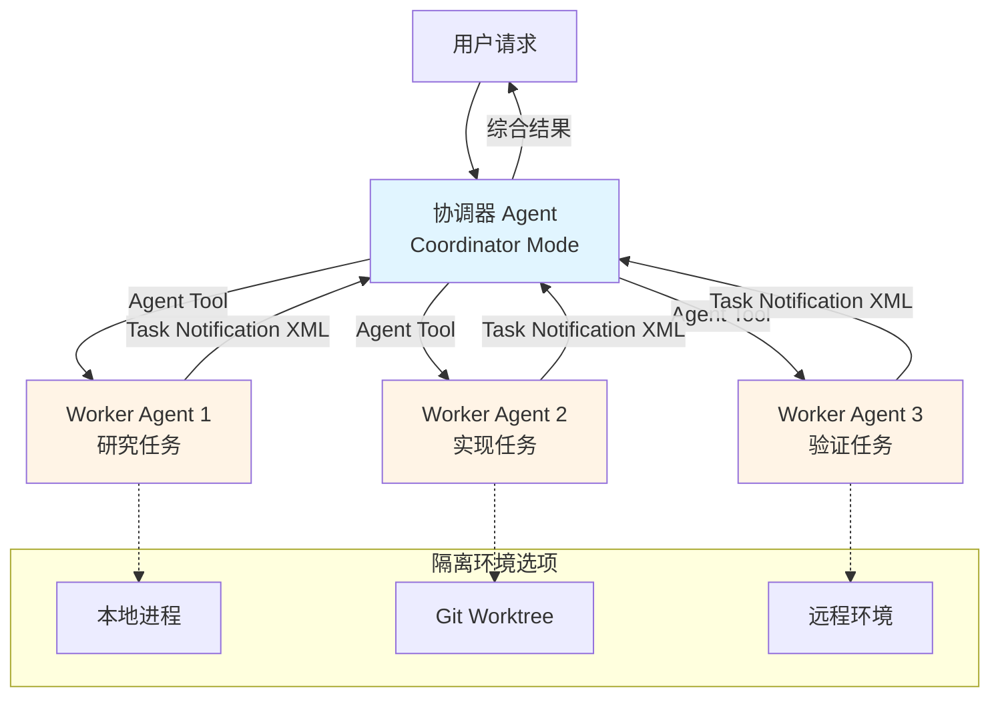

Claude Code 的**子 Agent 机制**是一个强大的多 Agent 协作系统，它允许主 Agent（协调器）通过生成、管理和协调多个子 Agent 来并行处理复杂任务。该机制采用**协调器-工作者模式**，支持本地隔离、远程执行和并行任务处理，极大地提升了复杂软件工程任务的执行效率和安全性。

## 架构概览

子 Agent 机制建立在三个核心概念之上：**协调器模式**（Coordinator Mode）、**工作者生成**（Worker Spawning）和**任务通信协议**（Task Communication Protocol）。协调器作为中央大脑，通过 Agent 工具生成多个独立的子 Agent，每个子 Agent 在隔离的环境中执行特定任务，完成后通过结构化的 XML 通知向协调器汇报结果。



整个系统通过精心设计的**工具权限控制**、**任务状态管理**和**消息队列机制**，确保子 Agent 既能独立工作又能在协调器的统一指挥下高效协作。

Sources: [coordinatorMode.ts](claude-code/src/coordinator/coordinatorMode.ts#L1-L370), [AgentTool.tsx](claude-code/src/tools/AgentTool/AgentTool.tsx#L1-L200)

## 协调器模式

协调器模式是一个特殊的运行状态，通过环境变量 `CLAUDE_CODE_COORDINATOR_MODE=1` 激活。在此模式下，主 Agent 不直接执行具体的文件操作或命令执行，而是专注于**任务分解、工作者调度和结果综合**。

### 核心职责

协调器的职责明确定义为四个层次：**帮助用户达成目标**、**指导工作者进行研究、实现和验证**、**综合结果并与用户沟通**、以及**直接回答能够处理的问题**。协调器从不感谢或确认工作者的结果——这些是内部信号而非对话伙伴。协调器的职责是在新信息到达时为用户进行总结。

协调器拥有三个核心工具：**Agent 工具**用于生成新的工作者、**SendMessage 工具**用于继续现有工作者（向其 `to` agent ID 发送后续指令）、**TaskStop 工具**用于停止运行中的工作者。在调用 Agent 工具时，协调器遵循严格的使用原则：**不使用一个工作者检查另一个工作者**（工作者会在完成时通知协调器）、**不使用工作者简单地报告文件内容或运行命令**（应赋予更高层次的任务）、**不设置 model 参数**（工作者需要默认模型来处理协调器委派的实质性任务）。

Sources: [coordinatorMode.ts](claude-code/src/coordinator/coordinatorMode.ts#L116-L141)

### 工具权限模型

协调器模式下的工具访问受到严格限制，仅允许使用**输出和代理管理工具**：Agent、TaskStop、SendMessage 和 SyntheticOutput。这种设计确保协调器专注于协调工作而非直接执行操作。

```typescript
export const COORDINATOR_MODE_ALLOWED_TOOLS = new Set([
  AGENT_TOOL_NAME,
  TASK_STOP_TOOL_NAME,
  SEND_MESSAGE_TOOL_NAME,
  SYNTHETIC_OUTPUT_TOOL_NAME,
])
```

工作者（Worker）则拥有更广泛的工具集，包括文件读写、Shell 执行、搜索工具、技能工具等，但受到特定限制以防止递归和系统冲突。工作者的工具集在 `ASYNC_AGENT_ALLOWED_TOOLS` 中定义，包含 Read、WebSearch、TodoWrite、Grep、WebFetch、Glob、Shell 工具、Edit、Write、NotebookEdit、Skill、SyntheticOutput、ToolSearch、EnterWorktree 和 ExitWorktree 工具。

Sources: [tools.ts](claude-code/src/constants/tools.ts#L55-L110)

### 系统提示构建

协调器的系统提示通过 `getCoordinatorSystemPrompt` 函数构建，明确阐述了协调器的角色定位、工具使用方法、工作者能力说明和任务工作流程。提示强调了**并行性是协调器的超能力**——工作者是异步的，应尽可能并发启动独立的工作者，不要序列化可以同时运行的工作。

系统提示还详细说明了**工作者提示的编写原则**：由于工作者无法看到协调器的对话，每个提示必须是自包含的，包含工作者所需的一切信息。协调器必须在研究完成后进行两个步骤：**（1）将发现综合为具体的提示**，**（2）选择是通过 SendMessage 继续该工作者还是生成新的工作者**。

Sources: [coordinatorMode.ts](claude-code/src/coordinator/coordinatorMode.ts#L111-L369)

## 工作者生成机制

工作者生成通过 **Agent 工具**实现，该工具支持多种参数配置来控制工作者的行为和隔离级别。

### Agent 工具参数

Agent 工具接受以下核心参数：**description**（3-5 个词的任务简短描述）、**prompt**（工作者要执行的任务）、**subagent_type**（可选，专用代理的类型）、**model**（可选，模型覆盖，优先级高于代理定义的模型 frontmatter）、**run_in_background**（可选，设置为 true 以在后台运行）、**name**（可选，生成的代理的名称，使其在运行时可通过 SendMessage({to: name}) 寻址）、**team_name**（可选，生成的团队名称）、**mode**（可选，生成的队友的权限模式）、**isolation**（可选，隔离模式，'worktree' 或 'remote'）、**cwd**（可选，运行代理的绝对路径）。

Sources: [AgentTool.tsx](claude-code/src/tools/AgentTool/AgentTool.tsx#L82-L138)

### 本地工作者

**LocalAgentTask** 是本地工作者的任务类型，负责在后台执行代理。每个本地工作者拥有独立的状态管理，包括 agentId、prompt、agentType、progress、pendingMessages 等字段。工作者通过 **进度追踪器**（ProgressTracker）实时跟踪工具使用计数、token 计数和最近活动。

本地工作者的生命周期包括：**注册**（通过 `registerAsyncAgent` 创建任务状态）、**运行**（通过 `runAgent` 函数执行 API 查询循环）、**进度更新**（通过 `updateAgentProgress` 实时更新）、**通知**（通过 `enqueueAgentNotification` 发送任务完成通知）、**清理**（通过 `killAsyncAgent` 停止运行中的工作者）。

```typescript
export type LocalAgentTaskState = TaskStateBase & {
  type: 'local_agent';
  agentId: string;
  prompt: string;
  agentType: string;
  progress?: AgentProgress;
  pendingMessages: string[];
  // ...
}
```

Sources: [LocalAgentTask.tsx](claude-code/src/tasks/LocalAgentTask/LocalAgentTask.tsx#L117-L149)

### 远程工作者

**RemoteAgentTask** 用于在远程环境中执行代理，支持多种远程任务类型：`remote-agent`、`ultraplan`、`ultrareview`、`autofix-pr`、`background-pr`。远程工作者通过 Teleport API 与远程环境通信，轮询远程会话事件并处理远程通知。

远程工作者的关键特性包括：**会话 URL**（通过 `getRemoteTaskSessionUrl` 获取远程会话的可访问 URL）、**轮询机制**（通过 `pollRemoteSessionEvents` 定期检查远程状态）、**完成检查器**（通过 `registerCompletionChecker` 注册特定任务类型的完成逻辑）、**元数据持久化**（通过 `writeRemoteAgentMetadata` 和 `deleteRemoteAgentMetadata` 管理任务元数据）。

远程工作者的任务状态包含 `remoteTaskType`、`sessionId`、`command`、`title`、`todoList`、`log` 等字段，以及特殊的 `isLongRunning` 标志用于标记不会在第一个 `result` 后立即完成的长时间运行代理。

Sources: [RemoteAgentTask.tsx](claude-code/src/tasks/RemoteAgentTask/RemoteAgentTask.tsx#L29-L150)

### Fork 机制

**Fork 机制**是一种特殊的工作者生成方式，允许代理"分叉"自身以隔离中间工具输出。当启用 Fork 功能时，代理可以通过**省略 `subagent_type` 参数**来创建一个继承父代理上下文的子代理。Fork 的核心优势在于**共享提示缓存**，使得分叉操作非常廉价。

Fork 的使用场景包括：**研究任务**（分叉开放式问题，如果研究可以分解为独立问题，则在一个消息中启动并行分叉）、**实现任务**（优先分叉需要多次编辑的实现工作）。Fork 的关键原则是：**不要窥视**（工具结果包含 `output_file` 路径——不要读取或跟踪它，除非用户明确要求进度检查）、**不要竞速**（启动后，你对分叉发现的内容一无所知，绝不要以任何格式伪造或预测分叉结果）、**编写指令式提示**（由于分叉继承你的上下文，提示是一个指令——做什么，而不是情况是什么）。

Sources: [prompt.ts](claude-code/src/tools/AgentTool/prompt.ts#L78-L154)

## 任务通信协议

协调器与工作者之间的通信通过**结构化的 XML 通知**实现，确保消息的可靠传递和解析。

### 任务通知格式

工作者完成任务后，通过 `enqueueAgentNotification` 函数生成 XML 格式的任务通知，并通过消息队列管理器将通知作为用户角色消息传递给协调器。通知格式如下：

```xml
<task-notification>
  <task-id>{agentId}</task-id>
  <status>completed|failed|killed</status>
  <summary>{人类可读的状态摘要}</summary>
  <result>{代理的最终文本响应}</result>
  <usage>
    <total_tokens>N</total_tokens>
    <tool_uses>N</tool_uses>
    <duration_ms>N</duration_ms>
  </usage>
  <worktree>
    <worktree_path>/path/to/worktree</worktree_path>
    <worktree_branch>feature-branch</worktree_branch>
  </worktree>
</task-notification>
```

其中，`<result>` 和 `<usage>` 部分是可选的，`<summary>` 描述结果："completed"、"failed: {error}" 或 "was stopped"。`<task-id>` 的值是代理 ID，用于 SendMessage 的 `to` 参数来继续该工作者。

Sources: [LocalAgentTask.tsx](claude-code/src/tasks/LocalAgentTask/LocalAgentTask.tsx#L198-L263)

### 消息队列管理

消息队列管理器通过 `enqueuePendingNotification` 函数将通知消息排队，模式为 `'task-notification'`。协调器在下一个回合中接收这些通知，作为用户角色消息处理。这种设计确保了**消息的原子性传递**（通过 `notified` 标志防止重复通知）和**状态一致性**（通过 AbortSpeculation 机制在后台任务状态变化时中止推测性结果）。

通知的生成逻辑包括**原子性检查**（通过 `updateTaskState` 原子地检查并设置 `notified` 标志）、**推测中止**（通过 `abortSpeculation` 丢弃预计算的响应）、**消息构造**（根据任务状态构建完整的 XML 通知）、**队列入队**（通过 `enqueuePendingNotification` 将消息加入队列）。

Sources: [LocalAgentTask.tsx](claude-code/src/tasks/LocalAgentTask/LocalAgentTask.tsx#L224-L263)

### 继续工作者

协调器可以通过 **SendMessage 工具**继续现有工作者，向其发送后续指令。SendMessage 工具接受 `to` 参数（目标代理 ID）和 `message` 参数（要发送的消息）。继续工作者的关键场景包括：**修正失败**（工作者报告测试失败或构建错误，继续该工作者使其拥有完整的错误上下文）、**扩展工作**（在工作者完成初始任务后，继续该工作者以处理相关任务）。

继续工作者的决策基于**上下文重叠度**：高重叠（研究探索了确切需要编辑的文件）→ 继续；低重叠（研究广泛但实现狭窄）→ 生成新的；完全无关的任务 → 生成新的。重要的是，**没有通用默认值**——协调器必须根据工作者的上下文与新任务的重叠程度做出决策。

Sources: [coordinatorMode.ts](claude-code/src/coordinator/coordinatorMode.ts#L252-L307)

## 隔离策略

子 Agent 机制提供两种主要的隔离策略：**Git Worktree 隔离**和**远程环境隔离**，确保不同工作者的文件操作不会相互干扰。

### Git Worktree 隔离

Worktree 隔离通过创建临时 Git 工作树来实现文件系统级别的隔离。每个 Worktree 是主仓库的一个独立副本，拥有自己的工作目录和分支，但共享 Git 历史和配置。Worktree 的创建过程包括：**验证 slug**（通过 `validateWorktreeSlug` 防止路径遍历攻击）、**创建目录**（通过 `mkdirRecursive` 递归创建目录）、**执行 Git 命令**（通过 `git worktree add` 创建工作树）、**符号链接目录**（通过 `symlinkDirectories` 将 node_modules 等大型目录从主仓库符号链接到 Worktree 以避免磁盘膨胀）。

Worktree 的生命周期管理包括：**创建**（通过 `createAgentWorktree` 函数，接受 repoRoot、slug 和可选的分支名称）、**使用**（代理在 Worktree 路径下执行所有文件操作）、**清理**（通过 `removeAgentWorktree` 函数，在工作完成或任务停止时删除 Worktree）。Worktree 的关键优势在于**完整的 Git 功能**（可以在独立分支上提交、推送、创建 PR）、**磁盘效率**（通过符号链接避免重复大型目录）、**安全隔离**（文件操作不会影响主工作目录）。

Sources: [worktree.ts](claude-code/src/utils/worktree.ts#L66-L150)

### 远程环境隔离

远程环境隔离通过 Teleport API 将代理部署到远程服务器执行。这种隔离方式适用于需要**大规模计算资源**或**特定环境配置**的任务。远程工作者的创建过程包括：**资格检查**（通过 `checkRemoteAgentEligibility` 验证远程会话的前置条件）、**会话创建**（通过 Teleport API 创建远程会话）、**任务注册**（通过 `registerRemoteAgentTask` 注册远程任务）、**轮询监控**（通过 `pollRemoteSessionEvents` 定期检查远程状态）。

远程工作者的优势包括：**资源隔离**（独立的计算资源，不占用本地机器）、**环境一致性**（标准化的远程环境，避免本地配置差异）、**长时间运行**（可以运行需要数小时的任务而不占用本地终端）。远程工作者支持多种任务类型，包括 `remote-agent`（通用远程代理）、`ultraplan`（计划模式代理）、`ultrareview`（代码审查代理）、`autofix-pr`（自动修复 PR 代理）和 `background-pr`（后台 PR 处理代理）。

Sources: [RemoteAgentTask.tsx](claude-code/src/tasks/RemoteAgentTask/RemoteAgentTask.tsx#L67-L150)

## 进度追踪与监控

子 Agent 机制提供完善的进度追踪和监控系统，使协调器和用户能够实时了解工作者的执行状态。

### 进度追踪器

**ProgressTracker** 是本地工作者的核心进度追踪组件，跟踪以下指标：**工具使用计数**（toolUseCount，累计工具调用次数）、**输入 token 计数**（latestInputTokens，最新输入 token 数，因为 Claude API 的 input_tokens 是每轮累计的）、**输出 token 计数**（cumulativeOutputTokens，累计输出 token 数，因为 output_tokens 是每轮单独的）、**最近活动**（recentActivities，最近 5 次工具调用的详细信息）。

进度追踪器通过 `updateProgressFromMessage` 函数从助手消息中提取使用统计和工具调用信息，构建 ToolActivity 对象记录工具名称、输入、活动描述、是否为搜索操作、是否为读取操作。进度更新通过 `getProgressUpdate` 函数生成 AgentProgress 对象，包含 toolUseCount、tokenCount、lastActivity 和 recentActivities。

Sources: [LocalAgentTask.tsx](claude-code/src/tasks/LocalAgentTask/LocalAgentTask.tsx#L23-L105)

### SDK 进度事件

对于 SDK 消费者（如 VS Code 子代理面板），系统通过 `emitTaskProgress` 函数发出进度事件。这些事件仅在 SDK 选项启用时发送（通过 `getSdkAgentProgressSummariesEnabled` 检查），以避免在没有选择的情况下向未选择加入的消费者泄漏摘要事件。

进度事件包含：**taskId**（任务 ID）、**tokenCount**（当前 token 计数）、**toolUseCount**（工具使用计数）、**durationMs**（持续时间）、**summary**（1-2 句话的进度摘要）、**toolUseId**（工具使用 ID）。这些事件使外部工具能够实时监控子代理的执行进度，提供更好的用户体验。

Sources: [LocalAgentTask.tsx](claude-code/src/tasks/LocalAgentTask/LocalAgentTask.tsx#L388-L414)

### 后台摘要服务

后台摘要服务通过 `startAgentSummarization` 定期为运行中的工作者生成 1-2 句话的进度摘要。摘要通过 `updateAgentSummary` 函数更新到任务状态，与进度更新分离以避免助手消息的进度更新覆盖后台摘要结果。

摘要服务的关键优势在于：**简洁的状态报告**（1-2 句话概括当前进度）、**定期更新**（避免频繁的完整状态刷新）、**保留摘要**（进度更新时保留现有的摘要字段）。摘要内容通过 SDK 进度事件发送给消费者，使协调器和用户能够快速了解工作者的整体进展。

Sources: [LocalAgentTask.tsx](claude-code/src/tasks/LocalAgentTask/LocalAgentTask.tsx#L356-L387)

## 任务工作流程

协调器模式下的典型任务工作流程遵循**研究-综合-实现-验证**四个阶段，充分利用并行性和隔离机制。

### 四阶段工作流

**研究阶段**由工作者并行执行，目标是调查代码库、查找文件、理解问题。协调器应从多个角度覆盖研究，在一个消息中启动多个并行工作者以充分利用异步性。**综合阶段**由协调器执行，阅读研究发现、理解问题、制定实现规范。这是协调器最重要的职责——必须亲自理解，绝不能将理解委派给工作者。**实现阶段**由工作者执行，根据规范进行针对性修改、提交代码。协调器应为每个文件集合一次只运行一个写密集型任务。**验证阶段**由工作者执行，测试更改是否有效。真正的验证意味着**证明代码有效**，而不是确认它存在：运行启用了功能的测试、运行类型检查并调查错误、保持怀疑态度、独立测试。

Sources: [coordinatorMode.ts](claude-code/src/coordinator/coordinatorMode.ts#L200-L228)

### 并发管理

并发管理的核心原则是：**只读任务（研究）可以自由并行运行**、**写密集型任务（实现）每个文件集合一次只运行一个**、**验证有时可以在不同的文件区域与实现并行运行**。协调器必须主动寻找扇出的机会，不要序列化可以同时运行的工作。

并发管理的另一个关键方面是**处理工作者失败**：当工作者报告失败时（测试失败、构建错误、文件未找到），应继续同一个工作者（通过 SendMessage）——它拥有完整的错误上下文。如果修正尝试失败，尝试不同的方法或向用户报告。**停止工作者**（通过 TaskStop）用于当你意识到中途方法错误，或用户在启动工作者后更改需求时。

Sources: [coordinatorMode.ts](claude-code/src/coordinator/coordinatorMode.ts#L211-L249)

### 提示编写最佳实践

编写工作者提示的核心原则是：**工作者无法看到你的对话**，每个提示必须是自包含的，包含工作者所需的一切。好的提示示例包括：**实现**（"Fix the null pointer in src/auth/validate.ts:42. The user field can be undefined when the session expires. Add a null check and return early with an appropriate error. Commit and report the hash."）、**精确的 Git 操作**（"Create a new branch from main called 'fix/session-expiry'. Cherry-pick only commit abc123 onto it. Push and create a draft PR targeting main. Add anthropics/claude-code as reviewer. Report the PR URL."）、**修正**（继续的工作者，简短："The tests failed on the null check you added — validate.test.ts:58 expects 'Invalid session' but you changed it to 'Session expired'. Fix the assertion. Commit and report the hash."）。

坏的提示示例包括：**无上下文**（"Fix the bug we discussed"）、**懒惰委派**（"Based on your findings, implement the fix"）、**模糊范围**（"Create a PR for the recent changes"）、**无方向**（"Something went wrong with the tests, can you look?"）。关键提示技巧包括：包含文件路径、行号、错误消息、明确"完成"的样子、对于实现："运行相关测试和类型检查，然后提交更改并报告哈希"、对于研究："报告发现——不要修改文件"、对于验证："证明代码有效，不要只是确认它存在"、"尝试边缘情况和错误路径——不要只是重新运行实现工作者运行的内容"。

Sources: [coordinatorMode.ts](claude-code/src/coordinator/coordinatorMode.ts#L251-L336)

## 内置代理类型

系统提供多种内置代理类型，针对特定任务场景优化。

### 通用代理

**General Purpose Agent** 是默认的代理类型，适用于广泛的任务。它拥有完整的工具访问权限（在 ASYNC_AGENT_ALLOWED_TOOLS 范围内），可以执行研究、实现、验证等多种任务。通用代理的 system prompt 强调自主性和判断力，能够根据任务需求灵活调整策略。

### Explore 代理

**Explore Agent** 是一种一次性代理，专门用于代码库探索和调查。它的关键特性是**运行一次并返回报告**——父代理从不通过 SendMessage 继续它。为了节省 token，Explore 代理跳过 agentId/SendMessage/usage 尾部（大约节省 135 个字符 × 3400 万次每周 Explore 运行）。Explore 代理适用于：**代码库调查**（"Find all authentication-related files and report their purpose"）、**依赖分析**（"Trace the data flow from API request to database query"）、**架构理解**（"Map out the component hierarchy in the frontend"）。

### Plan 代理

**Plan Agent** 是另一种一次性代理，专门用于制定实施计划。它的职责是**分析需求、设计解决方案、生成详细的实施步骤**，但不执行实际的代码修改。Plan 代理适用于：**复杂功能设计**（"Design an implementation plan for adding OAuth support"）、**重构规划**（"Create a step-by-step plan for migrating from REST to GraphQL"）、**架构决策**（"Propose an architecture for the new microservice"）。

Sources: [constants.ts](claude-code/src/tools/AgentTool/constants.ts#L1-L13)

### Verification 代理

**Verification Agent** 专门用于代码验证，确保实现符合预期。它的核心职责是**独立测试**——不应带有实现假设，而是以全新的视角验证代码。Verification 代理的关键原则：**证明代码有效**（运行启用了功能的测试，不只是"测试通过"）、**调查错误**（运行类型检查并调查错误，不要 dismiss 为"无关"）、**保持怀疑**（如果看起来不对劲，深入挖掘）、**独立测试**（证明更改有效，不要 rubber-stamp）。

## 安全与权限控制

子 Agent 机制实施多层安全控制，确保工作者的行为在安全边界内。

### 工具限制

所有代理都受到 **ALL_AGENT_DISALLOWED_TOOLS** 的限制，包括：TaskOutput（防止递归）、ExitPlanModeV2（计划模式是主线程抽象）、EnterPlanMode（计划模式是主线程抽象）、Agent（防止递归，但对于 ant 用户允许以启用嵌套代理）、AskUserQuestion、TaskStop（需要访问主线程任务状态）、Workflow（防止在子代理中递归执行工作流）。

此外，**ASYNC_AGENT_ALLOWED_TOOLS** 明确定义了异步代理允许的工具集，确保工作者只能访问必要的工具。这个集合包括：Read、WebSearch、TodoWrite、Grep、WebFetch、Glob、Shell 工具、Edit、Write、NotebookEdit、Skill、SyntheticOutput、ToolSearch、EnterWorktree、ExitWorktree。

Sources: [tools.ts](claude-code/src/constants/tools.ts#L36-L101)

### Worktree 安全验证

Worktree slug 的验证通过 `validateWorktreeSlug` 函数实现，防止路径遍历和目录逃逸攻击。验证规则包括：**长度限制**（最多 64 个字符）、**字符白名单**（只允许字母、数字、点、下划线和连字符）、**路径段验证**（每个 "/" 分隔的段必须非空且符合白名单，拒绝 "." 和 ".." 段）、**禁止绝对路径**（前导 "/" 或 "C:\" 会被拒绝）。

验证函数在执行任何副作用（Git 命令、Hook 执行、chdir）之前同步抛出异常，确保调用者能够可靠地捕获错误。这种设计防止了通过恶意构造的 slug（如 "../../../target" 或绝对路径）逃逸 worktrees 目录的风险。

Sources: [worktree.ts](claude-code/src/utils/worktree.ts#L51-L87)

### MCP 服务器限制

当 MCP 被锁定为仅插件时（strictPluginOnlyCustomization），系统会跳过用户控制的代理的 frontmatter MCP 服务器。插件、内置和 policySettings 代理被认为是管理员信任的——它们的 frontmatter MCP 是管理员批准的表面的一部分。阻塞它们会破坏合法需要 MCP 的插件代理，与"插件提供的总是加载"相矛盾。

代理的 MCP 服务器初始化通过 `initializeAgentMcpServers` 函数实现，它合并父客户端和代理特定的 MCP 服务器。只有新创建的客户端（内联定义）才会在代理完成时清理，共享的父客户端保持不变。

Sources: [runAgent.ts](claude-code/src/tools/AgentTool/runAgent.ts#L86-L150)

## 扩展阅读

子 Agent 机制与 Claude Code 的其他核心系统紧密集成。要深入了解完整的生态系统，建议阅读以下相关文档：

- **[Worktree 隔离环境](22-worktree-ge-chi-huan-jing)**：详细了解 Git Worktree 的创建、管理和清理机制，以及符号链接优化策略。
- **[协调器与 Swarm 模式](23-xie-diao-qi-yu-swarm-mo-shi)**：探索多 Agent 协作的高级模式，包括团队创建、消息传递和权限同步。
- **[工具架构与注册机制](8-gong-ju-jia-gou-yu-zhu-ce-ji-zhi)**：理解工具的定义、权限控制和动态加载机制。
- **[沙箱隔离机制](14-sha-xiang-ge-chi-ji-zhi)**：学习文件系统隔离、权限模型和安全策略的实现细节。