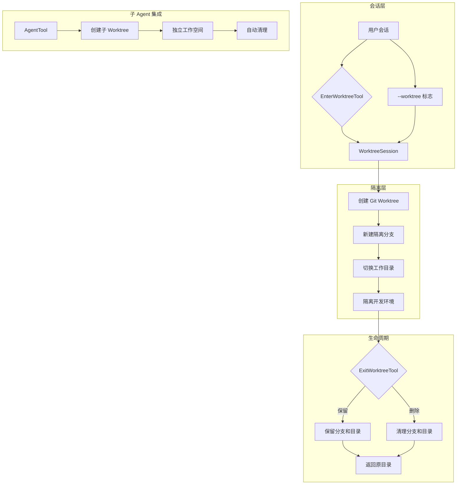
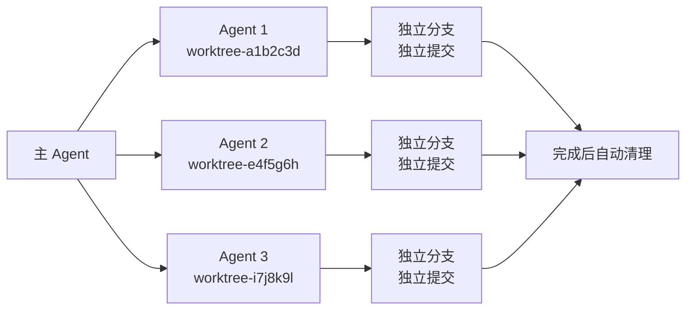

Worktree 隔离环境为 Claude Code 提供了基于 Git worktree 的并行工作能力，允许在独立的分支上进行隔离开发而不干扰主工作目录。这个机制既支持用户显式创建隔离环境，也为子 Agent 提供了自动化的工作空间隔离，是多 Agent 协作场景下的关键基础设施。

## 架构设计

Worktree 系统采用**双层隔离架构**：底层是 Git worktree 机制提供的文件系统级别隔离，上层是会话级别的状态管理和生命周期控制。整个系统通过 `EnterWorktreeTool` 和 `ExitWorktreeTool` 两个工具暴露给用户，同时在启动阶段通过 `--worktree` 标志支持直接进入隔离环境。



**核心设计原则**：会话级别的状态跟踪确保每个 worktree 都有明确的所有者和生命周期；Git 原生机制提供可靠的版本控制隔离；Hook 扩展点支持非 Git VCS 系统的集成。系统始终采用 fail-closed 策略——在无法确认安全时拒绝执行删除操作，防止误删未提交的工作成果。

Sources: [worktree.ts](claude-code/src/utils/worktree.ts#L1-L100)

## 核心组件解析

### WorktreeSession 状态模型

`WorktreeSession` 是整个隔离环境的状态核心，记录了从原始目录到隔离环境的所有上下文信息：

| 字段 | 类型 | 用途 |
|------|------|------|
| `originalCwd` | string | 进入 worktree 前的工作目录，用于退出时恢复 |
| `worktreePath` | string | Worktree 的绝对路径，通常是 `.claude/worktrees/<slug>` |
| `worktreeName` | string | Worktree 的逻辑名称，用于标识和恢复 |
| `worktreeBranch` | string | 创建的新分支名，格式为 `worktree-<slug>` |
| `originalBranch` | string | 原始分支名，用于上下文恢复 |
| `originalHeadCommit` | string | 基准提交 SHA，用于检测是否有新提交 |
| `sessionId` | string | 关联的会话 ID，确保会话级别的作用域 |
| `tmuxSessionName` | string | 关联的 tmux 会话名（可选） |
| `hookBased` | boolean | 是否通过 Hook 创建（非 Git 模式） |

这个状态通过 `getCurrentWorktreeSession()` 在全局访问，并在 `sessionStorage` 中持久化，确保会话恢复时能正确还原 worktree 上下文。状态管理采用**单例模式**——同一时刻一个会话只能有一个活跃的 worktree session，通过 `currentWorktreeSession` 全局变量跟踪。

Sources: [worktree.ts](claude-code/src/utils/worktree.ts#L85-L116)

### EnterWorktreeTool：创建隔离环境

`EnterWorktreeTool` 是用户主动创建 worktree 的入口，其核心流程包括验证、创建、切换三个阶段：

**验证阶段**首先检查是否已经处于 worktree session 中（防止嵌套），然后解析到主仓库根目录（支持从已有 worktree 中创建新 worktree）。**创建阶段**调用 `createWorktreeForSession()`，这个函数会：

1. 验证 slug 格式（防止路径遍历攻击）
2. 尝试 Hook-based 创建（如果配置了 WorktreeCreate hook）
3. 回退到 Git worktree 创建（标准路径）
4. 执行后置设置（复制配置、设置 hooks、符号链接）

**切换阶段**更新进程工作目录、重置会话状态、清理依赖 CWD 的缓存（系统提示、memory 文件、plans 目录）。这个设计确保切换是原子性的——所有状态变更在 `process.chdir()` 之后一次性完成，避免中间状态。

```typescript
// EnterWorktreeTool.call() 的核心逻辑
const worktreeSession = await createWorktreeForSession(getSessionId(), slug)
process.chdir(worktreeSession.worktreePath)
setCwd(worktreeSession.worktreePath)
setOriginalCwd(getCwd())
saveWorktreeState(worktreeSession)
clearSystemPromptSections()
clearMemoryFileCaches()
```

**重要约束**：这个工具只能操作由 `EnterWorktreeTool` 在当前会话中创建的 worktree，不会影响手动通过 `git worktree add` 创建的 worktree 或其他会话创建的 worktree。这个作用域隔离通过 `getCurrentWorktreeSession()` 的 null 检查实现。

Sources: [EnterWorktreeTool.ts](claude-code/src/tools/EnterWorktreeTool/EnterWorktreeTool.ts#L55-L100)

### ExitWorktreeTool：退出与清理

`ExitWorktreeTool` 提供 worktree 生命周期的终止点，支持两种退出策略：`keep`（保留）和 `remove`（删除）。其安全机制采用**多层防护**：

**第一层：作用域检查**。`getCurrentWorktreeSession()` 为 null 时直接返回 no-op，防止误删非本会话创建的 worktree。**第二层：变更检测**。调用 `countWorktreeChanges()` 检查未提交文件和新提交：

```typescript
async function countWorktreeChanges(
  worktreePath: string,
  originalHeadCommit: string | undefined,
): Promise<ChangeSummary | null> {
  const status = await execFileNoThrow('git', ['-C', worktreePath, 'status', '--porcelain'])
  const changedFiles = count(status.stdout.split('\n'), l => l.trim() !== '')
  
  const revList = await execFileNoThrow('git', [
    '-C', worktreePath, 'rev-list', '--count', 
    `${originalHeadCommit}..HEAD`
  ])
  const commits = parseInt(revList.stdout.trim(), 10) || 0
  
  return { changedFiles, commits }
}
```

**第三层：显式确认**。当 `action: 'remove'` 且检测到变更时，要求 `discard_changes: true` 才能继续。这个参数在 schema 层面是 optional，但在运行时通过 `validateInput()` 强制要求——工具会返回错误并列出变更详情，用户必须重新调用并显式设置 `discard_changes: true`。

**退出时的状态恢复**包括：切换回原始目录、重置 `originalCwd` 和 `projectRoot`（仅限 `--worktree` 启动的情况）、清空 worktree session 状态、更新 hooks 配置快照。`restoreSessionToOriginalCwd()` 函数封装了这个逆操作，确保状态恢复是对称的。

Sources: [ExitWorktreeTool.ts](claude-code/src/tools/ExitWorktreeTool/ExitWorktreeTool.ts#L65-L165)

## Git Worktree 创建机制

`createWorktreeForSession()` 是 worktree 创建的核心实现，其流程分为**快速恢复路径**和**完整创建路径**：

### 快速恢复路径

对于已存在的 worktree（通过 `readWorktreeHeadSha()` 直接读取 `.git` 指针文件检测），跳过所有创建步骤直接返回。这个优化避免了对已存在 worktree 的重复 fetch 操作（在大型仓库中可能耗时 6-8 秒），同时防止了凭证提示导致的挂起。

```typescript
const existingHead = await readWorktreeHeadSha(worktreePath)
if (existingHead) {
  return { worktreePath, worktreeBranch, headCommit: existingHead, existed: true }
}
```

### 完整创建路径

创建新 worktree 时，系统执行以下步骤：

1. **基准分支解析**：优先使用本地已有的 `origin/<defaultBranch>`，避免不必要的 fetch。通过 `resolveRef()` 直接读取 loose/packed ref，成功时跳过后续的 `rev-parse` 调用。

2. **PR 支持**：当传入 `prNumber` 时，fetch `pull/<prNumber>/head` 并基于 `FETCH_HEAD` 创建。这个特性通过 `parsePRReference()` 从 URL 或 `#N` 格式解析。

3. **Worktree 创建**：使用 `git worktree add -B <branch> <path> <base>` 创建。`-B` 标志（而非 `-b`）会重置孤立的分支，避免每次创建前都需要 `git branch -D`（节省 ~15ms 的 spawn 开销）。

4. **Sparse Checkout**：当配置了 `worktree.sparsePaths` 时，先创建空 worktree（`--no-checkout`），然后应用 sparse-checkout：

```typescript
if (sparsePaths?.length) {
  await execFileNoThrow('git', ['sparse-checkout', 'set', '--cone', '--', ...sparsePaths])
  await execFileNoThrow('git', ['checkout', 'HEAD'])
}
```

这个特性在大型 monorepo 中能显著减少磁盘占用——只检出必要的目录而非整个仓库。

Sources: [worktree.ts](claude-code/src/utils/worktree.ts#L205-L315)

## 后置设置与配置传播

新创建的 worktree 需要一系列后置设置才能正常工作，`performPostCreationSetup()` 封装了这些步骤：

### 配置文件复制

`settings.local.json` 从主仓库复制到 worktree 的 `.claude/` 目录。这个文件通常包含本地特定的配置（可能有密钥），复制确保 worktree 继承这些设置。复制操作是 best-effort 的——源文件不存在时静默跳过（ENOENT），其他错误记录警告。

### Git Hooks 配置

Worktree 需要使用主仓库的 hooks 目录（`.husky/` 或 `.git/hooks/`），因为 hooks 中的相对路径在 worktree 中会解析错误。系统通过 `git config core.hooksPath` 设置共享的 hooks 路径：

```typescript
const huskyPath = join(repoRoot, '.husky')
const gitHooksPath = join(repoRoot, '.git', 'hooks')
// 检测哪个存在并设置为 core.hooksPath
```

**Husky 兼容性问题**：Husky 的 prepare script 会在每次 `bun install` 时运行 `git config core.hooksPath .husky`，重置回相对路径。解决方案是同时将 attribution hook 直接安装到 worktree 的 `.husky/` 目录——Husky 不会删除已有的 hook 文件。

### 目录符号链接

为避免磁盘膨胀（特别是 `node_modules` 等大型目录），系统支持配置 `worktree.symlinkDirectories`：

```json
{
  "worktree": {
    "symlinkDirectories": ["node_modules", ".cache", ".bin"]
  }
}
```

`symlinkDirectories()` 函数会为每个配置的目录创建从主仓库到 worktree 的符号链接。操作是 best-effort 的——源不存在（ENOENT）或目标已存在（EEXIST）时静默跳过，其他错误记录警告。

### .worktreeinclude 支持

`.worktreeinclude` 文件（使用 `.gitignore` 语法）指定需要从主仓库复制到 worktree 的 gitignored 文件。这个机制常用于复制本地配置文件、密钥文件等：

```typescript
const patterns = includeContent.split(/\r?\n/).filter(line => line.length > 0 && !line.startsWith('#'))
const gitignored = await execFileNoThrow('git', [
  'ls-files', '--others', '--ignored', '--exclude-standard', '--directory'
])
// 过滤匹配 .worktreeinclude 模式的文件并复制
```

**性能优化**：使用 `--directory` 标志让 Git 将完全 ignored 的目录（如 `node_modules/`）折叠为单个条目，避免在大型仓库中列出 50 万个文件（~7 秒），降至数百个条目（~100ms）。

Sources: [worktree.ts](claude-code/src/utils/worktree.ts#L406-L525)

## Hook 扩展机制

Worktree 系统通过 Hook 机制支持非 Git VCS 的集成，允许用户配置 `WorktreeCreate` 和 `WorktreeRemove` hooks 来实现自定义的隔离策略。

### WorktreeCreate Hook

当 `hasWorktreeCreateHook()` 返回 true 时，`createWorktreeForSession()` 会调用 `executeWorktreeCreateHook()` 而非 Git worktree 命令：

```typescript
if (hasWorktreeCreateHook()) {
  const hookResult = await executeWorktreeCreateHook(slug)
  currentWorktreeSession = {
    originalCwd,
    worktreePath: hookResult.worktreePath,
    worktreeName: slug,
    sessionId,
    tmuxSessionName,
    hookBased: true  // 标记为非 Git worktree
  }
}
```

Hook 接收的输入包括 `hook_event_name: 'WorktreeCreate'` 和 `name`（slug），期望输出是 worktree 的绝对路径。Hook 可以是 shell 命令或 HTTP 端点，通过标准的 hook 执行框架运行。

**使用场景**：
- Perforce、SVN 等非 Git VCS 的隔离
- 云端开发环境的远程 worktree
- 自定义沙箱机制

### WorktreeRemove Hook

`WorktreeRemove` hook 在清理 worktree 时调用，接收 `worktree_path` 参数。返回值表示是否成功，失败时会记录错误但不会阻止清理流程。

**重要**：Hook-based worktree 不会设置 `originalHeadCommit`，因此 `countWorktreeChanges()` 会返回 null（无法验证状态），在 `action: 'remove'` 时需要显式的 `discard_changes: true`。

Sources: [hooks.ts](claude-code/src/utils/hooks.ts#L5065-L5130)

## 子 Agent 的 Worktree 集成

AgentTool 在创建子 Agent 时会自动为每个 agent 创建独立的 worktree，实现文件系统级别的隔离。这个机制通过 `forkSubagent.ts` 中的 `buildWorktreeNotice()` 实现：

### 自动 Worktree 创建

当 `FORK_SUBAGENT` feature 启用时，fork 子 agent 会继承父级的完整上下文，但在独立的 worktree 中工作。系统会在 agent 启动前调用 `createWorktreeForSession()`，使用 agent ID 作为 slug（格式：`agent-a<7hex>`）。

### 路径转换通知

子 agent 收到的系统提示会包含路径转换提醒：

```
你继承了父 agent 在 `/path/to/main/repo` 的对话上下文，
但你在独立的 git worktree `/path/to/main/repo/.claude/worktrees/agent-abc123` 中操作。
路径需要转换，编辑前重新读取。
```

这个通知确保子 agent 知道自己处于隔离环境中，避免直接使用父级上下文中的绝对路径。

### 自动清理机制

Agent 创建的临时 worktree 会在 agent 完成时自动清理。此外，`cleanupStaleAgentWorktrees()` 会在启动时扫描并清理超过 30 天的孤立 agent worktree：

```typescript
const EPHEMERAL_WORKTREE_PATTERNS = [
  /^agent-a[0-9a-f]{7}$/,      // AgentTool
  /^wf_[0-9a-f]{8}-[0-9a-f]{3}-\d+$/,  // WorkflowTool
  /^bridge-[A-Za-z0-9_]+(-[A-Za-z0-9_]+)*$/,  // Bridge
  /^job-[a-zA-Z0-9._-]{1,55}-[0-9a-f]{8}$/,  // Template jobs
]
```

清理前会检查：
- Worktree 没有未提交的 tracked 文件（`git status --porcelain -uno`）
- 所有提交都已推送到远程（`git rev-list HEAD --not --remotes`）
- 不是当前会话的 worktree

这个机制防止了 Ctrl+C 或崩溃导致的 worktree 泄漏。

Sources: [fork-subagent.md](claude-code/docs/features/fork-subagent.md#L140-L165), [worktree.ts](claude-code/src/utils/worktree.ts#L1000-L1100)

## 会话启动集成

通过 `--worktree` 标志，用户可以在会话启动时直接进入隔离环境。这个功能在 `setup.ts` 中实现，流程如下：

### 启动流程

1. **Git 检查**：验证当前目录是 Git 仓库或配置了 WorktreeCreate hook
2. **Slug 生成**：从 `--worktree-name` 或 `--worktree-pr` 参数生成 slug
3. **主仓库解析**：如果已在 worktree 中，切换到主仓库再创建新 worktree
4. **Tmux 会话创建**：如果启用 `--tmux`，创建关联的 tmux 会话
5. **状态设置**：将 `projectRoot` 设置为 worktree 路径，重新加载 hooks 配置

```typescript
if (worktreeEnabled) {
  const worktreeSession = await createWorktreeForSession(getSessionId(), slug, tmuxSessionName)
  process.chdir(worktreeSession.worktreePath)
  setCwd(worktreeSession.worktreePath)
  setProjectRoot(getCwd())  // --worktree 意味着 worktree 就是项目根
  saveWorktreeState(worktreeSession)
  updateHooksConfigSnapshot()
}
```

### Mid-Session vs Startup 的区别

**启动时进入**（`--worktree`）：`projectRoot` 被设置为 worktree 路径，整个会话都在隔离环境中进行，退出会话时会提示保留或删除。

**会话中进入**（`EnterWorktreeTool`）：`projectRoot` 保持不变（原始项目根），worktree 是临时的隔离空间，通过 `ExitWorktreeTool` 显式退出。

这个设计确保了"稳定的项目身份"契约——即使临时进入 worktree，项目的 skills、hooks、cron 等配置仍然基于原始项目根解析。

Sources: [setup.ts](claude-code/src/setup.ts#L165-L235)

## 安全机制

Worktree 系统实现了多层安全防护，防止意外数据丢失和恶意利用：

### 路径遍历防护

`validateWorktreeSlug()` 对用户提供的 worktree 名称进行严格验证：

```typescript
const VALID_WORKTREE_SLUG_SEGMENT = /^[a-zA-Z0-9._-]+$/
const MAX_WORKTREE_SLUG_LENGTH = 64

function validateWorktreeSlug(slug: string): void {
  if (slug.length > MAX_WORKTREE_SLUG_LENGTH) {
    throw new Error(`Invalid worktree name: must be ${MAX_WORKTREE_SLUG_LENGTH} characters or fewer`)
  }
  for (const segment of slug.split('/')) {
    if (segment === '.' || segment === '..') {
      throw new Error(`Invalid worktree name: must not contain "." or ".." path segments`)
    }
    if (!VALID_WORKTREE_SLUG_SEGMENT.test(segment)) {
      throw new Error(`Invalid worktree name: each segment must contain only letters, digits, dots, underscores, and dashes`)
    }
  }
}
```

这个验证在**任何副作用之前**执行（git 命令、hook 执行、chdir），防止通过 `../../../target` 等 slug 逃逸 worktrees 目录。

### Fail-Closed 策略

在无法确定安全状态时，系统选择拒绝操作而非假设安全：

- `countWorktreeChanges()` 返回 null 时，`validateInput()` 要求显式的 `discard_changes: true`
- Git 命令失败（锁文件、损坏的索引、无效引用）时，跳过清理而不是强制删除
- 无法验证提交是否推送时，保留 worktree 而不是删除

### 变更检测的完整性

`countWorktreeChanges()` 同时检查文件系统状态和提交历史：

```typescript
// 检查未提交文件
const status = await execFileNoThrow('git', ['-C', worktreePath, 'status', '--porcelain'])
const changedFiles = count(status.stdout.split('\n'), l => l.trim() !== '')

// 检查新提交
const revList = await execFileNoThrow('git', [
  '-C', worktreePath, 'rev-list', '--count', `${originalHeadCommit}..HEAD`
])
const commits = parseInt(revList.stdout.trim(), 10) || 0
```

只有两者都为 0 且命令成功时，才认为 worktree 是"干净的"。任何不确定性都导致 fail-closed。

Sources: [worktree.ts](claude-code/src/utils/worktree.ts#L21-L50), [ExitWorktreeTool.ts](claude-code/src/tools/ExitWorktreeTool/ExitWorktreeTool.ts#L65-L110)

## 配置选项

Worktree 行为通过 `settings.json` 的 `worktree` 字段配置：

```json
{
  "worktree": {
    "symlinkDirectories": ["node_modules", ".cache", ".turbo"],
    "sparsePaths": ["src/core/", "src/shared/", "package.json"]
  }
}
```

| 配置项 | 类型 | 用途 | 示例 |
|--------|------|------|------|
| `symlinkDirectories` | string[] | 从主仓库符号链接到 worktree 的目录，避免磁盘膨胀 | `["node_modules", ".cache"]` |
| `sparsePaths` | string[] | Sparse checkout 的路径列表，只检出指定目录 | `["src/frontend/", "package.json"]` |

**Symlink Directories 注意事项**：
- 只能链接整个目录，不支持单个文件
- 链接创建后，worktree 中的修改会影响主仓库（共享存储）
- 链接失败时静默跳过（源不存在或目标已存在）

**Sparse Paths 使用场景**：
- 大型 monorepo（10 万+文件）
- 只需要特定子目录的场景（前端开发只需 `src/frontend/`）
- CI/CD 环境中加速检出

Sources: [types.ts](claude-code/src/utils/settings/types.ts#L170-L195)

## 使用场景与最佳实践

### 并行开发多个功能

用户在主分支上工作时，可以临时进入 worktree 处理紧急 bug 或实验性功能：

```
用户：创建一个 worktree 来修复这个 bug
系统：[执行 EnterWorktreeTool]
系统：已切换到 worktree，分支 worktree-bugfix-abc123
用户：[修复 bug，提交]
用户：退出 worktree 并保留
系统：[执行 ExitWorktreeTool，action: keep]
系统：Worktree 已保留在 /path/.claude/worktrees/bugfix-abc123
```

后续可以通过 `cd .claude/worktrees/bugfix-abc123` 继续工作，或创建新的会话并指定 `--worktree` 标志恢复。

### 子 Agent 的隔离执行

当 Agent 并行处理多个独立任务时，每个 agent 自动获得独立的 worktree：



这种模式避免了多个 agent 同时修改同一文件导致的冲突，同时保留了完整的 git 历史用于审查。

### 大型 Monorepo 的加速

在包含数十万文件的 monorepo 中，通过 sparse checkout 可以显著加速 worktree 创建：

```json
{
  "worktree": {
    "sparsePaths": ["services/frontend/", "packages/shared/", "package.json", "tsconfig.json"]
  }
}
```

这会将 worktree 的文件数从 210k 降至几千个，创建时间从 30+ 秒降至 2-3 秒。

### 非交互式清理

对于确定不需要的 worktree，可以直接删除而无需交互式确认：

```
用户：退出 worktree 并删除所有变更
系统：[执行 ExitWorktreeTool，action: remove, discard_changes: true]
系统：已删除 worktree 和分支 worktree-experiment
```

**警告**：`discard_changes: true` 会强制删除所有未提交文件和新提交，操作不可逆。

Sources: [EnterWorktreeTool](claude-code/src/tools/EnterWorktreeTool/prompt.ts#L1-L31), [ExitWorktreeTool](claude-code/src/tools/ExitWorktreeTool/prompt.ts#L1-L33)

## 相关页面

Worktree 隔离环境是多 Agent 协作体系的关键组成部分。了解完整的协作机制，建议继续阅读：

- **[子 Agent 机制](21-zi-agent-ji-zhi)**：子 Agent 的完整架构和 worktree 集成细节
- **[协调器与 Swarm 模式](23-xie-diao-qi-yu-swarm-mo-shi)**：多 Agent 协调中的 worktree 应用
- **[沙箱隔离机制](14-sha-xiang-ge-chi-ji-zhi)**：除 worktree 外的其他隔离策略
- **[权限模型与审批流程](13-quan-xian-mo-xing-yu-shen-pi-liu-cheng)**：Worktree 操作的权限控制