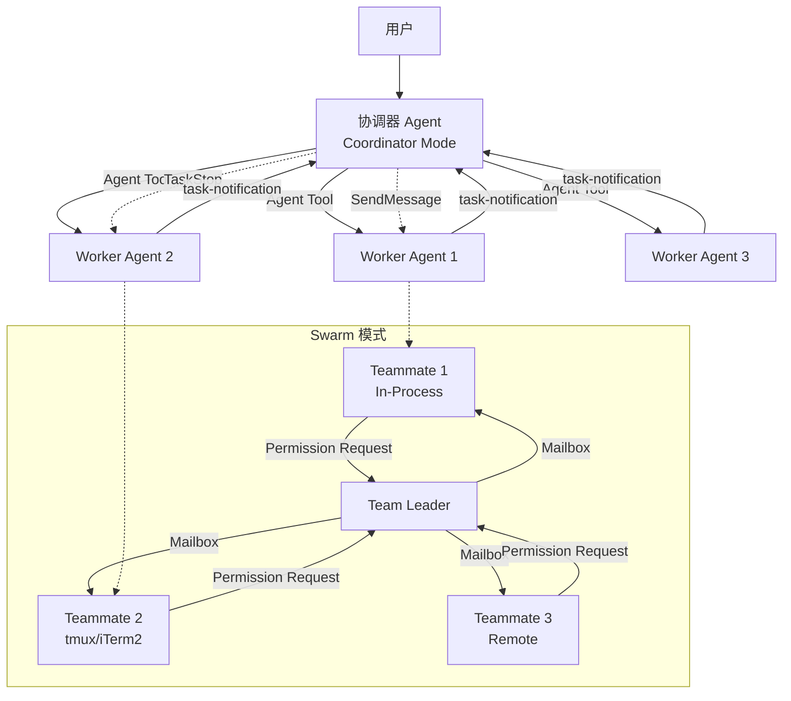
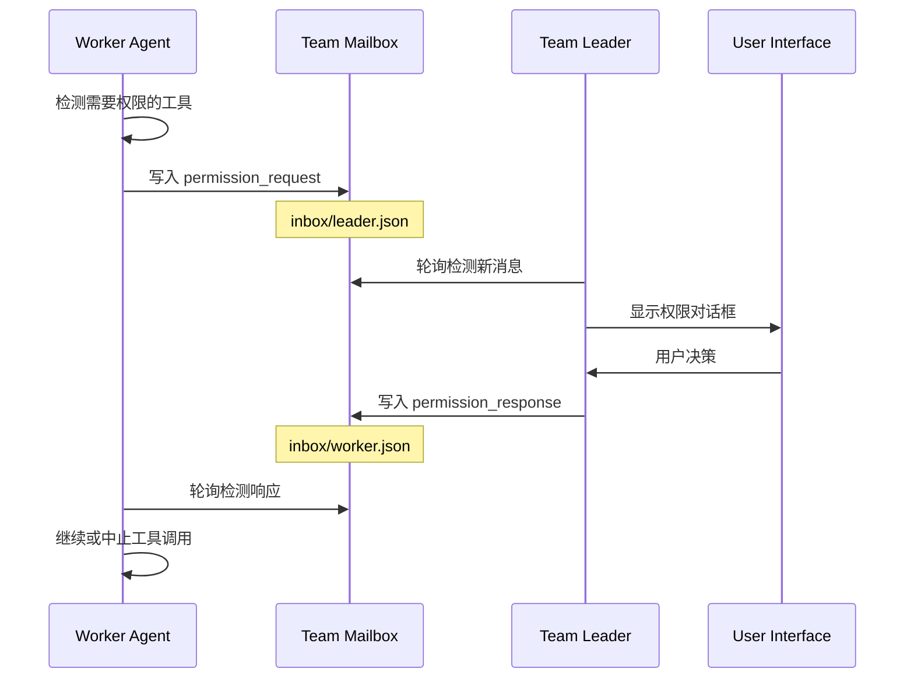

Claude Code 的协调器模式与 Swarm 模式构成了一个强大的多 Agent 协作系统，允许主 Agent 以协调者身份调度多个 Worker Agent 并行执行任务，同时通过灵活的后端架构实现进程内或进程间的 Agent 隔离。这一架构设计既支持单进程内的高效协作，也能通过 tmux 或 iTerm2 实现多终端面板的可视化编排。

## 核心架构概览



协调器模式通过环境变量 `CLAUDE_CODE_COORDINATOR_MODE` 激活，将 Claude Code 实例转换为任务调度中心。协调器不直接执行文件操作或 Shell 命令，而是通过 `Agent` 工具生成 Worker Agent，这些 Worker 拥有完整的工具集并能自主执行任务。Swarm 模式则在协调器基础上增加了 Team 机制，通过文件系统邮箱（Mailbox）和权限桥接实现 Agent 间的结构化通信与权限委托。

Sources: [coordinatorMode.ts](claude-code/src/coordinator/coordinatorMode.ts#L1-L370), [agentSwarmsEnabled.ts](claude-code/src/utils/agentSwarmsEnabled.ts#L1-L45)

## 协调器模式详解

### 角色定位与系统提示

协调器的核心系统提示明确定义了其职责边界：**你是一个协调者，而非执行者**。协调器通过专用工具集完成工作：

- **Agent 工具**：生成新的 Worker Agent 执行研究、实现、验证等任务
- **SendMessage 工具**：向已存在的 Worker 发送后续指令，利用其已加载的上下文
- **TaskStop 工具**：停止正在运行的 Worker（当发现方向错误或需求变更时）

协调器的系统提示强调三大原则：**理解不可委托**、**并行优于串行**、**验证必须独立**。当 Worker 完成研究后，协调器必须亲自阅读结果、理解问题、编写包含具体文件路径和行号的实现规范，然后再将任务委托给 Worker。这种"理解后委托"模式避免了懒性委托（如"根据研究结果修复问题"这类模糊指令）。

Sources: [coordinatorMode.ts](claude-code/src/coordinator/coordinatorMode.ts#L203-L370)

### Worker 能力边界

Worker Agent 拥有受限但完整的工具集。在 `CLAUDE_CODE_SIMPLE` 模式下，Worker 仅能使用 Bash、Read、Edit 三个核心工具；在完整模式下，Worker 可访问 `ASYNC_AGENT_ALLOWED_TOOLS` 定义的工具集，排除内部工具如 `TeamCreate`、`TeamDelete`、`SendMessage`、`SyntheticOutput`。Worker 还能访问父会话配置的 MCP 服务器工具和项目技能（通过 Skill 工具）。

```typescript
// Worker 工具集定义示例
const INTERNAL_WORKER_TOOLS = new Set([
  TEAM_CREATE_TOOL_NAME,
  TEAM_DELETE_TOOL_NAME,
  SEND_MESSAGE_TOOL_NAME,
  SYNTHETIC_OUTPUT_TOOL_NAME,
])

const workerTools = Array.from(ASYNC_AGENT_ALLOWED_TOOLS)
  .filter(name => !INTERNAL_WORKER_TOOLS.has(name))
  .sort()
  .join(', ')
```

如果启用了 `tengu_scratch` 功能门（Feature Gate），协调器会为 Worker 提供一个临时便笺目录（Scratchpad Directory），Worker 可在此自由读写而无需权限提示，用于跨 Worker 的持久化知识共享。

Sources: [coordinatorMode.ts](claude-code/src/coordinator/coordinatorMode.ts#L39-L82)

### 任务通知机制

Worker 完成任务后，通过 `task-notification` XML 格式的用户消息通知协调器。这种消息虽以用户角色出现，但包含结构化元数据：

```xml
<task-notification>
  <task-id>agent-a1b</task-id>
  <status>completed|failed|killed</status>
  <summary>Agent "Investigate auth bug" completed</summary>
  <result>Found null pointer in src/auth/validate.ts:42...</result>
  <usage>
    <total_tokens>N</total_tokens>
    <tool_uses>N</tool_uses>
    <duration_ms>N</duration_ms>
  </usage>
</task-notification>
```

协调器根据 `task-id` 判断消息来源，并通过 `SendMessage({to: "agent-a1b", message: "..."})` 继续该 Worker 的任务链。这种设计允许协调器在 Worker 完成研究后，向同一 Worker 发送综合后的实现规范，充分利用其已加载的文件上下文。

Sources: [coordinatorMode.ts](claude-code/src/coordinator/coordinatorMode.ts#L105-L157)

## Swarm 模式架构

### 启用条件与功能门控

Swarm 模式（Agent Teams/Teammate）通过 `isAgentSwarmsEnabled()` 函数统一判断，该函数检查三重条件：

1. **Ant 内部用户**：`USER_TYPE === 'ant'` 时始终启用
2. **外部用户**：需同时满足：
   - 通过环境变量 `CLAUDE_CODE_EXPERIMENTAL_AGENT_TEAMS=1` 或 CLI 标志 `--agent-teams` 显式启用
   - GrowthBook 功能门 `tengu_amber_flint` 为真（作为熔断器）

这种分层设计确保外部用户仅在自愿选择且后端配置允许时启用 Swarm 功能，避免意外激活导致的兼容性问题。

Sources: [agentSwarmsEnabled.ts](claude-code/src/utils/agentSwarmsEnabled.ts#L19-L45)

### 后端类型与隔离策略

Swarm 模式支持三种后端类型（`BackendType`）：

| 后端类型 | 描述 | 适用场景 | 优势 | 劣势 |
|---------|------|---------|------|------|
| **in-process** | 同一 Node.js 进程内运行，通过 AsyncLocalStorage 隔离上下文 | 轻量级并发、快速原型、资源受限环境 | 零启动开销、共享缓存、高效通信 | 单点故障、资源竞争、难以调试 |
| **tmux** | 使用 tmux 管理终端面板，每个 Agent 独立进程 | 终端环境、可视化需求、长时间任务 | 强隔离、可视化、可恢复 | 需要 tmux 依赖、较高内存占用 |
| **iterm2** | 使用 iTerm2 原生分屏（通过 it2 CLI） | macOS + iTerm2 用户、原生集成 | 更好的 macOS 集成、原生体验 | 仅限 iTerm2 用户、需额外安装 it2 |

后端检测通过 `detectAndGetBackend()` 自动完成，优先级为：iTerm2 > tmux > in-process。如果检测到 iTerm2 但未安装 it2 CLI，会提示用户运行 `/it2-setup` 命令。

Sources: [types.ts](claude-code/src/utils/swarm/backends/types.ts#L1-L200), [spawnMultiAgent.ts](claude-code/src/tools/shared/spawnMultiAgent.ts#L1-L150)

### In-Process Teammate 实现原理

In-Process Teammate 是 Swarm 模式的关键创新，它通过以下机制实现进程内多 Agent 并发：

1. **AsyncLocalStorage 上下文隔离**：每个 Teammate 拥有独立的 `TeammateContext`，包含 `agentId`、`agentName`、`teamName`、`color`、`abortController` 等字段。通过 `runWithTeammateContext()` 执行 Agent 循环时，所有日志、指标、会话状态都自动路由到当前上下文。

```typescript
// TeammateContext 定义示例
export type TeammateContext = {
  agentId: string        // "researcher@my-team"
  agentName: string      // "researcher"
  teamName: string       // "my-team"
  color?: AgentColorName // 'red', 'blue', 'green' 等
  planModeRequired?: boolean
  parentSessionId: string
  abortController: AbortController
}
```

2. **AbortController 链式控制**：每个 Teammate 拥有独立的 `AbortController`，与父会话的控制器**解除链接**。当协调器的查询被中断时，Teammate 继续运行直到任务完成或显式停止，避免级联中断导致工作丢失。

3. **文件状态缓存克隆**：Teammate 启动时通过 `cloneFileStateCache()` 复制父会话的文件状态缓存，享受缓存预热的同时避免状态污染。每个 Teammate 的文件读取独立记录，不影响其他 Agent 的缓存命中率。

4. **消息传递与邮箱系统**：Teammate 通过文件系统邮箱与其他 Agent 通信。邮箱文件位于 `~/.claude/teams/{team_name}/inboxes/{agent_name}.json`，使用文件锁（`proper-lockfile`）防止并发写入冲突。

Sources: [teammateContext.ts](claude-code/src/utils/teammateContext.ts), [spawnInProcess.ts](claude-code/src/utils/swarm/spawnInProcess.ts#L1-L150), [teammateMailbox.ts](claude-code/src/utils/teammateMailbox.ts#L1-L150)

## 权限同步与审批流程

### 跨 Agent 权限委托机制

Swarm 模式下的权限管理通过 `permissionSync.ts` 模块实现跨 Agent 的权限请求/响应流程：



Worker Agent 在遇到需要权限的工具调用时（如 Bash 命令、文件编辑），通过 `createPermissionRequest()` 构建请求对象，包含工具名、输入参数、建议权限规则等元数据，然后通过 `writeToMailbox()` 写入 Leader 的收件箱。Leader 的 UI 线程通过 `useSwarmPermissionPoller` 钩子每 500ms 轮询邮箱，检测到 `permission_request` 类型消息后弹出权限对话框。

用户批准或拒绝后，Leader 将决策结果通过 `permission_response` 消息回写至 Worker 的收件箱，Worker 在下一个轮询周期读取响应并继续执行。这种异步轮询机制避免了 RPC 调用的复杂性，同时保证了消息的可靠传递。

Sources: [permissionSync.ts](claude-code/src/utils/swarm/permissionSync.ts#L1-L100), [teammateMailbox.ts](claude-code/src/utils/teammateMailbox.ts#L200-L400)

### Leader 权限桥接

对于 In-Process Teammate，权限请求可通过更高效的内存桥接机制处理。`leaderPermissionBridge.ts` 提供了 `getLeaderToolUseConfirmQueue()` 函数，直接返回 Leader 的工具确认队列引用，允许 Worker 的权限请求通过 Leader 的 UI 组件显示：

```typescript
// Worker 的 canUseTool 函数示例
function createInProcessCanUseTool(
  identity: TeammateIdentity,
  abortController: AbortController,
): CanUseToolFn {
  return async (tool, input, toolUseContext, assistantMessage, toolUseID, forceDecision) => {
    const result = forceDecision ?? await hasPermissionsToUseTool(...)
    
    if (result.type === 'ask') {
      // 尝试通过 Leader 的 UI 桥接显示对话框
      const bridge = getLeaderToolUseConfirmQueue()
      if (bridge) {
        return await bridge.pushAndWaitForResult({
          tool,
          input,
          identity,
          toolUseID,
        })
      }
      
      // 回退到邮箱系统
      return await requestViaMailbox(...)
    }
    
    return result
  }
}
```

这种桥接机制使 Teammate 的权限提示与 Leader 自身的工具使用保持一致的 UI 体验（如 `BashPermissionRequest`、`FileEditToolDiff` 等专用组件），而非通用的文本确认框。

Sources: [inProcessRunner.ts](claude-code/src/utils/swarm/inProcessRunner.ts#L70-L150), [leaderPermissionBridge.ts](claude-code/src/utils/swarm/leaderPermissionBridge.ts)

## 任务生命周期与状态管理

### Task 状态定义

Swarm 中的每个 Teammate 在 `AppState.tasks` 中注册为独立的任务状态对象。In-Process Teammate 使用 `InProcessTeammateTaskState` 类型，Panel-Based Teammate（tmux/iTerm2）使用 `LocalAgentTaskState` 类型：

```typescript
// InProcessTeammateTaskState 核心字段
type InProcessTeammateTaskState = TaskStateBase & {
  type: 'in_process_teammate'
  identity: TeammateIdentity          // Agent 身份信息
  prompt: string                       // 初始任务描述
  model?: string                       // 模型覆盖
  selectedAgent?: AgentDefinition      // 使用的 Agent 定义
  abortController?: AbortController    // 运行时控制器
  awaitingPlanApproval: boolean        // 是否等待计划审批
  permissionMode: PermissionMode       // 独立权限模式
  messages?: Message[]                 // 对话历史（UI 镜像）
  pendingUserMessages: string[]        // 待投递的用户消息队列
  isIdle: boolean                      // 是否空闲
  shutdownRequested: boolean           // 是否请求关闭
  progress?: AgentProgress             // 进度跟踪
  lastReportedToolCount: number        // 上次报告的工具计数
  lastReportedTokenCount: number       // 上次报告的 Token 计数
}
```

任务状态通过 `registerTask()` 函数注册到全局任务框架，该框架提供统一的任务生命周期管理、持久化存储（`getTaskOutputPath`）、SDK 事件发射等功能。

Sources: [types.ts](claude-code/src/tasks/InProcessTeammateTask/types.ts#L1-L100), [framework.ts](claude-code/src/utils/task/framework.ts)

### 消息上限与内存优化

为防止长时间运行的 Swarm 会话耗尽内存，InProcessTeammateTask 对 `task.messages` 数组设置了 100 条消息的上限（`MAX_MESSAGES_IN_TASK_STATE = 100`）。该数组仅用于 UI 的缩放视图，完整的对话历史存储在本地 `allMessages` 数组（`inProcessRunner.ts` 中）和磁盘上的 Agent 转录文件中。

BigQuery 分析显示，在 500+ 轮会话中，每个 Agent 占用约 20MB RSS，并发 Swarm 爆发时可达到 125MB/Agent。最极端的案例（会话 9a990de8）在 2 分钟内启动了 292 个 Agent，内存占用峰值达到 36.8GB，其中 `task.messages` 数组的重复存储是主要成本。通过 100 条消息上限，内存占用降低至原本的 10-20%，同时保持 UI 响应性。

Sources: [types.ts](claude-code/src/tasks/InProcessTeammateTask/types.ts#L95-L122)

### 空闲通知与关闭流程

Teammate 完成任务或进入空闲状态时，通过 `teammateInit.ts` 注册的 Stop 钩子向 Leader 发送空闲通知：

```typescript
// 空闲通知示例
addFunctionHook(setAppState, sessionId, 'Stop', '', async (messages, _signal) => {
  // 标记 Teammate 为非活跃状态
  void setMemberActive(teamName, agentName, false)
  
  // 构建空闲通知
  const notification = createIdleNotification(agentName, {
    idleReason: 'available',
    summary: getLastPeerDmSummary(messages),
  })
  
  // 写入 Leader 邮箱
  await writeToMailbox(leadAgentName, {
    from: agentName,
    text: jsonStringify(notification),
    timestamp: new Date().toISOString(),
    color: getTeammateColor(),
  })
  
  return true // 不阻塞 Stop 事件
})
```

Leader 的 UI 轮询邮箱检测到空闲通知后，可在 `CoordinatorAgentStatus` 组件中显示 Teammate 的可用状态，允许用户通过快捷键将新任务分配给已加载上下文的空闲 Teammate，而非生成新实例。

Sources: [teammateInit.ts](claude-code/src/utils/swarm/teammateInit.ts#L40-L130)

## 协调器与 Swarm 的协同模式

### 研究与实现的分离

协调器模式最强大的应用场景是**研究-综合-实现**三阶段工作流：

1. **研究阶段**（并行）：协调器生成多个 Worker 并行研究不同方向
   ```typescript
   Agent({ description: "Investigate auth bug", prompt: "..." })
   Agent({ description: "Research token storage", prompt: "..." })
   ```

2. **综合阶段**（协调器）：阅读所有 Worker 的 `<task-notification>`，理解问题根源，编写精确的实现规范

3. **实现阶段**（Worker）：将规范传递给一个或多个 Worker 执行

4. **验证阶段**（独立 Worker）：生成新的 Worker 进行独立验证，确保实现者不验证自己的代码

Swarm 模式在此流程基础上增加了 Team 上下文的持久化：研究 Worker 可以通过 Team Allowed Paths 共享允许编辑的目录，避免每个 Agent 重复请求权限；Leader 可以通过 Team File 追踪所有成员的状态，动态调整任务分配。

Sources: [coordinatorMode.ts](claude-code/src/coordinator/coordinatorMode.ts#L205-L245)

### 上下文复用策略

协调器需要在"继续现有 Worker"与"生成新 Worker"之间做出决策，关键判断依据是**上下文重叠度**：

| 场景 | 策略 | 原因 |
|-----|------|------|
| 研究涉及的文件正是需要编辑的文件 | **继续**（SendMessage） | Worker 已加载文件到上下文，避免重复读取 |
| 研究范围广泛，实现范围狭窄 | **生成新实例**（Agent） | 避免拖入无关的探索噪声，干净上下文更高效 |
| 修正失败或扩展现有工作 | **继续** | Worker 拥有错误上下文和刚尝试过的知识 |
| 验证另一个 Worker 刚写的代码 | **生成新实例** | 验证者应以新视角审视代码，不携带实现假设 |
| 完全无关的任务 | **生成新实例** | 无可复用的上下文 |

Swarm 模式下的 Teammate 初始化钩子（`useSwarmInitialization`）会自动检测恢复的会话，从转录消息中提取 `teamName` 和 `agentName`，重建 Team 上下文，确保恢复后的 Agent 仍能访问 Team 的共享资源和邮箱。

Sources: [coordinatorMode.ts](claude-code/src/coordinator/coordinatorMode.ts#L290-L320), [useSwarmInitialization.ts](claude-code/src/hooks/useSwarmInitialization.ts#L30-L82)

## 高级特性与最佳实践

### Plan Mode 的强制应用

在 Swarm 模式下，可通过 `mode: 'plan'` 参数或在 Team File 中设置 `planModeRequired: true`，强制 Teammate 在实施前必须进入 Plan Mode 并获得 Leader 批准。这对于高风险操作（如数据库迁移、生产环境部署）至关重要：

```typescript
// 生成需要计划审批的 Teammate
Agent({
  name: "migration-runner",
  prompt: "Migrate user table to new schema...",
  mode: "plan", // 强制进入 Plan Mode
  team_name: "migration-team"
})
```

Teammate 在 Plan Mode 下会先生成实施计划，Leader 审查计划后通过 SendMessage 发送批准或修改建议，Teammate 才能执行实际操作。这种两阶段提交机制将风险控制在计划审查阶段，避免盲目执行导致的不可逆后果。

Sources: [constants.ts](claude-code/src/utils/swarm/constants.ts#L26-L34), [InProcessTeammateTask.ts](claude-code/src/tasks/InProcessTeammateTask/InProcessTeammateTask.ts)

### 性能追踪与遥测

Swarm 模式集成了 Perfetto 追踪系统（`perfettoTracing.ts`），可通过 `isPerfettoTracingEnabled()` 判断是否启用。启用后，每个 Agent 的启动、停止、工具调用等事件都会记录到 Perfetto 格式的追踪文件，用于性能分析和瓶颈定位：

```typescript
// 注册 Agent 到 Perfetto 追踪
if (isPerfettoTracingEnabled()) {
  registerPerfettoAgent(agentId, {
    name: agentName,
    parentSessionId: parentSessionId,
    teamName: teamName,
  })
}

// Agent 完成后注销
unregisterPerfettoAgent(agentId)
```

追踪文件可通过 Perfetto UI（ui.perfetto.dev）可视化，展示 Agent 间的并发关系、等待时间、资源竞争等关键指标。

Sources: [spawnInProcess.ts](claude-code/src/utils/swarm/spawnInProcess.ts#L95-L120), [perfettoTracing.ts](claude-code/src/utils/telemetry/perfettoTracing.ts)

### Worktree 隔离模式

对于高风险的代码变更，协调器可通过 `isolation: 'worktree'` 参数为 Worker 创建临时 Git Worktree，使其在代码库的独立副本上工作：

```typescript
Agent({
  description: "Refactor auth module",
  prompt: "...",
  isolation: "worktree", // 创建隔离 Worktree
  cwd: "/path/to/worktree" // 与 isolation 互斥
})
```

Worktree 创建后会生成独立分支，Worker 的所有变更都限制在该分支内。完成后，协调器可审查 Worktree 的变更，决定是否合并到主分支。这种物理隔离避免了实验性代码污染主工作区，特别适合大规模重构或不确定的技术探索。

Sources: [AgentTool.tsx](claude-code/src/tools/AgentTool/AgentTool.tsx#L50-L120), [worktree.ts](claude-code/src/utils/worktree.ts)

## 故障排查与调试技巧

### 常见问题诊断

1. **Swarm 功能未启用**：检查 `isAgentSwarmsEnabled()` 返回值，确认环境变量或 CLI 标志已设置，且 GrowthBook 门控为真。可通过 `claude-code --agent-teams` 显式启用。

2. **Teammate 无法启动**：检查后端检测日志（`detectAndGetBackend()`），确认 tmux 或 iTerm2 可用。对于 In-Process 模式，检查是否有资源竞争或死锁。

3. **权限请求无响应**：检查邮箱轮询是否正常（`useSwarmPermissionPoller`），确认 Leader 的 UI 未冻结。可通过 `readMailbox()` 手动检查收件箱内容。

4. **内存占用过高**：检查 `task.messages` 数组是否超过上限，确认长时间运行的任务定期调用 `compactConversation()` 压缩对话历史。

Sources: [agentSwarmsEnabled.ts](claude-code/src/utils/agentSwarmsEnabled.ts#L19-L45), [teammateMailbox.ts](claude-code/src/utils/teammateMailbox.ts#L50-L150)

### 调试工具与日志

- **`logForDebugging()`**：Swarm 相关模块使用统一的调试日志函数，可通过环境变量控制输出级别
- **邮箱文件检查**：直接查看 `~/.claude/teams/{team}/inboxes/*.json`，确认消息格式和状态
- **Team File 检查**：查看 `~/.claude/teams/{team}/config.json`，确认成员列表、Leader ID、Team Allowed Paths 等配置
- **Perfetto 追踪**：启用性能追踪后，通过 Perfetto UI 分析 Agent 生命周期和并发瓶颈

Sources: [teamHelpers.ts](claude-code/src/utils/swarm/teamHelpers.ts#L50-L200), [debug.ts](claude-code/src/utils/debug.ts)

## 总结

协调器模式与 Swarm 模式共同构成了 Claude Code 多 Agent 协作的基石。协调器通过明确的角色分工和工具限制，将 Claude 转换为任务调度专家，利用并行 Worker 实现高效的研究-实现-验证闭环。Swarm 模式则在此基础上引入了 Team 概念，通过文件系统邮箱、权限桥接、多后端支持等机制，实现了跨进程的 Agent 协作与资源隔离。

两者的结合使得 Claude Code 能够处理从简单代码修复到大规模系统重构的各类任务，在保证安全性的同时最大化并行效率。无论是单进程内的轻量级协作，还是跨终端的可视化编排，这套架构都提供了灵活且强大的解决方案，为复杂软件工程任务提供了前所未有的自动化能力。

## 相关主题

- [子 Agent 机制](21-zi-agent-ji-zhi) - 了解 Agent 工具的具体实现与调度算法
- [Worktree 隔离环境](22-worktree-ge-chi-huan-jing) - 深入 Worktree 创建、管理与合并流程
- [权限模型与审批流程](13-quan-xian-mo-xing-yu-shen-pi-liu-cheng) - 掌握 Swarm 权限委托的底层机制
- [上下文压缩策略](19-shang-xia-wen-ya-suo-ce-lue) - 学习长时间运行 Swarm 的内存优化技巧
- [Hooks 钩子系统](25-hooks-gou-zi-xi-tong) - 探索 Teammate Stop 钩子的注册与执行原理