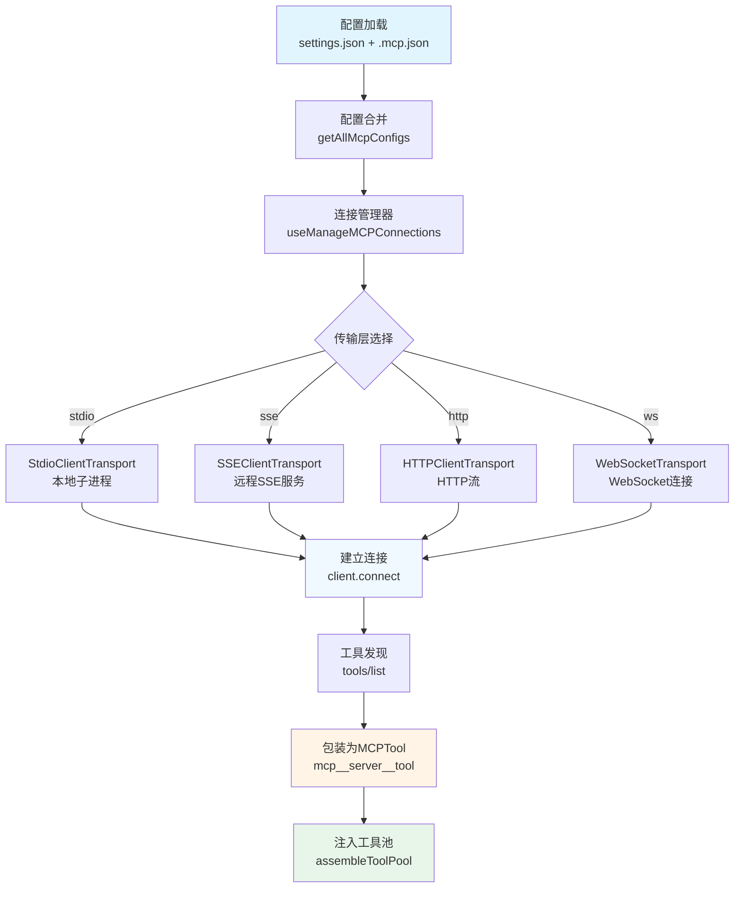
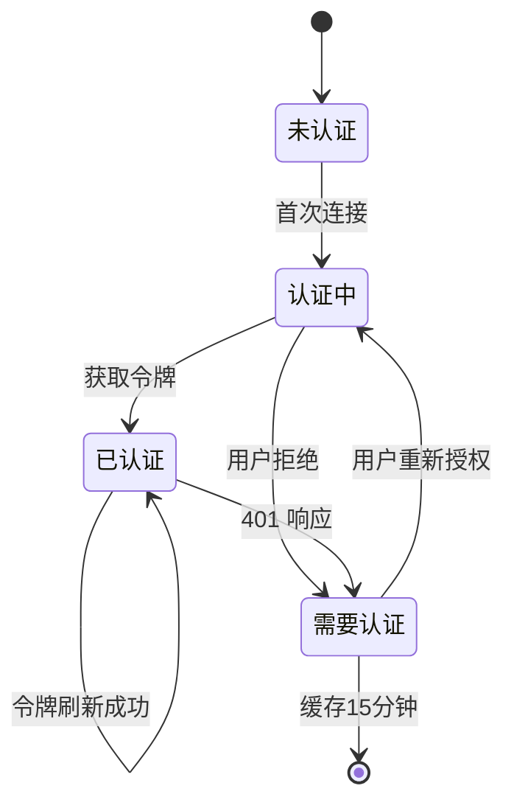

**Model Context Protocol (MCP)** 是 Claude Code 的核心扩展机制，通过标准化的协议让外部服务器为 AI 提供工具、资源和技能。本节将深入解析 MCP 在 Claude Code 中的集成架构、七种传输层实现、连接管理机制以及工具发现与执行链路。

## 架构总览：从配置到可用工具

MCP 集成遵循清晰的分层架构，从配置加载到工具可用经历五个关键阶段。配置系统首先合并 user/project/local/enterprise 多个作用域的 MCP 服务器定义，然后由连接管理器根据配置类型创建相应的传输层（stdio/sse/http/ws 等）。连接建立后，系统自动发现服务器提供的工具、资源和提示符，将它们包装为 Claude Code 的统一接口，最终注入到工具池中供 AI 调用。



Sources: [config.ts](claude-code/src/services/mcp/config.ts#L1-L1580) [client.ts](claude-code/src/services/mcp/client.ts#L596-L795) [useManageMCPConnections.ts](claude-code/src/services/mcp/useManageMCPConnections.ts#L1-L100)

## 七种传输层实现

MCP 协议支持多种传输方式，适应不同的部署场景。`connectToServer()` 根据配置中的 `type` 字段动态选择传输实现，每种传输层都有特定的认证机制和生命周期管理。

| 传输类型 | Transport 类 | 适用场景 | 认证方式 | 并发限制 |
|----------|-------------|---------|---------|---------|
| **stdio**（默认） | `StdioClientTransport` | 本地子进程服务器 | 无需认证 | 3个并发 |
| **sse** | `SSEClientTransport` | 远程 Server-Sent Events | `ClaudeAuthProvider` + OAuth | 20个并发 |
| **http** | `StreamableHTTPClientTransport` | HTTP 流式传输 | `ClaudeAuthProvider` + OAuth | 20个并发 |
| **sse-ide** | `SSEClientTransport` | IDE 扩展集成 | lockfile token | 无限制 |
| **ws-ide** | `WebSocketTransport` | IDE WebSocket | `X-Claude-Code-Ide-Authorization` | 无限制 |
| **ws** | `WebSocketTransport` | WebSocket 远程服务 | session ingress token | 20个并发 |
| **claudeai-proxy** | `StreamableHTTPClientTransport` | claude.ai 托管服务 | OAuth bearer + 401 重试 | 20个并发 |

**stdio 传输**是重量级的本地子进程模式，每个服务器都是独立进程。清理时采用信号升级策略：先发送 SIGINT 等待 100ms，未响应则升级到 SIGTERM 等待 400ms，最后强制 SIGKILL，总超时控制在 600ms 内。这种设计防止 MCP 服务器阻塞 CLI 退出。

**远程传输**（sse/http/ws）使用轻量级 HTTP/WebSocket 连接，允许更高的并发数。认证通过 `ClaudeAuthProvider` 实现 OAuth 2.0 流程，401 响应触发自动令牌刷新或认证提示。为避免重复认证弹窗，系统维护 15 分钟 TTL 的 `mcp-needs-auth-cache.json` 缓存。

```typescript
// stdio 传输配置示例
{
  "command": "npx",
  "args": ["-y", "@modelcontextprotocol/server-filesystem", "/path/to/allowed/dir"],
  "env": { "NODE_ENV": "production" }
}

// http 传输配置示例
{
  "type": "http",
  "url": "https://api.example.com/mcp",
  "oauth": {
    "clientId": "your-client-id",
    "callbackPort": 8080
  }
}
```

Sources: [client.ts](claude-code/src/services/mcp/client.ts#L596-L795) [types.ts](claude-code/src/services/mcp/types.ts#L1-L100)

## 连接管理与缓存机制

连接建立使用 lodash `memoize` 进行智能缓存，缓存键为 `${name}-${JSON.stringify(config)}`。相同的配置不会重复建立连接，但配置变更会触发新连接创建。每个连接对象维护独立的工具、资源和命令缓存，通过 `fetchToolsForClient`、`fetchResourcesForClient` 和 `fetchCommandsForClient` 使用 LRU 策略管理（上限 20）。

```typescript
export const connectToServer = memoize(
  async (name: string, serverRef: ScopedMcpServerConfig): Promise<MCPServerConnection> => {
    // 创建传输层并建立连接
    const client = new Client({ name: 'claude-code', version }, { capabilities })
    await client.connect(transport)
    
    // 注册关闭回调以清除缓存
    client.onclose = () => {
      const key = getServerCacheKey(name, serverRef)
      fetchToolsForClient.cache.delete(name)
      fetchResourcesForClient.cache.delete(name)
      fetchCommandsForClient.cache.delete(name)
      connectToServer.cache.delete(key)
    }
    
    return { type: 'connected', client }
  }
)
```

**连接降级检测**针对远程传输实现连续错误计数器。当遇到 ECONNRESET、ETIMEDOUT、EPIPE 等终端错误连续 3 次后，主动关闭 transport 触发重连。HTTP 传输额外检测 session 过期（404 状态码 + JSON-RPC code -32001），自动清除缓存并重建连接。

**请求级超时保护**避免单个请求阻塞整个系统。每个 HTTP 请求使用独立的 `setTimeout`（而非共享的 `AbortSignal.timeout()`），原因是 Bun 对 AbortSignal.timeout 的垃圾回收是惰性的——即使请求毫秒级完成，2.4KB 原生内存也要等 60s 才回收。使用 `timer.unref()` 确保超时不阻止进程退出。

Sources: [client.ts](claude-code/src/services/mcp/client.ts#L596-L800) [useManageMCPConnections.ts](claude-code/src/services/mcp/useManageMCPConnections.ts#L1-L1142)

## 工具发现与命名规范

MCP 服务器连接后，系统自动调用 `tools/list` 端点发现可用工具。每个工具通过 `buildMcpToolName` 构建全限定名：`mcp__${serverName}__${toolName}`，例如 `mcp__my-database__query`。这种命名规范确保不同服务器的同名工具不会冲突，同时便于权限系统精确匹配。

工具描述自动截断至 2048 字符（`MAX_MCP_DESCRIPTION_LENGTH`），防止 OpenAPI 生成的超长文档（曾观察到 15-60KB 的描述）污染上下文。工具的能力标注从 `tool.annotations` 自动提取：

| 注解字段 | 映射到能力 | 语义 |
|----------|-----------|------|
| `readOnlyHint` | `isReadOnly()` + `isConcurrencySafe()` | 只读操作，可并行执行 |
| `destructiveHint` | `isDestructive()` | 破坏性操作，需谨慎确认 |
| `openWorldHint` | `isOpenWorld()` | 开放世界，不可枚举影响范围 |
| `title` | `userFacingName()` | 用户友好的显示名称 |

**权限检查**默认返回 `{ behavior: 'passthrough' }`，意味着所有 MCP 工具都会进入权限确认流程。权限规则使用 `mcp__` 前缀精确匹配，例如 `allowedTools: ["mcp__my-db__query"]` 只允许特定的查询工具，而不影响其他工具。

Sources: [client.ts](claude-code/src/services/mcp/client.ts#L1745-L2000) [mcpStringUtils.ts](claude-code/src/services/mcp/mcpStringUtils.ts#L1-L80) [MCPTool.ts](claude-code/src/tools/MCPTool/MCPTool.ts#L1-L78)

## 工具执行链路与内容处理

当 AI 生成 `tool_use` 消息调用 MCP 工具时，执行链路经过多个安全检查和转换层。`MCPTool.call()` 首先确保连接有效（必要时触发重连），然后调用 `callMCPToolWithUrlElicitationRetry` 处理可能的 Elicitation 重试场景。

```typescript
async call(input: Record<string, unknown>): Promise<ToolResult> {
  const client = await ensureConnectedClient()
  const result = await callMCPToolWithUrlElicitationRetry(
    client,
    toolName,
    input
  )
  
  // 处理图片结果：resize + persist
  const processedContent = await processMcpContent(result.content)
  
  // 内容截断（如果超过限制）
  const truncated = truncateMcpContentIfNeeded(processedContent)
  
  return { data: truncated, mcpMeta: result.meta }
}
```

**Session 过期自动重试**机制针对 HTTP 传输实现。检测到 `McpSessionExpiredError` 后，系统自动重试一次，因为 `ensureConnectedClient()` 已经清除了旧缓存并建立了新连接。这种设计对用户完全透明。

**内容截断与持久化**处理大型输出。文本内容通过 `truncateMcpContentIfNeeded` 智能截断，保留关键信息。二进制内容（如图片）通过 `persistBinaryContent` 写入文件系统，图片自动 resize（`maybeResizeAndDownsampleImageBuffer`）以优化显示性能，返回文件路径供 AI 引用。

Sources: [client.ts](claude-code/src/services/mcp/client.ts#L1835-L1900) [MCPTool.ts](claude-code/src/tools/MCPTool/MCPTool.ts#L1-L78)

## 多作用域配置系统

MCP 服务器配置支持五个作用域，按优先级从高到低依次为：**dynamic**（运行时动态添加）、**local**（项目级 `.mcp.json`）、**project**（项目级 `settings.json`）、**user**（用户级 `settings.json`）、**enterprise**（企业托管配置）。`getAllMcpConfigs` 合并所有作用域，相同名称的服务器以高优先级配置为准。

**企业托管配置**通过 `managed-mcp.json` 文件部署，位于系统托管目录（通过 `getManagedFilePath()` 获取）。当企业配置存在时，禁止使用 `--strict-mcp-config` 标志和动态配置 MCP 服务器，确保安全策略的强制执行。

```typescript
// 配置作用域优先级
type ConfigScope = 
  | 'local'      // .mcp.json (项目根目录)
  | 'user'       // ~/.config/claude-code/settings.json
  | 'project'    // .claude/settings.json (项目级)
  | 'dynamic'    // --mcp-config 参数
  | 'enterprise' // managed-mcp.json
  | 'claudeai'   // claude.ai 云端同步
```

**配置验证**使用 Zod schema 确保类型安全。`McpServerConfigSchema` 定义了所有传输类型的结构约束，例如 HTTP 配置必须包含有效的 URL，OAuth 配置的 `authServerMetadataUrl` 必须使用 HTTPS。验证失败时，错误信息包含具体的字段路径和期望类型。

Sources: [config.ts](claude-code/src/services/mcp/config.ts#L1-L1580) [types.ts](claude-code/src/services/mcp/types.ts#L1-L100)

## 认证状态机与 OAuth 流程

远程 MCP 服务器（sse/http）使用 `ClaudeAuthProvider` 实现 OAuth 2.0 授权码流程。认证状态机包含四个状态：**未认证**（初始状态）、**认证中**（用户授权中）、**已认证**（令牌有效）、**需要认证**（401 响应或令牌过期）。



**401 处理流程**：当远程请求返回 401 Unauthorized 时，`wrapFetchWithStepUpDetection` 检测到认证失败，触发 `handleRemoteAuthFailure()`。该函数记录遥测事件 `tengu_mcp_server_needs_auth`，写入 15 分钟 TTL 的缓存文件，然后返回 `{ type: 'needs-auth' }` 状态。UI 层显示认证提示，用户点击后启动 OAuth 授权流程。

**Step-up 检测**用于识别需要更高权限的操作。当 403 Forbidden 响应包含特定的 step-up 提示时，系统自动引导用户完成额外的权限授予流程，而非简单的失败报错。

Sources: [auth.ts](claude-code/src/services/mcp/auth.ts#L1-L100) [client.ts](claude-code/src/services/mcp/client.ts#L493-L600)

## 高级特性：技能发现与通道权限

**MCP 技能发现**（Feature Flag: `MCP_SKILLS`）将 MCP 服务器的 `skill://` URI 资源转换为可调用的技能命令。启用此特性后，`fetchMcpSkillsForClient` 在连接建立时扫描资源列表，提取 `skill://` 协议的资源，转换为 `prompt` 类型的 Command 对象。技能命名遵循 `<serverName>:<skillName>` 格式，与插件技能保持一致。

**通道权限转发**（Feature Flag: `tengu_harbor_permissions`）允许通过外部通道（Telegram、iMessage、Discord）响应权限提示。当权限对话框触发时，系统同时向所有活动通道发送结构化的权限请求事件。用户回复格式为 `yes|no <5字符ID>`（例如 `yes abcde`），通道服务器解析后发送 `notifications/claude/channel/permission` 事件，包含 `{request_id, behavior}` 字段。

权限 ID 使用 25 字母表生成，5 字符提供约 980 万空间。为防止意外生成不雅词汇，系统维护子字符串黑名单（fuck、shit 等），生成 ID 时检测到匹配则重新哈希。这种设计在易用性和安全性之间取得平衡。

Sources: [mcpSkills.ts](claude-code/src/skills/mcpSkills.ts#L1-L8) [channelPermissions.ts](claude-code/src/services/mcp/channelPermissions.ts#L1-L100) [mcp-skills.md](claude-code/docs/features/mcp-skills.md#L1-L100)

## 用户界面与服务器管理

`/mcp` 命令提供交互式的 MCP 服务器管理界面，支持查看所有配置的服务器、连接状态、能力列表和服务器操作。子命令包括：

- **`/mcp`**：打开服务器列表，显示每个服务器的状态（connected/failed/needs-auth/disabled）
- **`/mcp reconnect <server>`**：重新连接指定服务器，清除所有缓存
- **`/mcp enable <server>`**：启用被禁用的服务器
- **`/mcp disable <server>`**：禁用服务器（保留配置但不连接）

`MCPConnectionManager` React 组件提供上下文 API，`useMcpReconnect` 和 `useMcpToggleEnabled` hooks 供其他组件调用连接管理功能。状态通过 `AppState.mcp` 集中管理，包含 `clients`（连接对象）、`tools`（工具列表）、`commands`（提示符和技能）、`resources`（资源列表）四个子状态。

**实时通知处理**监听 MCP 服务器的列表变更通知。`ToolListChangedNotificationSchema`、`ResourceListChangedNotificationSchema` 和 `PromptListChangedNotificationSchema` 分别触发对应的重新获取操作，确保客户端与服务器状态同步。

Sources: [mcp.tsx](claude-code/src/commands/mcp/mcp.tsx#L1-L85) [MCPConnectionManager.tsx](claude-code/src/services/mcp/MCPConnectionManager.tsx#L1-L73) [useManageMCPConnections.ts](claude-code/src/services/mcp/useManageMCPConnections.ts#L200-L300)

## 官方注册表与安全策略

**官方 MCP 注册表**（`https://api.anthropic.com/mcp-registry/v0/servers`）提供经过验证的 MCP 服务器列表。启动时调用 `prefetchOfficialMcpUrls()` 预加载（可通过 `CLAUDE_CODE_DISABLE_NONESSENTIAL_TRAFFIC` 禁用），URL 标准化后存入 Set 供快速查找。`isOfficialMcpUrl()` 函数用于识别官方服务器，可能影响信任级别或 UI 展示。

**企业策略执行**在配置合并阶段实施。当企业配置存在时，`filterMcpServersByPolicy` 过滤掉所有非企业配置的服务器，除非服务器在白名单中。这确保企业环境中的 MCP 扩展符合安全策略。

**名称标准化**（`normalizeNameForMCP`）确保服务器名和工具名符合 API 模式 `^[a-zA-Z0-9_-]{1,64}$`。非法字符替换为下划线，连续下划线合并（针对 claude.ai 服务器）。这种标准化防止注入攻击和命名冲突。

Sources: [officialRegistry.ts](claude-code/src/services/mcp/officialRegistry.ts#L1-L73) [normalization.ts](claude-code/src/services/mcp/normalization.ts#L1-L24) [config.ts](claude-code/src/services/mcp/config.ts#L800-L900)

## 最佳实践与故障排查

### 配置建议

**生产环境推荐**使用 stdio 传输配合显式的环境变量，避免路径查找的不确定性。敏感信息（API 密钥、数据库 URL）通过 `env` 字段传递，而非硬编码在命令参数中。

```json
{
  "mcpServers": {
    "database": {
      "command": "/usr/local/bin/mcp-db-server",
      "args": ["--readonly"],
      "env": {
        "DATABASE_URL": "${DB_URL}",
        "API_KEY": "${DB_API_KEY}"
      }
    }
  }
}
```

**环境变量展开**（`expandEnvVarsInString`）支持 `${VAR}` 和 `$VAR` 语法，在配置加载时执行。未定义的变量保持原样（不替换为空字符串），便于调试。

### 性能优化

**并发控制**根据传输类型自动调整：本地 stdio 服务器限制 3 个并发（子进程开销大），远程服务器允许 20 个并发（HTTP 请求轻量）。通过 `getMcpServerConnectionBatchSize()` 和 `getRemoteMcpServerConnectionBatchSize()` 配置。

**缓存策略**在三个层次实施：连接缓存（memoize）、工具/资源缓存（LRU 20）、认证缓存（15 分钟 TTL）。理解缓存失效时机（连接关闭、配置变更、列表变更通知）有助于诊断状态不一致问题。

### 故障排查

**连接失败**时检查配置文件的 JSON 语法（使用 `jq` 或在线验证器），确认命令路径可执行（`which npx`），验证环境变量已正确设置（`echo $DB_URL`）。启用调试模式（`--debug` 或 `--mcp-debug`）查看详细日志。

**工具未出现**通常由服务器能力声明缺失导致。使用 `/mcp` 命令查看服务器状态和 capabilities 字段，确认 `tools` 能力已声明。检查服务器日志（stdio 类型会输出到 Claude Code 的日志文件）。

**认证循环**可能是令牌刷新失败或 OAuth 配置错误。删除 `~/.config/claude-code/mcp-needs-auth-cache.json` 强制重新认证，检查 OAuth 回调端口未被占用（`lsof -i :8080`），验证 `authServerMetadataUrl` 可访问。

Sources: [config.ts](claude-code/src/services/mcp/config.ts#L200-L400) [envExpansion.ts](claude-code/src/services/mcp/envExpansion.ts#L1-L50) [client.ts](claude-code/src/services/mcp/client.ts#L1400-L1500)

## 扩展阅读

MCP 协议集成作为可扩展性的核心，与其他系统紧密关联：

- **[工具架构与注册机制](8-gong-ju-jia-gou-yu-zhu-ce-ji-zhi)**：了解 MCP 工具如何融入整体工具系统
- **[权限模型与审批流程](13-quan-xian-mo-xing-yu-shen-pi-liu-cheng)**：MCP 工具的权限检查链路
- **[Hooks 钩子系统](25-hooks-gou-zi-xi-tong)**：在 MCP 工具执行前后注入自定义逻辑
- **[Skills 技能扩展](26-skills-ji-neng-kuo-zhan)**：MCP 技能的发现与调用机制

MCP 协议为 Claude Code 提供了标准化的扩展接口，通过七种传输层、智能缓存机制和完善的认证流程，实现了安全可靠的工具集成。理解这一架构有助于高效配置 MCP 服务器、诊断连接问题，以及开发自定义的 MCP 服务端实现。