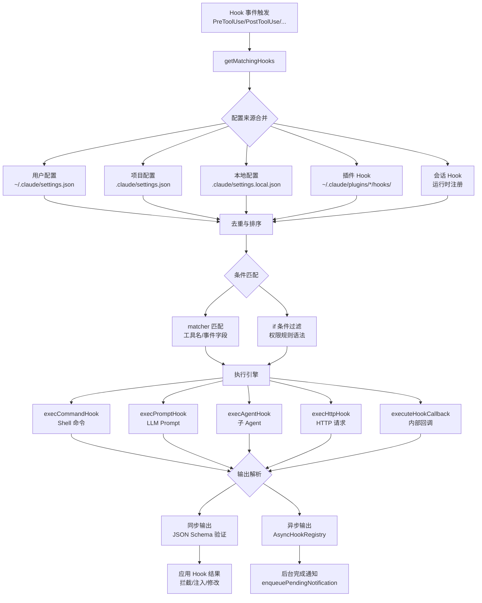

Hooks 是 Claude Code 的**生命周期拦截与扩展机制**，允许在 Agent 执行流程的 22 个关键节点注入自定义逻辑。通过 Hook，开发者可以实现工具调用拦截、权限决策、上下文注入、远程通知等高级功能，是构建企业级 AI Agent 治理体系的核心基础设施。

该系统采用**事件驱动架构**，支持 6 种 Hook 执行方式（Shell 命令、LLM Prompt、子 Agent、HTTP 请求、内部回调、运行时函数），并通过**同步/异步执行协议**平衡实时性与灵活性。所有 Hook 均受**工作区信任机制**保护，防止恶意仓库的配置注入攻击。

Sources: [hooks.ts](claude-code/src/utils/hooks.ts#L1-L50), [hookEvents.ts](claude-code/src/utils/hooks/hookEvents.ts#L1-L30), [agentSdkTypes.ts](claude-code/src/entrypoints/agentSdkTypes.ts#L1-L50)

## 架构总览：事件驱动的拦截系统

Claude Code Hooks 系统的核心是**多层配置合并**与**条件匹配引擎**。Hook 可以从 5 个来源注册（用户配置、项目配置、本地配置、插件、会话级），系统通过 `getMatchingHooks()` 函数按优先级合并，并根据 `matcher` 和 `if` 条件过滤出实际触发的 Hook 集合。



执行流程分为三个阶段：**配置合并**阶段从 5 个来源收集 Hook 定义并去重；**条件匹配**阶段通过 `matcher`（工具名匹配）和 `if`（输入条件过滤）筛选符合条件的 Hook；**执行与输出**阶段根据 Hook 类型选择执行引擎，解析输出 JSON 并应用到当前上下文。

Sources: [hooksConfigManager.ts](claude-code/src/utils/hooks/hooksConfigManager.ts#L1-L150), [hooks.ts](claude-code/src/utils/hooks.ts#L1685-L1956), [hooksSettings.ts](claude-code/src/utils/hooks/hooksSettings.ts#L1-L100)

## 22 种 Hook 事件：覆盖完整 Agent 生命周期

Hook 事件分为 8 个类别，涵盖从会话启动到子 Agent 协作的完整生命周期。每个事件提供不同的**匹配字段**（matcher），允许按工具名、错误类型、触发源等维度精确控制 Hook 触发范围。

| 类别 | 事件 | 触发时机 | 匹配字段 | 典型用途 |
|------|------|---------|---------|---------|
| **会话生命周期** | `SessionStart` | 会话启动时 | `source` (startup/resume/clear/compact) | 初始化环境、加载项目配置 |
| | `SessionEnd` | 会话结束时 | `reason` (clear/logout/exit) | 清理资源、发送统计 |
| | `Setup` | 初始化完成时 | `trigger` (init/maintenance) | 项目检查、依赖安装 |
| **用户交互** | `UserPromptSubmit` | 用户提交消息后 | — | 输入过滤、上下文注入 |
| | `Stop` | Agent 停止响应前 | — | 最终检查、状态保存 |
| | `StopFailure` | API 调用失败时 | `error` (rate_limit/auth/server_error) | 错误通知、降级处理 |
| **工具执行** | `PreToolUse` | 工具调用前 | `tool_name` | **拦截危险操作、修改输入** |
| | `PostToolUse` | 工具调用成功后 | `tool_name` | 输出验证、日志记录 |
| | `PostToolUseFailure` | 工具调用失败后 | `tool_name` | 错误恢复、重试逻辑 |
| **权限管理** | `PermissionRequest` | 权限对话框显示前 | `tool_name` | **自动审批决策** |
| | `PermissionDenied` | 自动模式拒绝工具时 | `tool_name` | 重试建议、降级方案 |
| **子 Agent** | `SubagentStart` | 子 Agent 启动时 | `agent_type` | 资源隔离、上下文传递 |
| | `SubagentStop` | 子 Agent 停止时 | `agent_type` | 结果聚合、清理工作 |
| **上下文压缩** | `PreCompact` | 上下文压缩前 | `trigger` (manual/auto) | 自定义压缩策略 |
| | `PostCompact` | 上下文压缩后 | `trigger` | 压缩后处理、统计 |
| **协作系统** | `TeammateIdle` | Teammate 即将空闲时 | — | 防止空闲、任务分配 |
| | `TaskCreated` | 任务创建时 | — | 任务验证、通知 |
| | `TaskCompleted` | 任务完成时 | — | 结果检查、集成触发 |
| **MCP 协议** | `Elicitation` | MCP 服务器请求用户输入 | `mcp_server_name` | **自动响应/拒绝请求** |
| | `ElicitationResult` | Elicitation 结果返回 | `mcp_server_name` | 结果处理、日志 |
| **环境变更** | `ConfigChange` | 配置变更时 | `source` | 配置同步、热重载 |
| | `CwdChanged` | 工作目录变更时 | — | 路径更新、环境重置 |
| | `FileChanged` | 监控文件变更时 | `file_path` | **实时响应文件变化** |
| | `InstructionsLoaded` | 指令加载时 | `load_reason` | 指令验证、动态调整 |
| | `WorktreeCreate` | Worktree 创建时 | — | 环境初始化 |
| | `WorktreeRemove` | Worktree 删除时 | — | 清理工作 |

### 关键事件的输入输出结构

每个 Hook 事件接收的 `jsonInput` 结构不同，以下是核心事件的输入示例：

**PreToolUse 输入**（最常用的事件，用于拦截工具调用）：
```json
{
  "tool_name": "Bash",
  "tool_input": {
    "command": "rm -rf node_modules",
    "timeout": 120000
  },
  "tool_use_id": "toolu_01ABC..."
}
```

**PermissionRequest 输入**（用于自动审批决策）：
```json
{
  "tool_name": "Write",
  "tool_input": {
    "file_path": "/etc/passwd",
    "content": "malicious content"
  },
  "tool_use_id": "toolu_01DEF..."
}
```

**FileChanged 输入**（用于实时文件监控响应）：
```json
{
  "file_path": "/path/to/watched/file.ts",
  "event_type": "modified",
  "timestamp": 1234567890
}
```

Sources: [hooksConfigManager.ts](claude-code/src/utils/hooks/hooksConfigManager.ts#L58-L271), [agentSdkTypes.ts](claude-code/src/entrypoints/sdk/coreTypes.ts#L25-L53), [hooks.ts](claude-code/src/utils/hooks.ts#L2100-L2500)

## 6 种 Hook 类型：从 Shell 脚本到智能 Agent

Hooks 支持 6 种执行方式，每种类型适用于不同的场景。前 4 种（command/prompt/agent/http）可通过配置文件声明，后 2 种（callback/function）仅限内部使用。

| 类型 | 执行方式 | 配置方式 | 适用场景 | 超时默认值 |
|------|---------|---------|---------|-----------|
| **command** | Shell 命令（bash/PowerShell） | `{"type": "command", "command": "script.sh"}` | 通用脚本、CI 检查、文件操作 | 10 分钟 |
| **prompt** | 注入到 AI 上下文 | `{"type": "prompt", "prompt": "检查代码规范"}` | 代码审查、上下文增强 | 30 秒 |
| **agent** | 启动子 Agent 执行 | `{"type": "agent", "prompt": "验证测试通过"}` | 复杂分析、多步骤验证 | 60 秒 |
| **http** | HTTP POST 请求 | `{"type": "http", "url": "https://api.example.com/hook"}` | 远程服务、Webhook、审计日志 | 10 分钟 |
| **callback** | 内部 JS 函数 | 代码注册 | 系统内置 Hook（不可配置） | — |
| **function** | 运行时注册的函数 | Agent/Skill 内部 API | 动态 Hook、临时逻辑 | — |

### command 类型：最通用的 Hook 方式

Command Hook 通过子进程执行 Shell 命令，`jsonInput` 通过 `stdin` 传递，支持环境变量注入和异步模式：

```json
{
  "type": "command",
  "command": "./scripts/check-sensitive-files.sh",
  "shell": "bash",
  "timeout": 30,
  "if": "Write(*.env)",
  "statusMessage": "检查敏感文件写入",
  "async": false
}
```

**高级特性**：
- **变量替换**：`${CLAUDE_PLUGIN_ROOT}`、`${CLAUDE_PROJECT_DIR}`、`${user_config.apiKey}`
- **环境变量注入**：`CLAUDE_ENV_FILE`（SessionStart/Setup/CwdChanged/FileChanged 事件）
- **异步模式**：首行输出 `{"async":true}` 后转为后台任务，不阻塞主流程
- **asyncRewake**：后台 Hook 退出码为 2 时通过通知唤醒模型

Sources: [schemas/hooks.ts](claude-code/src/schemas/hooks.ts#L35-L150), [hooks.ts](claude-code/src/utils/hooks.ts#L829-L1417)

### prompt 类型：LLM 驱动的智能检查

Prompt Hook 将检查逻辑交给 LLM，通过 `$ARGUMENTS` 占位符接收 Hook 输入，返回 JSON 格式的判断结果：

```json
{
  "type": "prompt",
  "prompt": "检查以下工具调用是否符合安全规范：$ARGUMENTS。返回 {\"ok\": true} 或 {\"ok\": false, \"reason\": \"原因\"}",
  "model": "claude-sonnet-4-6",
  "timeout": 20
}
```

**执行流程**：
1. 替换 `$ARGUMENTS` 为 `jsonInput` 字符串
2. 使用指定模型（默认 Haiku）进行单轮推理
3. 解析返回的 JSON，验证 `{"ok": boolean, "reason": string}` schema
4. `ok: false` 时生成阻塞错误，阻止工具执行

**适用场景**：代码规范检查、语义级安全审查、需要 AI 理解能力的复杂判断。

Sources: [execPromptHook.ts](claude-code/src/utils/hooks/execPromptHook.ts#L1-L212)

### agent 类型：多轮自主验证

Agent Hook 启动完整的子 Agent 进行多轮工具调用，适用于需要访问代码库、执行测试、分析文件的复杂验证场景：

```json
{
  "type": "agent",
  "prompt": "验证所有单元测试都已通过。读取测试输出文件，检查是否有失败的测试用例。$ARGUMENTS",
  "model": "claude-sonnet-4-6",
  "timeout": 120
}
```

**核心机制**：
- **子 Agent 隔离**：创建独立的 `hookAgentId`，拥有独立的 transcript 和权限上下文
- **工具集限制**：过滤掉 `ALL_AGENT_DISALLOWED_TOOLS`（防止 Hook Agent 进入 Plan Mode 或 spawning 嵌套 Agent）
- **StructuredOutput 工具**：强制 Agent 通过 `SyntheticOutputTool` 返回结构化结果
- **Transcript 访问**：系统自动注入 session rule `Read(/path/to/transcript)`，允许读取主对话历史

**适用场景**：CI/CD 验证、复杂代码审查、需要多步骤推理的安全检查。

Sources: [execAgentHook.ts](claude-code/src/utils/hooks/execAgentHook.ts#L1-L340)

### http 类型：远程服务集成

HTTP Hook 通过 POST 请求将 `jsonInput` 发送到远程服务器，支持自定义 Headers 和环境变量插值：

```json
{
  "type": "http",
  "url": "https://audit.company.com/api/tool-use",
  "headers": {
    "Authorization": "Bearer $AUDIT_TOKEN",
    "X-Project-ID": "${PROJECT_ID}"
  },
  "allowedEnvVars": ["AUDIT_TOKEN", "PROJECT_ID"],
  "timeout": 15
}
```

**安全机制**：
1. **URL 白名单**：`allowedHttpHookUrls` 配置项限制可访问的域名（通配符模式）
2. **环境变量插值**：仅 `allowedEnvVars` 列表中的变量会被解析，其他 `$VAR` 引用替换为空串
3. **Header 注入防护**：插值后移除 CR/LF/NUL 字节，防止 CRLF 注入攻击
4. **SSRF 防护**：通过 `ssrfGuardedLookup()` 检测私有 IP 地址（除非使用沙箱代理或环境变量代理）
5. **沙箱路由**：启用沙箱时，请求通过 `127.0.0.1:proxyPort` 代理，由代理强制执行域名白名单

**适用场景**：企业审计系统、远程审批服务、第三方集成。

Sources: [execHttpHook.ts](claude-code/src/utils/hooks/execHttpHook.ts#L1-L243)

## 配置与匹配机制：多来源合并与精确过滤

Hook 配置支持**多层级覆盖**和**细粒度匹配**。系统从 5 个来源收集 Hook 定义，通过优先级合并后，使用 `matcher` 和 `if` 双重条件过滤出实际触发的 Hook。

### 配置来源与优先级

配置按以下顺序加载，**后加载的覆盖先加载的**（相同 Hook 定义的去重保留后者）：

1. **用户配置**（`userSettings`）：`~/.claude/settings.json`，全局生效
2. **项目配置**（`projectSettings`）：`.claude/settings.json`，项目级覆盖
3. **本地配置**（`localSettings`）：`.claude/settings.local.json`，不应提交到 Git
4. **插件 Hook**（`pluginHook`）：`~/.claude/plugins/*/hooks/hooks.json`
5. **会话 Hook**（`sessionHook`）：运行时通过 SDK API 注册，仅当前会话有效

**去重逻辑**：使用 `pluginRoot\0command` 作为 Map 键，相同命令的 Hook 只保留最后加载的配置源。

**管理限制**：当 `allowManagedHooksOnly: true` 时，仅运行托管配置（Managed Settings）中的 Hook，用户/项目/本地配置被忽略。

Sources: [hooksSettings.ts](claude-code/src/utils/hooks/hooksSettings.ts#L65-L150), [hooksConfigSnapshot.ts](claude-code/src/utils/hooks/hooksConfigSnapshot.ts#L1-L100)

### matcher 字段：精确匹配事件属性

`matcher` 字段指定 Hook 触发的**目标值**，不同事件的匹配字段不同（见上文 22 种事件表）。支持三种模式：

| 模式 | 示例 | 匹配规则 |
|------|------|---------|
| **精确匹配** | `"Write"` | 完全等于目标值 |
| **管道分隔** | `"Write\|Edit\|Bash"` | 匹配任一值（OR 逻辑） |
| **正则表达式** | `"^Bash(git.*)"` | 正则匹配（需 `^` 或 `$` 标记） |
| **通配** | `"*"` 或 `""` 或省略 | 匹配所有值 |

**示例**：仅拦截 `Write` 和 `Edit` 工具的 `PreToolUse` Hook：

```json
{
  "hooks": {
    "PreToolUse": [
      {
        "matcher": "Write|Edit",
        "hooks": [
          {
            "type": "command",
            "command": "./scripts/check-file-path.sh"
          }
        ]
      }
    ]
  }
}
```

**匹配字段映射**：
- `PreToolUse` / `PostToolUse` / `PostToolUseFailure` / `PermissionRequest` / `PermissionDenied`：匹配 `tool_name`
- `SessionStart`：匹配 `source` (startup/resume/clear/compact)
- `Setup`：匹配 `trigger` (init/maintenance)
- `StopFailure`：匹配 `error` (rate_limit/authentication_failed/...)
- `Elicitation`：匹配 `mcp_server_name`

Sources: [hooks.ts](claude-code/src/utils/hooks.ts#L1428-L1503)

### if 条件：输入级别的精确过滤

`if` 字段使用**权限规则语法**对 `jsonInput` 进行二次过滤，避免在不相关的工具调用上浪费 Hook 执行资源。语法格式为 `ToolName(argument_pattern)`：

```json
{
  "type": "command",
  "command": "./scripts/prevent-force-push.sh",
  "if": "Bash(git push --force*)"
}
```

**高级用法**：
- **参数模式匹配**：`Bash(git commit*)` 匹配所有 git commit 命令
- **通配符**：`Read(*.env)` 匹配所有 .env 文件读取
- **AST 级别解析**（Bash 工具专用）：使用 tree-sitter 解析命令 AST，避免简单字符串匹配的误判

**执行流程**：`prepareIfConditionMatcher()` 预编译 `if` 条件为匹配器函数，在 `getMatchingHooks()` 阶段过滤。**不匹配的 Hook 直接跳过，不执行子进程**。

Sources: [hooks.ts](claude-code/src/utils/hooks.ts#L1472-L1503), [hooksConfigManager.ts](claude-code/src/utils/hooks/hooksConfigManager.ts#L1428-L1463)

## 执行引擎：同步/异步协议与输出解析

Hook 执行引擎根据类型分发到对应的执行器（`execCommandHook` / `execPromptHook` / `execAgentHook` / `execHttpHook`），并解析输出 JSON 决定后续行为。核心挑战是**平衡实时性**（同步 Hook 可能阻塞工具调用）和**灵活性**（异步 Hook 需要通知机制）。

### 同步执行与输出 Schema

同步 Hook 必须在超时时间内返回结果，输出为 JSON 格式，遵循 `syncHookResponseSchema`（Zod schema）：

```typescript
{
  continue?: boolean,              // 是否继续执行（默认 true）
  suppressOutput?: boolean,        // 隐藏 stdout（默认 false）
  stopReason?: string,             // continue=false 时的原因
  decision?: "approve" | "block",  // 全局决策
  reason?: string,                 // 决策原因
  systemMessage?: string,          // 注入到上下文的系统消息
  hookSpecificOutput?: {           // 事件特定输出
    hookEventName: "PreToolUse" | "PostToolUse" | ...,
    // 根据事件类型的专有字段
  }
}
```

**事件特定输出字段**（`hookSpecificOutput`）：

| 事件 | 专有字段 | 作用 |
|------|---------|------|
| **PreToolUse** | `permissionDecision`, `permissionDecisionReason`, `updatedInput`, `additionalContext` | **拦截工具调用**、修改输入参数、注入上下文 |
| **PostToolUse** | `additionalContext`, `updatedMCPToolOutput` | 修改 MCP 工具输出、注入后续上下文 |
| **UserPromptSubmit** | `additionalContext` | 在用户消息后注入额外上下文 |
| **SessionStart** | `initialUserMessage`, `watchPaths` | 设置初始用户消息、注册文件监控路径 |
| **PermissionRequest** | `decision: {behavior: "allow"|"deny", ...}` | **自动审批决策**，允许/拒绝工具调用 |
| **PermissionDenied** | `retry: boolean` | 指示模型是否可以重试被拒绝的工具 |
| **Elicitation** | `action: "accept"|"decline"|"cancel"`, `content` | **自动响应 MCP Elicitation 请求** |

**输出应用逻辑**（`processHookJSONOutput()` 函数）：
1. `continue: false` → 设置 `preventContinuation: true`，阻止后续流程
2. `decision: "block"` → 生成阻塞错误，工具调用被拦截
3. `hookSpecificOutput.permissionDecision: "deny"` → 覆盖权限决策，工具被拒绝
4. `hookSpecificOutput.updatedInput` → 修改实际传递给工具的参数
5. `hookSpecificOutput.additionalContext` → 注入到下一个用户消息的 system-reminder

Sources: [types/hooks.ts](claude-code/src/types/hooks.ts#L49-L567), [hooks.ts](claude-code/src/utils/hooks.ts#L2500-L3000)

### 异步执行与 AsyncHookRegistry

异步 Hook 通过首行输出 `{"async": true, "asyncTimeout": 15000}` 标记，系统将其注册到 `AsyncHookRegistry` 并立即返回，不阻塞主流程：

```typescript
// Hook stdout 首行检测
const firstLine = firstLineOf(stdout).trim()
if (isAsyncHookJSONOutput(parsed)) {
  executeInBackground({
    processId: `async_hook_${child.pid}`,
    asyncResponse: parsed,
    shellCommand,
    ...
  })
}
```

**AsyncHookRegistry 机制**：
- **注册**：`registerPendingAsyncHook()` 保存 Hook 元数据（processId、timeout、command、shellCommand）
- **轮询检查**：`checkForAsyncHookResponses()` 定期检查后台 Hook 的完成状态
- **进度通知**：`startHookProgressInterval()` 每秒发送 Hook 输出的增量更新
- **完成通知**：Hook 退出时通过 `emitHookResponse()` 发送 `outcome: "success"|"error"|"cancelled"`

**asyncRewake 模式**：后台 Hook 退出码为 2 时，通过 `enqueuePendingNotification()` 注入 `task-notification` 或 `queued_command`，唤醒空闲模型或打断忙碌模型，实现**Hook 触发模型重新执行**的效果。

Sources: [AsyncHookRegistry.ts](claude-code/src/utils/hooks/AsyncHookRegistry.ts#L1-L310), [hooks.ts](claude-code/src/utils/hooks.ts#L1199-L1246)

### 事件广播系统：hookEvents

Hook 执行状态通过**独立的事件系统**广播，与主消息流分离。SDK 用户可通过 `includeHookEvents` 选项订阅事件：

```typescript
type HookExecutionEvent =
  | { type: 'started', hookId, hookName, hookEvent }
  | { type: 'progress', hookId, hookName, hookEvent, stdout, stderr, output }
  | { type: 'response', hookId, hookName, hookEvent, output, exitCode, outcome }
```

**事件过滤**：
- **默认**：仅广播 `SessionStart` 和 `Setup` 事件（向后兼容）
- **`includeHookEvents: true`**：广播所有 22 种 Hook 事件
- **CLAUDE_CODE_REMOTE 模式**：自动启用所有事件广播

**事件处理流程**：
1. `registerHookEventHandler(handler)` 注册全局事件处理器
2. Hook 执行时通过 `emitHookStarted()` / `emitHookProgress()` / `emitHookResponse()` 发送事件
3. 未注册处理器时，事件缓存到 `pendingEvents` 数组（最大 100 条），处理器注册后批量发送

Sources: [hookEvents.ts](claude-code/src/utils/hooks/hookEvents.ts#L1-L193)

## 实践示例：企业级安全拦截系统

以下示例展示如何使用 Hook 构建多层防护机制，拦截危险操作、自动审批安全操作、实时监控文件变更。

### 示例 1：拦截敏感文件写入（PreToolUse）

**需求**：阻止写入 `.env`、`credentials.json` 等敏感文件，但允许特定白名单路径。

**配置**（`.claude/settings.json`）：
```json
{
  "hooks": {
    "PreToolUse": [
      {
        "matcher": "Write|Edit",
        "hooks": [
          {
            "type": "command",
            "command": "node ./scripts/check-sensitive-files.js",
            "if": "Write(*.env*)|Write(*credentials*)|Write(*.pem)",
            "timeout": 5
          }
        ]
      }
    ]
  }
}
```

**Hook 脚本**（`scripts/check-sensitive-files.js`）：
```javascript
// 从 stdin 读取 JSON 输入
let input = ''
process.stdin.on('data', chunk => input += chunk)
process.stdin.on('end', () => {
  const { tool_input } = JSON.parse(input)
  const { file_path } = tool_input
  
  // 白名单路径（例如测试环境）
  const allowedPaths = ['/tmp/test/', '/home/user/sandbox/']
  const isAllowed = allowedPaths.some(p => file_path.startsWith(p))
  
  if (isAllowed) {
    // 允许写入
    console.log(JSON.stringify({
      continue: true,
      hookSpecificOutput: {
        hookEventName: "PreToolUse",
        permissionDecision: "allow"
      }
    }))
    process.exit(0)
  } else {
    // 阻止写入
    console.log(JSON.stringify({
      continue: false,
      stopReason: `禁止写入敏感文件: ${file_path}`,
      hookSpecificOutput: {
        hookEventName: "PreToolUse",
        permissionDecision: "deny",
        permissionDecisionReason: "文件路径匹配敏感文件模式"
      }
    }))
    process.exit(2) // Exit code 2 将错误展示给模型
  }
})
```

**效果**：
- Agent 尝试写入 `.env` 文件 → Hook 拦截并返回 `permissionDecision: "deny"`
- 工具调用被阻止，错误消息展示给模型："禁止写入敏感文件: .env"
- 白名单路径（如 `/tmp/test/.env`）被允许

Sources: [hooks.ts](claude-code/src/utils/hooks.ts#L2500-L2800), [types/hooks.ts](claude-code/src/types/hooks.ts#L150-L250)

### 示例 2：自动审批 Git 操作

```json
{
  "hooks": {
    "PermissionRequest": [
      {
        "matcher": "Bash",
        "hooks": [
          {
            "type": "command",
            "command": "./scripts/auto-approve-git.sh",
            "if": "Bash(git *)",
            "timeout": 3
          }
        ]
      }
    ]
  }
}
```

Sources: [hooksConfigManager.ts](claude-code/src/utils/hooks/hooksConfigManager.ts#L100-L200)

### 示例 3：实时文件变更响应

```json
{
  "hooks": {
    "SessionStart": [
      {
        "hooks": [
          {
            "type": "command",
            "command": "echo '{\"hookSpecificOutput\":{\"hookEventName\":\"SessionStart\",\"watchPaths\":[\"/path/to/project/src\"]}}'"
          }
        ]
      }
    ],
    "FileChanged": [
      {
        "hooks": [
          {
            "type": "command",
            "command": "./scripts/on-file-change.sh"
          }
        ]
      }
    ]
  }
}
```

Sources: [hooks.ts](claude-code/src/utils/hooks.ts#L3000-L3300)

### 示例 4：HTTP 审计日志

```json
{
  "hooks": {
    "PreToolUse": [
      {
        "matcher": "*",
        "hooks": [
          {
            "type": "http",
            "url": "https://audit.company.com/api/tool-use",
            "headers": {
              "Authorization": "Bearer $AUDIT_TOKEN",
              "Content-Type": "application/json"
            },
            "allowedEnvVars": ["AUDIT_TOKEN"],
            "async": true
          }
        ]
      }
    ]
  }
}
```

Sources: [execHttpHook.ts](claude-code/src/utils/hooks/execHttpHook.ts#L100-L200)

## 安全机制：工作区信任与沙箱隔离

Hooks 系统实现了**纵深防御**策略，从配置加载到执行全程施加安全限制，防止恶意仓库利用 Hook 执行任意代码。

### 工作区信任检查

**所有 Hook 执行前强制检查工作区信任状态**（`shouldSkipHookDueToTrust()`）。在交互模式下，未信任的仓库（用户未在信任对话框中确认）的 Hook 被完全禁用：

```typescript
// 交互模式：所有 Hook 要求工作区信任
const hasTrust = checkHasTrustDialogAccepted()
if (!hasTrust) {
  return true // 跳过 Hook 执行
}
```

**非交互模式**（SDK / CI）：信任检查被跳过（`getIsNonInteractiveSession()` 为 true），但建议通过 `--allow-hooks` 显式控制。

Sources: [hooks.ts](claude-code/src/utils/hooks.ts#L286-L296)

### HTTP Hook 的多层防护

HTTP Hook 面临 SSRF（服务器端请求伪造）和数据泄露风险，系统实施 5 层防护：

1. **URL 白名单**：`allowedHttpHookUrls` 配置限制可访问的域名（支持通配符 `*`）
2. **环境变量插值限制**：仅 `allowedEnvVars` 列表中的变量会被解析，防止通过 `$SECRET` 泄露敏感信息
3. **Header 注入防护**：插值后移除 CR/LF/NUL 字节，防止 CRLF 注入
4. **SSRF 防护**：`ssrfGuardedLookup()` 检测私有 IP 地址（10.0.0.0/8、172.16.0.0/12、192.168.0.0/16、127.0.0.0/8）
5. **沙箱网络代理**：启用沙箱时，HTTP 请求通过本地代理路由，代理强制执行域名白名单

**SSRF 绕过例外**：
- 使用沙箱代理（`127.0.0.1:proxyPort`）时跳过 SSRF 检查（代理已隔离）
- 使用环境变量代理（`HTTP_PROXY` / `HTTPS_PROXY`）时跳过检查（企业代理通常在私有 IP）

Sources: [execHttpHook.ts](claude-code/src/utils/hooks/execHttpHook.ts#L50-L150), [ssrfGuard.ts](claude-code/src/utils/hooks/ssrfGuard.ts#L1-L100)

### 沙箱隔离

启用沙箱（`--sandbox`）后，所有 Shell 命令型 Hook 在隔离的容器中执行，网络访问通过代理路由，文件系统通过卷挂载限制。HTTP Hook 请求自动通过沙箱网络代理，由代理强制执行域名白名单（返回 403 表示被阻止）。

Sources: [execHttpHook.ts](claude-code/src/utils/hooks/execHttpHook.ts#L27-L50), [sandbox-adapter.ts](claude-code/src/utils/sandbox/sandbox-adapter.ts#L1-L100)

## 最佳实践与企业部署建议

### 配置层级策略

| 配置层级 | 存放内容 | 示例 |
|---------|---------|------|
| **用户配置**（`~/.claude/settings.json`） | 个人偏好、开发工具集成 | 自动格式化、个人通知 |
| **项目配置**（`.claude/settings.json`） | 团队共享的安全策略、CI 集成 | 敏感文件拦截、Git 操作审批 |
| **本地配置**（`.claude/settings.local.json`） | 本地环境特定配置（不提交） | 本地 API 端点、调试 Hook |
| **托管配置**（Managed Settings） | 企业级强制策略 | 允许的 HTTP URL、禁用特定 Hook |

**建议**：将安全关键型 Hook（如 PreToolUse 拦截器）放在**项目配置**并提交到 Git，确保团队成员统一执行。敏感信息（如 API Token）通过环境变量传递，避免硬编码。

### 性能优化

- **使用 `if` 条件**：避免在不相关的工具调用上执行 Hook，减少子进程开销
- **异步模式**：非阻塞性 Hook（如日志记录）使用 `async: true`，避免影响响应速度
- **合理设置超时**：快速检查脚本设置 5-10 秒超时，复杂验证使用 30-60 秒
- **避免 Agent Hook 滥用**：Agent Hook 启动完整子 Agent，资源消耗大，仅用于复杂多步骤验证

### 调试技巧

- **启用调试日志**：`CLAUDE_DEBUG=1` 查看 Hook 执行细节（`logForDebugging` 输出）
- **检查 Hook 匹配**：使用 `/hooks` 命令查看当前会话注册的所有 Hook
- **测试 Hook 输出**：手动执行 Hook 脚本，传入 JSON 输入验证输出格式
- **查看事件流**：SDK 模式启用 `includeHookEvents: true` 订阅 Hook 执行事件

### 企业部署清单

- [ ] 配置 `allowedHttpHookUrls` 白名单，限制 HTTP Hook 可访问的域名
- [ ] 配置 `httpHookAllowedEnvVars`，明确允许插值的环境变量
- [ ] 启用 `allowManagedHooksOnly`，禁用用户/项目级 Hook（仅运行托管配置）
- [ ] 部署 PreToolUse Hook 拦截敏感操作（文件写入、网络请求）
- [ ] 部署 PermissionRequest Hook 自动审批安全操作，减少用户交互
- [ ] 配置 HTTP 审计 Hook 记录所有工具调用到 SIEM 系统
- [ ] 启用沙箱隔离，防止 Hook 执行影响主机环境

## 延伸阅读

- **MCP 协议集成**：[MCP 协议集成](24-mcp-xie-yi-ji-cheng) — Hooks 与 MCP Elicitation 的协同工作
- **权限模型与审批流程**：[权限模型与审批流程](13-quan-xian-mo-xing-yu-shen-pi-liu-cheng) — Hook 如何参与权限决策
- **沙箱隔离机制**：[沙箱隔离机制](14-sha-xiang-ge-chi-ji-zhi) — Hook 在沙箱中的执行环境
- **Skills 技能扩展**：[Skills 技能扩展](26-skills-ji-neng-kuo-zhan) — Skills 如何使用 session Hook