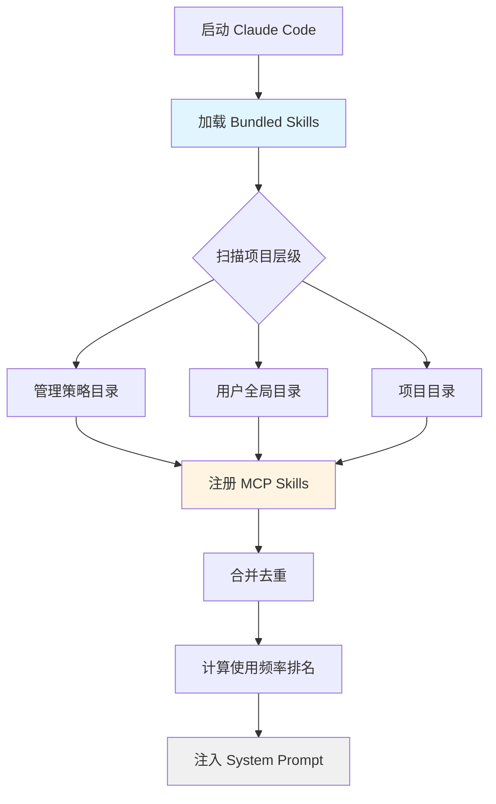

Skills 系统是 Claude Code 的核心扩展机制，其设计哲学是"**Prompt 即能力**"——复杂任务的关键不在于代码逻辑，而在于 Prompt 质量。一个代码审查 Skill 不需要实现审查引擎，只需告诉 AI "审查什么、按什么顺序、输出什么格式"。Skill 将这种"经验"封装为可复用的 Markdown 文档，让 AI 获得专业领域的工作能力。

Skill 与 Tool 有本质区别：Tool 是单个原子操作（如 Read、Bash），由 TypeScript 代码实现执行逻辑；Skill 是一套完整的工作流（如代码审查、批量重构），由 Prompt + 配置声名式封装，通过 `SkillTool` 统一执行。这种设计让非程序员也能通过编写 Markdown 文档来扩展 AI 能力。

Sources: [bundledSkills.ts](claude-code/src/skills/bundledSkills.ts#L1-L100), [command.ts](claude-code/src/types/command.ts#L1-L217)

## 技能的五个来源

Claude Code 从五个不同的来源加载技能，形成完整的技能生态：

| 来源 | 路径 | 特点 | 加载时机 |
|------|------|------|----------|
| **Bundled Skills** | 编译进二进制 | 内置核心技能，不可截断，享有特权 | 模块初始化时 |
| **项目技能** | `.claude/skills/` | 项目特定工作流，团队成员共享 | 启动时遍历项目层级 |
| **用户技能** | `~/.claude/skills/` | 个人偏好工具，全局可用 | 启动时加载 |
| **管理策略** | `$MANAGED_DIR/.claude/skills/` | 组织级强制技能，不可覆盖 | 启动时加载 |
| **MCP Skills** | MCP Server prompts | 远程动态发现，安全隔离 | MCP 连接时注册 |

加载优先级遵循"就近原则"：项目级 > 用户级 > 管理策略 > Bundled。同一名称的技能，项目级会覆盖用户级，确保项目特定配置优先生效。



项目技能的加载采用**向上遍历策略**：从当前工作目录开始，逐层向上查找 `.claude/skills/` 目录，直到用户 home 目录为止。这允许在 monorepo 中设置不同层级的技能——根目录的技能对所有子项目生效，子目录的技能仅在该子项目中可用。

Sources: [loadSkillsDir.ts](claude-code/src/skills/loadSkillsDir.ts#L407-L500), [bundledSkills.ts](claude-code/src/skills/bundledSkills.ts#L53-L108), [index.ts](claude-code/src/skills/bundled/index.ts#L1-L73)

## 技能定义格式

每个技能必须是一个目录，包含 `SKILL.md` 文件。文件结构采用 YAML Frontmatter + Markdown Body 的格式：

```markdown
---
name: code-review                    # 显示名称（可选，默认用目录名）
description: 系统性代码审查，发现bug和质量问题   # 简短描述
when_to_use: "用户说审查代码、找bug、code review"  # AI自动匹配的触发条件
allowed-tools:                       # 工具白名单（可选）
  - Read
  - Grep
  - Glob
argument-hint: "<file-or-directory>" # 参数提示（显示在自动补全中）
arguments: [path]                    # 声明式参数名
model: opus                          # 模型覆盖（可选）
effort: high                         # 努力级别：low/medium/high 或整数
context: fork                        # 执行模式：inline（默认）| fork
agent: code-reviewer                 # Fork模式使用的Agent类型
user-invocable: true                 # 用户是否可通过/skill-name调用
disable-model-invocation: false      # 禁止AI自主调用
version: "1.0"                       # 版本号
paths:                               # 条件激活路径模式
  - "src/**/*.ts"
  - "tests/**/*.test.ts"
hooks:                               # Hook配置
  PreToolUse:
    - command: ["echo", "checking"]
---

# 代码审查工作流

你是一个专业的代码审查专家。请按照以下步骤进行审查：

## 1. 收集变更
运行 `git diff` 查看所有变更...

## 2. 分析质量
检查以下方面：
- 代码重复
- 命名规范
- 错误处理...

## 3. 输出报告
按以下格式输出...
```

Frontmatter 支持 17 个字段，其中**最重要的是 `when_to_use`**——这是 AI 自动匹配技能的依据。当用户的请求语义上匹配 `when_to_use` 中的描述时，AI 会通过 `SkillTool` 自动调用该技能，无需用户显式输入 `/skill-name`。

### 核心字段详解

**`when_to_use`**（触发条件）是最关键的字段。应该用自然语言描述用户会在什么场景下需要这个技能：

```yaml
# 好的 when_to_use
when_to_use: "用户想审查代码、找bug、做code review、检查代码质量"

# 不好的 when_to_use（太技术化）
when_to_use: "调用 SkillTool 并传递 review 参数"
```

**`allowed-tools`**（工具白名单）限制技能执行时可以使用的工具。这是安全机制的一部分——即使技能被调用，也只能使用白名单中的工具：

```yaml
# 只读技能
allowed-tools: [Read, Grep, Glob]

# 完整权限
allowed-tools: []  # 空数组表示无限制
```

**`context: fork`**（隔离执行）让技能在独立的子 Agent 中运行，拥有独立的 token 预算和对话上下文。适用于长时间运行的任务（如批量重构），避免污染主对话流。

Sources: [loadSkillsDir.ts](claude-code/src/skills/loadSkillsDir.ts#L185-L270), [skills.mdx](claude-code/docs/extensibility/skills.mdx#L1-L222)

## 技能加载与发现机制

技能加载流程分为三个阶段：**启动扫描**、**动态发现**、**条件激活**。

### 启动扫描

在 Claude Code 启动时，`loadSkillsDir()` 会扫描所有技能目录：

```
1. 遍历 .claude/skills/ 子目录
2. 在每个子目录中查找 SKILL.md 文件
3. 解析 Frontmatter 提取元数据
4. 使用 realpath() 去重（防止符号链接导致重复加载）
5. 按路径深度排序（深层优先）
```

去重机制使用 `realpath()` 解析符号链接获得规范路径，确保通过不同路径访问同一技能时只加载一次。这在复杂的 monorepo 环境中特别重要。

### 动态发现

除了启动时加载的技能，系统还支持**基于文件路径的动态发现**。当 AI 读取或编辑某个文件时，系统会从该文件所在目录开始，向上查找 `.claude/skills/` 目录：

```
/work/project/src/components/Button.tsx
                    ↓ 向上查找
/work/project/src/components/.claude/skills/  ✓ 找到组件相关技能
/work/project/src/.claude/skills/              ✓ 找到源码级技能
/work/project/.claude/skills/                  ✓ 找到项目级技能
```

这允许为项目的不同部分定义特定技能——比如只在 `tests/` 目录下激活测试相关技能。

### 条件激活

带有 `paths` 字段的技能不会立即可用，而是进入"休眠"状态，存入 `conditionalSkills` Map。只有当被操作的文件路径匹配 `paths` 模式时，该技能才被**激活**：

```yaml
paths:
  - "*.test.ts"
  - "**/__tests__/**"
```

这个技能只有在 AI 操作测试文件时才会出现在可用技能列表中。这避免了技能列表的爆炸式增长，同时确保上下文相关性。

Sources: [loadSkillsDir.ts](claude-code/src/skills/loadSkillsDir.ts#L861-L950), [skillChangeDetector.ts](claude-code/src/utils/skills/skillChangeDetector.ts#L1-L50)

## 双模式执行：Inline 与 Fork

SkillTool 根据技能的 `context` 字段选择执行模式，两种模式有本质区别：

| 特性 | Inline 模式（默认） | Fork 模式（`context: fork`） |
|------|-------------------|---------------------------|
| 执行位置 | 主对话流中 | 独立子 Agent |
| Token 预算 | 共享主对话预算 | 独立预算（默认 100K） |
| 上下文污染 | 会影响后续对话 | 完全隔离，执行完释放 |
| 适用场景 | 轻量级查询、快速任务 | 大规模重构、长时间任务 |
| 结果呈现 | 直接注入对话流 | 提取结果文本，子消息释放 |

### Inline 模式

技能的 Prompt 内容被注入为 **UserMessage**，在主对话流中继续执行：

```
1. 参数替换：$ARGUMENTS → 用户输入的参数
2. Shell 展开：!`git diff` → 执行命令并替换结果
3. 路径变量：${CLAUDE_SKILL_DIR} → 技能目录绝对路径
4. 会话变量：${CLAUDE_SESSION_ID} → 当前会话ID
5. 注入为 UserMessage
```

同时会修改权限上下文（`contextModifier`）：
- 合并 `allowedTools` 到工具白名单
- 应用模型覆盖（`model` 字段）
- 设置努力级别（`effort` 字段）

### Fork 模式

技能在独立子 Agent 中执行，拥有完整的隔离环境：

```
1. 构建隔离的 Agent 定义
2. 启动独立的消息循环
3. 拥有独立的 token 预算
4. 通过进度回调报告工具使用
5. 提取结果文本后释放所有子消息
6. 清理 invoked skills 状态
```

Fork 模式的优势在于**上下文隔离**——子 Agent 的中间推理过程不会污染主对话，只有最终结果被保留。这对于需要大量探索性操作的任务特别重要（比如批量修改100个文件，每个文件都需要读取-分析-修改的循环）。

Sources: [SkillTool.ts](claude-code/src/tools/SkillTool/SkillTool.ts#L122-L332), [loadSkillsDir.ts](claude-code/src/skills/loadSkillsDir.ts#L270-L400)

## 权限模型与安全边界

Skills 系统实现了多层安全机制，确保技能不会执行危险操作：

### Safe Properties 白名单

系统维护一个包含 28 个属性的白名单（`SAFE_SKILL_PROPERTIES`）。任何不在白名单中的**有意义的属性**都会触发权限请求：

```typescript
const SAFE_SKILL_PROPERTIES = new Set([
  'name', 'description', 'whenToUse', 'allowedTools',
  'argumentHint', 'arguments', 'model', 'effort',
  'context', 'agent', 'userInvocable', 'version',
  // ... 共28个
])
```

这是**正向安全设计**——未来新增的属性默认不安全，需要显式加入白名单才能跳过权限检查。

### 四层权限检查

1. **Deny 规则匹配**：支持精确匹配和 `prefix:*` 通配符
2. **官方市场自动放行**：`plugin` 来源且符合官方命名规范
3. **Allow 规则匹配**：用户已批准的技能
4. **Safe Properties 检查**：所有属性都在白名单中

如果技能包含非白名单属性（如自定义的 `customConfig`），系统会弹出权限请求对话框，显示具体的非安全属性，并提供"允许一次"或"永久允许"选项。

### MCP Skills 的特殊限制

MCP Skills 来自远程服务器，被视为**不可信内容**，有以下额外限制：
- **禁止执行内联 shell 命令**：`` !`...` `` 语法在 MCP Skills 中无效
- **禁止 Shell 展开**：即使有 `shell` frontmatter 也会被忽略
- **只读访问**：默认只能调用读类型工具

Sources: [SkillTool.ts](claude-code/src/tools/SkillTool/SkillTool.ts#L433-L911), [loadSkillsDir.ts](claude-code/src/skills/loadSkillsDir.ts#L374)

## 内置技能示例

Claude Code 内置了多个高质量技能，展示了不同的设计模式：

### `/simplify` - 代码质量审查

```typescript
registerBundledSkill({
  name: 'simplify',
  description: 'Review changed code for reuse, quality, and efficiency',
  userInvocable: true,
  async getPromptForCommand(args) {
    return [{
      type: 'text',
      text: SIMPLIFY_PROMPT + (args ? `\n\n## Additional Focus\n\n${args}` : '')
    }]
  }
})
```

这个技能展示了**三阶段并行审查**模式：启动 3 个子 Agent 分别检查代码复用、代码质量、执行效率，然后汇总结果并修复问题。

Sources: [simplify.ts](claude-code/src/skills/bundled/simplify.ts#L1-L70)

### `/batch` - 批量并行重构

```typescript
registerBundledSkill({
  name: 'batch',
  description: 'Research and plan a large-scale change, then execute in parallel',
  whenToUse: 'Use when the user wants to make a sweeping change across many files',
  argumentHint: '<instruction>',
  disableModelInvocation: true,  // 只能用户显式调用
  async getPromptForCommand(args) {
    if (!args) return [{ type: 'text', text: MISSING_INSTRUCTION_MESSAGE }]
    if (!await getIsGit()) return [{ type: 'text', text: NOT_A_GIT_REPO_MESSAGE }]
    return [{ type: 'text', text: buildPrompt(args) }]
  }
})
```

这个技能展示了**Plan + Execute 模式**：先进入 Plan Mode 做研究和规划，将任务分解为 5-30 个独立单元，然后每个单元在隔离的 git worktree 中并行执行，最后汇总结果。关键特性：

- **Plan Mode 强制**：必须先规划再执行，避免错误扩散
- **Worktree 隔离**：每个单元在独立的 git 工作树中执行，避免冲突
- **自动 PR 创建**：每个单元完成后自动创建 Pull Request
- **进度跟踪**：实时显示表格追踪所有单元的状态和 PR 链接

Sources: [batch.ts](claude-code/src/skills/bundled/batch.ts#L1-L125)

### `/debug` - 会话调试

```typescript
registerBundledSkill({
  name: 'debug',
  description: 'Debug your current session by reading the debug log',
  allowedTools: ['Read', 'Grep', 'Glob'],
  argumentHint: '[issue description]',
  disableModelInvocation: true,
  async getPromptForCommand(args) {
    enableDebugLogging()  // 确保日志已开启
    const logContent = await tailDebugLog()  // 只读最后20行
    return [{
      type: 'text',
      text: `# Debug Skill\n\nHelp the user debug...\n\n## Session Debug Log\n${logContent}`
    }]
  }
})
```

这个技能展示了**条件功能开启**模式：首次调用时自动开启 debug logging，然后读取日志的最后 20 行进行分析。使用 `disableModelInvocation: true` 确保只有用户显式输入 `/debug` 时才调用，避免 AI 在对话中自动触发。

Sources: [debug.ts](claude-code/src/skills/bundled/debug.ts#L1-L104)

## 技能编写最佳实践

### 1. 清晰的触发条件

`when_to_use` 应该用用户的自然语言描述场景，而不是技术术语：

```yaml
# ✅ 好 - 用户视角
when_to_use: "用户想审查代码、找bug、检查代码质量、做code review"

# ❌ 差 - 技术视角
when_to_use: "调用代码审查工具分析 git diff 输出"
```

### 2. 最小权限原则

只请求必要的工具权限。只读技能不要请求写权限：

```yaml
# 只读审查
allowed-tools: [Read, Grep, Glob]

# 需要修改代码
allowed-tools: [Read, Write, Edit, Bash]
```

### 3. 结构化的 Prompt

使用 Markdown 标题和列表组织 Prompt，让 AI 容易理解工作流：

```markdown
# 阶段1: 收集信息
- 运行 git diff
- 列出所有变更文件

# 阶段2: 分析
- 检查代码重复
- 验证命名规范
- 检查错误处理

# 阶段3: 输出
- 按文件分组列出问题
- 给出修复建议
```

### 4. 参数处理

使用 `arguments` 和 `$ARGUMENTS` 变量让技能更灵活：

```markdown
---
arguments: [target]
---

审查目标：$ARGUMENTS

如果未提供参数，默认审查所有未提交的变更...
```

### 5. Fork 模式的使用场景

只在真正需要隔离时使用 `context: fork`：
- ✅ 批量修改大量文件（避免中间状态污染对话）
- ✅ 长时间运行的探索性任务
- ❌ 简单的代码审查（Inline 足够）
- ❌ 快速查询（Fork 增加启动开销）

### 6. Shell 命令的使用

谨慎使用内联 shell 命令（`` !`...` ``），只在必要时使用：

```markdown
# ✅ 好 - 获取动态信息
当前分支：!`git branch --show-current`

# ❌ 滥用 - 可以让 AI 自己执行
修改记录：!`git log --oneline -10`  # 应该让 AI 调用 BashTool
```

Sources: [skills.mdx](claude-code/docs/extensibility/skills.mdx#L1-L222)

## Prompt 预算与截断策略

技能列表在注入 System Prompt 时有严格的字符预算（约占上下文窗口的 1%，约 8000 字符）。系统采用三级降级策略：

```
1. 完整描述模式：每条描述最多 250 字符
   ↓ 超预算？
2. Bundled 保留完整，其他技能均分剩余预算
   ↓ 每条 < 20 字符？
3. 非 Bundled 技能只保留名称
```

**Bundled Skills 的特权**：内置技能享有不可截断的特权，即使预算不足也会保留完整描述。这确保核心功能始终对 AI 可见。

使用频率排名影响技能在列表中的顺序。系统使用指数衰减算法计算排名分数：

```
score = usageCount × max(0.5^(daysSinceUse / 7), 0.1)
```

7 天半衰期意味着一周前的使用权重减半，最低 0.1 保底避免老技能完全沉底。60 秒去抖机制确保同一技能在短时间内的多次调用只计一次。

Sources: [prompt.ts](claude-code/src/services/prompt/prompt.ts#L70-L150), [skillUsageTracking.ts](claude-code/src/services/skillUsageTracking.ts#L1-L100)

## 技能开发调试技巧

### 快速测试技能

在开发技能时，可以使用以下技巧快速测试：

```bash
# 1. 创建技能目录
mkdir -p .claude/skills/my-skill

# 2. 编辑 SKILL.md
cat > .claude/skills/my-skill/SKILL.md << 'EOF'
---
name: my-skill
description: 测试技能
when_to_use: "测试技能功能"
---

# 测试技能
这是一个测试技能...
EOF

# 3. 重启 Claude Code 或等待自动重载
# 4. 输入 /my-skill 测试
```

### 调试 Frontmatter 解析

如果技能没有正确加载，检查：

1. **目录结构**：必须是 `skill-name/SKILL.md` 格式
2. **YAML 语法**：使用在线 YAML 验证器检查 frontmatter
3. **必需字段**：至少包含 `description`
4. **路径匹配**：如果有 `paths` 字段，确认文件路径匹配模式

### 查看技能加载日志

启用 debug 模式可以看到详细的加载日志：

```bash
claude --debug
```

日志会显示：
- 扫描了哪些目录
- 解析了哪些技能
- 是否有重复或跳过的技能
- Frontmatter 解析错误

Sources: [SkillsMenu.tsx](claude-code/src/components/skills/SkillsMenu.tsx#L1-L237), [loadSkillsDir.ts](claude-code/src/skills/loadSkillsDir.ts#L400-L500)

## 扩展阅读

Skills 系统与其他扩展机制协同工作：

- **[MCP 协议集成](24-mcp-xie-yi-ji-cheng)**：MCP Server 的 prompts 自动转换为 Skills
- **[Hooks 钩子系统](25-hooks-gou-zi-xi-tong)**：Skills 可以注册 Hook 来拦截工具调用
- **[自定义 Agent 开发](27-zi-ding-yi-agent-kai-fa)**：Fork 模式的 Skills 使用 Agent 定义文件

理解 Skills 的关键是把握其**声明式本质**——不需要编写代码，只需用 Markdown 描述"做什么"和"怎么做"，AI 会根据描述执行具体逻辑。这降低了扩展门槛，让领域专家（而非程序员）也能为 Claude Code 添加新能力。