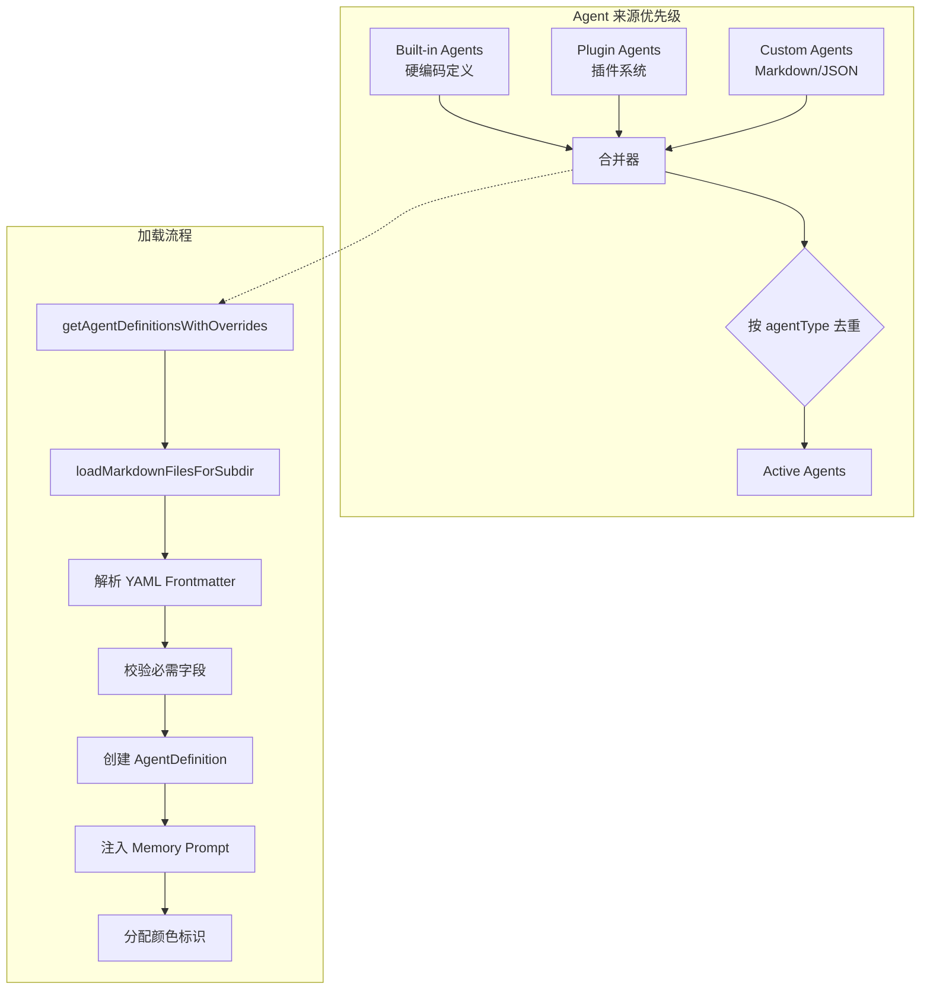
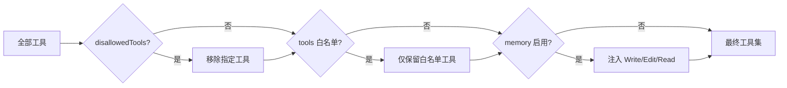

本文档面向高级开发者，深入探讨 Claude Code 的自定义 Agent 开发机制，涵盖从简单 Markdown 定义到复杂 TypeScript 实现的完整技术栈。你将掌握如何设计、实现、测试和部署符合专业标准的生产级 Agent，以及理解其底层架构原理。

## Agent 架构概述

Claude Code 的 Agent 系统采用三层优先级架构，通过去重机制实现灵活的覆盖策略：Built-in（内置）→ Plugin（插件）→ Custom（用户/项目/策略）。系统通过 `getActiveAgentsFromList()` 按 `agentType` 去重，后加载的定义会覆盖先前的，这意味着项目级 `.claude/agents/` 可以完全替换内置 Agent。



Agent 定义分为三种类型，每种对应不同的使用场景和技术要求：

| Agent 类型 | 数据结构 | System Prompt 来源 | 适用场景 | 文件位置 |
|-----------|---------|-------------------|---------|---------|
| **Built-in** | `BuiltInAgentDefinition` | 动态函数 `getSystemPrompt()` | 核心功能、高性能优化、条件化 prompt | `src/tools/AgentTool/built-in/` |
| **Plugin** | `PluginAgentDefinition` | Markdown 闭包 | 可分发、版本化、namespace 隔离 | 插件 `agents/` 目录 |
| **Custom** | `CustomAgentDefinition` | Markdown/JSON 闭包 | 项目定制、快速原型、团队共享 | `.claude/agents/*.md` |

Sources: [loadAgentsDir.ts](claude-code/src/tools/AgentTool/loadAgentsDir.ts#L151-L168) [builtInAgents.ts](claude-code/src/tools/AgentTool/builtInAgents.ts)

## Markdown Agent 快速开发

Markdown 格式是创建自定义 Agent 的首选方式，通过 YAML frontmatter 定义元数据，正文作为 system prompt，无需编写代码即可实现复杂的角色定制。

### 基础结构

```markdown
---
name: "reviewer"
description: "代码审查专家，只读分析代码质量、安全性和最佳实践"
---

你是代码审查专家。你的职责是：

1. **代码质量**：检测代码异味、复杂度问题、重复代码
2. **安全性**：识别潜在的安全漏洞和风险模式
3. **最佳实践**：验证是否符合项目规范和行业标准
4. **性能**：分析性能瓶颈和优化机会

**关键约束**：
- 严格遵守只读原则，禁止使用 Write、Edit 或任何文件修改工具
- 使用 Read、Glob、Grep 深入分析代码
- 输出结构化的审查报告，包含问题等级和修复建议
- 优先关注高优先级问题（安全 > 正确性 > 性能 > 风格）
```

### 字段参考表

| 字段 | 类型 | 必需 | 说明 | 示例 |
|------|------|------|------|------|
| `name` | string | ✅ | Agent 唯一标识符 | `"code-analyzer"` |
| `description` | string | ✅ | Agent 用途描述，用于自动选择 | `"分析代码库架构"` |
| `tools` | string[] | | 允许的工具白名单 | `["Read","Glob","Grep"]` |
| `disallowedTools` | string[] | | 禁止的工具黑名单 | `["Write","Edit","Agent"]` |
| `model` | string | | 使用的模型或 `"inherit"` | `"haiku"` / `"inherit"` |
| `effort` | string\|number | | 推理努力程度 | `"high"` / `0.7` |
| `permissionMode` | string | | 权限模式 | `"plan"` / `"acceptEdits"` |
| `maxTurns` | number | | 最大 agentic 轮次 | `10` |
| `background` | boolean | | 始终后台运行 | `true` |
| `initialPrompt` | string | | 首轮消息前缀 | `"/search TODO"` |
| `memory` | string | | 持久记忆范围 | `"user"` / `"project"` |
| `isolation` | string | | 隔离环境 | `"worktree"` |
| `mcpServers` | array | | Agent 级 MCP 服务器 | `["slack", {db: {...}}]` |
| `hooks` | object | | Agent 级 Hooks | `{PreToolUse: [...]}` |
| `skills` | string[] | | 预加载 Skills | `["git-workflow"]` |
| `color` | string | | 终端颜色标识 | `"blue"` / `"red"` |

Sources: [loadAgentsDir.ts](claude-code/src/tools/AgentTool/loadAgentsDir.ts#L462-L705)

### 工具控制策略

工具过滤遵循 **黑名单优先 → 白名单过滤 → 自动注入** 的三层策略：



**只读 Agent 模式**：使用 `disallowedTools` 禁止所有修改类工具，确保安全性。

```markdown
---
name: "architect"
description: "架构分析专家，探索代码结构并提供设计建议"
disallowedTools: ["Write", "Edit", "FileEdit", "FileWrite", "NotebookEdit", "Agent"]
model: "inherit"
---

你是软件架构专家。只通过 Read、Glob、Grep、Bash（只读命令）分析代码结构。
禁止修改任何文件，专注于探索、理解和建议。
```

**工具白名单模式**：使用 `tools` 字段精确控制可用工具集。

```markdown
---
name: "test-runner"
description: "测试执行专家，运行测试并分析失败原因"
tools: ["Bash", "Read", "Glob", "Grep"]
permissionMode: "acceptEdits"
---

你是测试专家。使用 Bash 运行测试命令，Read/Glob/Grep 分析测试代码和失败日志。
```

Sources: [loadAgentsDir.ts](claude-code/src/tools/AgentTool/loadAgentsDir.ts#L537-L548) [exploreAgent.ts](claude-code/src/tools/AgentTool/built-in/exploreAgent.ts#L51-L60)

### Memory 持久化机制

启用 `memory` 字段后，Agent 获得跨会话的持久记忆能力，系统自动注入 Memory 工具并在 system prompt 末尾追加记忆管理指令。

```markdown
---
name: "project-expert"
description: "项目知识专家，维护项目特定的知识和决策记录"
memory: "project"
tools: ["Read", "Glob", "Grep"]
---

你是项目知识专家。使用 Memory 工具记录和检索：
- 架构决策和理由
- 技术债务和改进计划
- 团队约定和最佳实践
```

**Memory 范围选项**：
- `"user"`：用户级全局记忆（`~/.claude/memories/agents/{agentType}/`）
- `"project"`：项目级共享记忆（`.claude/memories/agents/{agentType}/`）
- `"local"`：本地工作目录记忆（`./.claude/memories/agents/{agentType}/`）

Memory 机制的核心是 **自动工具注入**：即使 `tools` 未包含 Write/Edit/Read，memory 启用时也会强制注入，确保 Agent 能访问记忆存储。

Sources: [loadAgentsDir.ts](claude-code/src/tools/AgentTool/loadAgentsDir.ts#L537-L548) [agentMemory.ts](claude-code/src/tools/AgentTool/agentMemory.ts)

### Isolation 隔离环境

`isolation: "worktree"` 让 Agent 在独立的 git worktree 中运行，实现文件系统隔离，不影响主分支工作区。

```markdown
---
name: "experimental-coder"
description: "实验性编码 Agent，在隔离环境中尝试方案"
isolation: "worktree"
permissionMode: "bypassPermissions"
---

你是实验性编码 Agent。在独立 worktree 中：
1. 大胆尝试各种实现方案
2. 测试和验证修改
3. 返回最佳方案的 diff
```

**Worktree 生命周期**：
1. **创建**：在 `.git/worktrees/agent-{id}` 下创建工作副本
2. **执行**：所有文件操作在 worktree 中进行
3. **清理**：
   - Hook-based worktree → 保留
   - 有变更 → 保留并返回路径
   - 无变更 → 自动删除

Sources: [loadAgentsDir.ts](claude-code/src/tools/AgentTool/loadAgentsDir.ts#L607-L620) [sub-agents.mdx](claude-code/docs/agent/sub-agents.mdx#L97-L119)

## 高级开发：Built-in Agent 实现

当 Markdown Agent 无法满足需求时（如需要动态 prompt、性能优化、条件化逻辑），可以通过 TypeScript 实现内置 Agent。

### Built-in Agent 结构

```typescript
import type { BuiltInAgentDefinition } from '../loadAgentsDir.js'
import { FILE_READ_TOOL_NAME } from '../FileReadTool/prompt.js'
import { GLOB_TOOL_NAME } from '../GlobTool/prompt.js'
import { GREP_TOOL_NAME } from '../GrepTool/prompt.js'

function getCustomAgentPrompt(params: { toolUseContext: ToolUseContext }): string {
  const { toolUseContext } = params
  const hasEmbeddedTools = checkEmbeddedTools(toolUseContext)
  
  // 动态调整 prompt 基于运行时状态
  const searchGuidance = hasEmbeddedTools
    ? 'Use find/grep via Bash'
    : `Use ${GLOB_TOOL_NAME} and ${GREP_TOOL_NAME}`
  
  return `你是自定义专家 Agent。

关键能力：
- ${searchGuidance}
- 深度分析代码结构
- 生成结构化报告

工作模式：只读分析，输出 JSON 格式结果。`
}

export const CUSTOM_AGENT: BuiltInAgentDefinition = {
  agentType: 'custom-analyzer',
  whenToUse: '高级代码分析专家，支持自定义输出格式',
  disallowedTools: ['Write', 'Edit', 'Agent'],
  source: 'built-in',
  baseDir: 'built-in',
  model: 'inherit', // 或 'haiku' 加速
  getSystemPrompt: getCustomAgentPrompt,
  
  // 可选：运行时回调
  callback: () => {
    console.log('Custom agent spawned')
  }
}
```

### 动态 Prompt 生成策略

Built-in Agent 的核心优势是 `getSystemPrompt()` 接受 `toolUseContext` 参数，可以根据运行时状态动态调整 prompt 内容。

```typescript
function getAdaptivePrompt(params: { 
  toolUseContext: Pick<ToolUseContext, 'options'> 
}): string {
  const { options } = params.toolUseContext
  
  // 根据查询来源调整行为
  const isFromFork = options.querySource === 'agent:builtin:fork'
  
  // 根据环境变量调整工具指引
  const hasEmbeddedSearch = hasEmbeddedSearchTools()
  
  const toolGuidance = hasEmbeddedSearch
    ? `- Use \`find\` and \`grep\` via Bash`
    : `- Use Glob and Grep tools`
  
  return `你是自适应 Agent。
  
环境信息：
- 查询来源：${isFromFork ? 'Fork 子进程' : '主线程'}
- 搜索工具：${hasEmbeddedSearch ? '嵌入式' : '标准'}

工具指引：
${toolGuidance}

任务：根据环境动态调整策略。`
}
```

Sources: [exploreAgent.ts](claude-code/src/tools/AgentTool/built-in/exploreAgent.ts#L12-L44) [loadAgentsDir.ts](claude-code/src/tools/AgentTool/loadAgentsDir.ts#L93-L109)

### 注册 Built-in Agent

Built-in Agent 需要在 `builtInAgents.ts` 中注册才能被系统发现：

```typescript
// src/tools/AgentTool/builtInAgents.ts
import { EXPLORE_AGENT } from './built-in/exploreAgent.js'
import { PLAN_AGENT } from './built-in/planAgent.js'
import { CUSTOM_AGENT } from './built-in/customAgent.js'

export function getBuiltInAgents(): BuiltInAgentDefinition[] {
  return [
    EXPLORE_AGENT,
    PLAN_AGENT,
    GENERAL_PURPOSE_AGENT,
    VERIFICATION_AGENT,
    CLAUDE_CODE_GUIDE_AGENT,
    CUSTOM_AGENT, // 添加你的 Agent
  ]
}
```

Sources: [builtInAgents.ts](claude-code/src/tools/AgentTool/builtInAgents.ts)

## Plugin Agent 开发

Plugin Agent 结合了 Markdown 的易用性和插件的分发能力，支持 namespace 隔离、版本管理和依赖声明。

### Plugin 结构

```
my-plugin/
├── manifest.json
├── agents/
│   ├── code-reviewer.md
│   └── security-scanner.md
├── skills/
│   └── custom-skill.md
└── hooks/
    └── pre-tool-use.sh
```

### Manifest 配置

```json
{
  "name": "my-custom-agents",
  "version": "1.0.0",
  "description": "自定义 Agent 集合",
  "agentsPath": "agents",
  "agentsPaths": ["agents", "agents/extended"],
  "hooks": {
    "PreToolUse": [
      {
        "command": "hooks/pre-tool-use.sh",
        "timeout": 5000
      }
    ]
  },
  "mcpServers": {
    "custom-db": {
      "command": "npx",
      "args": ["mcp-database-server"]
    }
  }
}
```

### Namespace 隔离

Plugin Agent 自动获得 namespace 前缀，避免与用户定义冲突：

```
agents/
├── reviewer.md          → agentType: "my-plugin:reviewer"
└── security/
    └── scanner.md       → agentType: "my-plugin:security:scanner"
```

Sources: [loadPluginAgents.ts](claude-code/src/utils/plugins/loadPluginAgents.ts#L48-L96) [plugin.ts](claude-code/src/types/plugin.ts#L18-L54)

### Agent 级 MCP 服务器

Plugin Agent 可以声明专属的 MCP 服务器，仅在 Agent 运行时连接：

```markdown
---
name: "database-analyzer"
description: "数据库结构分析专家"
mcpServers:
  - "postgres-local"
  - custom-db:
      command: "npx"
      args: ["myp-db-analyzer"]
      env:
        DB_URL: "postgresql://localhost/mydb"
---

你是数据库分析专家。使用 MCP 服务器提供的工具：
- 分析表结构和关系
- 检测索引优化机会
- 生成迁移建议
```

**加载流程**：`runAgent()` 中的 `initializeAgentMcpServers()` 在 Agent 启动时连接声明服务器，Agent 结束后自动断开。

Sources: [loadAgentsDir.ts](claude-code/src/tools/AgentTool/loadAgentsDir.ts#L35-L48) [sub-agents.mdx](claude-code/docs/agent/sub-agents.mdx#L80-L96)

## 高级集成模式

### Hooks 集成

Agent 级 Hooks 在 Agent 会话期间生效，用于审计、预处理、安全检查等场景。

```markdown
---
name: "audited-writer"
description: "带审计跟踪的文件修改 Agent"
hooks:
  PreToolUse:
    - command: "scripts/audit-log.sh"
      timeout: 5000
      matchers:
        - toolName: "Write"
        - toolName: "Edit"
  PostToolUse:
    - command: "scripts/verify-changes.sh"
      matchers:
        - toolName: "Bash"
          toolInput:
            command: "git commit*"
---

你是文件修改 Agent。所有操作都会被审计记录。
```

**Hook 执行上下文**：Agent Hooks 继承主会话的 Hook 上下文，但 Agent 内部的工具调用会触发 Agent 级 Hooks。

Sources: [loadAgentsDir.ts](claude-code/src/tools/AgentTool/loadAgentsDir.ts#L289-L306) [hooks.mdx](claude-code/docs/extensibility/hooks.mdx)

### Skills 预加载

通过 `skills` 字段预加载特定 Skills，让 Agent 启动时即具备专业能力：

```markdown
---
name: "git-workflow-expert"
description: "Git 工作流专家"
skills: ["git-branching", "conflict-resolution", "pr-workflow"]
tools: ["Bash", "Read", "Write", "Edit"]
---

你是 Git 工作流专家。已预加载专业 Skills：
- 复杂分支管理
- 冲突解决策略
- PR 工作流优化
```

**Skill 加载机制**：`initialPrompt` 被解析为斜杠命令，在首轮用户消息前执行，注入 Skill 定义的 prompt 和工具权限。

Sources: [loadAgentsDir.ts](claude-code/src/tools/AgentTool/loadAgentsDir.ts#L576-L583)

### 条件化 Agent 可用性

通过 `requiredMcpServers` 声明 MCP 依赖，系统会自动检查并过滤不可用的 Agent：

```markdown
---
name: "slack-notifier"
description: "Slack 通知发送专家"
requiredMcpServers: ["slack"]
mcpServers:
  - "slack"
---

你是 Slack 通知专家。使用 slack MCP 服务器发送通知。
```

**检查逻辑**：`hasRequiredMcpServers()` 在 `AgentTool.call()` 时验证，不满足则跳过该 Agent。

Sources: [loadAgentsDir.ts](claude-code/src/tools/AgentTool/loadAgentsDir.ts#L180-L219)

## 测试与调试

### Agent 测试策略

```typescript
// __tests__/customAgent.test.ts
import { parseAgentFromMarkdown } from '../loadAgentsDir.js'

describe('Custom Agent', () => {
  it('should parse valid markdown agent', () => {
    const frontmatter = {
      name: 'test-agent',
      description: 'Test description',
      tools: ['Read', 'Glob'],
      model: 'haiku'
    }
    const content = 'Test system prompt'
    
    const agent = parseAgentFromMarkdown(
      '/path/to/test.md',
      'test-dir',
      frontmatter,
      content,
      'projectSettings'
    )
    
    expect(agent).not.toBeNull()
    expect(agent!.agentType).toBe('test-agent')
    expect(agent!.tools).toEqual(['Read', 'Glob'])
    expect(agent!.model).toBe('haiku')
    expect(agent!.getSystemPrompt()).toBe('Test system prompt')
  })
  
  it('should reject agent without required fields', () => {
    const frontmatter = { name: 'test' } // 缺少 description
    const agent = parseAgentFromMarkdown(
      '/path/to/test.md',
      'test-dir',
      frontmatter,
      'content',
      'projectSettings'
    )
    
    expect(agent).toBeNull()
  })
})
```

Sources: [loadAgentsDir.ts](claude-code/src/tools/AgentTool/loadAgentsDir.ts#L694-L705)

### 调试技巧

**1. 启用调试日志**

```bash
CLAUDE_DEBUG=1 claude-code
```

调试日志会显示：
- Agent 加载路径和解析结果
- 工具过滤过程
- Memory prompt 注入
- Hook 执行跟踪

**2. 检查加载结果**

```typescript
// 临时调试代码
import { getAgentDefinitionsWithOverrides } from './loadAgentsDir.js'

const result = await getAgentDefinitionsWithOverrides(process.cwd())
console.log('Active Agents:', result.activeAgents.map(a => ({
  type: a.agentType,
  source: a.source,
  tools: a.tools,
  disallowedTools: a.disallowedTools
})))

if (result.failedFiles) {
  console.log('Failed Files:', result.failedFiles)
}
```

**3. 验证 System Prompt**

```typescript
const agent = result.activeAgents.find(a => a.agentType === 'my-agent')
if (agent) {
  const prompt = agent.getSystemPrompt()
  console.log('System Prompt:', prompt)
  
  // 检查 memory 注入
  if (agent.memory) {
    console.log('Memory enabled:', agent.memory)
    console.log('Has memory prompt:', prompt.includes('memory'))
  }
}
```

Sources: [loadAgentsDir.ts](claude-code/src/tools/AgentTool/loadAgentsDir.ts#L314-L364)

## 最佳实践

### 1. 单一职责原则

每个 Agent 应该有明确的单一职责，避免"全能型"设计：

✅ **好的设计**：
```markdown
---
name: "test-coverage-analyzer"
description: "分析测试覆盖率并生成报告"
disallowedTools: ["Write", "Edit", "Agent"]
---

专注于测试覆盖率分析，使用 Bash 运行测试工具，输出结构化报告。
```

❌ **不好的设计**：
```markdown
---
name: "super-agent"
description: "代码分析、测试、部署、监控一体化"
---

试图做所有事情，缺乏专业性。
```

### 2. 工具最小权限原则

只授予 Agent 完成任务所需的最小工具集：

```markdown
---
name: "log-analyzer"
description: "分析日志文件并提取关键信息"
tools: ["Read", "Grep"]  # 只读访问，足够了
---
```

### 3. 明确的输出约定

在 system prompt 中定义清晰的输出格式，便于下游处理：

```markdown
你是代码审查 Agent。

**输出格式**：
## 审查摘要
[1-2 句总结]

## 关键问题
- **[等级]** 文件:行号 - 问题描述
  - 修复建议

## 改进建议
[可选的优化建议]
```

### 4. 错误处理和降级

设计 Agent 时考虑失败场景和降级策略：

```typescript
function getResilientPrompt(): string {
  return `你是弹性 Agent。

错误处理策略：
1. 如果首选工具不可用，尝试替代方案
2. 如果搜索无结果，扩大搜索范围
3. 如果无法完成，返回部分结果和建议

始终提供有价值的输出，即使任务未完全完成。`
}
```

### 5. 性能优化

对于高频使用的 Agent，优化执行效率：

```markdown
---
name: "fast-searcher"
description: "快速代码搜索，优化响应速度"
model: "haiku"  # 使用轻量级模型
maxTurns: 3     # 限制轮次
---

快速搜索策略：
- 并行执行多个搜索
- 优先使用 Glob 模式匹配
- 避免深度代码分析
- 快速返回初步结果
```

Sources: [exploreAgent.ts](claude-code/src/tools/AgentTool/built-in/exploreAgent.ts#L68-L71) [generalPurposeAgent.ts](claude-code/src/tools/AgentTool/built-in/generalPurposeAgent.ts#L9-L19)

## 完整示例库

### 示例 1：代码审查 Agent

```markdown
---
name: "security-reviewer"
description: "安全审查专家，检测 OWASP Top 10 漏洞"
disallowedTools: ["Write", "Edit", "Agent", "ExitPlanMode"]
color: "red"
---

你是安全审查专家，专注于检测 OWASP Top 10 漏洞。

**审查范围**：
1. **注入漏洞**：SQL、命令、LDAP 注入
2. **认证失效**：弱密码、会话管理问题
3. **敏感数据暴露**：硬编码密钥、日志泄露
4. **访问控制**：越权、IDOR
5. **安全配置**：CORS、CSP、安全头

**工作流程**：
1. 使用 Grep 搜索危险模式（eval、exec、innerHTML）
2. 使用 Read 分析关键代码路径
3. 检查配置文件和环境变量
4. 生成结构化报告

**输出格式**：
```
## 安全审查报告

### 高危问题 (CRITICAL)
- **[漏洞类型]** 文件路径:行号
  - 代码片段
  - 攻击向量
  - 修复方案

### 中危问题 (HIGH)
[同上格式]

### 最佳实践建议
[安全改进建议]
```
```

### 示例 2：文档生成 Agent

```markdown
---
name: "api-doc-generator"
description: "API 文档生成专家，从代码提取并格式化 API 信息"
tools: ["Read", "Glob", "Grep", "Write"]
permissionMode: "acceptEdits"
model: "inherit"
---

你是 API 文档生成专家。

**工作流程**：
1. 使用 Glob 查找 API 路由文件
2. 使用 Grep 搜索路由定义（@route, router.get, app.post）
3. 使用 Read 分析处理函数和参数
4. 提取请求/响应 schema
5. 生成 Markdown/JSON 文档

**文档结构**：
- 端点路径和方法
- 请求参数（path/query/body）
- 响应格式和状态码
- 认证要求
- 示例请求/响应

始终遵循 OpenAPI 3.0 规范。
```

### 示例 3：测试生成 Agent

```markdown
---
name: "test-generator"
description: "单元测试生成专家，基于代码逻辑创建测试用例"
tools: ["Read", "Glob", "Grep", "Write", "Edit"]
skills: ["jest-testing"]
background: true
---

你是测试生成专家。

**策略**：
1. 分析函数签名和类型定义
2. 识别边界条件和错误路径
3. 生成正向、负向和边缘用例
4. 遵循 AAA 模式（Arrange-Act-Assert）

**测试原则**：
- 每个测试独立且可重复
- 有意义的描述性名称
- 覆盖成功和失败场景
- Mock 外部依赖

输出 Jest/Vitest 兼容的测试文件。
```

## 相关主题

- [子 Agent 机制](21-zi-agent-ji-zhi) - 深入理解 AgentTool 的执行链路和隔离架构
- [Hooks 钩子系统](25-hooks-gou-zi-xi-tong) - Agent 级 Hooks 的高级用法
- [Skills 技能扩展](26-skills-ji-neng-kuo-zhan) - 创建可复用的专业能力
- [MCP 协议集成](24-mcp-xie-yi-ji-cheng) - Agent 级 MCP 服务器配置
- [权限模型与审批流程](13-quan-xian-mo-xing-yu-shen-pi-liu-cheng) - Agent 权限模式详解